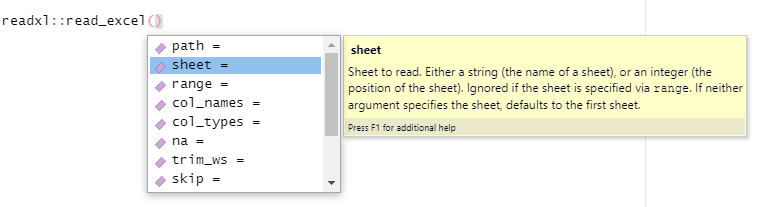
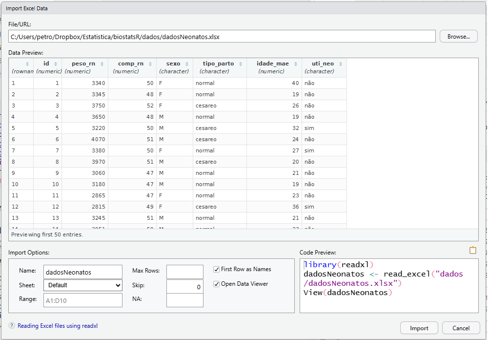
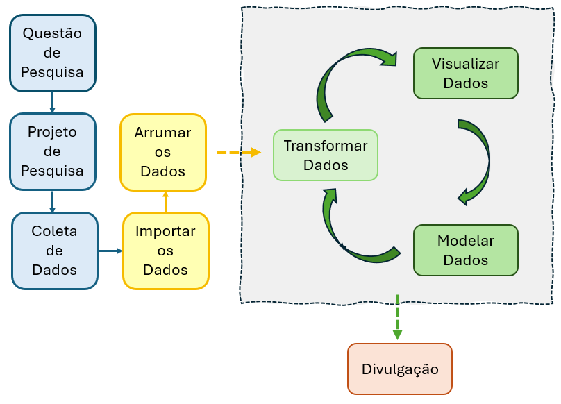

# Manipulação dos dados no R

## Dataframes no R {#sec-dataframes}

DataFrames são objetos de dados genéricos em formato tabular, onde os dados são organizados de maneira lógica em linha-e-coluna semelhante ao de uma planilha do Excel. O dataframe é uma estrutura bidimensional e pode ser formado com objetos criados previamente, desde que tenham o mesmo comprimento [@zuur2009beginner].

Uma das formas de criar um DataFrame no R é a partir de um conjunto de vetores, como, por exemplo, estes, relacionados a 15 nascimentos em uma determinada maternidade:

```{r}
id <- c(1:15)
peso_rn <- c (3340,3345,3750,3650,3220,4070,3380,3970,3060,3180,  
              2865,2815,3245,2051,2630)  
comp_rn <- c (50,48,52,48,50,51,50,51,47,47,47,49,51,50,44)
sexo <- c ("F", "F", "F", "M", "M", "M", "F", "M", "M", "M", "F", "F", "M", "M", "F")
tipo_parto <- c ("normal", "normal", "cesareo", "normal", "cesareo", "cesareo", "normal", "cesareo", "normal", "normal", "normal", "cesareo", "normal", "normal", "normal")
idade_mae <- c (40,19,26,19,32,24,27,20,21,19,23,36,21,23,23) 
```

Este grupo de vetores (variáveis) isolados fica difícil de manusear. Portanto, seria útil reuni-los em um só objeto. Pode-se fazer isso, usando a função `data.frame()`, do R base. Este DataFrame será atribuído a um novo objeto de nome `dadosNeonatos`.

```{r}
dadosNeonatos <- data.frame (id,
                             peso_rn,
                             comp_rn, 
                             sexo,
                             tipo_parto, 
                             idade_mae)
```

Verificando a classe deste novo objeto, tem-se:

```{r}
class (dadosNeonatos)
```

Para observar a modificação realizada, pode-se usar a função `str()` do R base, digitando no *R Script*:

```{r}
str(dadosNeonatos)
```

Na saída da função, verifica-se que o dataframe contém 15 linhas e 6 colunas.

### Acrescentando variáveis a um dataframe

Será adicionada ao dataframe uma nova variável chamada `uti_neo`, que indica se cada recém-nascido foi encaminhado ou não para a UTI neonatal logo após o nascimento. Essa variável será construída a partir de um vetor contendo a situação de cada um dos 15 recém-nascidos, e será incorporada como uma nova coluna no dataframe. A sintaxe utilizada para essa operação segue o padrão `nome-do-dataframe$nome-da-variável`:

```{r}
dadosNeonatos$uti_neo <- c ("não","não","não","não","sim","não","sim","não","não","não","não","sim","não","não","não")
```

Com isso, a variável `uti_neo` passa a fazer parte do conjunto de dados, permitindo análises específicas sobre a necessidade de cuidados intensivos neonatais. A função`str()`, pode ser usada, novamente, para observar a modificação:

```{r}
str(dadosNeonatos)
```

### Transformação de variáveis {#sec-transform}

Observa-se que todas as variáveis `sexo`, `tipo_parto` e `uti_neo` estão, no dataframe, como caractere (`chr`). Entretanto, elas são variáveis categóricas, portanto, necessitam ser transformadas para fatores. Como pertencem à classe `character`, então, basta usar a `as.factor()` sem necessidade de alterar os rótulos (`labels`) nos níveis (`levels`), o que seria necessário com o uso da função `factor()`, como mostrado na @sec-fatores e @sec-newcol.

```{r}
dadosNeonatos$tipo_parto <- as.factor(dadosNeonatos$tipo_parto)
dadosNeonatos$sexo <- as.factor (dadosNeonatos$sexo) 
dadosNeonatos$uti_neo <- as.factor (dadosNeonatos$uti_neo)
```

Após a transformação, executa-se, novamente, a função `str()` para ver como ficou a estrutura do dataframe:

```{r}
str(dadosNeonatos)
```

Agora, as três variáveis passaram a ser fatores e as outras mantiveram-se numéricas.

### Salvando um dataframe {#sec-salvadf}

O dataframe, criado e modificado anteriormente, pode ser salvo para uso posterior no diretório de trabalho. Os formatos mais comuns e eficientes incluem arquivos nativos do R como `.RData` e `.rds`, arquivos de texto como `.txt`, formatos otimizados para Big Data como `.parquet`, e extensões de outros softwares estatísticos como `.xlsx` (Excel), `.csv` (Valores Separados por Vírgula), `.sav` (SPSS) e `.dta` (Stata).

As formas bastante usadas para salvar um dataframe são `.xlsx` e `.csv`. Para salvar em uma extensão `.xlsx`, utiliza-se a função `write_xlsx ()` do pacote `writexl` [@ooms2022writexl]. O dataframe dadosNeonatos será salvo como:

```{r}
#| eval: false
writexl::write_xlsx(dadosNeonatos, "dados/dadosNeonatos.xlsx")
```

Para salvar com a extensão `.csv`, usar a função `write_csv()` ou `write_csv2()` que fazem parte do pacote `readr` [@wickham2026readr]. A primeira função, usa `"."` para a separação dos decimais e `","` para separar as variáveis; a segunda função usa `","` para os decimais e `";"` para separar as variáveis, convenção do Excel para algumas localidades, como o Brasil [@write2022csv]. Portanto, uma maneira de salvar o arquivo é:

```{r}
#| eval: false
write_csv2 (dadosNeonatos, "dados/dadosNeonatos.csv")
```

## Importando dados de outros *softwares*

É possível inserir dados diretamente no *R Script*, como visto na @sec-dataframes. Entretanto, se o conjunto de dados for muito extenso, torna-se complicado. Desta forma, é melhor construir o dataframe em outro software, como o Excel, SPSS, etc. e, após, quando necessário, importar os dados para o R.

### Importando dados de um arquivo CSV {#sec-csv}

O formato CSV significa *Comma Separated Values*, ou seja, é um arquivo de valores separados por vírgula. Esse formato de armazenamento é simples e agrupa informações de arquivos de texto em planilhas. É possível gerar um arquivo `.csv`, a partir de uma planilha do *Excel*, usando o menu `salvar como` e escolher `CSV`.

As funções `read_csv()` e `read_csv2()`, pertencentes ao pacote `readr`, incluído no ecossistema `tidyverse` [@wickham2019tidyverse], podem ser utilizadas para importar arquivos CSV. A principal diferença entre elas está nos separadores de coluna (variáveis) e nos separadores decimais que cada uma utiliza por padrão.

- `read_csv` (padrão americano)

  - separador de colunas: vírgula (,)

  - separador de decimais: ponto (.)

  - uso ideal para arquivos gerados no padrão americano

- `read_csv2` (padrão brasileiro/europeu)

  - separador de colunas: ponto e vírgula (;)

  - separador de decimais: vírgula (,)

  - uso ideal para arquivos gerados por versões em português do Excel, onde a vírgula é usada nos números decimais

::: callout-tip
## Importante

Ao tentar abrir um arquivo com `read_csv()` e todas as colunas ficarem agrupadas em uma única linha má estruturada, ou se os números com vírgula virarem texto (`character`), mudar para `read_csv2()`.
:::

Portanto, quando se importa um arquivo `.csv`, é importante saber qual a sua estrutura. Verificar se os decimais estão separados por *ponto* ou por *vírgula* e se as colunas (variáveis), por *vírgula* ou *ponto e vírgula*. Para ver isso, basta abrir o arquivo em um bloco de notas (por exemplo, *Bloco de Notas do Windows*, *Notepad ++, etc.*).

Além disso, é necessário saber em que diretório do computador está o arquivo para informar ao comando. Recomenda-se colocar o arquivo na pasta do diretório de trabalho, pois assim basta apenas colocar o nome do arquivo na função de leitura dos dados. Caso contrário, tem-se que se usar todo o caminho (*path*).

Como exemplo, será importado o arquivo `dadosNeonatos.csv` que se encontra no diretório de trabalho do autor, salvo anteriormente. Para obter o arquivo, siga os passos da @sec-dataframes ou clique [**aqui**](https://github.com/petronioliveira/Arquivos/blob/main/dadosNeonatos.csv) e salve em seu diretório de trabalho.

A estrutura deste arquivo mostra que as colunas estão separadas por ponto e vírgula e, portanto, a leitura dos dados será feita com a função `read_csv2()` e, como o arquivo está no diretório de trabalho, não há necessidade de informar o diretório completo. Os dados serão colocados em um objeto de nome `neonatos` [^05-manipulacao_dados-1]:

[^05-manipulacao_dados-1]: A mudança do nome do dataframe de `dadosNeonatos` para `neonatos` é desnecessária. Foi realizada apenas por questões didáticas.

```{r}
#| message: false
library(readr)

neonatos <- read_csv2("dados/dadosNeonatos.csv")
```

Use a função `str()` para visualizar o conjunto de dados:[^05-manipulacao_dados-2]

[^05-manipulacao_dados-2]: Observe, na saída, que a variável `uti_neo` aparece palavras com acentuação (“não”). Às vezes, ao abrir o arquivo com a função `read_csv2()`, pode acontecer de esta palavra aparecer, por exemplo, como: “`n\\xe3o`”. Louco, não é? Se ocorrer isso, use, após o nome do arquivo e separado por vírgula, o argumento `locale = locale(encoding = "latin1")`. Dessa forma, o erro será corrigido.

```{r}
str(neonatos)
```

Como se observa na saída do comando, as variáveis foram importadas em classes que vão necessitar transformações para serem usadas. Isto deve ser feito como foi visto na @sec-transform.

::: callout-caution
## Atenção

Toda vez que se importa um dataset, deve-se verificar atentamente a sua estrutura antes de dar seguimento as análises
:::

### Importando um arquivo do Excel {#sec-xlsx}

O pacote `readxl`, pertencente ao conjunto de pacotes do `tidyverse`, facilita a obtenção de dados do Excel para o R, através da função `read_excel()`. Esta função tem o argumento `sheet =`, que deve ser usado indicando o número ou o nome da planilha, colocado entre aspas. Este argumento é importante se houver mais de uma planilha, caso contrário, ele é opcional. Para saber os outros argumentos da função, coloque o cursor dentro da função e aperte a tecla `Tab` (@fig-sheet). Isto abrirá um menu com os argumentos:

{#fig-sheet fig-align="center" width="16cm"}

Será feita a leitura dos mesmos dados, usados na leitura de dados `csv`, apenas o arquivo agora está no formato `.xlsx`. Para obter o arquivo, siga os mesmos passos, usados anteriormente. Clique [**aqui**](https://github.com/petronioliveira/Arquivos/blob/main/dadosNeonatos.xlsx) e salve em seu diretório de trabalho.

Os dados serão atribuídos a um objeto com outro nome (`recemNatos`):

```{r}
recemNatos <- readxl::read_excel("dados/dadosNeonatos.xlsx")
str(recemNatos)
```

Como se vê ao analisar a estrutura, deve-se proceder transformações nas variáveis, como visto na @sec-transform.

Na @fig-sheet, o duplo dois pontos (`::`) precedido do nome do pacote, no caso `readxl`, especifica a procedência da função usada. Nessa situação, não há necessidade de usar a função `library()` para carregar o pacote já instalado em um diretório (biblioteca) previamente.

### Importando arquivos com o *RStudio*

O `RStudio` permite importar arquivos sem a necessidade de digitar comandos, que, para alguns podem ser tediosos.

Na tela inicial do `RStudio`, à direita, na parte superior, clique na aba *Environment* e em `Import Dataset`. Esta ação abre um menu que permite importar arquivos .csv, Excel, SPSS, etc.

Por exemplo, para importar o arquivo `dadosNeonatos.xlsx`, clicar em `From Excel...` Abre uma janela com uma caixa de diálogo. Clicar no botão `Browse...`, localizado em cima à direita, para buscar o arquivo `dadosNeonatos.xlsx`. Assim que o arquivo for aberto, ele mostra uma *preview* do arquivo e, em baixo, à direita mostra uma *pré-visualização* do código (@fig-import)), igual ao digitado anteriormente, que cria um objeto denominado `dadosNeonatos`, nome do objeto escolhido pelo R, mas pode ser modificado na janela, à esquerda, `Import Option` em `Name`, onde pode-se digitar qualquer nome. Após encerrar as escolhas, clicar em `Import`. É um caminho diferente para fazer o mesmo. Este é um dos fascínios do R!

{#fig-import fig-align="center" width="20cm"}

### Importando dados de forma simples

A grande elegância do R está na simplicidade, o pacote `rio` (*R Input/Output*) [@chan2023rio] é o modelo de simplicidade quando se fala em importar e exportar dados. Está baseado no conceito de *Swiss Army Knife* (canivete suíço) e reduz o processo de entrada e saída de dados a duas funções principais: `import()` e `export()`.

Ele descobre o formato do arquivo automaticamente através da extensão (`.csv`, `.xlsx`, `.sav`, etc.) e chama o pacote correto nos bastidores (como `readr`, `readxl`, `haven`, `data.table`), sem que se necessite carregar todos eles manualmente.

Não importa a fonte dos dados, a sintaxe é a mesma:

```{r}
library(rio)
dados <- rio::import("dados/dadosNeonatos.xlsx")
str(dados)
```

Para converter um arquivo de Excel para CSV, basta mudar a extensão no destino:

```{r}
#| eval: false
# Salva um data.frame .xlsx como .csv
rio::export(dados, "dados/dados_rn.csv")
```

Esta função `export()` faz o mesmo que as funções `write_xlsx()` e `write_csv2()`, vistas acima (@sec-salvadf).

::: callout-tip
## Dica

Para garantir que o `rio` consiga ler absolutamente qualquer formato (incluindo SPSS, SAS, etc.), é recomendado instalar os pacotes auxiliares recomendados, rodando uma única vez:

```{r}
#| eval: false
rio::install_formats()
```

Assim, quando o `rio` for chamado a trabalhar, ele vai checar todos os formatos e instalar de uma só vez todos que faltarem no computador. Por isso, a metáfora "canivete suíço" se encaixa nas suas funções.
:::

## Tibble {#sec-tibble}

A maneira mais comum de armazenar dados no R é usar `data.frames` ou `tibble`.

*Tibble* é um novo tipo de dataframe. É como se fosse um dataframe mais moderno. Ele mantém muitos recursos importantes do data frame original, mas remove muitos dos recursos desatualizados.

A maioria dos pacotes do R usa dataframes tradicionais; entretanto, é possível transformá-los em `tibble`, usando a função `as_tibble()`, do pacote `tibble` [@wickham2026tibble][^05-manipulacao_dados-2b]. Esse pacote fornece uma versão moderna do dataframe, com impressão mais informativa e comportamento mais previsível. A transformação de um dataframe tradicional em um `tibble` é um procedimento recomendável, em função da maior flexibilidade destes.

[^05-manipulacao_dados-2b]: A função `as_tibble()` também fica disponível ao carregar outros pacotes do `tidyverse`, como o `tidyr` ou o `dplyr`, que a reexportam do pacote `tibble`.

Como exemplo deste procedimento, será usado o dataframe criado na @sec-dataframes: `dadosNeonatos`.

Este é um conjunto de dados da classe `data.frame`, contendo 15 observações de 7 variáveis (colunas), que pode ser convertido a um `tibble`, usando a função `as_tibble()`:

```{r}
library(tibble)
as_tibble(dadosNeonatos)
```

Por padrão, quando o dataset é muito longo, apenas as primeiras dez linhas são mostradas. Aqui, aparece toda a estrutura dos dados. São apresentadas a dimensão da tabela e as classes de cada coluna. Verifica-se que não houve grandes mudanças, apenas o conjunto de dados está estruturalmente mais organizado, mais flexível.

## Pacote tidyverse {#sec-tidyverse}

A denominada ciência de dados é difícil de definir, pois a definição depende da formação específica de cada cientista de dados. Entretanto, é possível mostrar como a ciência de dados pode ser realizada na prática, constituindo aquilo que se costuma chamar de *Ciclo da Ciência de Dados* (@fig-ciclo).\
Primeiramente, os dados brutos são coletados de diversas maneiras (veja @sec-producao). Após, são armazenados, por exemplo, em Excel, e, em seguida, são arrumados para reduzir problemas de padronização, conceituais e erros ou exclusão de variáveis e casos que não fazem parte do objetivo estabelecido no projeto de pesquisa. Isto constituirá a base de dados analítica.\
A base de dados analítica é então transformada, refinada, para produzir medidas resumidoras, tabela e gráficos. Quando necessário, são produzidos modelos estatísticos. O resultado final deve ser comunicado através dos meios de divulgação científica (relatórios, periódicos, livros, jornadas, congressos, GitHub, etc.).

{#fig-ciclo fig-align="center" width="15cm"}

O pacote `tidyverse` é uma coleção de pacotes para a linguagem de programação R, pensada e desenvolvida para facilitar e otimizar o fluxo de trabalho em ciência de dados [@wickham2019tidyverse].\
Em vez de ser um pacote único, ele é um "meta-pacote", o que significa que, ao instalá-lo, você instala vários pacotes menores que trabalham em conjunto.

A filosofia principal por trás do `tidyverse` é a de dados "tidy" (arrumados ou organizados) [@wickham2014tidy], onde:

- Cada variável está em uma coluna.

- Cada observação está em uma linha.

- Cada valor está em uma célula.

Seguindo essa lógica, as funções e pacotes do `tidyverse` são projetados para facilitar a manipulação dos dados dentro do *Ciclo da Ciência de Dados* (@fig-ciclo), tornando a manipulação, a análise e a visualização de dados mais consistentes e intuitivas.

### Principais Pacotes do tidyverse

O `tidyverse` simplifica tarefas complexas, oferecendo ferramentas específicas para cada etapa do Ciclo de Ciências de Dados. Alguns dos pacotes mais importantes são:

- **dplyr**: Para manipulação de dados. Contém funções essenciais para filtrar linhas, selecionar colunas, criar novas variáveis, e resumir dados.

- **ggplot2**: Para visualização de dados. É um dos pacotes mais populares do R para criar gráficos esteticamente agradáveis e informativos.

- **tidyr**: Para organizar os dados. Ele transforma dados "bagunçados" (que não seguem o formato tidy) em um formato mais limpo e organizado.

- **readr**: Para importar dados. Permite ler arquivos de texto (como CSVs) de forma rápida e robusta.

- **tibble**: Uma versão aprimorada do data.frame do R base. O `tibble` é mais fácil de usar e interage melhor com os pacotes do `tidyverse`.

- **stringr**: Para manipular strings (textos). Simplifica as tarefas de trabalhar com dados de texto.

- **forcats**: Para lidar com fatores (variáveis categóricas).

### Princípios do tidyverse {#sec-printidyverse}

O `tidyverse` causou quase uma revolução na comunidade do R. Alguns chegam a dizer que existe uma linguagem R antes e depois do `tidyverse`. Pode parecer exagero, mas o certo é que o uso dos princípios do `tidyverse` foi abraçado pela maioria dos usuários de R e, em função disso, foram criados uma grande quantidade de pacotes que conversam entre si, facilitando o manuseio dos dados.

Os princípios fundamentais são:

1.  Reutilizar estruturas de dados existentes.

2.  Organizar funções simples usando o `pipe`[^05-manipulacao_dados-3]. Esse operador, introduzido por Stefan Milton Bache no pacote `magrittr` [@bache2022magritt], permite encadear múltiplas operações em uma sequência clara e legível, de forma que a saída de uma função se torna a entrada da próxima. Isso torna o código mais fácil de ler e entender, eliminando a necessidade de criar muitas variáveis intermediárias. O `pipe` pode ser acionado digitando `%>%` ou usando o atalho `ctrl + shift + M`[^05-manipulacao_dados-4]. Neste livro, será dado preferência para o `pipe` nativo do R (`|>`).

3.  Usar uma sintaxe consistente: As funções dos pacotes tidyverse seguem uma lógica de nomeação e de argumentos parecida, facilitando a memorização e o uso.

4.  Projetado com foco nos seres humanos, priorizando a eficiência do programador.

[^05-manipulacao_dados-3]: O nome é uma referência ao famoso quadro do pintor belga René Magritte [*La Trahison des images*](https://decorem.com.br/blogs/news/significado-da-obra-a-traicao-das-imagens-de-rene-magritte?srsltid=AfmBOoqG3gSMhNdnwgmQ3piepQPRSkJlXkNQjQv5mDq72QYRwub3vJKz) *(Ceci n’est pas une pipe)*.

[^05-manipulacao_dados-4]: Além do `pipe`, indiretamente, embutido no `tidyverse`, existe o pipe nativo do R (`|>`) que também pode ser usado com as mesmas funções do `%>%`. No menu *Tools* \> *Global Options...* \> *Code* e marque a opção `Use native pipe operator |>` para que o atalho `ctrl + shift + M` retorne sempe o pipe nativo. Desmarcado, retorna o pipe `magrittr`.

Quando o `tidyverse` é carregado, todos os pacotes embutidos nele, serão carregados.

```{r}
library(tidyverse)
```

::: {.callout-warning title="Conflito de funções ao carregar tidyverse"}
Ao carregar o pacote `tidyverse` ou qualquer outro, podem surgir mensagens de conflito indicando que funções previamente disponíveis foram sobrescritas por versões de mesmo nome.

No exemplo apresentado, as funções `filter()` e `lag()` do pacote `stats` foram substituídas pelas versões do pacote `dplyr`.

Para utilizar as funções originais do pacote `stats` após esse carregamento, é necessário especificar o namespace diretamente, usando duplo dois pontos (`::`):\
`stats::filter()` e `stats::lag()`.
:::

## Pacote dplyr {#sec-dplyr}

Um dos pacotes de maior utilidade abarcado pelo `tidyverse` é o `dplyr`. Ele permite realizar transformação dos dados de uma forma simples e eficiente. O uso dos verbos `dplyr`, aliado ao operador `pipe`, tendem a tornar os scripts mais "enxutos" e elegantes [@wickham2015dplyr].\
As principais funções do `dplyr` são:

- `select()` - seleciona colunas\
- `arrange()` - ordena uma variável em ordem crescente ou decrescente\
- `filter()` - filtra linhas\
- `mutate()` - cria/modifica colunas\
- `group_by()` - agrupa por fatores\
- `summarise()` - sumariza a base

Todas as funções têm as mesmas características: o primeiro argumento é um `tibble` e os demais definem a ação da função.

Neste capítulo e em muitos outros deste livro, será utilizado o dataframe `dadosMater.xlsx`.

## Dataframe `dadosMater.xlsx` {#sec-dadosMater}

O arquivo `dadosMater.xlsx` é um dataframe constituído por dados de 1368 partos consecutivos do Hospital Geral de Caxias do Sul (HGCS)[^05-manipulacao_dados-5], durante um estudo sobre infecções congênitas [@madi2010prevalence]. Para baixar esses dados, clique [aqui](https://github.com/petronioliveira/Arquivos/blob/main/dadosMater.xlsx) e faça o *download* para o diretório de trabalho, para uso posterior.

[^05-manipulacao_dados-5]: Hospital Escola da Universidade de Caxias do Sul, RS.

### Leitura dos dados

Para ler arquivos do Excel (`.xlsx`), o pacote ideal é o `readxl`.[^05-manipulacao_dados-6] Ele é leve, rápido e não depende do Excel instalado. A função a ser usada é `read_excel()`. O objeto `mater` será utilizado para receber os dados [^05-manipulacao_dados-7]:

[^05-manipulacao_dados-6]: Poderia usar o pacote `rio` com a função `import()`:

    `dados <- rio::import("dados/dadosMater.xlsx")`

[^05-manipulacao_dados-7]: O nome `mater` é uma escolha do autor, nesta seção. Em outros momentos, será denominado, simplesmente, `dados`. O nome do objeto é uma escolha pessoal.

```{r}
mater <- readxl::read_excel("dados/dadosMater.xlsx")
```

::: callout-important
## Importante

O comando para carregar o conjunto de dados somente funciona, sem colocar o caminho completo, se tudo está sendo realizado no diretório de trabalho.
:::

Como rotina, em análise de dados, após a leitura é interessante explorar a estrutura dos dados. A função `as_tibble()` do pacote `tibble` é interessante para ver a estrutura dos dados:

```{r}
mater <- tibble::as_tibble(mater)
print(mater)
```

Por padrão, a função retorna as dez primeiras linhas [^05-manipulacao_dados-8]. Além disso, colunas que não couberem na largura da tela serão omitidas. Também são apresentadas a dimensão da tabela e as classes de cada coluna. Observa-se que ele tem 1368 linhas (observações) e 30 colunas (variáveis). Além disso, verifica-se que todas as variáveis estão como numéricas (`dbl`) e, certamente, algumas, dependendo do objetivo na análise, precisarão ser transformadas.

[^05-manipulacao_dados-8]: Para inserir maior número de linhas: `print(n = ...)`

O significado de cada uma das variáveis do `tibble` `mater` é o seguinte:

- **id** $\to$ identificação do participante\
- **idade_mae** $\to$ idade da parturiente em anos\
- **altura** $\to$ altura da parturiente em metros\
- **peso** $\to$ peso da parturiente em kg\
- **ganho_peso** $\to$ aumento de peso durante a gestação\
- **anos_est** $\to$ anos de estudo completos\
- **cor** $\to$ cor declarada pela parturiente: 1 = branca; 2 = não branca\
- **estado_civil** $\to$ estado civil: 1 = solteira; 2 = casada ou companheira\
- **renda** $\to$ renda familiar em salários mínimos\
- **fumo** $\to$ tabagismo: 1 = sim; 2 = não\
- **quant_fumo** $\to$ quantidade de cigarros fumados diariamente\
- **prenatal** $\to$ realizou pelo menos 6 consultas no pré-natal? 1 = sim; 2 = não
- **para** $\to$ número de filhos paridos\
- **droga** $\to$ drogadição? 1 = sim; 2 = não\
- **ig** $\to$ idade gestacional em semanas\
- **tipo_parto** $\to$ tipo de parto: 1 = normal; 2 = cesareana\
- **peso_pla** $\to$ peso da placenta em gramas
- **sexo** $\to$ sexo do recém-nascido (RN): 1 = masc; 2 = fem\
- **peso_rn** $\to$ peso do RN em gramas\
- **comp_rn** $\to$ comprimento do RN em cm\
- **pc_rn** $\to$ perímetro cefálico do recém-nascido em cm\
- **apgar1** $\to$ escore de Apgar no primeiro minuto\
- **apgar5** $\to$ escore de Apgar no quinto minuto\
- **uti_neo** $\to$ RN necessitou de terapia intensiva? 1 = sim; 2 = não\
- **obito** $\to$ óbito no período neonatal? 1 = sim; 2 = não\
- **hiv** $\to$ parturiente portadora de HIV? 1 = sim; 2 = não\
- **sifilis** $\to$ parturiente portadora de sífilis? 1 = sim; 2 = não\
- **rubeola** $\to$ parturiente portadora de rubéola? 1 = sim; 2 = não\
- **toxo** $\longrightarrow$ parturiente portadora de toxoplasmose? 1 = sim; 2 = não\
- **inf_cong** $\to$ parturiente portadora de alguma infecção congênita? 1 = sim; 2 = não

O *tibble* `mater` pode ser facilmente modificado com os verbos do pacote `dplyr`.

### Selecionando colunas

A função `select ()` pode ser usada para escolher quais colunas (variáveis) entrarão na análise. Ela recebe como primeiro argumento o conjunto de dados e os demais argumentos são os nomes das colunas. O conjunto de dados `mater` contém 30 colunas e muitas podem ser removidas, dependendo do objetivo da análise.

```{r}
mater <- dplyr::select(mater, - obito, -hiv, -sifilis, -rubeola, -toxo)
```

Note que foi usado o sinal de menos (-) antes das variáveis, porque elas foram removidas. Também poderiam ser listadas as variáveis que permanecem que, automaticamente, as não listadas serão removidas.

Outra maneira, pode ser colocando o número da coluna como abaixo, o sinal de subtração antes da função concatenar `c()` com os números das colunas a serem removidas (25 a 29):

```{r}
#| eval: false
mater <- dplyr::select(mater, - c(25:29))
```

A função `str()` permite visualizar a nova estrutura:

```{r}
str(mater)
```

A função `select ()` pode ser combinada com outras funções, como `filter ()`.

### Modificando e criando novas colunas {#sec-newcol}

Para esta ação, usa-se a função `mutate()`. Por exemplo, todas as variáveis no *tibble* `mater` foram lidas como numéricas. Entretanto, as variáveis `cor`, `estado_civil`, `fumo`, `prenatal`, `droga`, `tipo_parto`, `sexo`, `uti-neo` e `inf_cong` são categóricas e devem ser convertidas para fator, usando a função `factor()` [^05-manipulacao_dados-9] associada a `mutate()`:

[^05-manipulacao_dados-9]: Veja também @sec-fatores.

```{r}
mater <- dplyr::mutate(mater,
                       cor = factor(cor, 
                                    levels = c(1,2), 
                                    labels = c("branca", "não branca")), 
                       estado_civil = factor(estado_civil, 
                                             levels = c(1,2), 
                                             labels = c("solteira", "casada")),
                       fumo = factor(fumo, 
                                     levels = c(1,2), 
                                     labels = c("sim", "não")), 
                       prenatal = factor(prenatal, 
                                         levels = c(1,2), 
                                         labels = c("sim", "não")), 
                       droga = factor(droga, 
                                      levels = c(1,2), 
                                      labels = c("sim", "não")), 
                       tipo_parto = factor(tipo_parto, 
                                           levels = c(1,2), 
                                           labels = c("normal", "cesareo")), 
                       sexo = factor(sexo, 
                                     levels = c(1,2), 
                                     labels = c("masc", "fem")), 
                       uti_neo = factor(uti_neo, 
                                        levels = c(1,2), 
                                        labels = c("sim", "não")),
                       inf_cong = factor(inf_cong, 
                                         levels = c(1,2), 
                                         labels = c("sim", "não")))

```

O conjunto de dados está, agora, estruturado de forma correta.

```{r}
str(mater)
```

O Índice de Massa Corporal (IMC) é um cálculo que relaciona o peso e a altura de uma pessoa para avaliar se ela está com o peso ideal, abaixo do peso, acima do peso ou obesa. É uma ferramenta simples e amplamente utilizada na área da saúde para triagem e acompanhamento do estado nutricional. Para obter esse índice, serão utilizadas as variáveis peso e altura da gestante no início da gravidez. Como visto na @sec-funcoes, o cálculo do IMC é dado pela razão entre o peso em kg e a altura em metros elevada ao quadrado. Para criar uma nova coluna com a variável `imc`, pode-se também usar o `mutate()`.

```{r}
mater <- dplyr::mutate(mater,
                       imc = peso/altura^2)

media_imc <- mean(mater$imc, na.rm =TRUE)
round(media_imc,1)
```

### Filtrando linhas

A função `filter()` é usada para criar um subconjunto de dados que obedeçam determinadas condições lógicas: & (e), \| (ou) e ! (não). Por exemplo:

- **y & !x** $\to$ seleciona *y* e não *x*
- **x & !y** $\to$ seleciona *x* e não *y*
- **x \| y** $\to$ seleciona *x* ou *y*
- **x & y** $\to$ seleciona *x* e *y*

Um recém-nascido é dito a termo quando a duração da gestação está entre 37 e 42 semanas incompletas. Para extrair do banco de dados `mater` os recém-nascidos a termo (`dados_termo`), pode-se usar a função `filter()`:

```{r}
dados_termo <- dplyr::filter (mater, ig>=37 & ig<42)
```

Observe que, agora, o conjunto de dados `dados_termo` tem `r length(dados_termo$id)` linhas, número de recém-nascidos a termo do banco de dados original `mater` (`r length(mater$id)`). Logo, os recém nascidos a termo correspondem a `r round((length(dados_termo$id)/length(mater$id)*100),1)`% dos nascimentos, nesta maternidade.

**Outro exemplo**

Para selecionar apenas os meninos, nascidos a termo (`dados_termo`), codificados como `"masc"`, procede-se da seguinte maneira:

```{r}
dados_masc <- dplyr::filter (dados_termo, sexo == 'masc')
```

::: callout-tip
## Alerta

Não esquecer que o sinal de igualdade, no R, é representado por um == (duplo igual)
:::

### Sumarizando uma coluna

Para resumir uma coluna, por exemplo, `dados_termo$peso_rn`, utilizando uma métrica de interesse, como média, mediana, desvio padrão, etc. (@sec-resumo), pode-se usar a função `summarise()`.

```{r}
resumo <- dplyr::summarise(dados_termo,
  n = length (id),
  media = mean(peso_rn, na.rm = TRUE),
  desvpad = sd(peso_rn, na.rm = TRUE))
resumo
```

Muitas vezes, há necessidade de sumarizar uma coluna agrupada pelas categorias de uma segunda coluna. Por exemplo, peso dos recém-nascidos a termo por sexo. Para isso, além do `summarise()`, utilizamos também a função `group_by()`.\
Para facilitar o trabalho, será usado o operador pipe que pode ser acionado digitando `|>` ou usando o atalho `ctrl + shift + M`, como observado na @sec-printidyverse. Em vez de passar o argumento para a função separadamente, é possível escrever o valor ou objeto e, em seguida, usar o `pipe` para convertê-lo como o argumento da função na mesma linha. Funciona como se o `pipe` jogasse o objeto dentro da função seguinte.

```{r}
resumo <- dados_termo |> 
  dplyr::group_by(sexo) |> 
  dplyr::summarise(
    n = length (id),
    media = mean(peso_rn, na.rm = TRUE),
    desvpad = sd(peso_rn, na.rm = TRUE))
resumo
        
```

### Selecionando linhas específicas

A função `slice()` do pacote `dplyr` é usada para selecionar linhas específicas de um dataframe (ou *tibble*) com base em suas posições. Ela é bastante útil quando se quer extrair subconjuntos de dados sem usar condições lógicas, mas sim índices de linha.

Diferente de `filter()`, que seleciona linhas baseado em condições, `slice()` usa números de linhas. Por exemplo, para visualizar as cinco primeiras linhas do conjunto de dados `dados_termo`, usa-se:

```{r}
slice(dados_termo, 1:5)
```

A função `slice()` é compatível com agrupamentos, por exemplo, para selecionar os cinco primeiros casos do tibble `dados_termo` por `sexo`:

```{r}
dados_termo |>
        group_by(sexo) |> 
        slice(1:5)
```

O `tidyverse` introduziu funções auxiliares como:

- `slice_head()`: que seleciona as primeiras `n` linhas.

```{r}
slice_head(dados_termo, n = 3)
```

- `slice_tail()`: que seleciona as últimas `n` linhas.\

```{r}
slice_tail(dados_termo, n = 3)
```

- `slice_sample()`: seleciona linhas aleatórias. Uma amostra de n = 200 será extraída do `tibble` `dados_termo`, como exemplo:

```{r}
dados_termo200 <- dados_termo |> slice_sample(n = 200)
```

- `slice_min()`: seleciona as linhas com os menores valores em uma coluna específica. Não ordena todo o dataframe, mas sim identifica e extrai as linhas que têm os menores valores na coluna indicada com `order_by`. Por exemplo, se o objetivo é extrarir do tibble dados_termo so cinco menores pesos ao nascer de cada sexo:

```{r}
dados_termo |> 
  select(peso_rn, sexo) |> 
  slice_min(order_by = peso_rn, 
            n = 5, 
            with_ties = TRUE, 
            by = sexo)
```

- `slice_max()`: funciona da mesma maneira que o `slice_min()`, apenas para os maiores valores.

::: callout-tip
## Exercício

Verificar a média e o desvio padrão dos pesos dos recém-nascidos a termo de mães fumantes e não fumantes, por sexo.

[Resposta]{.underline}

```{r}
# Partindo do conjunto de dados `dados_termo` (recém-nascidos a termo), tem-se:

resumo <- readxl::read_excel("dados/dadosMater.xlsx") |>  
  dplyr::filter(ig >= 37 & ig < 42) |> 
  dplyr::select(fumo, sexo, peso_rn) |> 
  dplyr::mutate(fumo = factor(fumo, 
                              levels = c(1,2), 
                              labels = c("sim", "não")), 
                sexo = factor(sexo, 
                             levels = c(1,2),labels = c("masculino", "feminino"))) |> 
  dplyr::group_by(sexo, fumo) |> 
  dplyr::summarise(
                   media = mean(peso_rn, na.rm = TRUE),
                   desv_pad = sd(peso_rn, na.rm = TRUE),
                   .groups = "drop_last")
                
print(resumo)
```
:::

### Ordenando uma coluna

Para ordenar os dados de uma coluna, pode-se usar a função `arrange()` do `dplyr`. O primeiro argumento é o conjunto de base. Os demais argumentos são as colunas a serem ordenadas.\
Por padrão, a função coloca os dados em ordem crescente, mas é possível alterar e organizar em ordem decrescente usando a função `desc()`, que recebe o nome da coluna como argumento e ordena os valores em ordem decrescente.

Por exemplo, a renda familiar das parturientes será ordenada de forma ascendente. Em primeiro lugar, apenas como exercício, a renda familiar em salários mínimos será convertida em reais, tomando como base o valor de 2026 de 1621 reais. Após, a variável `renda` será colocada em ordem crescente com a função `arrange()`. A seguir, usando as funções `slice_head()` e `slice_tail()`, se verificará as 5 menores e as 5 maiores rendas que serão atribuídos a dois objetos (`menores` e `maiores`). Estes vão ser exibidos juntos, usando a função `bind_rows()`, também do `dplyr`:

```{r}
# Cinco menores salários em ordem crescente
menores <- mater |> select(renda) |> 
    mutate(renda = renda *1621.00) |> 
    arrange(renda) |> 
    slice_head(n=5)
maiores <- mater |> select(renda) |> 
    mutate(renda = renda *1621.00) |> 
    arrange(renda) |> 
    slice_tail(n=5)

# Exibição
bind_rows(menores, maiores)
```

### Função `count()`

Permite contar rapidamente os valores únicos de uma ou mais variáveis. Esta função tem os seguintes argumentos.

- **x** $\to$ dataframe
- **wt** $\to$ pode ser NULL (padrão) ou uma variável
- **sort** $\to$ padrão = FALSE; se TRUE, mostrará os maiores grupos no topo
- **name** $\to$ O nome da nova coluna na saída; padrão = NULL

Quando o argumento `name` é omitido, a função retorna *n* como nome padrão.

Usando o dataframe `mater`, a função `count()` irá contar o número de parturientes fumantes, variável dicotômica `fumo`:

```{r}
count(mater, fumo)
```

::: callout-tip
## Exercício

Calcule o percentual de partos cesáreos no *tibble* `mater`.

[Resposta]{.underline}

```{r}
mater <- readxl::read_excel("dados/dadosMater.xlsx") |> 
  dplyr::select(tipo_parto) |> 
  dplyr::mutate(tipo_parto = factor(tipo_parto, 
                              levels = c(1,2), 
                              labels = c("normal", "cesareo")))

tab <- with(data = mater, table(tipo_parto))
addmargins(tab)

round(prop.table(tab), 3)
```
:::

## Pacote forcats

O pacote `forcats` é uma das maravilhas do `tidyverse` voltada exclusivamente para o tratamento de variáveis categóricas no R — ou seja, os fatores. O nome vem de “*for categorical variables*”, e ele foi criado para resolver os desafios que surgem ao lidar com fatores, especialmente em visualizações e modelagens [@damiani2022forcats].

O pacote oferece funções intuitivas e poderosas para:

- Reordenar os níveis de um fator;
- Modificar, combinar e recodificar níveis;
- Lidar com níveis raros ou ausentes;
- Preparar fatores para gráficos com `ggplot2` (@sec-ggplot2).

As principais funções do `forcats` são:

- `fct_reorder()` — Reordena os níveis com base em outra variável (ex: média);
- `fct_infreq()` — Reordena os níveis pela frequência (mais comum primeiro);
- `fct_rev()` — Inverte a ordem dos níveis;
- `fct_lump()` — Agrupa níveis menos frequentes em "outros";
- `fct_recode()` — Renomeia níveis manualmente;
- `fct_drop()` — Remove níveis não utilizados;
- `fct_expand()` — Adiciona novos níveis.

Como exemplo, será modificada a ordem de como a variável `tipo_parto` será apresentada. Para ver a ordem dos níveis, pode-se usar:

```{r}
levels(mater$tipo_parto)
```

Ou seja, o parto normal está colocado antes do cesáreo Como é uma variável dicotômica, basta inverter a ordem, usando a função `fct_rev()`:

```{r}
library(forcats)

mater$tipo_parto <- fct_rev(mater$tipo_parto)

levels(mater$tipo_parto)
```

## Manipulação de datas

Originalmente, todos os que trabalham com o R queixavam-se de como era frustrante trabalhar com datas. Era um processo que causava grande perda de tempo nas análises. O pacote `lubridate` [@grolemund2011dates] foi criado para simplificar ao máximo a leitura de datas e extração de informações das mesmas.

```{r}
library(lubridate)
```

Quando o `lubridate` é carregado aparece uma mensagem, avisando que alguns nomes de funções também estão contidas no pacote base do R.\
Para evitar confusões e verificar que as funções corretas estão sendo usadas, usa-se o duplo dois pontos (`::`) antes do nome da função, precedido do nome do pacote, por exemplo: `lubridate::date()`.

Para obter a data atual ou a data-hora, você pode usar as funções `today()` ou `now()`:

```{r}
today()
now()
```

### Convertendo *strings* ou caractere para data

Para converter *string* ou caracteres em datas, basta executar funções específicas adequadas aos dados. Elas determinam automaticamente o formato quando você especifica a ordem do componente. Para usá-los, identifique a ordem em que o ano, o mês e o dia aparecem em suas datas e, em seguida, organize "y", "m" e "d" na mesma ordem. Isso lhe dá o nome da função do `lubridate` que analisará a data. Por exemplo, suponhamos a data de 25/12/2022:

```{r}
natal <- "25/12/2022"
natal
```

Aparentemente, o *R* aceitou a informação como uma data. Entretanto, se for verificada a classe do objeto, tem-se:

```{r}
class(natal)
```

Estando como caractere, esta data não poderá ser usada em operações com datas, pois necessitaria estar como uma classe `date`. Para converte-la, usa-se a função `dmy()`:

```{r}
natal <- dmy(natal)
natal
class(natal)
```

Dessa forma, a data, agora está sendo reconhecida pelo *R* como `date`. É sempre importante verificar a classe da data.

Às vezes, as datas escritas estão com o mês abreviado, como 25/dez/2022. O procedimento é o mesmo

```{r}
minha.data <- "25/dez/2022"
minha.data
class (minha.data)
```

```{r}
minha.data <- dmy(minha.data)
minha.data
class (minha.data)
```

Se além da data, houver necessidade de especificar o horário, basta usar `dmy_h()`, `dmy_hm()` e `dmy_hms()`. No padrão americano, pode ser usado `ymd()`.

O `lubridate` traz diversas funções para extrair os componentes de um objeto da classe date.

- `second()` $\to$ extrai os segundos.
- `minute()` $\to$ extrai os minutos.
- `hour()` $\to$ extrai a hora.
- `wday()` $\to$ extrai o dia da semana.
- `mday()` $\to$ extrai o dia do mês.
- `month()` $\to$ extrai o mês.
- `year()` $\to$ extrai o ano.

Por exemplo, usando a data de nascimento (`dn`) de um dos netos do autor:

```{r}
dn <- dmy("06/06/2018")
year(dn)
```

Para acrescentar um horário ao objeto data de nascimento (`dn`)[^05-manipulacao_dados-10]:

[^05-manipulacao_dados-10]: UTC = Coordinated Universal Time

```{r}
hour(dn) <- 18
dn
```

### Juntando componentes de datas

Para juntar componentes de datas e horas, pode-se utilizar as funções `make_date()` e `make_datetime()`. Em muitos arquivos, os componentes da data estão em colunas diferentes e há necessidade de juntá-los em uma única coluna para compor a data:

```{r}
felix <- make_date(year = 2018, month = 06, day = 06)
felix
```

Para juntar ano, mês, dia, hora e minuto:

```{r}
minha.data <- make_datetime(year = 2018, 
                            month = 06, 
                            day = 06, 
                            hour = 18,
                            min = 00, 
                            sec = 15)
minha.data
```

### Extraindo componentes de datas

Quando temos objetos do tipo POSIXt[^05-manipulacao_dados-11] podemos extrair componentes ou elementos deles. Para isso são usadas algumas funções específicas do pacote `lubridate` como mostrado a seguir.

[^05-manipulacao_dados-11]: POSIXt é uma classe de objetos do R que representa datas e horas. POSIXt significa Portable Operating System Interface for Unix Time, que é um padrão para medir o tempo em segundos desde 1 de janeiro de 1970. Existem duas formas internas de implementar POSIXt: POSIXct e POSIXlt. POSIXct armazena os segundos desde a época UNIX e POSIXlt armazena uma lista de dia, mês, ano, hora, minuto, segundo, etc.

```{r}
data <- now()

year(data)            # Extrai o ano
 
month(data)           # Extrai o mês

week(data)            # Extrai a semana

day(data)             # Extrai o dia

minute(data)          # Extrai o minuto

second(data)          # Extrai o segundo
```

Para verificar o número de dias tem em um determinado mês, usa-se a função `days_in_month()`:

```{r}
 data1 <- dmy("25/02/2000")
 days_in_month(data1)          
```

### Operações com datas

O pacote `lubridate` possui funções de duração e de período para manipular as datas. As funções de duração calculam o número de segundos correspondentes a um determinado intervalo de tempo (por exemplo, dias, horas ou minutos). As funções de duração não levam em consideração anos bissextos e horário de verão, enquanto as funções de período consideram esses fatores.

```{r}
ddays (1)           # Número de segundos em 1 dia

dhours (1)          # Número de segundos em 1 hora

dminutes (1)        # Número de segundos em 1 minuto

days (5)            # Cria um período de 5 dias

weeks (5)           # Cria um período de 5 semanas
```

Suponha-se que haja necessidade de saber em qual dia cairá após acrescentarmos 5 semanas à `data1` (25/02/2000), criada acima:

```{r}
data1 + weeks (5)           
```

Adicionando 1 ano à `data1` (25/02/2000) com uma função de duração, tem-se:

```{r}
data1 + dyears (1)           
```

Se for adicionado um ano à mesma data, mas agora com uma função de período, tem-se:

```{r}
data1 + years (1)           
```

#### Intervalo de tempo entre datas

Um intervalo de tempo pode ser obtido a partir de uma **data inicial** e uma **data final**. Suponha que uma gestante tenha como data da sua última menstruação 04/10/2022 e o bebê tenha nascido em 30/06/2023. Qual a idade gestacional em dias? A sintaxe para calcular um intervalo é dada pela subtração das duas datas:

```{r}
data.inicial <- dmy("04/10/2022")
data.final <- dmy("30/06/2023")
idade_gesta <- data.final - data.inicial
idade_gesta
```

Ou seja a gestação durou 269 dias, constituindo-se em um parto a termo, entre 37 (259 dias) e 42 semanas (294 dias).
