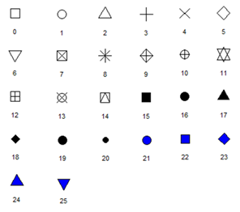
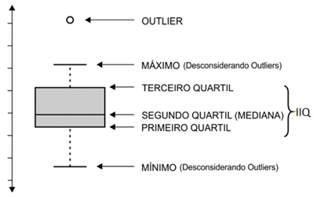
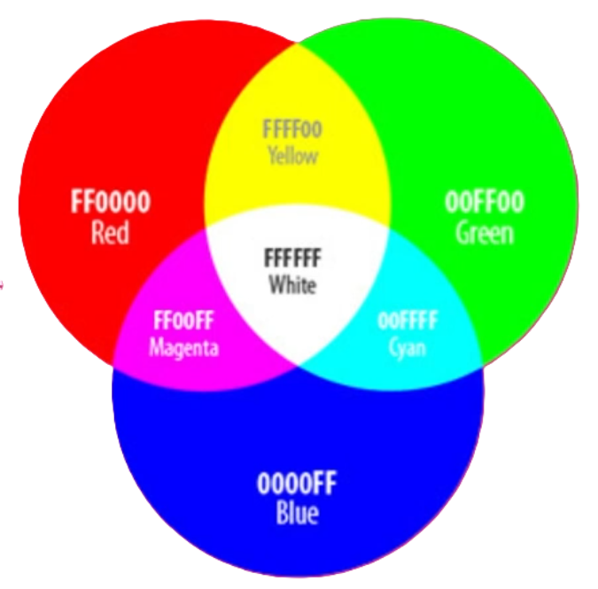
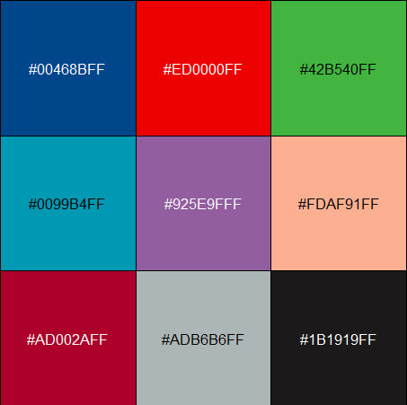

# Gráficos {#sec-graficos}

## Pacotes necessários

```{r}
#| message: false
#| warning: false
pacman::p_load(tidyverse, readxl, scales, ggsci, ggpubr, 
               paletteer, knitr, RColorBrewer, scico)
```

## Leitura da base de dados {#sec-dadosggplot2}

A fonte de dados será o conjunto de dados `dadosMater.xlsx` encontrado [aqui](https://github.com/petronioliveira/Arquivos/blob/main/dadosMater.xlsx) . Salve o arquivo em seu diretório leia-o com o código abaixo:

```{r}
dados <- readxl::read_excel("dados/dadosMater.xlsx")  |> 
  select(idade_mae, fumo, quant_fumo, renda, para, ig, peso_rn, comp_rn, sexo)  |>  
  mutate(fumo = factor(fumo, 
                       levels = c(1,2), 
                       labels = c("Fumante", "Não fumante")),
         sexo = factor(sexo, 
                       levels = c(1,2), 
                       labels = c("Masculino", "Feminino")),
         categIdade = case_when(
           idade_mae < 20 ~ "< 20 anos",
           idade_mae >= 20 & idade_mae <= 35 ~ "20 a 35 anos",
           idade_mae > 35 ~ "> 35 anos"),
         categIdade = factor(categIdade, 
                             levels = c("< 20 anos", 
                                        "20 a 35 anos",
                                        "> 35 anos")),
         categFumo = case_when(
           quant_fumo == 0 ~ "nao_fumante",
           quant_fumo <= 10 ~"fumante_leve",
           quant_fumo > 10  & quant_fumo < 20 ~ "fumante_moderada",
           quant_fumo >= 20 ~ "fumante_pesada"),
         categFumo = factor(categFumo, 
                            levels = c("nao_fumante", 
                                       "fumante_leve",
                                       "fumante_moderada",
                                       "fumante_pesada"))) 

str(dados)
```

## Pacote ggplot2 {#sec-ggplot2}

O `ggplot2` é um pacote da linguagem R, parte do ecossistema `tidyverse`, voltado para a visualização de dados, oferecendo uma abordagem poderosa e elegante baseada na *Gramática dos Gráficos* [@wickham2010layered],[@wickham2023ggplot2].

### Gramática dos gráficos

A lógica das **camadas (layers)** no **ggplot2** significa que um gráfico é construído **empilhando componentes**, cada um responsável por uma parte da visualização. A ideia central é: **um gráfico não é um objeto único, mas a soma de várias camadas independentes que trabalham juntas**. Consiste em construir gráficos adicionando partes — dados, geometrias, transformações estatísticas, escalas, temas — uma sobre a outra, usando o operador `+`. Cada camada contribui com um aspecto visual ou analítico do gráfico.

Os blocos de construção de um gráfico incluem:

- **Dados** — o conjunto de dados usado naquela camada (pode ser diferente do gráfico principal).

- **Mapeamento estético (aes)** — Controla como as variáveis do seu dataframe são mapeadas para propriedades visuais, como eixos *x* e *y*, cores, tamanhos e formas.

- **Geometria (geom)** — Define o formato visual dos dados. Por exemplo, `geom_point()` para gráficos de dispersão, `geom_bar()` para gráficos de barras e `geom_boxplot()` para diagramas de caixa.

- **Estatísticas e Transformações** — Permite calcular e plotar resumos estatísticos automaticamente (como médias, regressões ou suavizações usando `geom_smooth`) diretamente dos dados originais.

- **Posicionamento (position)** — ajustes como `position_dodge`, `stack`, `jitter`.

- **Sistema de Facetas (Facets)** - Facilita a divisão de um gráfico em múltiplos painéis (subgráficos) com base em uma ou mais variáveis categóricas, permitindo comparar grupos lado a lado.

- **Sistema de Temas (theme)** - Oferece total controle sobre o design geral do gráfico (fontes, fundos, grades, legendas e rótulos), permitindo criar gráficos prontos para publicação científica ou corporativa

[Por que isso é poderoso]{.underline}?

Porque com essa estratégia é possível:

- Sobrepor diferentes tipos de visualização

- Usar dados diferentes em cada camada

- Adicionar anotações, linhas de referência, modelos estatísticos

- Controlar estética global ou por camada

- Criar gráficos complexos de forma modular

## Principais gráficos

Para descrever os dados e visualizar o que está acontecendo, recomenda-se utilizar um gráfico adequado. O que é adequado? Depende principalmente do tipo de dados, bem como das características particulares do que se quer explorar. Além disso, um gráfico em um relatório sempre é um fator de "impacto". Ou seja, pode ter um efeito positivo no leitor ou fazê-lo abandonar a leitura. Finalmente, um gráfico de frequência pode ser utilizado para ilustrar, explicar uma situação complexa onde palavras ou uma tabela podem ser confusos, extensos ou de outro modo insuficiente. Por outro lado, deve-se evitar usar gráficos onde poucas palavras expressam claramente o que se quer mostrar. Aconselha-se que, ao analisar os dados, é importante inspecioná-los como se fossem uma imagem, uma fotografia, ver como eles se parecem, qual o seu aspecto, e só então pensar em interpretar os aspectos vitais da estatística [@field2012graphs].

### Gráfico de dispersão {#sec-scatterplot}

Um gráfico de dispersão (*Scatterplot*) exibe a relação entre duas variáveis numéricas. Cada ponto representa uma observação. Suas posições nos eixos *x* (horizontal) e *y* (vertical) representam os valores das duas variáveis.\
O gráfico de dispersão permite identificar padrões, tendências e a força de uma possível correlação entre essas variáveis. Frequentemente, vem acompanhado por um cálculo do coeficiente de correlação (@sec-coef), que mede uma relação linear.

O gráfico de dispersão será usado para introduzir a lógica gramática dos gráficos no `ggplot2`.

Para a inicar a construção de gráfico de dispersão, começa-se com o mapeamento das variáveis para os eixos *x* e *y*. A função central do pacote é `ggplot()`, que recebe os dados por meio do argumento `data`. Em seguida, a função estética `aes()` define os mapeamentos dos eixos *x* e *y*, iniciando o gráfico com uma **camada base** — ainda vazia, mesmo que os dados já tenham sido fornecidos. Essa camada base corresponde a um painel cinza (@fig-baselayer), sobre o qual outras camadas serão adicionadas. Funciona como um terreno pronto para receber uma construção, que será erguida com o uso de uma função geométrica.

Tomando as variáveis `comp_rn` e `peso_rn` de uma amostra de 100 observações do conjunto `dados` [^08-graficos-1], com filtro para as gestações a termo [^08-graficos-2], será visualizada a camada base:

[^08-graficos-1]: O código inicia com a semente `set.seed()` para garantir a repetibilidade.

[^08-graficos-2]: Gestações com idade gestacional igual ou acima de 37 semanas e abaixo de 42 semanas.

```{r}
#| echo: true
#| label: fig-baselayer
#| fig-align: 'center'
#| out-width: "70%"
#| fig-cap: "Camada base do ggplot"

set.seed(123)
dados_100 <- dados |> 
  filter(ig >= 37 & ig < 42) |> 
  slice_sample(n=100)

dados_100|> 
  ggplot(aes(x = comp_rn, y = peso_rn))
```

A seguir, adiciona-se [^08-graficos-3] a camada dos pontos que usa a **geometria** `geom_point()` para criar um **gráfico de dispersão** (@fig-scatter1).

[^08-graficos-3]: O adicionar aqui é literal, pois isto é feito com o sinal (+).

```{r}
#| echo: true
#| eval: true
#| label: fig-scatter1
#| fig-align: 'center'
#| out-width: "70%"
#| fig-cap: "Gráfico de dispersão básico"
#| message: false
#| warning: false

dados_100|>
  ggplot(aes(x = comp_rn, y = peso_rn)) +
  geom_point()
```

Como quase tudo no R, existem diversos modos de se chegar ao mesmo resultado. O `aes()` e os dados (`data`) podem ser definidos na camada `ggplot()` ou na `geom`.

```{r}
#| echo: true
#| eval: false
#| message: false
#| warning: false

ggplot(data = dados_100) +
  geom_point(aes(x = comp_rn, y = peso_rn))

ggplot() +
  geom_point(data = dados_100, aes(x = comp_rn, y = peso_rn))

```

A saída de qualquer dos códigos acima é igual ao da @fig-scatter1.

A @fig-scatter1 mostra um gráfico de dispersão ainda sem um aspecto elegante, mas com as informações necessárias. Tem este fundo acinzentado que não é do agrado da maioria, além de não apresentar os rótulos das variáveis de forma mais clara, mais adequada.

#### Customização do gráfico de dispersão {#sec-custom}

A geometria `geom_point()` tem múltiplas opções de customização, através de seus argumentos:

- **color**: a cor do traço, o contorno do ponto

- **stroke**: a largura do traço no ponto

- **fill**: cor da parte interna do ponto

- **shape**: formato do marcador (@fig-shape)

- **alpha**: transparência do ponto, varia de 0 a 1, 0 é totalmente transparente; 1 = opaco.

- **size**: tamanho do ponto

{#fig-shape fig-align="center" width="7.8cm"}

Para definir um tamanho uniforme para todos os pontos do gráfico, basta especificar um valor numérico no argumento `size` [^08-graficos-4] da função `geom_point()`, como por exemplo `size = 1.5` (padrão). Para melhor visualização, será escolhido `size = 3` ou `4`. O mesmo princípio se aplica à cor. O argumento `color` (vai colorir o contorno dos pontos) e argumento `fill` para a cor de preenchimento do ponto. A escolha das cores depende do gosto pessoal, na @sec-coresr, serão mostrados alguns princípios que auxiliam esse processo. Para alterar o formato dos pontos, usar o argumento `shape`, conforme as opções na @fig-shape. Somente os formatos 21 a 25 permitem preenchimento. No exemplo, será usado `shape = 21` que tem borda preta (controlada pelo `stroke = 1`. Nesse caso, é possível adicionar o argumento para definir a cor interna do ponto, ou seja, uma cor fixa (`fill = "tomato"`).

[^08-graficos-4]: O valor de `size` é numérico e representa o diâmetro aproximado do ponto em mm.

```{r}
#| echo: true
#| label: fig-scatter2
#| fig-align: 'center'
#| out-width: "70%"
#| fig-cap: "Gráfico de dispersão colorido"

ggplot(data = dados_100,
       mapping = aes(x = comp_rn, y = peso_rn)) +
  geom_point(fill ="tomato",
             alpha = 1,
             shape = 21, 
             size = 3,
             stroke =1)
```

#### Lidando com a sobreposição dos pontos {#sec-jitter}

Na @fig-scatter2 , a modificação realizada melhorou o aspecto do gráfico. Entretanto, os pontos estão se sobrepondo, porque o comprimento dos recém-nascidos, apesar de ser uma variável numérica contínua, está registrado no conjunto de dados como discreta e existem vários com o mesmo comprimento. Nesse caso, a solução para evitar a sobreposição, é provocar um pequeno deslocamento aleatório dos pontos, tornando o gráfico mais legível. Isto é feito, embutindo o *jitter* (espalhamento) com um argumento dentro do `geom_point()`, o `position = position_jitter (width = 0.2, height = 0)`. O argumento `width` controla o deslocamento horizontal (eixo *x*); `height` controla o deslocamento vertical (eixo *y*). No exemplo (@fig-scatter3), os pontos serão espalhados horizontalmente, mantendo a posição vertical. Será usado o argumento `width = 0.2` que espalha os pontos de forma leve, sem alterar o eixo *y*.

```{r}
#| echo: true
#| label: fig-scatter3
#| fig-align: 'center'
#| out-width: "70%"
#| fig-cap: "Gráfico de dispersão com jitter"

ggplot(data = dados_100, 
       mapping = aes(x = comp_rn, y = peso_rn)) +
  geom_point(position = position_jitter(width = 0.2, height = 0),
             fill ="tomato2",
             shape = 21,
             alpha = 1,
             size = 3,
             stroke = 1) 
```

#### Modificando os títulos dos eixos {#sec-titulos}

A forma mais simples e recomendada de mudar o nome principal dos eixos é utilizando `labs()` como uma nova camada.

```{r}
#| echo: true
#| label: fig-scatter4
#| fig-align: 'center'
#| out-width: "70%"
#| fig-cap: "Gráfico da @fig-scatter3 com os rótulos modificados"

ggplot(data = dados_100, 
       mapping = aes(x = comp_rn, y = peso_rn)) +
  geom_point(position = position_jitter(width = 0.2, height = 0),
             fill ="tomato2",
             shape = 21,
             alpha = 1,
             size = 3,
             stroke = 1) +
  labs(x = "Comprimento do Recém-nascido (cm)",
       y = "Peso do Recém-nascido (g)") 
```

Na @fig-scatter4, observa-se que os rótulos, agora definem claramente para o leitor a que eles se referem.

#### Mudando o tema {#sec-theme}

A @fig-scatter4 já é um gráfico bem aceitável, apesar de o autor implicar muito com o fundo cinza – `theme_gray()`. Essa cor acinzentada padrão do `ggplot2` pode ser alterada pela definição de outro tema integrado, entre muitos, como o `theme_bw()` que usa um fundo branco e linhas finas de grade de cor cinza. Outro tema interessante é o `theme_classic()` que é um tema de aparência clássica, com linhas dos eixos *x* e *y* e sem linhas de grade. Foi adicionado também o argumento `base_size = 13`, para modificar o tamanho das letras.

Para ver outras possibilidades acesse [Completes themes - ggplot2](https://ggplot2.tidyverse.org/reference/ggtheme.html).

O gráfico da @fig-scatter4 com a adição do `theme_bw()` e aumento do tamanho das letras, pode ser observado na @fig-scatter5.

```{r}
#| echo: true
#| label: fig-scatter5
#| fig-align: 'center'
#| out-width: "70%"
#| fig-cap: "Gráfico da @fig-scatter4 com o tema theme_bw()"

ggplot(data = dados_100,
       mapping = aes(x = comp_rn, y = peso_rn)) +
  geom_point(position = position_jitter(width = 0.2, height = 0),
             fill ="tomato",
             shape = 21, 
             alpha = 1,
             size = 3,
             stroke =1) +
  labs(x = "Comprimento do Recém-nascido (cm)",
       y = "Peso do Recém-nascido (g)") +
  theme_bw(base_size = 13)
```

O gráfico mostra, de forma direta, que **bebês mais compridos tendem a pesar mais**. Há uma **correlação positiva clara** entre comprimento e peso dos recém‑nascidos.

### Histograma {#sec-hist}

O **histograma** é uma ferramenta gráfica que fornece informações sobre o formato da distribuição e dispersão dos dados, permitindo verificar se existe ou não simetria. É usado para dados contínuos.

No histograma, as frequências observadas são representadas por intervalos de classes de ocorrência que estão no eixo *x* e a altura das barras, representando a frequência de cada intervalo, no eixo *y*. A área de cada barra é proporcional à porcentagem de observações de cada intervalo. O `geom_histogram()` é a geometria para a construção de um histograma. Aqui, há necessidade apenas do eixo *x*, pois existe uma única variável. A execução do comando retorna a distribuição dessa variável.

Os dados para plotar um histograma, serão provenientes do mesmo dataframe `dados_100` , utilizado na @sec-scatterplot . A lógica é a mesma do gráfico de dispersão. A variável, usada para construção de um histograma simples, é `dados_100$peso_rn` .

```{r}
#| echo: true
#| label: fig-hist1
#| fig-align: 'center'
#| out-width: "70%"
#| fig-cap: "Histograma simples"
#| message: false
#| warning: false

ggplot(dados_100, aes(x=peso_rn)) + 
  geom_histogram()+
  labs(x = " Peso dos Recém-Nascidos (g)", 
       y = "Frequência")  +
  theme_bw(base_size = 13)
```

A aparência do histograma da @fig-hist1 permite ter uma ideia da distribuição e simetria dos dados, mas não está com um aspecto agradável, amigável. Mesmo que ele expresse corretamente a sua mensagem, essa pode ser prejudicada por uma má aparência.\
O histograma recebeu uma variável numérica (no caso, o peso dos recém-nascidos) e a divide em vários “compartimentos”, os intervalos, representados pelas barras. A escolha do tamanho (amplitude) do intervalo é de extrema importância para a aparência do histograma.\
O `geom_histogram()` tem um argumento, denominado `binwidth` que permite alterar a amplitude do intervalo. O `binwidth` é um intervalo e sua unidade é igual a da variável que se está “histogramando”. No exemplo, foi usado o peso do recém-nascido (g). Se o objetivo são intervalos de 100 em 100 gramas, o `binwidth` será igual a 100 (@fig-hist100).

```{r}
#| echo: true
#| label: fig-hist100
#| fig-align: 'center'
#| out-width: "70%"
#| fig-cap: "Histograma simples com binwidth = 100"
#| message: false
#| warning: false

ggplot(dados_100, aes(x=peso_rn)) + 
  geom_histogram(binwidth = 100,
                 fill = "chartreuse",
                 color = "darkgreen")+
  labs(x = "Peso dos Recém-Nascidos (g)", 
       y = "Frequência")  +
  theme_bw(base_size = 13)
```

Uma outra maneira, é usar `bins` que agrupa em intervalos de mesmo tamanho. Por exemplo `bins = 30`, o `geom_histogram()` dividirá em 30 intervalos iguais, gerando um histograma como o da @fig-hist2, onde não foi especificado `bins` nem `binwidth`, pois este é padrão.

Junto com a alteração dos intervalos, modificou-se a cor de preenchimento (`fill`) e bordas (`color`) das barras (@fig-hist2 ).

```{r}
#| echo: true
#| label: fig-hist2
#| fig-align: 'center'
#| out-width: "70%"
#| fig-cap: "Histograma simples com bins = 30 e tema alterado"
#| message: false
#| warning: false

ggplot(dados_100, aes(x=peso_rn)) + 
  geom_histogram(bins = 30,
                 fill = "chartreuse",
                 color = "darkgreen")+
  labs(x = "Peso dos Recém-Nascidos (g)", 
       y = "Frequência")  +
  theme_bw(base_size = 13)
```

Com frequência se observa um histograma com curva normal sobreposta (@fig-hist3) para facilitar a comparação dos dados com a distribuição normal. Isso pode ser conseguido com um código que usa função `stat_function()` para a construção da curva normal, baseada nos dados (média e desvio padrão da variável `peso_rn`) e a função `after_stat(density)`, colocada na estética do histograma, no eixo *y*, para substituir a frequência (contagem) pela densidade de probabilidade (veja @sec-distprob). O restante do código somente estabelece que a linha da curva será tracejada (`linetype = “dashed”`), de cor vermelha (`color = “red”`) e com tamanho 1 (`linewidth = 1`).

```{r}
#| echo: true
#| label: fig-hist3
#| fig-align: 'center'
#| out-width: "70%"
#| fig-cap: "Histograma com curva normal sobreposta"
#| message: false
#| warning: false

ggplot(dados_100) + 
  geom_histogram(aes(x = peso_rn, 
                     y = after_stat(density)),
                 binwidth = 100,
                 fill = "chartreuse",
                 color = "darkgreen") +
  stat_function(fun = dnorm, 
                args = list(mean = mean(dados_100$peso_rn),
                            sd = sd(dados_100$peso_rn)),
                linetype = "dashed",
                linewidth = 1,
                color = "red") +
  labs(x = "Peso do Recém-Nascido (g)", 
       y = "Densidade de Probabilidade")  +
  theme_bw(base_size = 13)
```

Na @fig-hist3, se observa que os pesos dos recém-nascidos se ajustam razoavelmente à curva normal.

### Boxplot {#sec-bxp}

O `boxplot` é uma representação gráfica de um resumo eficaz, de fácil compreensão, de uma ou mais variáveis numéricas. Fornece uma análise visual da posição, dispersão, simetria, caudas e valores discrepantes (*outliers*) do conjunto de dados (@fig-boxplot).

- **Posição** – Em relação à posição dos dados, observa-se a linha central do retângulo (a mediana ou segundo quartil).

- **Dispersão** – A dispersão dos dados pode ser representada pelo intervalo interquartil (IIQ), tamanho da caixa, que é a diferença entre o terceiro quartil (3ºQ) e o primeiro quartil (1ºQ), ou ainda pela amplitude que é calculada da seguinte maneira: valor máximo – valor mínimo. Embora a amplitude seja de fácil entendimento, o intervalo interquartil é uma estatística mais robusta para medir variabilidade uma vez que não sofre influência de outliers.

- **Simetria** – Um conjunto de dados que tem uma distribuição simétrica, terá a linha da mediana no centro do retângulo. Quando a linha da mediana está próxima ao primeiro quartil, os dados são assimétricos positivos e quando a posição da linha da mediana é próxima ao terceiro quartil, os dados são assimétricos negativos. Vale lembrar que a mediana é a medida de tendência central mais indicada quando os dados possuem distribuição assimétrica, uma vez que a média aritmética é influenciada pelos valores extremos.\

- **Caudas** – As linhas que vão do retângulo até aos *outliers* podem fornecer o comprimento das caudas da distribuição.\

- **Valores atípicos** (*Outliers*) – Os valores atípicos indicam possíveis valores discrepantes. No boxplot, as observações são consideradas atípicas quando estão abaixo ou acima dos limites superior e inferior. O limite de detecção de valores atípicos (outliers) é construído utilizando o intervalo interquartil, dado pela distância entre o primeiro e o terceiro quartil. Sendo assim, os limites inferior e superior de detecção de outlier são dados por:

  - o Limite Inferior: 1ºQ – (1,5 \* IIQ);

  - o Limite Superior: 3ºQ + (1,5 \* IIQ). Tanto o limite superior como o inferior são representados por (º).

  - os Valores extremos: são valores que estão acima ou abaixo de 3 vezes o IIQ e são representados por (\*).

{#fig-boxplot fig-align="center" width="10.7cm"}

Os boxplots são construídos com o `geom_boxplot()`. Deve-se especificar uma variável quantitativa para o eixo *y* e uma variável qualitativa para o eixo *x* (grupo). Se não houver, variável *x* e tem-se apenas um vetor de valores numéricos, então, ignora-se a variável *x* [^08-graficos-5].

[^08-graficos-5]: Informar ao R que não será usada a variável *x*, usando *`x`*`= NULL` ou *`x`*`= ""` ou `x = " "` . O autor dá preferência por `x = "".` Assim, o `ggplot2` entende que existe um objeto discreto no eixo *x* e o boxplot é desenhado dentro do espaço reservado para essa categoria. Isto permite o uso do argumento `width` para controla a largura dentro do espaço. Usando `x = NULL`, o `ggplot2` entende que não existe eixo *x* e o gráfico vira um boxplot unidimensional, usando toda a largura disponível. Dessa maneira, torna o boxplot muito largo e o `width` é ignorado.

Para o exemplo de um boxplot, será usada a variável `peso_rn` do conjunto de dados `dados_100` , carregados na @sec-scatterplot. O `geom_boxplot()` vazio gera um gráfico sem cores. Colocando o preenchimento `fill = “skyblue”`, tem-se um boxplot de cor azul céu (@fig-bxp1).

```{r}
#| echo: true
#| label: fig-bxp1
#| fig-align: "center"
#| out-width: "70%"
#| fig-cap: "Boxplot simples"
#| message: false
#| warning: false

ggplot(dados_100, 
       aes(x = "", y = peso_rn)) +
  geom_boxplot(fill = "skyblue", alpha = 0.6, width = 0.4) +
  labs (x = "", y = "Peso do Recém-nascido (g)") +
  theme_bw(base_size = 13)
```

A @fig-bxp1 mostra, de forma clara, a distribuição dos pesos dos recém‑nascidos. A Mediana está um pouco abaixo do centro da caixa, sugerindo leve assimetria. A caixa representa o intervalo interquartil, mostrando a concentração central dos pesos. Os “bigodes” indicam a dispersão, amplitude dos valores típicos. Há um valor acima do limite superior, indicando um recém‑nascido com peso bem maior que os demais (*outlier*).

Esse boxplot já tem um aspecto muito bom e pode ser considerado pronto. Entretanto uma versão melhor pode ser feita com algumas pequenas modificações, como remover o eixo *x* e seus ticks por completo, usando a função `theme()` com os argumentos, respectivamente, `axis.text.x = element_blank()` e `axis.ticks.x = element_blank()`, como recomendado por Wickham [@wickham2010layered]. Observe bem o eixo *x*, o tick desapareceu.

```{r}
#| echo: true
#| label: fig-bxp2
#| fig-align: "center"
#| out-width: "70%"
#| fig-cap: "Boxplot simples sem eixo x"
#| message: false
#| warning: false

ggplot(dados_100, aes(x = " ", y = peso_rn)) +
  geom_boxplot(fill = "skyblue", alpha = 0.6, width = 0.4) +
  labs(x = NULL, y = "Peso do Recém-nascido (g)") +
  theme_bw(base_size = 13) +
  theme(axis.text.x = element_blank(),
        axis.ticks.x = element_blank())

```

Na aparência do boxplot , é clássico, no estilo Tukey [@mcgill1978variations], o seu formato com os “bigodes” terminando em “T”, como mostra a @fig-boxplot, e não um traço simples, padrão do `ggplot2`. Para modificar isso, pode-se criar uma nova camada de barra de erro, usando a função `geom_errorbar()`, antes de `geom_boxplot()`. Assim, como o boxplot passa ser a camada mais superficial, ele impede que se visualize a barra de erro na caixa (@fig-bxp3), desde que ele seja opaco (remover ou zerar o argumento `alpha`). A função `geom_errorbar()` é a, normalmente, usada para barras de erro, no entanto, aqui ela está sendo utilizada com `stat = "boxplot"` [^08-graficos-6], o que significa que os cálculos de estatística do boxplot [^08-graficos-7] serão aplicados à barra de erro para desenhar os limites do boxplot. O argumento `width = 0.1` ajusta a largura das barras de erro, tornando-as mais estreitas.

[^08-graficos-6]: O padrão é `stat = "identity"`, o que significa que os valores das barras de erro devem ser fornecidos diretamente no conjunto de dados, sem cálculos adicionais.

[^08-graficos-7]: `ggplot2` não está calculando médias e desvios‑padrão (como seria comum em barras de erro). Em vez disso, ele usa o *stat* do boxplot para obter:

    - **ymin** → limite inferior do *whisker*

    - **lower** → primeiro quartil (Q1)

    - **middle** → mediana

    - **upper** → terceiro quartil (Q3)

    - **ymax** → limite superior do *whisker*

```{r}
#| echo: true
#| label: fig-bxp3
#| fig-align: 'center'
#| out-width: "70%"
#| fig-cap: "Boxplot simples com bigodes em T"
#| message: false
#| warning: false

ggplot(dados_100, aes(x = " ", y = peso_rn)) +
  geom_errorbar(stat = "boxplot", width = 0.1) +
  geom_boxplot(fill = "skyblue", width = 0.4) +
  labs(x = NULL, y = "Peso do Recém-nascido (g)") +
  theme_bw(base_size = 13) +
  theme(axis.text.x = element_blank(),
        axis.ticks.x = element_blank())
```

#### Múltiplos boxplots

Os boxplots são bastante úteis quando se compara dois grupos, tornando-se uma ferramenta conveniente para compreender rapidamente as diferenças entre esses grupos. Ao usar os boxplots para comparar grupos, deve-se ter cuidado, pois os resumos podem levar à perda de informação que pode induzir erros de interpretação. Considere os boxplots da @fig-bxp4, comparando o comprimentos de recém-nascidos a termo masculinos e femininos, a mediana dos meninos é mais alta do que a das meninas. As meninas apresentam a mediana fora do centro das caixas, indicando um certo grau de assimetria. Mesmo sendo possível obter informações importantes sobre os dados, usando um boxplot, não se pode discernir a distribuição subjacente dos pontos de dados individuais dentro de cada grupo ou o número total de observações.\
As cores dos boxplots serão definidas manualmente dentro do `geom_boxplot()`. Além disso, será adicionada a função `theme(legend.position = "none")` para remover a legenda, pois ela é redundante neste gráfico, uma vez que os sexos já estão mencionados no eixo *x* [^08-graficos-8].

[^08-graficos-8]: Aqui não se deve remover o eixo *x*, como feito na @fig-bxp2, pois a sua presença é importante.

```{r}
#| echo: true
#| label: fig-bxp4
#| fig-align: 'center'
#| out-width: "70%"
#| fig-cap: "Comparação de dois grupos com boxplots"
#| message: false
#| warning: false

ggplot(dados_100, aes(x = sexo, y = comp_rn)) +
  geom_errorbar(stat = "boxplot", width = 0.1) +
  geom_boxplot(fill= c("#76CEF7", "#FFA2A4")) +
  labs(x = NULL, y = "Comprimento dos Recém-Nascidos (cm)") +
  theme_bw(base_size = 13) +
  theme(legend.position = "none")
```

As cores `#76CEF7` (azul claro) e `#FFA2A4` (rosa) foram escolhidas, usando o [Seletor de Cores](https://corhexa.com/seletor-de-cores) do CorHexa (ver @sec-coresr).

#### Sobrepondo *Jitter* em um Boxplot

Combinar `geom_jitter()` com um boxplot permite exibir estatísticas resumidas enquanto mostra cada ponto dos dados bruto (@fig-bxp5). Torna o boxplot mais esclarecedor com a visualização da distribuição dos dados. Não esquecer de colocar o argumento `outliers = FALSE` que remove os *outliers.*

Prestar atenção para o fato de que o *jitter* introduz um ruído aleatório e, por isso, em cada execução do código os pontos se distribuem em posições diferentes. Para tornar o jitter reprodutível usar uma `seed` (semente), `set.seed(234)` antes de executar o `ggplot()`, mas essa ação é opcional.

O `geom_jitter()` pode usar vários argumentos:

- `width`: controla a quantidade horizontal do espalhamento;

- `height`: controla a quantidade vertical do espalhamento;

- `size`: controla o tamanho dos pontos;

- `alpha`: ajusta a transparência (por ex.: `alpha = 0.5`) para ajudar a visualizar as áreas com alta densidade.

```{r}
#| echo: true
#| label: fig-bxp5
#| fig-align: 'center'
#| out-width: "70%"
#| fig-cap: "Boxplots com jitter"
#| message: false
#| warning: false

set.seed(234)
ggplot(dados_100, aes(x = sexo, y = comp_rn)) +
  geom_errorbar(stat = "boxplot", width = 0.1) +
  geom_boxplot(fill= c("#76CEF7", "#FFA2A4"),
               outliers = FALSE) +
  geom_jitter(color="#7A7A7A", 
              size=1.5, 
              width = 0.1,
              height = 0) +
  labs(x = NULL, y = "Comprimento dos Recém-Nascidos (cm)") +
  theme_bw(base_size = 13) +
  theme(legend.position = "none")
```

A semente (`set.seed(234)`) no início serve para garantir que os pontos criados pelo *jitter* fiquem com o mesmo espalhamento toda vez que forem gerados.

#### Boxplots horizontais {#sec-bxphorizontal}

Para criar boxplots horizontais, adiciona-se a função `coord_flip()` à função `geom_boxplot()` para inverter os eixos. Em um boxplot padrão, a variável categórica está no eixo *x* e a variável numérica no eixo *y*. Com `coord_flip()`, as variáveis são invertidas, colocando a variável categórica no eixo *y* e a numérica no eixo *x*, resultando no boxplot horizontal da @fig-bxp6.

```{r}
#| echo: true
#| label: fig-bxp6
#| fig-align: 'center'
#| out-width: "70%"
#| fig-cap: "Boxplots horizontais"
#| message: false
#| warning: false

ggplot(dados_100, aes(x = sexo, y = comp_rn)) +
  geom_errorbar(stat = "boxplot", width = 0.1) +
  geom_boxplot(fill= c("#76CEF7", "#FFA2A4")) +
  coord_flip() +
  labs(x = NULL, y = "Comprimento dos Recém-Nascidos (cm)") +
  theme_bw(base_size = 13) +
  theme(legend.position = "none")
```

### Gráfico de violino {#sec-violin}

Os gráficos de violino permitem visualizar a distribuição de uma variável numérica para um ou vários grupos. No `ggplot2`, são construídos com o `geom_violin()` e, com frequência, substituem os boxplots, principalmente, quando se tem uma amostra muito grande e usar o *jitter* no boxplot pode não ser eficaz, pois os pontos podem se sobrepor e tornar a figura ilegível.

Cada “violino” representa uma variável de agrupamento. A forma representa a estimativa de densidade de probabilidade da variável: quanto mais pontos de dados em um intervalo específico, mais largo será o violino para esse intervalo. É muito parecido com um boxplot, mas permite uma compreensão mais profunda da distribuição.

Para o exemplo prático, será usada uma amostra proveniente do conjunto de dados `dados` ( @sec-dadosggplot2), filtrando para as gestações a termo, ou seja, com idade gestacional (`ig`) \> 37 semanas e \< 42 semanas, `dados_rnt`. Serão utilizadas as variáveis `peso_rn` e `categFumo`, tabagismo entre as gestantes, de acordo com a intensidade (não fumante, fumante leve. fumante moderada, fumante pesada) . O objetivo é observar visualmente o impacto do tabagismo sobre os pesos dos recém-nascidos.

```{r}
dados_rnt <- dados |> 
  dplyr::filter(ig >= 37 & ig < 42) |> 
  select(peso_rn, categFumo)
```

Para construir o gráfico de violino, serão usados os argumentos `trim = FALSE`, para não aparar as caudas, e `quantiles = c(0.25, 0.5, 0.75)`, e `quantile.linetype = "dashed"` para traçar os quartis (@fig-violino1). As cores das categoria foram definidas pelo `ggplot2`.\
Reiterando, a função `theme(legend.position = "none")` será colocada para evitar que a legenda das categorias apareça, uma vez que ela é explicita no gráfico.

```{r}
#| echo: true
#| label: fig-violino1
#| fig-align: 'center'
#| out-width: "70%"
#| fig-cap: "Gráfico de violino com os quartis"
#| message: false
#| warning: false

ggplot(dados_rnt, aes(x=categFumo, y=peso_rn, fill=categFumo)) + 
  geom_violin(trim = FALSE,
              quantiles = c(0.25, 0.50, 0.75),
              quantile.linetype = "dashed") +
  labs(x = "Tabagismo Materno", 
       y = "Peso do Recém-Nascido (g)")  +
  theme_bw(base_size = 13) +
  theme(legend.position = "none") 
```

Uma alteração interessante que pode ser feita no gráfico de violino, é adicionar um boxplot, dentro do mesmo (@fig-violino2), faz o efeito do argumento `quantiles()`, usado na @fig-violino1 [^08-graficos-9]. Facilita a interpretação e, na opinião do autor, é mais bonito e elegante. O argumento `width = 0.5`, na função `geom_boxplot()`, estabelece a largura do boxplot, evitando que o mesmo se estenda para fora do "violino". Também deve ser usado argumento `outliers = FALSE`[^08-graficos-10] para que os *outliers* não apareçam.

[^08-graficos-9]: A camada do `geom_boxplot()` deve ser colocada após a do `geom_violin()`, se sobrepõe a ela.

[^08-graficos-10]: O padrão é `outliers = TRUE`.

```{r}
#| echo: true
#| label: fig-violino2
#| fig-align: 'center'
#| out-width: "70%"
#| fig-cap: "Gráfico de violino com boxplots"
#| message: false
#| warning: false

ggplot(dados_rnt, aes(x=categFumo, y=peso_rn, fill=categFumo)) + 
  geom_violin(trim = FALSE) +
  geom_boxplot(width = 0.5,
               outliers = FALSE) +
  labs(x = "Tabagismo Materno", 
       y = "Peso do Recém-Nascido (g)")  +
  theme_bw(base_size = 13) +
  theme(legend.position = "none")
```

A @fig-violino2 mostra uma tendência do peso do recém-nascido diminuir à medida que intensidade do fumo aumenta. O gráfico sugere que esta tendência não é significativa, pois as caixas se sobrepõem. Entretanto é necessário um teste estatístico [^08-graficos-11] para verificar.

[^08-graficos-11]: ANOVA de uma via

Para obter uma versão horizontal da @fig-violino1, chama-se a função `coord_flip()` [^08-graficos-12] que permite inverter os eixos *x* e *y* e, assim, tornar a interpretação mais intuitiva, mais amigável .

[^08-graficos-12]: Consulte a construção da @fig-bxp6

Para [interpretar um gráfico de violino]{.underline}, observar o seguinte:

- Forma do violino, observando a largura em diferentes pontos para entender onde os dados se concentram.

- A linha mediana e a caixa do boxplot associado indicam a mediana e o intervalo interquartil, respectivamente.

- Se o violino é simétrico em torno da mediana, a distribuição dos dados é aproximadamente simétrica.

- Se a parte superior do violino é mais larga, os dados podem ser assimétricos, inclinados para valores maiores.

- Em múltiplas categorias, pode-se comparar rapidamente as distribuições. Diferentes formas e larguras entre as categorias fornecem uma visão clara das variações entre elas.

### Gráfico de barras {#sec-bar}

O gráfico de barras é uma análogo do histograma, onde as barras, ao contrário deste, são separadas. Os gráficos de barra exibem a distribuição (frequências) de uma variável categórica através de barras verticais ou horizontais, ou sobrepostas [^08-graficos-13]. A função `geom_bar()` permite delinear o gráfico de barras da @fig-bar1.

[^08-graficos-13]: Uma recomendação importante: Evite gráfico de barras em três dimensões!

Para os exemplos práticos, será usada uma amostra proveniente do conjunto de dados dados (@sec-dadosggplot2), manipulando as variáveis: `categFumo` , tabagismo materno, e `categIdade` , idade materna categorizada. Em outros exemplos de gráficos barras, serão usadas as variáveis `fumo` (fumante e não fumante), `para` (número de filhos anteriores) e `sexo` do recém-nascido.

O gráfico de barras inicial servirá para visualizar a prevalência (@sec-prevalencia) de fumo na gestação categorizada pela intensidade do fumo.

```{r}
#| echo: true
#| label: fig-bar1
#| fig-align: 'center'
#| out-width: "70%"
#| fig-cap: "Gráfico de barras padrão do ggplot2"
#| message: false
#| warning: false

ggplot(data = dados) + 
  geom_bar(aes(x = categFumo, 
               y = after_stat(count/sum(count))))+ 
  labs(x = "Tabagismo Materno", 
       y = "Proporção por categoria")  +
  theme_bw(base_size = 13)
```

As cores de preenchimento das barras podem ser alteradas, de acordo com a variável categórica. As cores serão estabelecidas de acordo com o padrão do ggplot2 (@fig-bar2). O gráfico retornará uma legenda, mostrando o que representa cada cor. Ela é desnecessária porque fica explicito, no eixo *x*, o que cada barra representa. Portanto, é uma boa conduta remover a legenda com a função `theme (legend.position = "none")`, como já visto em outras ocasiões (boxplots e gráfico de violino):

```{r}
#| echo: true
#| label: fig-bar2
#| fig-align: 'center'
#| out-width: "70%"
#| fig-cap: " Gráfico de barras com as cores das barras estabelecidas pelo ggplot2"
#| message: false
#| warning: false

ggplot(data = dados) + 
  geom_bar(aes(x = categFumo, 
               y = after_stat(count/sum(count)),
               fill = categFumo))+ 
  labs(x = "Tabagismo Materno", 
       y = "Proporção por categoria")  +
  theme_bw(base_size = 13) +
  theme(legend.position = "none")
```

As cores padrão do `ggplot2` podem ser alteradas, como será visto na @sec-coresr, escolhendo manualmente, ou usando uma paleta.

#### Proporção ou porcentagem

Na @fig-bar2, a unidade do eixo *y* encontra-se como uma proporção `y = after_stat(count/sum(count))`, ou seja, y = *frequência por categoria*/*total de observações*.\
É possível modificar para porcentagem (@fig-bar3), empregando a função `percent_format()` do `pacote scales`. O código é praticamente igual, apenas acrescentar o argumento `labels = percent_format(accuracy = 0.1, decimal.mark = “,”)` dentro da função `scale_y_continuous()`.

```{r}
#| echo: true
#| label: fig-bar3
#| fig-align: 'center'
#| out-width: "70%"
#| fig-cap: "Gráfico de barras com porcentagem no eixo y"
#| message: false
#| warning: false

ggplot(data = dados) + 
  geom_bar(aes(x = categFumo, 
               y = after_stat(count/sum(count)),
               fill = categFumo))+ 
  scale_y_continuous (labels = percent_format (accuracy = 0.1,
                                               decimal.mark = ",")) +
  labs(x = "Tabagismo Materno", 
       y = "Porcentagem por categoria")  +
  theme_bw(base_size = 13) +
  theme(legend.position = "none")
```

#### Controle da largura da barra

Para controlar a largura e o espaço entre as barras, num gráfico de barras no `ggplot2`, usar o argumento `width` dentro da função `geom_bar()`, definindo um valor entre 0 e 1. Um valor de 1 representa a largura total, ou seja, não haverá espaço entre as barras, como no histograma.

Como exemplo, será alterado a largura das barras do gráfico da figura @fig-bar3 . Se o objetivo é que as barras sejam mais estreitas e com mais espaço entre elas, deve-se definir um valor para `width` inferior a 0.9 (padrão). Na @fig-bar4, será usado `width = 0.5`.

```{r}
#| echo: true
#| label: fig-bar4
#| fig-align: 'center'
#| out-width: "70%"
#| fig-cap: "Gráfico de barras mais estreitas com width = 0.5"
#| message: false
#| warning: false

ggplot(data = dados) + 
  geom_bar(aes(x = categFumo, 
               y = after_stat(count/sum(count)),
               fill = categFumo),
           width = 0.5)+ 
  labs(x = "Tabagismo Materno", 
       y = "Proporção por categoria")  +
  theme_bw(base_size = 13) +
  theme(legend.position = "none")
```

::: callout-tip
## Exercício

Qual a diferença entre `geom_bar()` e `geom_col()`?

Construir o mesmo gráfico de barras da @fig-bar4, usando a `geom_col()`.
:::

[Resposta]{.underline}

> <font size=2>
>
> A `geom_bar()` conta as ocorrências e usa a altura para representar essa contagem, enquanto `geom_col()` usa a altura para representar o valor especificado na estética *y* . Ambas as funções aceitam o argumento `width`. Enquanto o `geom_bar()` com a `after_stat()` calcula os valores automaticamente, o `geom_col()` exige que se forneça os valores de *y* (as proporções) diretamente.

```{r}
#| echo: true
#| label: fig-bar5
#| fig-align: 'center'
#| out-width: "70%"
#| fig-cap: "Gráfico de barras do Exercício"
#| message: false
#| warning: false

# 1) Calcular proporções por categoria

dados_prop <- dados |> 
  count(categFumo) |> 
  mutate(prop = n / sum(n))
dados_prop

# 2) Construir o gráfico com geom_col()

ggplot(data = dados_prop) +
  geom_col(aes(x = categFumo,
               y = prop,
               fill = categFumo),
           width = 0.9) +
  labs(x = "Tabagismo Materno",
       y = "Proporção por categoria") +
  theme_bw(base_size = 13) +
  theme(legend.position = "none")

```

</font>

#### Gráfico de barras empilhadas

O gráfico de barras empilhadas (contagem) é ideal para visualizar a proporção de cada grupo dentro de uma categoria. A altura total da barra representa a contagem total para a variável no eixo *x*, e as cores dentro da barra mostram a distribuição da segunda variável.

Para criá-lo, mapear a primeira variável para o **eixo x** e a segunda variável para a **estética fill**. A função `geom_bar()` faz o empilhamento por padrão.

Serão utilizados os mesmos dados (@sec-dadosggplot2) manipulados nos gráficos de barra até agora. Com o objetivo de ver a proporção de tabagismo por faixa etária das gestantes da maternidade, serão usadas as variáveis `categIdade` e `fumo` . Como aprimoramentos, se pretende colocar as porcentagens de fumantes em cada uma das faixas etária no topo das barras para facilitar a leitura do gráfico.

Em primeiro lugar, calcular as *proporções* de fumante em cada uma das faixas etárias. Após realizado o cálculo das proporções de fumantes em cada faixa etária, constrói-se o gráfico. Para colocar as porcentagens no gráfico [^08-graficos-14], será usada a geometria `geom_text()`, informando essas porcentagens e a localização no eixo *x* e *y*, usando o argumento `vjust = -0.5` [^08-graficos-15], resultando na @fig-bar6.

[^08-graficos-14]: Este acréscimo das porcentagens dentro do gráfico é opcional. Para fazer o mesmo gráfico sem esta informação, não há necessidade dos cálculos das proporções e nem do `geom_text()` que deve ser removido.

[^08-graficos-15]: `vjust = -0.5` posiciona o rótulo levemente acima do topo da barra, em unidades de altura do texto — independente da escala dos dados.

```{r}
#| echo: true
#| label: fig-bar6
#| fig-align: 'center'
#| out-width: "70%"
#| fig-cap: "Gráfico de barras empilhadas"
#| message: false
#| warning: false

proporcoes_fumo <- dados |>
  group_by(categIdade, fumo) |>
  summarise(n = n(), .groups = "drop") |>
  group_by(categIdade) |>
  mutate(total_faixa = sum(n),
         proporcao_fumo = n / total_faixa) |>
  filter(fumo == "Fumante")

ggplot(dados, aes(x = categIdade, fill = fumo)) +
  geom_bar(color = "#000000") +
  scale_fill_manual(values = c("#000000", "#FFFFFF")) +
  geom_text(data = proporcoes_fumo,
            aes(x = categIdade,
                y = total_faixa,
                label = scales::percent(proporcao_fumo, accuracy = 0.1)),
            size = 4,
            vjust = -0.5,
            color = "#000000") +
  scale_y_continuous(expand = expansion(mult = c(0, 0.1))) +
  labs(x = "Faixa Etária", y = "Frequência", fill = NULL) +
  theme_classic(base_size = 13) +
  theme(legend.position = "top")
```

#### Gráfico de barras lado a lado

O gráfico de barras lado a lado (ou agrupado) é útil para comparar diretamente a contagem de cada grupo entre as categorias. As barras de uma mesma categoria são dispostas lado a lado para facilitar a comparação visual. Para criá-lo, se faz de maneira semelhante das barras empilhadas. Mapear a primeira variável para o eixo *x* e a segunda para a estética `fill` e adicionar o argumento `position = "dodge"` dentro do `geom_bar()`. Este argumento diz ao `ggplot2` para não empilhar as barras, mas sim colocá-las lado a lado.\
O `geom_text ()` usa `position_dodge()` para replicar o comportamento das barras. O argumento `width = 0.9` é o valor padrão para a largura das barras no `ggplot2` e garante um alinhamento perfeito. O gráfico de barras lado a lado é, portanto construído assim:

1)  Inicialmente, calcula-se as proporções das categorias [^08-graficos-16]:

[^08-graficos-16]: Não é necessário calcular `posicao_y`. O argumento `vjust = -0.5` no `geom_text()` posiciona o rótulo acima de cada barra automaticamente, independente da escala dos dados.

```{r}
prop_fumo <- dados  |> 
  group_by(categIdade, fumo)  |> 
  summarise(n = n(), .groups = "drop") |> 
  group_by(categIdade)  |> 
  mutate(total_faixa = sum(n),
         proporcao_fumo = n / total_faixa)
prop_fumo
```

2)  Com esses dados, constrói-se o gráfico:

```{r}
#| echo: true
#| label: fig-bar7
#| fig-align: 'center'
#| out-width: "80%"
#| fig-cap: "Gráfico de barras lado a lado"
#| message: false
#| warning: false

ggplot(dados, aes(x = categIdade, fill = fumo)) +
  geom_bar(position = "dodge",
           color ="#000000") +
  scale_fill_manual(values = c("#000000","#FFFFFF")) +
  geom_text(data = prop_fumo,
            aes(x = categIdade,
                y = n,
                label = scales::percent(proporcao_fumo, accuracy = 0.1)),
            size = 3.5,
            vjust = -0.5,
            color = "#000000",
            position = position_dodge(width = 0.9)) + 
  scale_y_continuous (expand = expansion(mult = c(0, 0.10))) +
  labs(x = "Faixa Etária",
       y = "Frequência",
       fill = NULL) +
  theme_classic(base_size = 12) +
  theme(legend.position = "top")
```

A @fig-bar7 mostra as porcentagens de fumantes em cada uma das categorias de uma forma bem clara.

#### Gráfico de barra para uma variável numérica discreta

Uma variável numérica discreta é um tipo de variável que assume valores inteiros, resultantes de contagens, e que não podem assumir valores fracionários entre eles. A medição ocorre através da contagem das observações (@sec-tipovariavel). Para a representação gráfica, utiliza-se um gráfico de barras . O resultado é semelhante a um histograma com as barras separadas. Para o exemplo, serão usados os mesmos dados empregados na construção dos gráficos de barras empilhadas e lado a lado, provenientes do conjunto de dados `dadosMater.xlsx` (@sec-dadosggplot2). Nesses dados, existe a variável `para` que representa o número de filhos que a gestante teve antes do atual. É uma variável numérica discreta que será mostrada visualmente por gráfico de barras simples (@fig-bar8).

::: callout-important
## Importante

Apesar da variável `para` ser uma variável numérica discreta, para a construção do gráfico ela foi **transformada em um fator** para informar ao `ggplot2` que todos os rótulos do eixo *x* (nº de filhos anteriores) devem aparecer, inclusive o referente aos 9 e 10 filhos anteriores, apesar de não existirem na amostra.
:::

```{r}
#| echo: true
#| label: fig-bar8
#| fig-align: 'center'
#| out-width: "70%"
#| fig-cap: "Gráfico de barras de uma variável discreta"
#| message: false
#| warning: false

# Criar uma tabela com contagem completa, incluindo zeros
contagem <- as.data.frame(table(factor(dados$para, levels = 0:11)))

# Calcular proporção de cada barra
contagem$prop <- contagem$Freq / sum(contagem$Freq)

# Plotar
ggplot(contagem, aes(x = Var1, y = prop)) +
  geom_bar(stat = "identity", 
           fill = "tomato", color = "gray30") +
  geom_text(aes(label = scales::percent(prop, accuracy = 0.1),
                y = prop + 0.01), size = 3.5, color = "black") +
  scale_y_continuous (expand = expansion(mult = c(0, 0.10))) +
  labs(x = "Número de filhos anteriores ao atual", 
       y = "Proporção") +
  theme_classic(base_size = 13)
```

### Gráfico de barra de erro

Um gráfico de barra de erro é uma ferramenta visual que mostra a variabilidade de dados em um ponto específico. Ele consiste em pontos ou barras que representam as médias (ou outras estatísticas) de um conjunto de dados, com linhas verticais (ou horizontais) que indicam o intervalo de confiança, o desvio padrão ou o erro padrão da média. Essas linhas verticais são conhecidas como “barras de erro”. Usado para comparar as médias de diferentes grupos, mostrando a variabilidade dentro de cada grupo. É visto com frequência em pesquisas científicas e publicações para apresentar os resultados experimentais com suas respectivas variabilidades. Entretanto, este tipo de gráfico é alvo de controvérsias em relação ao seu uso, recebendo bastante crítica porque gráficos de barras não exibem a distribuição dos dados e não adicionam informações além da transmissão direta no texto das médias e dos desvios padrão. Alguns, mais fervorosos dão a ele uma denominação pejorativa de gráfico de dinamite [@peres2022barraerro].

As barras de erro dão uma ideia geral de quão precisa é uma medição. O cenário para a construção de um gráfico de barra de erro é o tabagismo na gestação e o peso dos recém-nascidos, onde as barras representarão a média do peso ao nascer (g) e as barras de erro com intervalo de confiança de 95% (veja @sec-estimacao), calculado usando média $\pm$ margem de erro, onde a margem de $erro = 1.96 × erro \ padrão$.

1)  [Resumo dos dados]{.underline}: Após carregar os dados necessários (`dados_rnt`), se fará um resumo dos mesmos que informará as respectivas médias, desvios padrão e margens de erro por grupo.

```{r}
resumo <- dados |> 
  dplyr::filter(ig >= 37 & ig < 42) |> 
  select(peso_rn, sexo, fumo) |> 
  group_by(sexo, fumo) |> 
  summarise(n = n(),
            media = mean(peso_rn, na.rm = TRUE),
            dp = sd(peso_rn, na.rm = TRUE),
            me = 1.96 * dp/sqrt(n),
            min =min(peso_rn, na.rm = TRUE),
            max =max(peso_rn, na.rm = TRUE),
            .groups = 'drop')
print(resumo)
```

2)  [Construção do gráfico]{.underline} (@fig-bar9) , conforme explicado abaixo:

    a)  O gráfico inicia com a colocação a variável `sexo` no eixo *x* e média da variável `peso_rn` no *y* e estabelecendo cores diferentes para o fator `sexo`;

    b)  `geom_bar(stat = “identity”` usa os valores reais da média para a altura das barras, `color = “black”` estabelece a cor preta para o contorno das barras e `position_dodge(0.9)` separa as barras lado a lado para cada grupo de `fumo`;

    c)  `geom_point (position = position_dodge(0.9)` adiciona um ponto sobre cada barra (pode ser útil para destacar a média). É opcional;

    d)  `geom_errorbar()` adiciona a barra de erro acima da média, com base na barra de erro `me`. Poderia ter sido usado o desvio padrão. O erro está opcionalmente colocado acima da barra, mas poderia ser acima e abaixo ;

    e)  `labs()` define os rótulos dos eixos e da legenda;

    f)  `coord_cartesian(ylim = c(0, 3500))` limita o eixo *y* de 0 a 3500, sem cortar dados fora desse intervalo. Entretanto, para reduzir a altura das barras, pode-se cortar dados, por exemplo começar em1000, 1500 ou, mesmo, 2000, uma vez que não existem recém-nascidos, nesta amostra, com menos de 2000 g e o foco é a média e o IC95%;

    g)  `scale_fill_manual(values = c("#F2F2F2"`, `"#F2FBFF"))` estabelece as cores para os níveis de `fumo`;

    h)  `scale_y_continuous( breaks = seq(0, 3500, 500) , expand = expansion(mult = c(0, 0.10)))` - a primeira parte define os rótulos do eixo *y* de 500 em 500, começando em 0 [^08-graficos-17], a segunda adiciona um pequeno espaço acima das barras para não cortar os rótulos (adiante será discutido sobre isso);

    i)  Por último colocou o tema clássico[^08-graficos-18] do `ggplot2` com fonte maior para melhorar a leitura.

[^08-graficos-17]: Modificar se no `coord_cartesian()` o valor inicial for alterado, por exemplo, 1000, 1500 ou 2000.

[^08-graficos-18]: Pode ser qualquer tema, este fica bem por ser bem limpo, sem grades, apenas eixo *x* e *y*.

```{r}
#| echo: true
#| label: fig-bar9
#| fig-align: 'center'
#| out-width: "70%"
#| fig-cap: "Gráfico de barras de erro"
#| message: false
#| warning: false

ggplot(resumo, aes(x=sexo, y=media, fill=fumo)) +      
  geom_bar(stat="identity", color="#000000", 
           position=position_dodge(0.9)) +
  geom_point(position=position_dodge(0.9)) +
  geom_errorbar(aes(ymin = media, ymax = media+me), width=0.2,
                position=position_dodge(.9)) +
  labs(x="", 
       y = "Peso do Recém-Nascido(g)",
       fill = "") +
  coord_cartesian(ylim = c(1500, 3500)) +
  scale_fill_manual(values = c("#000000", "#FFFFFF")) +
  scale_y_continuous (breaks = seq(1500, 3500, 500),
                      expand = expansion(mult = c(0, 0.10))) +
  theme_classic(base_size = 13) +
  theme(legend.position = "top")

```

### Gráfico de linha {#sec-line}

Em diversas situações, há necessidade de visualizar os dados observados ao longo do tempo. A sua representação se dá, na maioria das vezes, por meio de um gráfico de linhas. O `ggplot2` tem uma geometria, a `geom_line()` é utilizada para isso. Do mesmo modo que nos gráficos de dispersão, precisa-se definir o que representado nos eixos *x* e *y*.

Esse tipo de gráfico é muito útil para relatórios epidemiológicos e análises de sazonalidade.

Os dados usados nesta seção são provenientes do Painel de Hospitalizações de Síndrome Respiratória Aguda Grave (SRAG) da Secretaria da Saúde do Estado do Rio Grande do Sul. Esta base de dados encontra-se [aqui](https://github.com/petronioliveira/Arquivos/blob/main/covid_rs.csv) em .CSV. Salve em seu diretório de trabalho e faça a leitura da seguinte maneira, garantindo que a variável anos seja um fator [^08-graficos-19]:

[^08-graficos-19]: Isto permitira separar os anos por cores no gráfico.

```{r}
#| message: false
#| warning: false
dados_covid <- readr::read_csv2("dados/covid_rs.csv") |> 
  dplyr:: mutate (ano = as.factor(ano))

str(dados_covid)
```

```{r}
#| echo: true
#| label: fig-line1
#| fig-align: 'center'
#| fig-width: 10
#| fig-height: 6   
#| out-width: "70%"
#| fig-cap: |
#|   Hospitalizações por SRAG por COVID-19 — RS (2023–2026) 
#|   Dados por semana epidemiológica
#|   Rio Grande do Sul, RS
#| message: false
#| warning: false

ggplot(dados_covid, aes(x = sem, y = n_hosp, color = ano)) +
  geom_line(linewidth = 1.2) +
  geom_point(size = 2) +
  scale_x_continuous(breaks = seq(1, 53, 2)) +
  labs(
    x = "Semana epidemiológica",
    y = "Número de hospitalizações",
    color = "Ano"
  ) +
  theme_minimal(base_size = 14)
```

O ano de 2023 mostra um padrão típico pós-epidemia; em 2024 houve um aumento forte entre as semanas 7 e 17; em 2025 com uma onda muito intensa (picos acima de 1000 hospitalizações); em 2026 com dados ainda parcial, mas já mostrando tendência de aumento até a semana 23.

## Manuseio das cores no ggplot2 {#sec-coresr}

Na @sec-custom foi introduzido o uso de cores no R. Agora, apesar deste assunto praticamente não ter limites, serão mostrados alguns princípios do manuseio das cores no `ggplot2.`

O R possui 657 cores integradas que permitem uma gama ampla de opções. Uma lista completa dos nomes dessas cores podem ser vistas, digitando, no *RScript* ou *Console* do *RStudio*, `colors()`.

```{r}
#| echo: true
#| eval: false
colors()
```

**Para escolher as cores pelo nome**, pode-se visualizá-las de uma maneira fácil, acessando um guia completo [aqui](https://drive.google.com/file/d/1WAdKbgHvMtNEP6GhScH9zMXmgW59_GdE/view?usp=sharing), criado pelo Dr. Ying Wei, do Departamento de Bioestatística da Universidade de Columbia, USA. Neste guia, as cores estão especificadas por seu **nome em inglês**.

Uma outra maneira de especificar as cores, é usar o **sistema RGB ou hexadecimal**. Esse sistema usa códigos no formato **#RRGGBB**, onde cada par representa a intensidade de **vermelho (RR)**, **verde (GG)** e **azul (BB)** em valores hexadecimais de **00 a FF**.

Cada par de letras controla a intensidade de uma cor primária [@holtz_ggplot2_color]

- `#FF0000`: Vermelho puro (Vermelho máximo, sem Verde ou Azul).

- `#00FF00`: Verde puro.

- `#0000FF`: Azul puro.

- `#FFFFFF`: Branco puro.

- `#000000`: Preto puro.

É possível adicionar mais dois dígitos no final (`#RRGGBBAA`) para controlar a **opacidade** (transparência), onde `00` é invisível e `FF` é cor sólida. A plataforma gratuita **CorHexa** tem um [Seletor de Cores](https://corhexa.com/seletor-de-cores) que é uma ferramenta extremamente útil para criar e ajustar cores facilmente e encontrar o seu código hexadecimal. Em [HTML Color Codes](https://htmlcolorcodes.com/) existe modos de escolher a cor e copiar o código hexadecimal.

A mistura das cores cria outras cores conforme a @fig-hexa, a `#FFFF00` (“yellow”) resulta da combinação de `#FF0000` ("red") e #00FF00 ("green"). Cada cor é descrita por três componentes (vermelho, verde e azul).

{#fig-hexa fig-align="center" width="10cm"}

### Cores por Variável (Mapeamento)

Para aplicar uma cor a todo o gráfico, defina `color` ou `fill` **fora da função** `aes()`.

A @fig-scatter5 é um exemplo de cores fixas, usando `fill = "tomato"` para o preenchimento.

Para que as cores representem categorias ou valores numéricos, passe o nome da variável **dentro da função** `aes()`. O preenchimento (`fill`) é colocado dentro da função; o contorno, se houver interesse em modificar, usar `color` fora da função `aes()`, no `geom_point()`. O `ggplot2` criará automaticamente as legendas que , por padrão, aparecerá à direita [^08-graficos-20]. A @fig-scatter6 é a @fig-scatter5 modificada para ter cores diferentes de acordo com a categoria (`sexo`) e com legenda na parte superior.

[^08-graficos-20]: Para modificar a posição da legenda foi usada a função `theme(legend.position = "top")`.

```{r}
#| echo: true
#| label: fig-scatter6
#| fig-align: 'center'
#| out-width: "70%"
#| fig-cap: "Gráfico da dispersão com cores de acordo com uma variável categórica, determinadas pelo ggplot2"

ggplot(data = dados_100,
       mapping = aes(x = comp_rn, y = peso_rn, fill = sexo)) +
  geom_point(position = position_jitter(width = 0.2, height = 0),
             shape = 21, 
             alpha = 1,
             size = 3,
             stroke =1) +
  labs(x = "Comprimento do Recém-nascido (cm)",
       y = "Peso do Recém-nascido (g)",
       fill = "") +
  theme_bw(base_size = 13) +
  theme(legend.position = "bottom")
```

### Ajustando Cores Categóricas (Discretas)

Para alterar as cores internas atribuídas automaticamente a grupos pelo `ggplot2`, como na @fig-scatter6, usar as camadas `scale_color_manual()` ou `scale_fill_manual()`.

Inicialmente, para que as cores fiquem bem amarradas às categorias (no caso, `"Masculino"` e `"Feminino"`), será utilizado um vetor `cores_sexo` com as cores azul e rosa, respectivamente, para os sexos masculino e feminino.

```{r}
cores_sexo <- c("Masculino" = "#2b8cbe",
                "Feminino" = "#f598a2")   
```

O código fica assim:

```{r}
#| echo: true
#| label: fig-scatter7
#| fig-align: 'center'
#| out-width: "70%"
#| fig-cap: "Gráfico da dispersão com cores determinadas manualmente"

ggplot(data = dados_100,
       mapping = aes(x = comp_rn, y = peso_rn, fill = sexo)) +
  geom_point(position = position_jitter(width = 0.2, height = 0),
             shape = 21, 
             alpha = 1,
             size = 3,
             stroke = 1) +
  labs(x = "Comprimento do Recém-nascido (cm)",
       y = "Peso do Recém-nascido (g)",
       fill = "") +
  scale_fill_manual(values = cores_sexo) +
  theme_bw(base_size = 13) +
  theme(legend.position = "bottom")
```

::: callout-caution
## Atenção!

Se estiver usando `shape` que **não aceita preenchimento** (como 16 ou 19), então deve-se usar `color = sexo` e `scale_color_manual().`
:::

### Ajustando as cores de variáveis contínuas (Gradientes)

Se sua variável for numérica, você pode ajustar a transição de cores com funções da família `scale_color_gradient()` ou `scale_fill_gradient()`. Define-se o degradê manualmente: do menor peso (`low`) ao maior peso (`high`)

```{r}
#| echo: true
#| label: fig-scatter8
#| fig-align: 'center'
#| out-width: "70%"
#| fig-cap: |
#|   Gráfico da dispersão com cores determinadas por variável contínua
#|   (Renda Familiar em salários mínimos)

ggplot(data = dados,
       mapping = aes(x = comp_rn, y = peso_rn, fill = renda)) + 
  geom_point(position = position_jitter(width = 0.2, height = 0),
             shape = 21, 
             alpha = 0.9,
             size = 3.5,
             stroke = 0.7,
             color = "gray30") + 
  labs(x = "Comprimento do Recém-nascido (cm)",
       y = "Peso do Recém-nascido (g)",
       fill = "Renda (SM)") +
  scale_fill_gradient(low = "aliceblue", high = "darkblue") + 
  theme_bw(base_size = 13) +
  theme(legend.position = "right") 
```

### Paletas Prontas (Pacotes Extras)

Para usar paletas profissionais e esteticamente agradáveis rapidamente, pode-se recorrer a paletas de pacotes clássicos como o `ggsci`, `RColorBrewer` ou `paletteer` . Para criar paletas aleatórias e harmoniosas, existe um [site](https://coolors.co/) bem popular que realiza essa função.

#### Pacote ggsci

O `ggsci` é um pacote que oferece uma coleção de paletas de alta qualidade inspiradas em cores usadas em revistas científicas, bibliotecas de visualização de dados, filmes de ficção científica e programas de TV. As paletas de cores no `ggsci` estão disponíveis como escalas `ggplot2`, Para todas usa-se as seguintes funções:

- `scale_color_nomedapaleta()` e
- `scale_fill_nomedapaleta ()`.

Por exemplo, para a paleta do *Lancet*, usa-se para o preenchimento: `scale_fill_lancet()`; para o *New England Journal of Medicine*, `scale_fill_nejm()`; para o *Journal of the American Medical Association*, `scale_fill_jama()`; para o *British Medical Journal*, `scale_fill_bmj()`, etc. O pacote `ggsci` deve ser instalado e carregado para usar essas paletas. Para visualizar as opções do pacote `ggsci` acessar [Scientific Journal and Sci-Fi Themed Color Palettes for ggplot2](#0){style="font-size: 13pt;"}.

Como exemplo, será usado o código que gerou o gráfico da @fig-scatter7 com alterações, usando a paleta do periódico *British Medical Journal (BMJ)*.

```{r}
#| echo: true
#| label: fig-scatter9
#| fig-align: 'center'
#| out-width: "70%"
#| fig-cap: "Gráfico da dispersão com cores da paleta do British Medical Journal"
ggplot(data = dados_100,
       mapping = aes(x = comp_rn, y = peso_rn, fill = sexo)) +
  geom_point(position = position_jitter(width = 0.2, height = 0),
             shape = 21, 
             alpha = 1,
             size = 4,
             stroke = 1) +
  labs(x = "Comprimento do Recém-nascido (cm)",
       y = "Peso do Recém-nascido (g)",
       fill = "") +
  scale_fill_bmj() +
  theme_bw(base_size = 13) +
  theme(legend.position = "bottom")
```

As cores usadas são agora as da paleta do *BMJ* (@fig-scatter9). A paleta do *BMJ* pode ser visualizada com a função `show_col(pal_bmj())`(@fig-bmj) do pacote `scales`.

{#fig-bmj fig-align="center" width="9cm"}

## Desafio

::: callout-tip
Tente visualizar outras paletas do pacote `ggsci`, usando a função `show_col()` do pacote scales. Por exemplo:

`show_col(pal_jama())`

`show_col(pal_lancet())`

`show_col(pal_aaas())`

`show_col(pal_simpsons())`
:::

#### Pacote RColorBrewer

O `RColorBrewer` [@RColorBrewerPackage] é um dos pacotes mais famosos e utilizados do R para escolha de esquemas de cores. Ele não cria cores aleatórias: ele implementa as paletas criadas pela geógrafa Cynthia Brewer [@HarrowerBrewer2003], que foram desenhadas especificamente para mapas e gráficos, garantindo excelente contraste visual e legibilidade.

Para visualizar (@fig-colorbrewer) as paletas do pacote `RColorBrewer`, usar:

```{r}
#| echo: true
#| fig-cap: 'Paleta do RColorBrewer'
#| label: fig-colorbrewer
#| fig-align: 'center'
#| out-width: "90%"
#| message: false
#| warning: false

par(mar=c(2, 4, 2, 3))            # modifica o tamanho das margens
display.brewer.all()
par(mar=c(5.1, 4.1, 4.1, 2.1))    # retorna ao tamanho original das margens
```

Como exemplo (@fig-scatter10), será repetido o gráfico da @fig-scatter9 com uma paleta de cores do `RColorBrewer`, `Pastel2`.

```{r}
#| echo: true
#| label: fig-scatter10
#| fig-align: 'center'
#| out-width: "70%"
#| fig-cap: "Gráfico de dispersão com cores personalizadas usando o RColorBrewer"

ggplot(dados_100, 
       aes(x = comp_rn, y = peso_rn, fill = sexo)) +
  geom_point(position = position_jitter(width = 0.2, height = 0),
             shape = 21, 
             color = "gray20", 
             size = 4, 
             stroke = 1) +
  scale_fill_brewer(palette = "Pastel2") +
  labs(title="",
       x = "Comprimento do Recém-nascido (cm)",
       y = "Peso do Recém-nascido (g)",
       fill = "") +
  theme_bw(base_size = 13) +
  theme(legend.position = "bottom")
```

#### Paleta paletteer

O pacote `paletteer` no R reúne um grande número de paletas de cores de diversos pacotes do R dedicados a cores. Fornece uma interface simples e consistente para acessar essas paletas, facilitando o trabalho. Oferece mais de 2000 paletas de cores de vários pacotes do R, como `ggthemes`, `wesanderson`, `lisa`, `scico`, entre outros. Tudo acessível por uma interface simples e poderosa, facilitando a criação de visualizações bonitas e informativas [@hvitfeldt2024paletteer].\
Todas as paletas podem ser acessadas a partir das três funções `paletteer_c()`, `paletteer_d()` e `paletteer_dynamic()` usando a sintaxe: `nome_do_pacote::nome_da_paleta` [^08-graficos-21].

[^08-graficos-21]: A função `paletteer_c()` é usada para variáveis contínuas; a `paletteer_d()` para variáveis categóricas e a `paletteer_dynamic()` é pouco usada, mas serve para paletas que mudam conforme o número de categorias.

Paletas discretas são paletas com um número fixo de cores. Elas são úteis para visualizar dados categóricos. Por exemplo, uma paleta que vai do vermelho ao laranja, do verde ao preto é uma paleta discreta.

Exemplo com a paleta `nbapalettes::supersonics_holiday`, mapeando os pontos em um tamanho maior (`size = 7`) para chamar atenção das cores.

```{r}
#| echo: true
#| label: fig-scatter11
#| fig-align: 'center'
#| out-width: "70%"
#| fig-cap: "Gráfico de dispersão com cores personalizadas usando o paletteer"

ggplot(dados_100, 
       aes(x = comp_rn, y = peso_rn, fill = sexo)) +
  geom_point(position = position_jitter(width = 0.2, height = 0),
             shape = 21, 
             color = "gray20", 
             size = 5, 
             stroke = 1.5) +
  scale_fill_paletteer_d("nbapalettes::supersonics_holiday") +
  labs(title="",
       x = "Comprimento do Recém-nascido (cm)",
       y = "Peso do Recém-nascido (g)",
       fill = "") +
  theme_bw(base_size = 13) +
  theme(legend.position = "bottom") 
```

Para uma visualização rápida de algumas paletas com o `paleteteer`, pode-se digitar em um script do *RStudio* o seguinte comando:

```{r}
paletteer::paletteer_d("lisa::FridaKahlo")
```

```{r}
paletteer::paletteer_d("nbapalettes::supersonics_holiday")
```

No console, aparecerão as cores com os códigos hexadecimais. Se as cores não estiverem visíveis como aqui, então acesse o website [HTML Color Codes](https://html-color-codes.info/), onde facilmente é feita essa conversão.

Isto é apenas o caminho, existem uma enorme quantidade de paletas (mais de 2500 paletas!) e o `paletteer` é uma espécie de facilitador para se ter acesso a elas. Escolher as cores para um gráfico é uma tarefa desafiadora e demorada, o que geralmente leva à insatisfação. Em um dos seus sites educacionais [Yan Holtz](https://www.yan-holtz.com/) disponibiliza um [localizador de paletas de cores](https://r-graph-gallery.com/color-palette-finder) que torna este trabalho mais palatável.

## Outras manipulações nos gráficos

### Facetamento {#sec-facet}

Na @sec-coresr, foi mostrado como comparar grupos, através da cor, usando as estéticas `fill` ou `color` [^08-graficos-22]. Outra técnica para diferenciar grupos em um gráfico é o **facetamento**. O facetamento cria gráficos dividindo os dados em subconjuntos e exibindo o mesmo gráfico para cada subconjunto (@fig-scatter12) . Para facetar um gráfico, basta adicionar uma especificação de facetamento com a função `facet_wrap()`, que recebe o nome de uma variável categórica precedido pelo sinal gráfico `til (~)`.

[^08-graficos-22]: Além da cor, os grupos em um gráfico também podem ser diferenciados por meio das estéticas **shape** e **size**. Para isso, substituir o mapeamento `fill = sexo` por `shape = sexo` ou `size = sexo`.

Como exemplo prático, será aproveitado o código que gerou a @fig-scatter6 com pequenas alterações [^08-graficos-23] e aplicação do `facet_wrap()`.

[^08-graficos-23]: Além da função específica para o facetamento, a cor agora é determinada com preenchimento dos pontos ( `fill=”tomato”`) colocado dentro do `geom_point()` .

```{r}
#| echo: true
#| label: fig-scatter12
#| fig-align: 'center'
#| out-width: "70%"
#| fig-cap: "Gráfico de dispersão com facetamento por categoria (sexo)"

ggplot(data = dados_100,
       mapping = aes(x = comp_rn, y = peso_rn)) +
  geom_point(position = position_jitter(width = 0.2, height = 0),
             fill = "tomato",
             shape = 21, 
             alpha = 1,
             size = 3,
             stroke =1) +
  labs(x = "Comprimento do Recém-nascido (cm)",
       y = "Peso do Recém-nascido (g)") +
  theme_bw(base_size = 13) +
  theme(legend.position = "bottom") +
  facet_wrap(~sexo)
```

O facetamento (@fig-scatter12) permite verificar que a relação entre o comprimento e o peso dos recém-nascidos é nitidamente linear e semelhante entre os sexos.

### Reta de Regressão

A função `geom_smooth()` é uma forma geométrica do `ggplot2` usada para visualizar tendências ou padrões entre duas variáveis numéricas. Ele adiciona uma linha suavizada ao gráfico, que ajuda a entender a relação entre os dados , especialmente quando há muitos pontos ou quando a relação não é linear. O `geom_smooth()` ajusta uma curva aos dados, usando métodos estatísticos. A regressão linear usa `method = “lm”` [^08-graficos-24]. Por padrão, exibe o intervalo de confiança (veja @sec-estimacao), que mostra a incerteza da estimativa da reta [^08-graficos-25]. Esta técnica ajuda a identificar padrões que não podem ser visíveis apenas com os pontos brutos.

[^08-graficos-24]: Outros métodos: `“loess”`, `“glm”`, `“gam”`. Para mais informações, consulte a ajuda `?loess`, `?gam` ou `?glm` ou `NULL`, onde a escolha é automática: usa `“loess”` para \< 1000 pontos e `“gam”` para \> 1000.

[^08-graficos-25]: Se não houver interesse no aparecimento da área ao redor da reta de regressão, o intervalo de confiança, mudar o argumento `se = FALSE`.

O código da figura @fig-scatter6 será tomado como base sem a divisão por sexo [^08-graficos-26], com modificações, para gerar a reta de regressão.

[^08-graficos-26]: A @fig-scatter12 mostrou que a correlação não parece diferir entre os sexos.

```{r}
#| echo: true
#| label: fig-scatter13
#| fig-align: 'center'
#| out-width: "80%"
#| fig-cap: "Gráfico de dispersão com reta de regressão"

set.seed(234)
ggplot(dados_100, 
       aes(x = comp_rn, y = peso_rn)) +
  geom_point(position = position_jitter(width = 0.2, height = 0),
             fill = "tomato",
             shape = 21,
             alpha = 1,
             size = 3,
             stroke =1) +
  geom_smooth(method = "lm", 
              se =TRUE,
              color= "darkred") +
  xlab("Comprimento do Recém-nascido (cm)") +
  ylab("Peso do Recém-nascido (g)") +
  theme_bw(base_size = 13)
```

O gráfico da @fig-scatter13, mostra um ajuste dos pontos a uma reta, com inclinação ascendente, ou seja uma correlação positiva, à medida que o comprimento do recém-nascido aumenta, aumenta o seu peso ao nascer.\
A distância dos pontos à reta é o erro ou resíduo. A melhor reta ajustada é aquela em que a soma dos quadrados da distância de cada ponto (soma dos quadrados residual) em relação à reta é minimizada (veja também @sec-rls).

### Mudando o nome dos eixos, o nome e a ordem dos rótulos

Para modificar o nome dos eixos, a recomendação, como visto na @sec-titulos, é usar a função `labs()` como nos gráficos a partir da @fig-scatter4 .

O nome e ordem dos rótulos podem ser modificados, usando a função `scale_x_discrete()` com os argumentos `limits =` que coloca os níveis na ordem desejada e `labels =` que coloca os novos nomes[^08-graficos-27] na ordem estabelecida pelo argumento `limits =`.

[^08-graficos-27]: Pode-se aproveitar aqui para trocar os nomes ou , simplesmente, corrigir acentuação que, às vezes, não foi colocada no dataframe.

Observando, por exemplo, o gráfico da @fig-bar3, onde se usou a paleta do NEJM, verifica-se que os rótulos do eixo *x* estão como: `fumante_leve`, `fumante_moderada`, `fumante_pesada` e `nao_fumante`. Esses nomes não estão prontos para publicação e o ideal é que sejam modificados para `Leve`, `Moderado`, `Pesado` e `Não`, uma vez que o título do eixo *x* será modificado para `Tabagismo Materno`.

Aproveitando, pode-se modificar a ordem das categorias, colocando, por exemplo, as fumantes pesadas como primeira categoria na @fig-bar10, a seguir as fumantes moderadas, leves e não fumantes para ter uma lógica decrescente da intensidade de tabagismo materno.

```{r}
#| echo: true
#| label: fig-bar10
#| fig-align: 'center'
#| out-width: "70%"
#| fig-cap: "Gráfico de barras modificado"
#| message: false
#| warning: false

# Cálculo das proporções de tabagismo em cada uma das categorias para adicionar ao gráfico  
prop_fumo <- dados |> 
  group_by(categFumo) |> 
  summarise(n = n(), .groups = "drop") |> 
  mutate(
    total_faixa = sum(n),
    proporcao_fumo = n / total_faixa)

# Construção do gráfico
ggplot(data = dados, aes(x = categFumo, fill = categFumo)) + 
  geom_bar(position = "dodge", color = "black") + 
  scale_fill_nejm() +
  geom_text(data = prop_fumo,
            aes(x = categFumo,
                y = n,
                label = scales::percent(proporcao_fumo, accuracy = 0.1)),
            size = 4,
            vjust = -0.5,
            color = "black") +
  labs(x = "Tabagismo Materno", y = "Frequência") +
  scale_x_discrete(limits = c("fumante_pesada", "fumante_moderada",
                               "fumante_leve", "nao_fumante"),
                   labels = c("Pesado", "Moderado", "Leve", "Não")) +
  scale_y_continuous(expand = expansion(mult = c(0, 0.1))) +
  theme_bw(base_size = 13) +
  theme(legend.position = "none")
```

Na @fig-bar10, dentro do `geom_text()`, o argumento `vjust = -0.5` posiciona o rótulo levemente acima do topo da barra. Por ser relativo ao tamanho do texto (e não à escala do eixo y), funciona independentemente dos valores dos dados.

### Alterando o título e subtítulo do gráfico

Nem sempre necessários, o título, o subtítulo ou uma nota de rodapé podem ser adicionados ao gráfico através da função `labs()`, usada anteriormente para colocar rótulos nos eixos *x* e *y*. Além de argumentos para colocar rótulos nos eixos, a função `labs()` tem outros que permitem colocar título, subtítulo e nota de rodapé (`caption)`.

Como exemplo, será plotado um gráfico com boxplots que ilustrem o impacto do tabagismo materno sobre o peso do recém-nascido. Os dados serão provenientes do dataframe `dados_rnt` (@sec-violin).\
Todos os argumentos da função `labs()` serão usados e, também, serão alterados, os nomes dos rótulos do eixo *x*, seguindo o modelo da @fig-bar10 O código do gráfico da @fig-bxp7 vai ser atribuído a um objeto denominado `bxp`:

```{r}
#| echo: true
#| label: fig-bxp7
#| fig-align: 'center'
#| out-width: "70%"
#| fig-cap: "Boxplots do impacto do tabagismo materno no peso do recém-nascido"
#| message: false
#| warning: false
bxp <- ggplot(dados_rnt, aes(x = categFumo, 
                            y = peso_rn,
                            fill = categFumo)) +
  stat_boxplot(geom = "errorbar", width = 0.1) +
  geom_boxplot() +
  scale_fill_brewer(palette = "Pastel2")  +
  stat_summary(fun = "mean", 
                colour = "red", 
                size = 3, 
                geom = "point") +
  labs(title = "Tabagismo Materno e Peso do Recém Nascido", 
       subtitle = "Maternidade do Hospital Geral de Caxias do Sul, 2008",
       x = "Tabagismo Materno",
       y = "Peso dos Recém-Nascidos (g)",
       caption = "O ponto vermelho é a média de cada grupo") +
  scale_x_discrete(limits = c("nao_fumante", 
                              "fumante_leve", 
                              "fumante_moderada", 
                              "fumante_pesada"),
                     labels = c("Não", "Leve", 
                                "Moderado", "Pesado")) +
  theme_bw(base_size = 13) +
  theme(legend.position = "none")
  
print(bxp)
```

### Modificação dos limites dos eixos

O pacote `ggplot2` possui uma família de funções `scale_` para modificar as propriedades referentes às escalas do gráfico. Como é possível ter escalas de números, categorias, cores, datas, entre outras, é disponibilizada uma função específica para cada tipo de escala.

Cada tipo fundamental é manipulado por uma das três funções construtoras de escala: `continuous_scale()`, `discrete_scale()` e `binned_scale()`.

No gráfico da @fig-bxp7, os pesos dos recém-nascidos estão dispostos em uma escala que varia a cada 1000 g. Para modificar esses limites, pode-se usar a função `scale_y_continuous()` para ter intervalos de 500 g.

O gráfico da @fig-bxp7 foi designado para um objeto denominado `bxp`. Isto facilita o trabalho, pois não há necessidade de repetir todo o código que gerou o gráfico, apenas as modificações:

```{r}
#| echo: true
#| label: fig-bxp8
#| fig-align: 'center'
#| out-width: "70%"
#| fig-cap: "Modificação dos limites do eixo y: 500 em 500"
#| message: false
#| warning: false

bxp +
  theme(plot.title = element_text(size = 14,
                                  face = "bold"),
        plot.subtitle = element_text(size = 12,
                                     face = "bold",
                                     color = "darkgreen")) +
  scale_y_continuous(breaks = seq(1000, 5000, 500))
```

Junto com a modificação dos limites dos eixo da @fig-bxp7, manipulou-se o título e subtítulo, usando a função `theme()` e foi aumentado o tamanho da fonte, usou-se negrito e a cor do subtítulo passou a ser "darkgreen", gerando a @fig-bxp8.

### Modificação da expansão

Voltando aos gráficos de barra, todos, com exceção dos gráficos da @fig-bar6, @fig-bar7, @fig-bar8 e @fig-bar9 [^08-graficos-28] têm algo que incomoda ao autor: abaixo do valor 0 (zero) existe uma expansão, ou seja um espaço abaixo do 0. Isto, visualmente, é desagradável.

[^08-graficos-28]: Nesses, foram realizadas modificações para eliminar o espaço abaixo de zero.

Para que as barras tenham início exatamente no 0 (zero), pode-se empregar a função `scale_y_continuous()` com o argumento `expand = expansion(mult = c(0, 0.1))`, significando que não se expande nada abaixo do 0 e se adiciona 10% do intervalo dos dados acima do máximo (independe da escala), criando uma margem superior. Essa estratégia funciona bem para gráficos de contagem. Comparar a @fig-bar11 com a @fig-bar2 para observar a diferença.

::: callout-tip
## Atenção

Em gráficos de proporção, deve-se usar uma margem menor `expand = expansion(mult = c(0, 0.06))`
:::

O rótulos do eixo *y* também foram corrigidos.

```{r}
#| echo: true
#| label: fig-bar11
#| fig-align: 'center'
#| out-width: "70%"
#| fig-cap: "Gráfico de barras com remoção do espaço abaixo de 0 (zero)"
#| message: false
#| warning: false

ggplot(data = dados) + 
  geom_bar(aes(x = categFumo, 
               y = after_stat(count/sum(count)),
               fill = categFumo))+ 
  scale_y_continuous(labels = percent_format(accuracy = 0.1,
                                             decimal.mark = ","),
                     expand = expansion(mult = c(0, 0.10))) +
  scale_x_discrete(limits = c("nao_fumante", 
                              "fumante_leve", 
                              "fumante_moderada", 
                              "fumante_pesada"),
                   labels = c("Não", "Leve", 
                              "Moderado", "Pesado")) +
  labs(x = "Tabagismo Materno", 
       y = "Proporção por categoria")  +
  theme_bw(base_size = 13) +
  theme(legend.position = "none")
```

## Ajustando o layout e as margens no ggplot2

Usando o gráfico da @fig-scatter5, repetido aqui e designando-o a um objeto com nome de `gdisp`:

```{r}
#| echo: true
#| fig-align: 'center'
#| fig-cap: "Gráfico de dispersão" 
#| out-width: "70%"
#| message: false
#| warning: false
gdisp <- ggplot(data = dados_100,
       aes(x = comp_rn, y = peso_rn)) +
  geom_point(position = position_jitter(width = 0.2, height = 0),
             fill ="tomato",
             shape = 21, 
             alpha = 1,
             size = 3,
             stroke =1) +
  labs(x = "Comprimento do Recém-nascido (cm)",
       y = "Peso do Recém-nascido (g)") +
  theme_bw(base_size = 13)
print(gdisp)
```

O objeto `gdisp` contém o gráfico de dispersão e pode ser modificado sem ter que digitar todos os comandos novamente. O código usada para **ajustar o espaçamento interno (as margens) ao redor de todo o gráfico** é:

```{r}
#| echo: true
#| label: fig-scatter14
#| fig-align: 'center'
#| out-width: "80%"
#| fig-cap: "Gráfico de dispersão com margem reduzida"
#| message: false
#| warning: false
gdisp +
  theme(plot.margin = margin(t = 60, r = 60, b = 60, l = 60))
```

Ele adiciona uma "área de respiro" (uma borda invisível) entre os elementos do gráfico e a borda externa da imagem final. Isso é extremamente útil para evitar que títulos compridos sejam cortados, que os nomes dos eixos fiquem colados na borda ou simplesmente para dar uma estética mais elegante e equilibrada ao layout.

[Como funciona a sintaxe]{.underline}:

A função `margin()` segue uma regra padrão no `ggplot2` chamada **TRBL** . Ela define as margens no sentido horário, começando do topo:

- `t` ($\textbf{T}\text{op}$): Margem do **Topo** (superior).

- `r` ($\textbf{R}\text{ight}$): Margem da **Direita**.

- `b` ($\textbf{B}\text{ottom}$): Margem de **Baixo** (inferior).

- `l` ($\textbf{L}\text{eft}$): Margem da **Esquerda**.

Define as margens em pontos [^08-graficos-29]. Um ponto (`pt`) equivale a 1/72 de polegada, ou aproximadamente 0,35 milímetros. É a mesma unidade usada para definir tamanho de fonte. portanto, quando se observa um valor de 80, significa que o gráfico terá 80 pontos de margem no topo, à direita, na base e à esquerda. Isto dá aproximadamente 28 mm de espaço em cada lado.

[^08-graficos-29]: A margem pode ser definida também em centímetros (cm), usando o mesmo comando, mas especificando que é em "cm". Por exemplo, para aumentar 2 cm em todos os lados: `theme(plot.margin = unit(c(2, 2, 2, 2), "cm"))`

::: callout-note
## Dica prática

Ao exportar gráficos para PDF ou PNG e quiser controlar o layout com precisão (por exemplo, para publicação), ajustar as margens com `margin()` é essencial para evitar que elementos fiquem cortados ou apertados demais.
:::

## Pacote ggpubr

O pacote `ggpubr` é uma extensão do `ggplot2` no R. Ele foi criado por Alboukadel Kassambara [@kassambara2025ggpubr] com um objetivo principal: **facilitar a criação de gráficos prontos para publicação científica**, especialmente para pesquisadores e analistas que acham a sintaxe nativa do `ggplot2` muito complexa ou demorada.

As principais vantagens e funcionalidades do pacote:

### Sintaxe simplificada

O `ggplot2` é incrivelmente poderoso, mas exige muitas linhas de código para ajustar detalhes estéticos. O `ggpubr` oferece funções embrulhadas (*wrapper functions*) que criam gráficos complexos com apenas uma linha de código.

- `ggboxplot()` para gráficos de caixa

- `gghistogram` para histogramas

- `ggbarplot()` para gráficos de barra

- `ggline()` para gráficos de linha

- `ggscatter()` para gráficos de dispersão

- `ggviolin()` para gráficos de violino

### Testes estatísticos automáticos

Funções como `stat_compare_means()` e `stat_cor()` adicionam valores *p*, correlações e resultados de testes diretamente no gráfico.

### Temas prontos para publicação

Esqueça o aborrecimento de formatar eixos, fundos e fontes para submissão de artigos. O pacote traz o `theme_pubr()`, que limpa o gráfico automaticamente, removendo fundos cinzas desnecessários e ajustando as fontes para os padrões exigidos por revistas científicas (como *Nature*, *Science*, *Lancet*, etc.).

### Paletas de Cores Científicas

O pacote integra paletas de cores populares de jornais de prestígio e softwares de análise através do argumento `palette`. Você pode usar cores padrão da *Nature* (`"npg"`), *AAAS* (`"aaas"`), *Lancet* (`"lancet"`), ou paletas fáceis para daltônicos.

### Organização de Múltiplos Gráficos

Em artigos, é muito comum precisar juntar vários gráficos em uma única figura (Fig 1A, 1B, 1C). O `ggpubr` resolve isso de forma brilhante com a função `ggarrange()`, que é mais intuitiva que o `grid.arrange` nativo, permitindo inclusive criar uma legenda única para todos os gráficos combinados.

### Exemplo prático para comparação

A @fig-bxp5 exibe a comparação do comprimento dos recém-nascidos a termo por sexo e mostra a distribuição dos grupos com o uso do *jitter*. Será repetido este gráfico, usando o `ggboxplot()` do `ggpubr`:

```{r}
#| echo: true
#| label: fig-bxp9
#| fig-align: 'center'
#| out-width: "70%"
#| fig-cap: "Boxplot construído com o pacote ggpubr"
#| message: false
#| warning: false

bp <- ggboxplot(dados_100, 
            x = "sexo", 
            y = "comp_rn",
            fill = "sexo", 
            palette = c("#76CEF7", "#FFA2A4"),
            bxp.errorbar = TRUE,
            bxp.errorbar.width = 0.15,
            legend = "none")

bp + 
  geom_jitter(color="#7A7A7A", 
              size=1.5, 
              width = 0.08,
              height = 0) +
  stat_compare_means(method = "t.test", 
                     label.y = 55,
                     label.x = 0.7)                  
```

Como se observa na @fig-bxp9, os gráficos são praticamente idênticos. Atente que primeiro foram construídos os boxplots e atribuídos a um objeto `bp`. Após, foram adicionadas camadas para o *jitter* (usando o *ggplot2*) e uma comparação entre as médias com um teste *t* independente, que exibiu um valor *p* = 0.26, mostrando não haver uma diferença estatisticamente significativa entre os grupos (valor *p* \> 0.05).[^08-graficos-30]

[^08-graficos-30]: Veja também @sec-testet.

Para maiores informações sobre a construção de gráficos com este interessante pacote consulte [aqui.](https://rpkgs.datanovia.com/ggpubr/)
