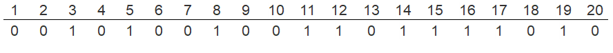
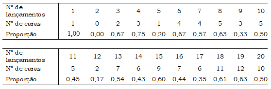
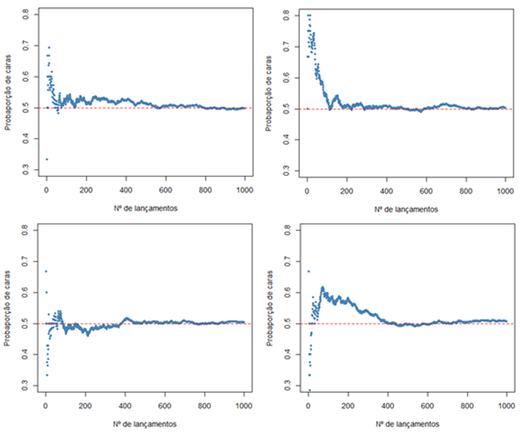

# Introdução à Teoria das Probabilidades {#sec-probabilidades}

## Pacotes necessários neste capítulo

```{r}
pacman::p_load(dplyr, readxl, scales, ggplot2)
```

## Introdução

A teoria das probabilidades é a base sobre a qual a estatística é desenvolvida. Os jogos de azar deram um grande impulso ao conhecimento da moderna teoria das probabilidades, principalmente, pelo trabalho de Blaise Pascal (1623-1662), em parceria com Pierre de Fermat (1601-1665). Eles foram estimulados por um escritor francês e matemático amador, Antoine Gombaud (1607-1684), conhecido como Chevalier de Méré, que era muito interessado em jogos de azar [@debnath2015short].

A Teoria das probabilidades permite que seja possível modelar populações, experimentos ou qualquer situação que possa ser considerada aleatória. Estes modelos possibilitam fazer inferência sobre populações a partir da observação de uma amostra dessa população. Ao usar apenas uma parte da população, inevitavelmente, é cometido um erro, o **erro amostral**. Este erro amostral pode ser dimensionado pela teoria das probabilidades.

Existem duas interpretações alternativas de probabilidades: a **frequentista** e a **bayesiana** [@menezes2004probabilidade]. Neste livro, será discutida, basicamente, a definição de probabilidade frequentista. O processo bayesiano de formulação de um modelo probabilístico faz uso do conhecimento subjetivo, estabelecendo uma especificação **a priori**, combinado com a informação objetiva ou empírica. A teoria bayesiana é a estrutura integradora dessas duas fontes de informação, derivando como resultado a distribuição **a posteriori** dos parâmetros de interesse. Na @sec-diagbayes, sobre análise de testes diagnósticos, serão abordados alguns aspectos relacionados à teoria bayesiana em medicina.

## Processo aleatório

Um processo ou experimento é dito **aleatório** quando em uma situação se sabe quais os resultados que podem acontecer, mas não se sabe qual resultado particular irá acontecer. Por exemplo, quando uma moeda é lançada, se conhece que a probabilidade de o desfecho `cara` ocorrer é de 50%, mas se desconhece o que irá ocorrer até que a moeda esteja no chão.

O número de caras que podem surgir em vários lançamentos da moeda é chamado de **variável aleatória**, ou seja, uma variável que pode assumir mais de um valor com determinadas probabilidades [@pagano2000random]. Da mesma forma, um dado lançado pode mostrar seis faces, numeradas de um a seis, com igual probabilidade de 16,7%. Portanto, quando a probabilidade é associada a todos os conjuntos de valores possíveis de uma variável, diz-se que ela é aleatória. O conjunto de todos os possíveis resultados de um experimento aleatório é denominado **espaço amostral**.

Na área da saúde, trabalha-se com uma infinidade de variáveis aleatórias, por exemplo, o número de filhos de uma mulher, o número de mortos diários em uma epidemia, o número de vacinados em uma campanha, etc. Essas variáveis são variáveis aleatórias discretas, pois apenas permitem ser quantificadas por processo de contagem. Por outro lado, o peso ou a altura de uma mulher são ditos variáveis aleatórias contínuas, pois podem assumir qualquer valor real entre uma medida e outra, dependendo da precisão do aparelho usado.

Em geral, variáveis aleatórias são representadas por letras maiúsculas, como X, Y e Z e sua probabilidade, por exemplo, pode ser denotada por: $P(X)$.

## Definição frequentista

A probabilidade se relaciona a eventos futuros ou que ainda não ocorreram, desta forma a probabilidade pode ser entendida como uma medida de incerteza em relação ao evento. A probabilidade de um evento ocorrer, em determinadas circunstâncias, pode ser definida como a proporção de vezes que o evento é observado quando o experimento é repetido um número infinitamente grande de vezes [@menezes2004probabilidade]. Pode-se dizer que a visão frequentista define a probabilidade como uma **frequência de longo prazo**.

A chamada **Lei dos Grandes Números** diz que à medida que múltiplas observações são coletadas, a proporção observada de ocorrências de um determinado desfecho, após *n* ensaios, converge para a probabilidade real P desse desfecho. Ou seja, quanto mais vezes for repetido uma experiência, a melhor estimativa de probabilidade tende a ocorrer. Suponha que seja lançada uma moeda honesta repetidas vezes. Por definição, essa é uma moeda que tem $P(cara)=0,5$. O que se observaria? O autor fez 20 lançamentos seguidos com uma mesma moeda e obteve o seguinte resultado, onde 1 = cara (@fig-moeda20):

{#fig-moeda20 fig-align="center" width="16.5cm" height="1.4cm"}

Neste caso, 10 (50%) desses lançamentos resultaram em cara. Agora, suponha que foram feitos registros do número de caras ($n_1$) dos primeiros lançamentos (*N*) e calculadas as proporções de caras ($n_1⁄N$) todas as vezes. O resultado está na @fig-propmoeda.

{#fig-propmoeda fig-align="center" width="16.5cm"}

Observa-se, nessa sequência, que a proporção de caras flutua muito, variando de 0,17 a 0,75. Se o número de lançamentos for aumentando tem-se a sensação de que a proporção se aproxima da "correta". Por exemplo, com 100 jogadas, obteve-se 53 caras (0,53); com 150 jogadas, 79 (0,53) e com 200 jogadas, 111 (0,56). Quando N se aproximar do infinito ($N \to\infty$) a proporção de caras convergirá para 0,50. A definição frequentista de probabilidade segue essa definição. Ninguém consegue um número infinito de lançamentos de moedas, mas um computador pode simular milhares de lançamentos. A @fig-nmoeda mostra o que acontece com a proporção $n_1⁄N$ à medida que *N* aumenta em lançamentos de moedas. As simulações foram repetidas 4 vezes somente para ter certeza de que o que aconteceu não foi obra do acaso.

{#fig-nmoeda fig-align="center" width="17cm"}

Embora nenhuma das simulações tenha realmente terminado com um valor exato de 0,5, elas se aproximaram, oscilando muito pouco em torno desse valor.

### Aplicando a visão frequentista no dia a dia {#sec-aplicafreq}

A definição frequentista também pode ser aplicada no cotidiano. Utilizando a altura de 1368 mulheres, uma medida numérica contínua, incluída no conjunto de dados `dadosMater.xlsx` (veja @sec-dadosMater). Essas alturas serão selecionadas e colocadas em um objeto, denominado `dados`.

```{r}
dados <- readxl::read_excel("dados/dadosMater.xlsx") |>
  dplyr::select(altura)
```

Usando a função `summary()`, será feito um resumo da variável `altura`:

```{r}
summary(dados$altura)
```

A mediana da altura das gestantes é `r summary(dados$altura)[3]` m. Em um longo conjunto de sorteios, a probabilidade de uma mulher ter altura acima deste valor é 50%. O percentil 75 (3º quartil) é igual a `r summary(dados$altura)[5]` m, a probabilidade de estar acima deste valor, portanto, é 25%. É possível encontrar a probabilidade de a altura estar acima, abaixo ou entre quaisquer valores. Quando se faz a mensuração de uma variável contínua, fica-se limitado ao método usado. Portanto, quando se diz que uma mulher tem 160 cm, significa dizer que está entre 159,5 e 160,5 cm, dependendo da precisão do instrumento de medição. Dessa maneira, o interesse está na probabilidade de a variável aleatória assumir valores entre certos limites.

A probabilidade de encontrar um valor exatamente igual à média (`r round(mean(dados$altura, na.rm = TRUE) * 100, 2)` cm) é, teoricamente, **igual a zero**. Essa é uma propriedade fundamental das distribuições contínuas: como os valores podem assumir qualquer número real em um intervalo, nenhum ponto isolado tem probabilidade positiva — apenas intervalos têm. Para ilustrar, pode-se calcular a probabilidade em um intervalo extremamente estreito em torno da média[^09-probabilidades-1]:

[^09-probabilidades-1]: Hospital Geral de Caxias do Sul, Hospital de Ensino da Universidade de Caxias do Sul, RS

```{r}
media <- mean(dados$altura, na.rm = TRUE)
epsilon <- 1e-6   # intervalo de ±0,000001 m
p_pontual <- pnorm(media + epsilon, mean = media, sd = sd(dados$altura, na.rm = TRUE)) -
             pnorm(media - epsilon, mean = media, sd = sd(dados$altura, na.rm = TRUE))
p_pontual
```

Mesmo em um intervalo de apenas 0,000001 m em torno da média, a probabilidade é muito próxima de zero. À medida que o intervalo se aproxima de zero, a probabilidade converge exatamente para zero. É por isso que, para variáveis contínuas, trabalha-se sempre com probabilidades associadas a intervalos, nunca a valores exatos.

## Propriedades das probabilidades

As seguintes propriedades simples decorrem da definição de probabilidade.

Sendo `E` um evento aleatório, a $P[E]$ está entre 0 e 1, ou seja $0\le P[E]\le 1$. Quando o evento certamente não ocorre, a probabilidade é 0, quando sempre ocorre a probabilidade é 1. Quando a probabilidade for igual a 0,50 tem-se máxima incerteza.

1.  *Regra de adição (regra do "ou")*

Dois eventos A e B são mutuamente exclusivos, ou seja, quando A acontece, B não pode acontecer. Então, a probabilidade de que um ou outro aconteça é a soma de suas probabilidades. Por exemplo, um dado lançado pode mostrar um ou dois, mas não ambos. A probabilidade de mostrar um ou dois é igual a $1/6 + 1/6 = 1/3$.

$$P[A ou B]=P[A]+P[B]$$

Se A e B não são mutuamente exclusivos, ou seja, quando A acontece pode também ocorrer B. Por exemplo, o nascimento de uma menina pode ser concomitante com o fato de ser branca.

$$P[A ou B]=P[A]+P[B]-P[A \space e \space B]$$

2.  *Regra de multiplicação (regra do "e")*

Suponha que dois eventos (A e B) sejam independentes, ou seja, saber que um aconteceu não nos diz nada sobre se o outro aconteceu. Então, a probabilidade de que ambos aconteçam é o produto de suas probabilidades. Por exemplo, suponha que jogamos duas moedas. Uma moeda não influencia a outra, portanto os resultados dos dois lançamentos são independentes e a probabilidade de ocorrerem duas caras é 0,50 × 0,50 = 0,25.

$$P[A \quad e\quad B]=P[A]×P[B]$$

Se os eventos são dependentes, a probabilidade que ambos aconteçam é igual a:

$$P[A \quad e \quad B]=P[A]×P[B \rvert A]$$ Com essas propriedades simples e outras mais complexas, é possível construir algumas ferramentas matemáticas extremamente poderosas, mas isso não faz parte do objetivo deste livro e não se entrará em detalhes.

## Distribuição de Probabilidades {#sec-distprob}

Um conjunto de eventos que são mutuamente excludentes e que inclui todos os eventos que podem acontecer, é chamado de exaustivo. A soma de suas probabilidades é 1. O conjunto dessas probabilidades constitui uma *distribuição de probabilidade*.

Existem diversos modelos probabilísticos que procuram descrever vários tipos de variáveis aleatórias discretas ou contínuas. Estas distribuições também são chamadas de *modelos probabilísticos estocásticos* que são definidas por duas funções matemáticas: a *função de probabilidade* (fp) para variáveis discretas, que atribui a cada valor a sua probabilidade de ocorrência (`P(X=x`)) e *função densidade de probabilidade* (`fdp`) para variáveis contínuas.

A função de probabilidade é a função que atribui probabilidades a cada um dos possíveis valores da variável aleatória discreta, usando, em geral, as frequências relativas, apresentadas em uma tabela de frequência. O *modelo de Bernoulli* ou *Binomial* e o *modelo de Poisson* são exemplos de modelo probabilístico de variáveis discretas.

A função densidade de probabilidade é a função que atribui probabilidade a qualquer intervalo de número reais, ou seja, um conjunto de valores não enumerável (infinito). Não é possível atribuir probabilidades para um determinado valor, é possível apenas para um intervalo. Por exemplo, o peso dos recém-nascidos. Para atribuir probabilidade a intervalos de valores é utilizada uma função e as probabilidades são representadas por áreas. Existem diversos modelos contínuos de probabilidade, mas o mais importante deles, é o *modelo normal*, também conhecido como *modelo gaussiano*.

## Distribuição Normal {#sec-normal}

O *modelo probabilístico normal* ou *gaussiano* é extremamente importante em estatística, pois serve como um fundamento para técnicas de inferência. Variáveis como os pesos dos recém-nascidos a termo, as alturas das mulheres adultas, a renda familiar em reais e muitas outras variáveis, na natureza, se ajustam ao modelo da distribuição normal.

O modelo de distribuição normal sempre descreve uma curva simétrica, unimodal e em forma de sino (@fig-curvanormal).

```{r}
#| label: fig-curvanormal
#| echo: false
#| out-width: "70%"
#| out-height: "70%"
#| fig-align: 'center'
#| fig-cap: "Curva Normal"
#| warning: false

df_norm <- data.frame(x = seq(-4, 4, length = 1000)) |>
  dplyr::mutate(y = dnorm(x))

ggplot(df_norm, aes(x = x, y = y)) +
  geom_line(linewidth = 1) +
  labs(x = "X", y = "Densidade de Probabilidades") +
  theme_classic(base_size = 13)
```

Uma distribuição normal é descrita por meio de dois parâmetros: a média da distribuição $\mu$ e o desvio padrão da distribuição $\sigma$. Em função dessa informação, observe como a distribuição normal funciona se esses parâmetros forem alterados.

Como é fácil prever, alterar a média desloca a curva de sino para a esquerda ou para a direita, enquanto a alteração do desvio padrão estende ou achata a curva, ou seja, muda a dispersão da distribuição.

A @fig-threecurves, mostra a distribuição normal com média 0 e desvio padrão 1, na curva à direita, a distribuição normal com média 1.5 e desvio padrão 1. Sobrepondo-se à curva da esquerda observa-se uma curva mais achatada (verde) que tem média 0 e desvio padrão 1.5. Observa-se, como mencionado, que modificando os parâmetros da curva, altera-se a posição ou o formato da mesma.

```{r}
#| label: fig-threecurves
#| echo: false
#| out-width: "70%"
#| out-height: "70%"
#| fig-align: 'center'
#| fig-cap: "Curvas normais com modificação dos parâmetros"
#| warning: false

x_seq <- seq(-4.5, 4.5, length = 500)
df_curvas <- data.frame(
  x     = rep(x_seq, 3),
  y     = c(dnorm(x_seq, 0, 1), dnorm(x_seq, 0, 1.5), dnorm(x_seq, 1.5, 1)),
  curva = rep(c("N(\u03bc=0, \u03c3=1)", "N(\u03bc=0, \u03c3=1.5)", "N(\u03bc=1.5, \u03c3=1)"),
              each = length(x_seq))
)

ggplot(df_curvas, aes(x = x, y = y, color = curva)) +
  geom_line(linewidth = 1) +
  geom_vline(xintercept = 0,   linetype = "dashed", color = "dodgerblue3", linewidth = 0.5) +
  geom_vline(xintercept = 1.5, linetype = "dashed", color = "firebrick3",  linewidth = 0.5) +
  scale_color_manual(
    values = c(
      "N(\u03bc=0, \u03c3=1)"   = "dodgerblue3",
      "N(\u03bc=0, \u03c3=1.5)" = "darkolivegreen4",
      "N(\u03bc=1.5, \u03c3=1)" = "firebrick3"
    )
  ) +
  scale_x_continuous(limits = c(-4.5, 4.5)) +
  scale_y_continuous(limits = c(0, 0.42)) +
  labs(x = "X", y = "Densidade", color = NULL) +
  theme_classic(base_size = 13) +
  theme(legend.position = "top")
```

### Características da distribuição normal

A curva normal apresenta as seguintes características:

- A média e o desvio padrão descrevem exatamente uma distribuição normal, eles são chamados de parâmetros da distribuição. Se uma distribuição normal tem média $\mu$ e desvio padrão $\sigma$, pode-se escrever a distribuição como $N (\mu,\sigma)$. As três distribuições dos gráficos da @fig-threecurves podem ser escritas como:

  - Curva azul $\to$ $N(\mu = 0,\sigma = 1)$
  - Curva verde $\to$ $N(\mu = 0,\sigma = 1.5)$
  - Curva vermelha $\to$ $N(\mu = 1.5,\sigma = 1)$

- Na distribuição normal, a média, a mediana e a moda coincidem.

- A curva normal é simétrica em torno da média ($\mu$).

- As extremidades da curva, em ambos os lados da média, se estendem cada vez mais próximas do eixo *x* (abscissa) sem jamais tocá-lo. É assintótica.

- Os pontos de inflexão da curva são $\mu - \sigma$ e $\mu + \sigma$.

- A área total sob a curva é 1 ou 100%.

### Distribuição normal padronizada {#sec-dnp}

Cada variável aleatória contínua tem a sua média e seu desvio padrão e, portanto, a sua curva normal correspondente.

Para facilitar a comparação entre variáveis, foi criado o conceito de **curva normal padronizada**, que é uma curva normal com média 0 e desvio padrão 1. A distribuição normal padrão também pode ser chamada de *distribuição normal centrada* ou *reduzida*.

Para calcular probabilidades associadas a distribuição normal, costuma-se converter a variável aleatória original *X*, em unidades reduzidas ou padronizadas, denominadas de **escore Z** ou **escore padrão**. Essa transformação é realizada pela equação que indica o número de desvios padrão envolvidos no afastamento do valor *x* em relação à média da população:

$$Z =\frac{x-\mu}{\sigma}$$ onde:

- *Z* $\to$ escore Z\
- *x* $\to$ valor qualquer da variável aleatória *X*\
- $\mu$ $\to$ média da variável *X*\
- $\sigma$ $\to$ desvio padrão da variável *X*

Qualquer distribuição de uma variável aleatória normal pode ser padronizada, usando o escore *Z*. Isto permite que se calcule a probabilidade de se encontrar determinados intervalos de valores [@gonzalez2021normal].

Como exemplo, se retornará à `altura` das mulheres. É, praticamente, impossível saber o valor da média populacional, por isso costuma-se usar a média aritmética como um estimador da média populacional. Dessa forma, a variável `dados$altura` poderá ser utilizada como estimativa da média populacional. Em primeiro lugar, se construirá um `tibble` de nome `resumo`:

```{r}
resumo <- dados |>
  dplyr::summarise(n = n(),
                   media = mean(altura, na.rm = TRUE),
                   dp = sd(altura, na.rm = TRUE),
                   min = min(altura, na.rm = TRUE),
                   max = max(altura, na.rm = TRUE))
resumo
```

Assim, pode-se verificar quantos desvios padrão uma mulher, pertencente a essa amostra, com 1,75 m está afastada da média:

```{r}
Z <- (1.75 - resumo$media) / resumo$dp
round(Z, 2)
```

Esta mulher está distante mais de 2 desvios padrão acima da média da sua população. Portanto, ela é considerada alta. Por que?

Para responder a essa pergunta, há necessidade de calcular a probabilidade de encontrar uma mulher com esta altura, nesta população. Primeiro, calcula-se a probabilidade de encontrar uma mulher com esta altura, nesta amostra. No *R*, existem as funções `dnorm()`, `pnorm()` e `qnorm()`, que permitem calcular a densidade de probabilidade, a distribuição cumulativa e a função quantílica da distribuição normal para um conjunto de valores. Além dessas, há a função `rnorm()` que permite obter observações aleatórias que seguem uma distribuição normal [@jain_2022norm].

#### Função pnorm()

A função `pnorm()` fornece a *Função de Distribuição Cumulativa* (CDF) da distribuição Normal, que é a probabilidade de que a variável *X* contenha um valor menor ou igual a *x*.

[Argumentos]{.underline}:

- **q** $\rightarrow$ vetor de quantis\
- **mean** $\rightarrow$ média\
- **sd** $\rightarrow$ desvio padrão\
- **lower.tail** $\rightarrow$ Se `TRUE`, as probabilidades são $P(X\le x)$, caso contrário $P(X > x)$

Se for usado $mean = 0$ e $sd = 1$, o valor de q = Z, caso contrário, toma-se os valores da média, o desvio padrão da população e o valor de *x*. Com esta função, é possível responder a pergunta feita anteriormente em relação a probabilidade de encontrar uma mulher com mais de 1,75 m, equivalente a `r round(Z, 2)` desvios padrão acima da média, em uma população com média = `r resumo$media` e desvio padrão = `r resumo$dp`.

```{r}
p <- pnorm(Z, mean = 0, sd = 1, lower.tail = FALSE)
p
```

Ou, usando os valores originais diretamente:

```{r}
pnorm(1.75, mean = resumo$media, sd = resumo$dp, lower.tail = FALSE)
```

Observa-se que, nesta amostra, apenas `r round(pnorm(Z, mean = 0, sd = 1, lower.tail = FALSE), 3) * 100`% das mulheres têm acima de 1,75 m, razão de ser considerada uma mulher alta. Ou seja, é pouco provável encontrar mulheres acima dessa altura, nesta amostra.

Para representar graficamente essa pequena probabilidade, será construída uma curva com essa pequena área sombreada, colorida em azul claro. Para isso, uma função própria, denominada `normal_intervalo_sombreado()` plotará a figura. Os argumentos dessa função são: `a = limite inferior do intervalo`; `b = limite superior do intervalo`; `mean = média (padrão = 0)`; `sd = desvio padrão (padrão = 1)`. Ela pode ser obtida [aqui](https://github.com/petronioliveira/Arquivos/blob/main/normal_intervalo_sombreado.R) para ser baixada em seu diretório de trabalho para uso posterior [^09-probabilidades-2]. Para carregar a função para uso usa-se a função nativa `source()` que serve para executar o código contido em um arquivo com a extensão `.R`.

[^09-probabilidades-2]: Veja @sec-funcpropria como se constrói uma função. A função apresentada aqui é mais complexa.

A @fig-prob1725 representa com clareza esta pequena probabilidade[^09-probabilidades-3].

[^09-probabilidades-3]: Arbritariamente, foi estabelecido um limite superior de 2 m (valor muito alto), simplesmente para função ser executada.

```{r}
#| label: fig-prob1725
#| echo: false
#| out-width: "70%"
#| out-height: "70%"
#| fig-align: 'center'
#| fig-cap: "Probabilidade de encontrar mulheres entre 1,75 e 2.00 m"
#| warning: false

source("dados/normal_intervalo_sombreado.R")

normal_intervalo_sombreado(a = 1.75, b = 2, mean = 1.598, sd = 0.065 )

```

#### Função qnorm()

A função `qnorm()` permite encontrar o quantil *q* para qualquer probabilidade *p*. Portanto, a função `qnorm` é o inverso da função `pnorm()`.

[Argumentos]{.underline}:

- *p* $\to$ vetor de probabilidades\
- *mean* $\to$ média\
- *sd* $\to$ desvio padrão\
- *lower.tail* $\to$ Se `TRUE`, as probabilidades são ($P \le x$), caso contrário $P(X > x)$

No exemplo anterior, a probabilidade de se encontrar mulheres, na maternidade, com mais de 1,75 m foi de `r round(pnorm(Z, mean = 0, sd = 1, lower.tail = FALSE), 3) * 100`%. Poderia ser calculado com a função `qnorm()` qual o escore *Z* correspondente:

```{r}
qnorm(p, mean = 0, sd = 1, lower.tail = FALSE)
```

#### Função dnorm()

Essa função retorna o valor da *função de densidade de probabilidade* (pdf) da distribuição normal dada uma certa variável aleatória X, uma média populacional $\mu$ e o desvio padrão populacional $\sigma$.

[Argumentos]{.underline}:

- **x** $\to$ vetor de quantis\
- **mean** $\to$ média\
- **sd** $\to$ desvio padrão

Embora *x* represente a variável independente da *pdf* para a distribuição normal, também é útil pensar em *x* como um escore *Z*. Por exemplo, a densidade de probabilidade quando *x* = 0 é igual:

```{r}
dnorm(x = 0, mean = 0, sd = 1)
```

Para se construir uma curva de densidade de probabilidades normal ( $X \sim N(\mu=0,\sigma=1)$), basta aplicar a função `dnorm()` a uma sequência contínua de escores *Z*. O vetor de escores Z é obtido com a função `seq()`, como mostrado a seguir:

```{r}
escores_z <- seq(-3, 3, by = 0.05)
escores_z
```

Agora, usando a função `dnorm()`, será construído conjunto de valores de densidade de probabilidade correspondentes aos escores *Z* obtidos anteriormente:

```{r}
valores_d <- dnorm(escores_z, mean = 0, sd = 1)
```

Estes valores serão plotados para construir a curva normal (@fig-pdf):

```{r}
#| label: fig-pdf
#| echo: false
#| out-width: "70%"
#| out-height: "70%"
#| fig-align: 'center'
#| fig-cap: "Função densidade de probabilidade"
#| warning: false

# Criar um data frame
df <- data.frame(escores_z, valores_d)

# Construir a curva de densidade normal
ggplot(df, aes(x = escores_z, y = valores_d)) +
  geom_line(color = "steelblue", linewidth = 1) +
  scale_x_continuous(breaks = seq(-4, 4, by = 1), limits = c(-4, 4)) +
  scale_y_continuous(expand = expansion(add = c(0, 0.05))) +
  labs(
    x = "Escores Z",
    y = "Densidade de Probabilidade"
  ) +
  theme_classic(base_size = 13)
```

Como se pode ver, `dnorm()` fornece a "altura" do *pdf* da distribuição normal em qualquer escore *Z* que se forneça como argumento.

#### Função rnorm() {#sec-rnorm}

A função `rnorm()` gera *n* números aleatórios com distribuição normal com média $\mu$ e desvio padrão $\sigma$.

[Argumentos]{.underline}:

- **n** $\to$ número de observações a serem geradas\
- **mean** $\to$ média\
- **sd** $\to$ desvio padrão

Com esta função é possível, por exemplo, gerar 10 observações de uma distribuição normal:

```{r}
rnorm(10)
```

No entanto, deve-se notar que, se uma "semente" (`seed`) não for especificada, a saída não será reproduzível, ou seja, cada vez que o comando for executado, retornará um novo conjunto de observações:

```{r}
rnorm(10)
```

Para tornar o código reproduzível, retornando o mesmo conjunto de valores, deve-se usar uma "semente" (*seed*), usando a função *set.seed()*, cujo argumento é um número que identificará a série gerada, no exemplo, pela função `rnorm()`. O valor do número ("semente") não é importante, é apenas um identificador. Para ilustrar, serão construídos dois conjuntos de 10 números que serão recebidos pelos objetos *x* e *y*. Para gerar o conjunto de números *x*, será usado o número `123` como "semente". A "semente" funciona como uma espécie de marca. Para o *y* não será usada a função `set.seed()`:

```{r}
n <- 10
set.seed(123)
x <- rnorm(n)
x

y <- rnorm(n)
y
```

Comparando os conjuntos com a função `identical()` do R base, observa-se que os conjuntos são diferentes:

```{r}
identical(x, y)
```

Agora, repetindo os mesmos comandos, mas usando antes a mesma "semente", observa-se que os conjuntos são idênticos.

```{r}
set.seed(123)
x <- rnorm(n)
x

set.seed(123)
y <- rnorm(n)
y

identical(x, y)
```

[Outros usos da função `rnorm()`]{.underline}:

A função `rnorm()` será usada para gerar três vetores diferentes de números aleatórios de uma distribuição normal.

```{r}
set.seed(1234)
n10 <- rnorm(10, mean = 0, sd = 1)
n100 <- rnorm(100, mean = 0, sd = 1)
n10000 <- rnorm(10000, mean = 0, sd = 1)
```

Em sequência, serão construídos histogramas (@fig-pdf1), onde se pode observar que, aumentando o número de observações, tem-se gráficos que irão progressivamente se aproximando da verdadeira função de densidade normal.

```{r}
#| label: fig-pdf1
#| echo: false
#| out-width: "80%"
#| out-height: "80%"
#| fig-align: 'center'
#| fig-cap: "Histogramas construídos com amostras geradas pela função rnorm"
#| warning: false

# Criar data frames
df10 <- data.frame(valor = n10)
df100 <- data.frame(valor = n100)
df10000 <- data.frame(valor = n10000)

# Criar os histogramas
g1 <- ggplot(df10, aes(x = valor)) +
  geom_histogram(binwidth = 0.5, fill = "steelblue", color = "white") +
  labs(title = "Amostra de 10") +
  theme_bw()

g2 <- ggplot(df100, aes(x = valor)) +
  geom_histogram(binwidth = 0.5, fill = "darkorange", color = "white") +
  labs(title = "Amostra de 100") +
  theme_bw()

g3 <- ggplot(df10000, aes(x = valor)) +
  geom_histogram(binwidth = 0.5, fill = "forestgreen", color = "white") +
  labs(title = "Amostra de 10.000") +
  theme_bw()

ggpubr::ggarrange(g1, g2, g3,
                  labels = c("A", "B", "C"), 
                  ncol = 3, 
                  nrow = 1,
                  common.legend = TRUE, 
                  legend = "bottom")

```

Observe também que à medida que *n* aumenta, a distribuição dos dados caracteriza-se como uma distribuição normal. Na @sec-dam, este assunto voltará à cena.

### Regra Empírica 68-95-99.7

A regra empírica diz que, para qualquer distribuição normal com média $\mu$ e desvio padrão $\sigma$, aproximadamente 68%, 95% e 99,7% dos valores encontram-se, respectivamente, dentro de $\mu \pm 1\sigma$, $\mu \pm 2\sigma$ e $\mu \pm 3\sigma$. No caso particular da distribuição normal padrão ($X \sim N(\mu=0, \sigma=1)$), esses intervalos correspondem a $\pm 1$, $\pm 2$ e $\pm 3$.

Essa regra pode ser usada para descrever uma população e ajudar a decidir se uma amostra de dados veio de uma distribuição normal. Se uma amostra é grande o suficiente e a observação do histograma tem um formato parecido com um sino, é possível verificar se os dados seguem as especificações 68-95-99,7%. Se sim, é razoável concluir que os dados vieram de uma distribuição normal.

[Exemplo]{.underline}:

Com a função `rnorm()`, será gerado um vetor de 1000 números e um histograma com curva normal sobreposta:

```{r}
#| label: fig-histdp
#| echo: false
#| out-width: "70%"
#| out-height: "70%"
#| fig-align: 'center'
#| fig-cap: "Histograma com curva normal sobreposta"
#| warning: false

# Gerar dados simulados
set.seed(123)
base <- rnorm(1000, mean = 0, sd = 1)
df1 <- data.frame(valor = base)

# Construir o gráfico
ggplot(df1, aes(x = valor)) +
  geom_histogram(aes(y = after_stat(density)), binwidth = 0.5, fill = "lightblue", color = "white") +
  stat_function(fun = dnorm,
                args = list(mean = mean(df1$valor),
                            sd = sd(df1$valor)),
                linetype = "solid",
                linewidth = 1,
                color = "deepskyblue3") +
  scale_x_continuous(breaks = seq(-3, 3, by = 1), limits = c(-3, 3)) +
  geom_vline(xintercept = -1, color = "red", linetype = "dashed", linewidth = 0.5) +
  geom_vline(xintercept = 1, color = "red", linetype = "dashed", linewidth = 0.5) +
  annotate("text", x = -1, y = 0.42, label = "A", color = "black", vjust = 1, size = 6) +
  annotate("text", x = 1, y = 0.42, label = "B", color = "black", vjust = 1, size = 6) +
  labs(
    x = "Escore z",
    y = "Densidade de Probabilidade"
  ) +
  theme_classic(base_size = 13)
```

No histograma (@fig-histdp), a probabilidade entre os escores Z - 1 e + 1 (entre as duas linhas tracejadas A e B) é igual a aproximadamente 68%. Pode-se calcular isto facilmente, usando a função `pnorm()`:

[Probabilidade abaixo de z = 1, abaixo do ponto B]{.underline}:

```{r}
B <- pnorm(1, 0, 1)
B <- round(B, 3) * 100
B
```

[Probabilidade abaixo de z = -1, abaixo do ponto A]{.underline}:

```{r}
A <- pnorm(-1, 0, 1)
A <- round(A, 3) * 100
A
```

Logo, a área abaixo da curva entre A e B é igual a:

```{r}
prob <- B - A
prob
```

### Calculando probabilidades em uma distribuição normal

::: callout-tip
## Exemplo 1

A variável `dados$altura`, mostrada na @sec-aplicafreq, tem uma média (`r round(mean(dados$altura), 3)`), mediana de (`r round(median(dados$altura), 3)`) e um coeficiente de variação (CV) muito pequeno de `r round(sd(dados$altura)/mean(dados$altura), 3)*100`%. Isso caracteriza uma variável com uma distribuição praticamente simétrica. Usando esses dados ($X\sim N(\mu=$ `r format(round(resumo$media, 3), decimal.mark = ",")`, $\sigma=$ `r format(round(resumo$dp, 3), decimal.mark = ",")`$)$), pode-se calcular probabilidades, dadas pela área sob a curva.

Baseado nessas informações, qual a probabilidade de se encontrar mulheres com altura entre 1,47 e 1,73 m?
:::

**Resposta**:

```{r}
# Dados
mu <- resumo$media
sigma <- resumo$dp
linf <- 1.47
lsup <- 1.73

# Solução
z1 <- (linf - mu) / sigma
z2 <- (lsup - mu) / sigma

p1 <- pnorm(linf, mu, sigma)
p2 <- pnorm(lsup, mu, sigma)

p2 - p1
```

normal_intervalo_sombreado(a = 1.47, b = 1.73, mean = resumo$media, sd = resumo$dp )

```{r}
#| label: fig-normal954
#| echo: false
#| out-width: "70%"
#| out-height: "70%"
#| fig-align: 'center'
#| fig-cap: "Probabilidade de encontrar mulheres entre 1,47 e 1,73 m"
#| warning: false

normal_intervalo_sombreado(a = 1.47, b = 1.73, mean = resumo$media, sd = resumo$dp )

```

A probabilidade de alturas entre 1,47 m e 1,73 m é igual a `r round((p2 - p1) * 100, 1)`%, como mostrado na @fig-normal954.

::: callout-tip
## Exemplo 2

Os dados de uma pesquisa mostram informações sobre o tempo de cirurgia para reconstrução do ligamento cruzado anterior (LCA). A distribuição de probabilidades se ajusta à distribuição normal com o tempo médio de cirurgia de 129 minutos com um desvio padrão de 14 minutos.

1.  Qual a probabilidade de uma cirurgia de reconstrução do LCA requerer um tempo de 60 minutos, mas menor do que 100 minutos?

2.  Qual a probabilidade de uma cirurgia do LCA demandar 120 a 180 minutos?
:::

**Resposta 1:**

```{r}
# Dados
mu <- 129
sigma <- 14
linf <- 60
lsup <- 100

# Solução
z1 <- (linf - mu) / sigma
z2 <- (lsup - mu) / sigma

p1 <- pnorm(linf, mu, sigma)
p2 <- pnorm(lsup, mu, sigma)

p2 - p1

```

```{r}
#| label: fig-normal192
#| echo: false
#| out-width: "80%"
#| out-height: "80%"
#| fig-align: 'center'
#| fig-cap: "Probabilidade do tempo de cirurgia de LCA menor ou igual a 100 minutos"
#| warning: false

normal_intervalo_sombreado(a = 60, b = 100, mean = 129, sd = 14 )

```

De acordo com a distribuição, 1,9% das cirurgias irão demandar quantidade de tempo entre 60 e 100 minutos (@fig-normal192).

**Resposta 2:**

```{r}
# Dados
mu <- 129
sigma <- 14
linf <- 120
lsup <- 180

# Solução
z1 <- (linf - mu) / sigma
z2 <- (lsup - mu) / sigma

p1 <- pnorm(linf, mu, sigma)
p2 <- pnorm(lsup, mu, sigma)

p2 - p1
```

```{r}
#| label: fig-normal134
#| echo: false
#| out-width: "80%"
#| out-height: "80%"
#| fig-align: 'center'
#| fig-cap: "Probabilidade do tempo de cirurgia de LCA ser entre 2 e 3 horas"
#| warning: false
#| message: false

normal_intervalo_sombreado(a = 120, b = 180, mean = 129, sd = 14 )

```

De acordo com a distribuição, 74% das cirurgias irão demandar quantidade de tempo entre 2 a 3 horas (@fig-normal134).

::: callout-tip
## Exemplo 3

Supondo que em uma determinada ilha hipotética existam duas populações etnicamente diferentes onde as mulheres têm as seguintes medidas de altura: população 1 tem μ = 160 cm e σ = 6,6 cm e a população 2 tem μ = 140 cm e σ = 6,6 cm. As alturas de ambas as populações têm distribuição normal. Essas duas populações têm o mesmo aspecto físico, podendo ser distinguidas apenas geneticamente.

1.  Qual a probabilidade de uma mulher com 150 cm pertencer à população 1?

2.  Qual a probabilidade de uma mulher com 150 cm pertencer à população 2?
:::

**Resposta 1**:

```{r}
# Dados
mu <- 160
sigma <- 6.6
x <- 150

# Solução
z <- (x - mu) / sigma

p <- pnorm(x, mu, sigma, lower.tail = TRUE)
p
```

Na população 1, 6,5% das mulheres tem altura $\le 1{,}50$ m . Em outras palavras, existe pouca probabilidade dessa mulher pertencer à população 1.

**Resposta 2**:

```{r}
# Dados
mu <- 140
sigma <- 6.6
x <- 150

# Solução
z <- (x - mu) / sigma

p <- pnorm(x, mu, sigma, lower.tail = TRUE)
p
```

Na população 2, 93,5% das mulheres tem altura $\le 1{,}50$ m . Concluindo, ela pode pertencer a qualquer uma das populações. Pode ser uma mulher alta da população 2 ou uma "baixinha" da população 1!

::: callout-note
## Resumo: Distribuição Normal

| Parâmetro | Descrição                 |
|-----------|---------------------------|
| $\mu$     | Média (posição da curva)  |
| $\sigma$  | Desvio padrão (dispersão) |

**Notação:** $X \sim N(\mu, \sigma)$

**Regra empírica:** $\mu \pm 1\sigma \approx 68\%$; $\mu \pm 2\sigma \approx 95\%$; $\mu \pm 3\sigma \approx 99{,}7\%$

| Função R             | O que retorna                     |
|----------------------|-----------------------------------|
| `dnorm(x, mean, sd)` | Densidade de probabilidade em *x* |
| `pnorm(q, mean, sd)` | $P(X \le q)$                      |
| `qnorm(p, mean, sd)` | Quantil para probabilidade *p*    |
| `rnorm(n, mean, sd)` | *n* valores aleatórios            |
:::

## Distribuição Binomial

A distribuição normal padrão é apenas um dos exemplos de distribuição de probabilidade. Uma boa parte das situações se ajustam a ela. Entretanto, diversas situações reais muitas vezes se aproximam de outras distribuições estocásticas definidas por algumas hipóteses. Daí a importância de se conhecer e manipular algumas destas distribuições. Entre elas, a **distribuição binomial**.

Quando um experimento aleatório resulta em um de dois, mutuamente exclusivos, desfechos, tais como vivo/morto, positivo/negativo, sim/não, masculino/feminino é denominado de *Ensaio de Bernoulli*. Recebeu esta denominação em homenagem ao matemático suíço, Jacob Bernoulli (1654-1705), considerado fundador do cálculo e da teoria da probabilidade [@robertson2022bernoulli].

A distribuição de frequências que descreve as proporções de um ensaio de Bernoulli, chama-se **Distribuição Binomial**. A probabilidade binomial dá a probabilidade de determinado desfecho ocorrer em determinado número de ensaios independentes. Uma sequência de ensaios de Bernoulli forma um **Processo de Bernoulli**.

A distribuição binomial é importante para variáveis discretas. Existem poucas condições que precisam ser atendidas para distribuição binomial:

- Cada ensaio resulta em um de dois desfechos, mutuamente exclusivos, denominados, arbitrariamente, de sucesso e fracasso;
- A probabilidade de sucesso é fixa, igual a *p*, constante em cada ensaio, e a probabilidade de fracasso é igual a *1 – p*;
- O número de repetições *n* em um ensaio é fixo;
- Os ensaios são independentes.

A distribuição binomial é na verdade uma família de distribuições, cujos membros são definidos pelos valores de *n* e *p* (parâmetros da distribuição binomial).

A probabilidade de sucesso [^09-probabilidades-4], em uma distribuição binomial, é dada pela fórmula:

[^09-probabilidades-4]: *Sucesso*, aqui, não está no sentido de vitória, êxito, triunfo, glória e sim com a conotação de obter o desfecho esperado. Por exemplo, se uma moeda é lançada e se espera obter cara, sucesso significa um resultado igual a cara.

$$P(X = x)= C \times p^x \times (1 - p)^{n-x}$$

onde *n* = ensaios, *x* = sucessos, *p* = probabilidade de um sucesso e *C* representa o número possível de combinações em um ensaio.

O número de combinações, *C* de *x* sucessos entre *n* repetições podem ser computado pela fórmula:

$$C = \frac{n!}{x!(n - x)!}$$

ou, no R, com a função `choose(n, x)`.

O modelo de distribuição binomial trata de encontrar a probabilidade de sucesso de um evento que tem apenas dois resultados possíveis em uma série de experimentos. Usando dados de uma distribuição binomial, é possível calcular os valores esperados de uma variável aleatória conforme ela passa por tentativas independentes. Em outras palavras, é possível prever o número exato de caras ou coroas que se deve esperar ao jogar uma moeda um certo número de vezes.

Também, pode-se usar a probabilidade binomial cumulativa para encontrar a probabilidade de obter um determinado intervalo de resultados. Por exemplo, saber a probabilidade do nascimento de até três meninos em 10 nascimentos consecutivos quando a probabilidade de nascer um menino é 0,50.

O *R* tem quatro funções embutidas para gerar distribuição binomial. Elas são descritas a seguir.

### Funções da distribuição binomial

#### Função pbinom()

Esta função retorna o valor da *função de distribuição cumulativa* (CDF) da distribuição binomial dada uma certa variável aleatória *q*, número de tentativas (*size*) e probabilidade de sucesso em cada tentativa (*prob*).

[Argumentos]{.underline}:

- **q** $\to$ vetor de quantis\
- **size** $\to$ número de ensaios\
- **prob** $\to$ probabilidade de sucesso em cada ensaio\
- **lower.tail** $\to$ Se `TRUE`, as probabilidades são ($P \le x$), caso contrário $P(X > x)$

Por exemplo, qual é a probabilidade de nascer até três meninos em cinco nascimentos, sabendo que a probabilidade de nascer um menino é igual a 0,50?

```{r}
pbinom(3, 5, 0.50)
```

Isso corresponde à soma das probabilidades de nascer nenhum menino, um menino, dois meninos e três meninos (@fig-menino3). Isto é calculado pela equação $P(X = x)$, vista anteriormente.\
Colocando no *R*:

```{r}
n = 5
p = 0.50
x <- 0:5
# Probabilidades individuais de cada número de meninos
Fx <- (factorial(n) / (factorial(x) * factorial(n - x))) * p^x * (1 - p)^(n - x)
Fx
```

```{r}
#| label: fig-menino3
#| echo: false
#| out-width: "70%"
#| out-height: "70%"
#| fig-align: 'center'
#| fig-cap: "Distribuição binomial, mostrando a P (x < 4) com n = 5 e p = 0,50"
#| warning: false
#| message: false

df_binom3 <- data.frame(
  x     = factor(0:5),
  prob  = Fx,
  grupo = c("incluído", "incluído", "incluído", "incluído", "excluído", "excluído")
)

ggplot(df_binom3, aes(x = x, y = prob, fill = grupo)) +
  geom_col(width = 0.7, color = "white") +
  geom_text(aes(label = round(prob, 2)), vjust = -0.4, size = 3.5, color = "royalblue4") +
  scale_fill_manual(
    values = c("incluído" = "lightblue2", "excluído" = "royalblue4"),
    guide  = "none"
  ) +
  scale_y_continuous(limits = c(0, 0.45)) +
  labs(x = "Nascimentos de meninos", y = "Probabilidade",
       title = expression(P(X < 4))) +
  theme_classic(base_size = 13)
```

#### Função qbinom()

Esta função retorna a função quantílica (inversa da CDF) da distribuição binomial dada uma probabilidade *p*, número de tentativas (*size*) e probabilidade de sucesso em cada tentativa (*prob*). Com o uso desta função, podemos descobrir o quantil da distribuição binomial.

[Argumentos]{.underline}:

- **p** $\to$ probabilidade ou vetor de probabilidades\
- **size** $\to$ número de ensaios\
- **prob** $\to$ probabilidade de sucesso em cada ensaio\
- **lower.tail** $\to$ Se `TRUE`, as probabilidades são ($P \le x$), caso contrário $P(X > x)$

Por exemplo, quantos meninos nascerão em 5 partos com `r sum(Fx[1:4])*100`% de probabilidade cumulativa?

```{r}
qbinom(0.8125, size = 5, prob = 0.50)
```

#### Função rbinom()

A função `rbinom()` permite extrair *n* observações aleatórias de uma distribuição binomial. Os argumentos da função são descritos abaixo:

[Argumentos]{.underline}:

- **n** $\to$ número de observações aleatórias a ser gerado\
- **size** $\to$ número de ensaios\
- **prob** $\to$ probabilidade de sucesso em cada ensaio

Para fazer uma simulação de 1000 amostras, aleatoriamente, de tamanho 5 e com probabilidade de nascer menino igual a 0,50, usa-se [^09-probabilidades-5]:

[^09-probabilidades-5]: Deve ser especificado uma "semente" (seed) antes de executar a função, senão será obtido um conjunto diferente de observações aleatórias a cada execução. Teste para verificar.

```{r}
set.seed(23)
menino <- rbinom(n = 1000, size = 5, prob = 0.5)
```

Cada amostra de n = 5 exibe o número de meninos nascidos. Pode-se fazer a média que representa o valor esperado do número de sucessos (nascimento de menino, no exemplo) em um conjunto de ensaios independentes:

```{r}
mean(menino)
```

Quanto maior o número de variáveis aleatórias criadas, mais próximo a média do número de sucessos estará do número esperado de sucessos que é igual ao número de sucessos vezes a probabilidade de sucesso em cada ensaio (5 x 0,50 = 2,5).

Estranho, não é? Dois meninos e meio, em média por ensaio! É, a média é assim, uma estimativa, expectativa matemática! Não é real...

#### Função dbinom()

Essa função retorna o valor da função de densidade de probabilidade (*pdf*) da distribuição binomial dada uma determinada variável aleatória X, número de tentativas (*size*) e probabilidade de sucesso em cada tentativa (*prob*). A função tem a seguinte sintaxe:

[Argumentos]{.underline}:

- **x** $\to$ vetor de números\
- **size** $\to$ número de ensaios\
- **prob** $\to$ probabilidade de sucesso em cada ensaio

A função é usada para encontrar a probabilidade de um determinado valor para dados que seguem a distribuição binomial, ou seja, encontra $P(X=x)$, probabilidade de *x* sucessos em tentativas de tamanho (*size*) *n* quando a probabilidade (*p*) de sucesso é *prob*. Obtém o mesmo resultado da fórmula:

$$P(X = x)= C \times p^x \times (1 - p)^{n-x}$$

Por exemplo, no nascimento de uma criança, as duas possibilidades, menino ou menina, são mutuamente excludentes e esses são os únicos eventos que podem acontecer. A probabilidade de nascimento de menino, como visto, é 0,50, qual seria a probabilidade de nascerem 4 meninos em 5 partos consecutivos não gemelares (@fig-menino5)?

```{r}
dbinom(4, size = 5, prob = 0.50)
```

As probabilidades de nascerem meninos em 5 nascimentos são:

```{r}
Fx <- dbinom(0:5, 5, 0.50)
Fx
```

```{r}
#| label: fig-menino5
#| echo: false
#| out-width: "70%"
#| out-height: "70%"
#| fig-align: 'center'
#| fig-cap: "Distribuição binomial para P (x = 4) com n = 5 e p = 0,50"
#| warning: false
#| message: false

df_binom5 <- data.frame(
  x     = factor(0:5),
  prob  = Fx,
  grupo = c("outro", "outro", "outro", "outro", "destacado", "outro")
)

ggplot(df_binom5, aes(x = x, y = prob, fill = grupo)) +
  geom_col(width = 0.7, color = "white") +
  geom_text(aes(label = round(prob, 2)), vjust = -0.4, size = 3.5, color = "royalblue4") +
  scale_fill_manual(
    values = c("destacado" = "lightblue2", "outro" = "royalblue4"),
    guide  = "none"
  ) +
  scale_y_continuous(limits = c(0, 0.45)) +
  labs(x = "Nascimentos de meninos", y = "Probabilidade",
       title = expression(P(X == 4))) +
  theme_classic(base_size = 13)
```

### Média e desvio padrão da distribuição binomial {#sec-mudpbinom}

Quando o número de repetições é grande, geralmente há necessidade de resumir as probabilidades. A distribuição binomial pode ser descrita por sua *média* e *variância*.

A média é o valor médio da variável aleatória em um longo número de repetições. É também chamada de *valor esperado* ou *expectativa*. A expectativa de uma variável aleatória X, geralmente, é denotada por $E(X)$ e obtida pela multiplicação do número de ensaios independentes (*n*) pela probabilidade (*p*) de sucesso em cada ensaio:

$$\mu = E(X) = n \times p$$

Portanto, a expectativa (esperança) de nascimento de meninos em 5 partos é $E(X)=5 \times 0{,}50 = 2{,}5$, como visto na função `rbinom()`. Observe que o valor esperado de uma variável aleatória discreta não tem um valor que a variável aleatória pode realmente assumir.

Por exemplo, para o número médio de meninos em um parto, ou não se tem menino ou se tem 1 menino, cada uma possibilidade com probabilidade de 0,50 e o valor esperado é (0 × 0,50) + (1 × 0,50) = 0,50. O número de meninos deve ser 0 ou 1, mas o valor esperado é a metade, a média que se obteria no longo prazo.

A variância de uma variável aleatória discreta *X* é igual a

$$\sigma^2=var(X) = n\times p \times (1-p)$$

Consequentemente, o desvio padrão é igual a

$$\sigma = \sqrt{var(X)} = \sqrt{n\times p \times (1-p)}$$

Para o exemplo de 5 nascimentos, a média foi de 2,5 meninos e o desvio padrão

$$\sigma =\sqrt{5\times 0{,}50 \times (1-0{,}50)}=\sqrt{2{,}5 \times 0{,}50}= 1{,}12$$

Portanto, se espera que ocorram em média 2,5 ($\sigma$ = 1,12) nascimentos de meninos em 5 partos.

::: callout-note
## Resumo: Distribuição Binomial

| Parâmetro | Descrição                               |
|-----------|-----------------------------------------|
| $n$       | Número de ensaios                       |
| $p$       | Probabilidade de sucesso em cada ensaio |

**Notação:** $X \sim B(n, p)$

**Fórmula:** $P(X = x) = \dbinom{n}{x}\, p^x\, (1-p)^{n-x}$

**Média:** $\mu = n \cdot p$ $\quad$ **Desvio padrão:** $\sigma = \sqrt{n \cdot p \cdot (1-p)}$

| Função R                | O que retorna                  |
|-------------------------|--------------------------------|
| `dbinom(x, size, prob)` | $P(X = x)$                     |
| `pbinom(q, size, prob)` | $P(X \le q)$                   |
| `qbinom(p, size, prob)` | Quantil para probabilidade *p* |
| `rbinom(n, size, prob)` | *n* valores aleatórios         |
:::

## Distribuição de Poisson

A **Distribuição de Poisson** é usada para modelar a **contagem de eventos que ocorrem em um intervalo fixo** de tempo, espaço, área ou volume.

Enquanto a Binomial conta o número de sucessos em um número *fixo de tentativas* (*n*), a Poisson conta quantas vezes um evento raro acontece em uma *janela contínua* de tempo ou espaço (por exemplo: número de casos de covid-19 por dia, número de acidentes em um cruzamento por mês, número de gestantes infectadas por ano).

### Condições da Distribuição de Poisson

Para que uma variável *X* siga uma distribuição de Poisson, $X \sim \text{Poisson}(\lambda)$, é preciso que:

1.  **Eventos independentes:** a ocorrência de um evento não altera a chance de outro ocorrer.

2.  **Taxa média constante (**$\lambda$**):** o evento ocorre a uma taxa média conhecida ($\lambda$) ao longo do tempo/espaço.

3.  **Eventos isolados:** dois eventos não podem acontecer exatamente ao mesmo tempo/ponto.

### Função de Probabilidade

A chance de observarmos exatamente *k* eventos no intervalo é dada por:

$$p(X = k)= \frac{e^{-\lambda}\times \lambda^{k}}{k!}$$

Onde:

- $\lambda$ (lambda) é a **taxa média de eventos** por intervalo.
- $e \approx 2{,}71828$ (base do logaritmo natural).
- $k\in \left\{0,1,2,3,... \right\}$ é o número de contagens.

Na distribuição de Poisson, a **média** e a **variância** são exatamente iguais ao parâmetro $\lambda$: $$\mu = \lambda \quad e \quad \sigma^{2} = \lambda$$

### Funções Nativas

Assim como na Binomial, o R fornece quatro funções padrão alterando o prefixo antes de `pois`:

| Função | O que faz? | Exemplo de uso |   |
|------------------------|------------------------|------------------------|------------------------|
| **dpois(x, lambda)** | **P(X = x):** Probabilidade exata | Probabilidade de ocorrer **exatamente 3 casos de sarampo** em 2 dias |  |
| **ppois(q, lambda)** | **P(X ≤ q):** Probabilidade acumulada | Probabilidade de ocorrer **no máximo 3 casos de sarampo** nos próximos 2 dias |  |
| **qpois(p, lambda)** | Quantil inverso (valor que cobre p%) | **Quantos casos** ficam abaixo de **95%** da distribuição. |  |
| **rpois(n, lambda)** | Simulação de n valores | Simular **10 dias** de número de casos de sarampo, usando a taxa λ. |  |

### Exemplos

Imagine um hospital que recebe, em média, $\lambda = 4$ **emergências por hora**:

```{r}
# 1. Chance de chegar EXATAMENTE 4 pacientes na próxima hora: P(X = 4)
lambda <- 4 

dpois(x = 4, lambda = lambda)
```

```{r}
# 2. Chance de chegar NO MÁXIMO 2 pacientes: P(X <= 2)

ppois(q = 2, lambda = lambda) 
```

```{r}
# 3. Chance de chegar MAIS de 6 pacientes (sobrecarga): P(X > 6)

ppois(q = 6, lambda = lambda, lower.tail = FALSE) 
```

```{r}
# 4. Simulando 1.000 horas do hospital e visualizando
library(ggplot2)

set.seed(42)
horas_simuladas <- rpois(n = 1000, lambda = lambda)
dados <- data.frame(atendimentos = factor(horas_simuladas))
# Gráfico de barras da contagem de ocorrências
ggplot(dados, aes(x = atendimentos)) +
  geom_bar(fill = "forestgreen", color = "black", alpha = 0.8) +
  theme_minimal() +
  labs(
    title = "Simulação de Atendimentos de Emergência (Lambda = 4/hora)",
    x = "Número de Chegadas por Hora",
    y = "Frequência em 1.000 Horas")
```

[O que o gráfico revela]{.underline}?

1.  **Pico em torno de 3 e 4 chegadas** Os maiores valores de frequência estão em 3 e 4 atendimentos por hora. Isso é exatamente o que a teoria prevê:

- Na Poisson, o valor mais provável é o próprio (aqui, 4).

- O valor imediatamente anterior (3) também costuma ser muito frequente.

2.  **Simetria levemente enviesada à direita** A distribuição tem uma cauda que se estende para valores maiores (6, 7, 8…). Isso é típico da Poisson:

- Não é simétrica como a normal.

- Tem uma **assimetria positiva**, com alguns valores mais altos ocorrendo raramente.

3.  **Baixa frequência de eventos extremos** Valores como 0, 1, 7, 8 aparecem poucas vezes. Isso mostra que:

- É raro ter **nenhum atendimento** em uma hora.

- Também é raro ter **muitos atendimentos** (7 ou mais).

4.  **A soma das barras deve ser \~1000** Cada barra representa quantas vezes aquele número de chegadas ocorreu nas 1.000 horas simuladas. Se somarmos todas as frequências, chegamos perto de 1.000 — o que confirma que o gráfico representa uma simulação de 1.000 observações.

[Interpretação estatística]{.underline}

A distribuição observada está coerente com uma Poisson():

- Média ≈ 4

- Variância ≈ 4 (na Poisson, média = variância)

- Maior probabilidade em torno de $\lambda$

- Cauda longa para a direita

- Eventos raros (0, 7, 8) aparecem pouco

Isso indica que o processo simulado segue bem o comportamento de um processo de chegadas aleatórias com taxa constante.

[Interpretação prática (emergência hospitalar)]{.underline}

Se isso representa chegadas por hora em uma emergência:

- A equipe deve esperar **3 a 5 atendimentos por hora** na maior parte do tempo.

- Horas com **0 ou 1 atendimento** são incomuns.

- Horas com **7 ou mais atendimentos** são raras, mas possíveis — e representam momentos de sobrecarga.

## Resumo: Distribuição de Poisson

::: callout-note
| Parâmetro | Descrição                                 |
|-----------|-------------------------------------------|
| $\lambda$ | Número médio de ocorrências por intervalo |

**Notação:** $X \sim \text{Poisson}(\lambda)$

**Fórmula:** $P(X = x) = \dfrac{e^{-\lambda}\, \lambda^x}{x!}$

**Média e variância:** $\mu = \sigma^2 = \lambda$

**Quando usar:** Preferível à Binomial quando $n \ge 20$ e $n \times p < 5$

| Função R           | O que retorna                  |
|--------------------|--------------------------------|
| `dpois(x, lambda)` | $P(X = x)$                     |
| `ppois(q, lambda)` | $P(X \le q)$                   |
| `qpois(p, lambda)` | Quantil para probabilidade *p* |
| `rpois(n, lambda)` | *n* valores aleatórios         |
:::
