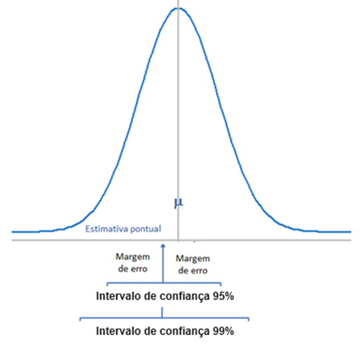

# Estimação {#sec-estimacao}

## Pacotes necessários

```{r}
pacman::p_load(DescTools, 
               flextable,
               knitr,
               Rmisc, 
               tidyverse)
```

## Introdução

A estatística inferencial é o ramo da estatística que utiliza resultados amostrais para tomar decisões e tirar conclusões sobre a população da qual a amostra foi extraída. A estimação de parâmetros e os testes de hipóteses, em conjunto, constituem a base da **inferência estatística**.\
A estimação é o procedimento pelo qual valores numéricos são atribuídos a um parâmetro populacional com base nas informações de uma amostra. Na inferência, $\mu$\$\\mu\$ representa a média populacional e $p$ denota a proporção populacional. Existem diversos outros parâmetros, como mediana, moda, variância, desvio padrão.\
Se fosse viável realizar um censo (uma pesquisa que inclua toda a população de interesse), os procedimentos de estimação seriam desnecessários. O cenário seria equivalente ao de uma eleição: basta contar todos os votos para declarar o vencedor. No entanto, na área da saúde, realizar um censo é frequentemente um processo caro, demorado ou virtualmente impossível. Por isso, costuma-se extrair uma amostra da população para calcular as estatísticas amostrais apropriadas. Com base nelas, são atribuídos valores ao parâmetro de interesse.\
A função estatística usada para estimar um parâmetro é denominada **estimador**. Assim, a média da amostra, $\bar{x}$, é o estimador da média populacional, $\mu$; e a proporção da amostra, $\hat{p}$, é o estimador da proporção populacional, $p$. Já a estimativa é o valor numérico específico que o estimador assume para uma dada amostra.\
A estimação pontual — como usar $\bar{x}$ para estimar $\mu$ — é intuitiva e útil, mas tem uma limitação óbvia: **não informa o grau de incerteza associado ao valor estimado**. Duas amostras diferentes, extraídas da mesma população, dificilmente produzirão a mesma média. Assim, confiar apenas em um número único pode transmitir uma falsa sensação de precisão.

Para lidar com essa incerteza, a estatística inferencial introduz um conceito fundamental: **intervalos de confiança (ICs)**.

## O que é um intervalo de confiança?

Um intervalo de confiança é um **intervalo de valores plausíveis** para o parâmetro populacional, construído a partir dos dados amostrais [@altman2005ic]. Ele é composto por:

- uma **estimativa pontual** (por exemplo, $\bar{x}$ ou $\hat p$),

- um **erro padrão**, que mede a variabilidade do estimador,

- um **coeficiente crítico**, que depende do nível de confiança desejado.

::: callout-note
## Fórmula Geral

$$\text{estimativa pontual} \ \pm \text{coeficiente crítico} \times \text{erro padrão}$$
:::

O $\text{coeficiente crítico} \times \text{erro padrão}$ é conhecido como **margem de erro** (@fig-intconf). O nível de confiança mais comum é 95%, mas nada impede o uso de 90%, 99% ou outros valores, dependendo do contexto.

{#fig-intconf fig-align="center" width="11cm"}

A @fig-ic9599 ilustra como o aumento do nível de confiança amplia a margem de erro: o IC de 99% é mais largo do que o de 95%.

{#fig-ic9599 fig-align="center" width="11cm"}

## Intervalo de confiança com $\sigma$ conhecido

A *margem de erro* para a estimativa da média populacional, $\mu$, quando se conhece o desvio padrão populacional ,$\sigma$, e $n \ge 30$ ou, mesmo que $n < 30$, mas a população de onde amostra foi selecionada tem distribuição normal, é a quantidade que é subtraída ou adicionada ao valor da média da amostra, $\bar{x}$, para obter o intervalo de confiança para $\mu$. Desta forma, a margem de erro é igual a:

$$me = z_{(1-\frac{\alpha}{2})} \times \frac{\sigma }{\sqrt{n}}$$

Logo, o intervalo de confiança para a média populacional, $\mu$, para um nível de confiança (1 - $\alpha \times 100$)%, é igual a:

$$IC_{(1-\alpha)}(\mu) \rightarrow  \bar{x} \pm  me$$

Se objetivo é construir um intervalo de confiança de 95%, a última equação passa a ser:

$$IC_{(1-\alpha)}(\mu) \rightarrow  \bar{x} \pm  z_{(0,975)} \times me$$

Onde *z* é o valor crítico para o nível de confiança escolhido, obtido da tabela de distribuição normal padrão, e *me* é a margem de erro ($z_{0,975} \times erro \quad padrao$). Um intervalo de confiança de 95% significa que a área total sob a curva normal entre dois pontos em torno da média populacional, $\mu$, é igual a 95%, ou 0,95. A área das caudas é $\alpha$, ou seja, cada cauda é igual a $\frac{\alpha}{2}$ (@fig-twotailed).

```{r}
#| label: fig-twotailed
#| echo: false
#| fig-align: center
#| fig-width: 5 
#| fig-cap: "Distribuição normal padrão com IC de 95%: área central (1 − α = 0,95) e caudas (α/2 = 0,025 cada)"

z_crit <- qnorm(0.975)

ggplot2::ggplot(data.frame(x = c(-4, 4)), ggplot2::aes(x)) +
  ggplot2::stat_function(fun = dnorm, linewidth = 0.8) +
  ggplot2::stat_function(fun = dnorm, geom = "area",
                         xlim = c( z_crit, 4), fill = "lightblue2") +
  ggplot2::stat_function(fun = dnorm, geom = "area",
                         xlim = c(-4, -z_crit), fill = "lightblue2") +
  ggplot2::geom_vline(xintercept = 0, linetype = "dashed", color = "red") +
  ggplot2::annotate("segment",
                    x = -z_crit, xend = z_crit, y = 0.15, yend = 0.15,
                    arrow = ggplot2::arrow(ends = "both",
                                          length = ggplot2::unit(0.2, "cm")),
                    color = "grey40") +
  ggplot2::scale_x_continuous(
    breaks = c(-z_crit, 0, z_crit),
    labels = c(paste0("\u2212", round(z_crit, 2)), "0",
               paste0("+",     round(z_crit, 2)))
  ) +
  ggplot2::annotate("text", x =  0,   y = 0.17,
                    label = "1 - \u03b1 = 0,95", size = 4, fontface = "italic") +
  ggplot2::annotate("text", x =  2.8, y = 0.04,
                    label = "\u03b1/2 = 0,025", size = 3.5, fontface = "italic") +
  ggplot2::annotate("text", x = -2.8, y = 0.04,
                    label = "\u03b1/2 = 0,025", size = 3.5, fontface = "italic") +
  ggplot2::labs(x = NULL, y = NULL) +
  ggplot2::theme_classic() +
  ggplot2::theme(axis.ticks.y = ggplot2::element_blank(),
                 axis.text.y  = ggplot2::element_blank(),
                 axis.line.y  = ggplot2::element_blank())
```

Para encontrar o valor de *z* para um nível de confiança de 95%, primeiro encontram-se as áreas à esquerda desses dois pontos, $z_1$ e $z_2$. Esses dois valores de *z* serão iguais, mas com sinais opostos. A área total sob a curva é igual a 1. A área entre $z_1$ e $z_2$ é igual a $1 - \alpha = 0,95$.

A área a esquerda de $z_1$ é igual a 0,025 e a área a esquerda de $z_2$ é igual a 1 – 0,025 = 0,975. No *R*, os valores $z_1$ e $z_2$ podem facilmente ser obtidos com a função `qnorm()`:

```{r}
print(c(qnorm(0.025),qnorm(0.975)), 3)
```

Dessa maneira, para uma confiança de 95%, é usado um $z = 1.96$, onde:

$$p(-1,96 \le z \le 1,96) = 0,95$$

Logo,

$$IC_{95\%}(\mu) \rightarrow  \bar{x} \pm  (1.96 \times \sigma_{\bar{x}})$$

ou

$$IC_{95\%}(\mu) \rightarrow  \bar{x} \pm  (1.96 \times \frac{\sigma}{\sqrt{n}})$$

### Cálculo do intervalo de confiança com $\sigma$ conhecido {#sec-dadosic}

Serão usados dados do dataframe `dadosMater.xlsx` [^12-estimacao-1], selecionando as variáveis de interesse (`fumo`, `ig`, `peso_rn`) e filtrando para os recém-nascidos a termo (37 a 41 semanas de idade gestacional):

[^12-estimacao-1]: Os dados podem ser baixados no seu diretório de trabalho a partir do repositório do autor no [GitHub](https://github.com/petronioliveira/Arquivos/blob/main/dadosMater.xlsx).

```{r}
set.seed(1234)
amostra1 <- readxl::read_excel("dados/dadosMater.xlsx") |>  
  dplyr::select(fumo, ig, peso_rn) |> 
  dplyr::filter(ig>=37 & ig<42)  |> 
  dplyr::mutate(fumo = factor(fumo, 
                       levels = c(1,2), 
                       labels = c("Fumante", "Não fumante"))) |> 
  dplyr::slice_sample(n = 50)
```

A partir de uma população de recém-nascidos, cujo desvio padrão ($\sigma$) é igual a 459,2 g [^12-estimacao-2], foi extraída uma amostra (`amostra1`) de n = 50, média ($\bar{x}$) de `r mean(amostra1$peso_rn)`g e desvio padrão ($s$) de `r round(sd(amostra1$peso_rn),1)`. Se forem extraídas outras amostras, espera-se que elas produzam estimativas diferentes da `amostra1`. Assim, o valor atribuído a média populacional, com base em uma **estimativa pontual** depende de qual das amostras está sendo usada. Consequentemente, a estimativa pontual atribui um valor a $\mu$ que quase sempre difere da mesma.

[^12-estimacao-2]: A média da população também é conhecida ($\mu = 3218g$), vai-se ignorar, por questões didáticas, este fato.

[Dados do exemplo para o cálculo]{.underline}

Com 95% de confiança a margem de erro é igual ao $z_{crítico}$ vezes o erro padrão da média:

```{r}
 n <- 50
 x_barra <- mean(amostra1$peso_rn)
 sigma <- 459.2 
 me <- 1.96 * sigma/sqrt(n)
  round(me, 2)
```

Basta, agora, adicionar e subtrair a margem de erro da média:

```{r}
lim_inf <- x_barra - me
lim_sup <- x_barra + me

round(c(lim_inf, lim_sup), 2)
```

Assim, tem-se uma confiança de 95% de que a verdadeira média, esteja incluída no intervalo. O nome para isso é *intervalo de confiança de 95% para a média populacional*.

### Função para o cálculo o IC com $\sigma$ conhecido

O cálculo manual é simples, mas enfadonho, nos tempos dos computadores. Em decorrência, como o R não tem uma função para encontrar os intervalos de confiança para a média de dados com distribuição normal quando o desvio padrão da população é conhecido, foi criada uma função (`ic_z [meuPacote]`) para cumprir essa ação. Esta função, criada pelo autor, encontra-se no pacote `meuPacote`, que pode ser instalado a partir do `GitHUb`:

```{r}
#| echo: true
#| eval: true
#| message: false
#| warning: false
remotes::install_github("petronioliveira/meuPacote")

# Ou alternativamente
#install.packages("pak")
#pak::pak("petronioliveira/meuPacote")
```

```{r}
meuPacote::ic_z(amostra1$peso_rn,sigma = 459.2)
```

### Interpretação do intervalo de confiança

Se fossem extraídas todas as possíveis amostras de *n* = 50 da população de recém-nascidos a termo e construído para cada uma delas um intervalo de confiança de 95% em torno de cada média amostral, espera-se que 95% desses intervalos incluirão a média populacional e 5% não incluirão. O IC95% informa sobre a *precisão* com que a média amostral estima a média populacional desconhecida [^12-estimacao-3].

[^12-estimacao-3]: A media populacional de onde foi extraída a amostra1 é igual a 3218g. Sabe-se porque foi usada uma população conhecida por uma questão didática. A regra é não se conhecer a média populacional, razão da importância do intervalo de confiança

Na @fig-vinte, são mostradas 20 amostras diferentes de tamanho *n* = 50, dessa população. Junto aparecem os intervalos de confiança de 95% construídos em torno dessas amostras. Observa-se que apenas uma amostra (em vermelho)[^12-estimacao-4] não inclui a média populacional (linha tracejada vertical em azul). Pode-se afirmar com 95% de confiança que se forem extraídas muitas amostras do mesmo tamanho de uma população e construído intervalos de confiança de 95% em torno das médias dessas amostras, 95% desses intervalos de confiança incluirão a média populacional.

[^12-estimacao-4]: Entretanto, aleatoriamente, poderiam aparecer mais de uma.

```{r}
#| echo: false

set.seed(1325)
n        <- 50
sigma_pop <- sigma   # evita mascarar a função sd()
n.reps   <- 20
media    <- 3218
alpha    <- 0.05
meus_dados <- matrix(rnorm(n = n.reps * n, mean = media, sd = sigma_pop),
                     ncol = n.reps)
sample.means <- apply(meus_dados, 2, mean)
me_sim       <- apply(meus_dados, 2,
                      function(v) qnorm(1 - alpha/2) * sd(v) / sqrt(length(v)))
dfx <- data.frame(sample.means,
                  me    = me_sim,
                  lcl   = sample.means - me_sim,
                  ucl   = sample.means + me_sim,
                  trial = 1:n.reps)
dfx$fora <- dfx$ucl < media | dfx$lcl > media
```

```{r}
#| label: fig-vinte
#| echo: false
#| out.width: "70%"
#| out.height: "70%"
#| fig.align: 'center'
#| fig.cap: "Intervalos de confiança de 95% que mostra 20 replicações simuladas de amostras de n = 50 do peso do recém-nascido. Apenas um intervalo (em vermelho) não inclui a média populacional (linha vertical azul)"
#| warning: false

ggplot2::ggplot(dfx, 
                ggplot2::aes(x     = sample.means, 
                             y     = trial, 
                             xmin  = lcl, 
                             xmax  = ucl, 
                             color = fora)) + 
  ggplot2::geom_errorbar() + 
  ggplot2::geom_point(pch = 16) +
  ggplot2::geom_vline(ggplot2::aes(xintercept = media),
                      color = "blue", lty = 2) +
  ggplot2::labs(x = "Médias amostrais", y = "Ensaios") +
  ggplot2::ggtitle(paste("ICs de sucesso:", 100 * mean(!dfx$fora), "%")) +
  ggplot2::scale_color_manual(values = c("seagreen4", "red")) +
  ggplot2::theme_bw() +
  ggplot2::theme(legend.position = "none")
```

::: callout-warning
## O que o IC **não** significa

É frequente a interpretação equivocada dos intervalos de confiança. O IC95% **não** significa que há 95% de probabilidade de a média populacional estar dentro do intervalo calculado — $\mu$ é um valor fixo (embora desconhecido), não uma variável aleatória.

O correto é: **se o mesmo procedimento fosse repetido muitas vezes**, 95% dos intervalos construídos dessa forma conteriam a verdadeira média populacional. O intervalo que calculamos *pode ou não* conter $\mu$ — mas foi obtido por um método que acerta em 95% das vezes.
:::

### Exercício 1 {.unnumbered}

::: callout-note
## Exercício — IC com $\sigma$ conhecido

A partir da `amostra1`, calcule o intervalo de confiança para a **idade gestacional média** dos recém-nascidos a termo. Registros históricos da mesma maternidade indicam que o desvio padrão populacional é $\sigma = 1{,}2$ semanas.

1.  Qual é a margem de erro com 95% de confiança?
2.  Construa também o IC de 99% e compare a largura dos dois intervalos. O que muda e por quê?
:::

```{r}
#| code-fold: true
#| code-summary: "Ver solução"

# 1. IC de 95%
meuPacote::ic_z(amostra1$ig, sigma = 1.2)

# 2. IC de 99% — margem de erro maior, intervalo mais largo
meuPacote::ic_z(amostra1$ig, sigma = 1.2, conf_level = 0.99)
```

Elevar o nível de confiança de 95% para 99% aumenta o coeficiente crítico de $z = 1{,}96$ para $z = 2{,}58$, ampliando a margem de erro em cerca de **32%**. Maior confiança implica menor precisão — não há como ter as duas simultaneamente sem aumentar o tamanho amostral.

## Cálculo do intervalo de confiança com $\sigma$ desconhecido

Na prática, a regra é $\sigma$ ser desconhecido e precisa ser estimado pela amostra e a estimação da média populacional ($\mu$) é feita usando a **distribuição *t* de Student**. Em amostras pequenas ($\le 30$), usar o modelo normal para construir intervalos de confiança, pode gerar um erro, pois os pressupostos do teorema do limite central não são respeitados. Dessa forma, a distribuição de Student também deve ser usada.

### Distribuição *t* de Student {#sec-dist_t}

A distribuição *t*, desenvolvida por *William Sealy Gosset*, em 1908, é semelhante à distribuição normal. Como a curva de distribuição normal, a curva de distribuição *t* é unimodal, simétrica (em forma de sino) em torno da média e nunca encontra o eixo horizontal. A área total sob uma curva de distribuição *t* é 1 ou 100%. A curva da distribuição *t* é mais plana do que a curva de distribuição normal padrão. Em outras palavras, ela é mais achatada e mais espalhada. No entanto, conforme o tamanho da amostra aumenta, a distribuição *t* aproxima-se da distribuição normal padrão.

O formato de uma curva de distribuição *t* particular depende do número de graus de liberdade. O número de graus de liberdade (*gl*) para uma distribuição *t* é igual ao tamanho da amostra menos um, ou seja, $gl=n-1$, veja @sec-variancia.

O número de graus de liberdade é o único parâmetro da distribuição *t*. Há uma diferente distribuição *t* para cada número de graus de liberdade, portanto, a distribuição *t* se constitui em uma família de distribuições (@fig-familia).

```{r}
#| label: fig-familia
#| echo: false
#| out.width: "80%"
#| out.height: "80%"
#| fig.align: 'center'
#| fig.cap: "Curvas de distribuição t conforme o grau de liberdade comparadas à distribuição normal"
#| warning: false

x_seq <- seq(-4, 4, length.out = 500)

dplyr::bind_rows(
  data.frame(x = x_seq, y = dt(x_seq, df =  1), dist = "gl = 1"),
  data.frame(x = x_seq, y = dt(x_seq, df =  3), dist = "gl = 3"),
  data.frame(x = x_seq, y = dt(x_seq, df =  8), dist = "gl = 8"),
  data.frame(x = x_seq, y = dt(x_seq, df = 30), dist = "gl = 30"),
  data.frame(x = x_seq, y = dnorm(x_seq),        dist = "Normal")
) |>
  dplyr::mutate(
    dist = factor(dist, levels = c("gl = 1","gl = 3","gl = 8","gl = 30","Normal"))
  ) |>
  ggplot2::ggplot(ggplot2::aes(x = x, y = y, color = dist, linetype = dist)) +
  ggplot2::geom_line(linewidth = 0.8) +
  ggplot2::scale_color_manual(
    values = c("red","blue","darkgreen","gold","black"),
    name   = "Distribui\u00e7\u00e3o"
  ) +
  ggplot2::scale_linetype_manual(
    values = c("solid","solid","solid","solid","dashed"),
    name   = "Distribui\u00e7\u00e3o"
  ) +
  ggplot2::labs(x = "x", y = "Densidade") +
  ggplot2::theme_classic()
```

Da mesma maneira que a distribuição normal padrão, a média da distribuição padrão *t* é 0. Entretanto, ao contrário da distribuição normal padrão, cujo desvio padrão é 1, o desvio padrão de uma distribuição *t* é $\sqrt{\frac{gl}{gl-2}}$ , para *gl* \> 2, sempre é maior do que 1. Assim, o desvio padrão de uma distribuição *t* é maior do que o desvio padrão da distribuição normal padrão.\
Os valores de ${t}_{crítico}$ podem ser obtidos usando a função `qt()` que usa os seguintes argumentos:

- **p** $\to$ probabilidade, igual a $1 - \frac{\alpha}{2}$, considerando-se bicaudal e $1 - \alpha$ quando unicaudal;
- **df** $\to$ graus de liberdade;
- **lower.tail** $\to$ lógico; se TRUE, informa a probabilidade da cauda inferior. O padrão é TRUE.

Assim, o valor do ${t}_{crítico}$ para $gl=10$ é:

```{r}
alpha  <-  0.05
p <- 1 - (alpha/2)
gl = 10
t <- qt(p = p, df = 10, lower.tail = TRUE)
round(t, digits = 2)
```

A área compreendida entre $\pm$ `r round(t, digits = 2)` é igual a 95% (@fig-bilateral):

$$p(-2,23\le t\le 2,23)=0,95$$

```{r}
#| label: fig-bilateral
#| echo: false
#| out.width: "70%"
#| out.height: "70%"
#| fig.align: 'center'
#| fig.cap: "Distribuição t com gl = 10, bilateral"
#| warning: false

tc_bi <- qt(0.975, df = 10)

ggplot2::ggplot(data.frame(x = c(-4, 4)), ggplot2::aes(x)) +
  ggplot2::stat_function(fun = dt, args = list(df = 10), linewidth = 0.8) +
  ggplot2::stat_function(fun = dt, args = list(df = 10), geom = "area",
                         xlim = c( tc_bi,  4), fill = "lightblue2") +
  ggplot2::stat_function(fun = dt, args = list(df = 10), geom = "area",
                         xlim = c(-4, -tc_bi), fill = "lightblue2") +
  ggplot2::geom_vline(xintercept = 0, linetype = "dashed", color = "red") +
  ggplot2::scale_x_continuous(
    breaks = c(-tc_bi, 0, tc_bi),
    labels = c(paste0("\u2212", round(tc_bi, 2)), "0", round(tc_bi, 2))
  ) +
  ggplot2::annotate("text", x =  0, y = 0.10, label = "0,95",  size = 4, fontface = "italic") +
  ggplot2::annotate("text", x =  3, y = 0.03, label = "0,025", size = 4, fontface = "italic") +
  ggplot2::annotate("text", x = -3, y = 0.03, label = "0,025", size = 4, fontface = "italic") +
  ggplot2::labs(x = NULL, y = NULL) +
  ggplot2::theme_classic() +
  ggplot2::theme(axis.ticks.y = ggplot2::element_blank(),
                 axis.text.y  = ggplot2::element_blank(),
                 axis.line.y  = ggplot2::element_blank())
```

Quando se considera apenas uma das caudas (unicaudal ou unilateral), o valor do ${t}_{crítico}$ para $gl=10$ é

```{r}
t1 <- qt(p = 0.95, df = 10, lower.tail = TRUE)
round(t1, digits = 2)
```

Assim, a área abaixo de `r round(t1, digits = 2)` é igual a 95% (@fig-unilateral).

$$p(t \le 1,81)=0,95$$

```{r}
#| label: fig-unilateral
#| echo: false
#| out.width: "70%"
#| out.height: "70%"
#| fig.align: 'center'
#| fig.cap: "Distribuição t com gl = 10, unilateral"
#| warning: false


tc_uni <- qt(0.95, df = 10)

ggplot2::ggplot(data.frame(x = c(-4, 4)), ggplot2::aes(x)) +
  ggplot2::stat_function(fun = dt, args = list(df = 10), linewidth = 0.8) +
  ggplot2::stat_function(fun = dt, args = list(df = 10), geom = "area",
                         xlim = c(tc_uni, 4), fill = "lightblue2") +
  ggplot2::geom_vline(xintercept = 0, linetype = "dashed", color = "red") +
  ggplot2::scale_x_continuous(
    breaks = c(0, tc_uni),
    labels = c("0", round(tc_uni, 2))
  ) +
  ggplot2::annotate("text", x = 0, y = 0.10, label = "0,95", size = 4, fontface = "italic") +
  ggplot2::annotate("text", x = 3, y = 0.03, label = "0,05", size = 4, fontface = "italic") +
  ggplot2::labs(x = NULL, y = NULL) +
  ggplot2::theme_classic() +
  ggplot2::theme(axis.ticks.y = ggplot2::element_blank(),
                 axis.text.y  = ggplot2::element_blank(),
                 axis.line.y  = ggplot2::element_blank())
```

### Cálculo do intervalo de confiança com $\sigma$ desconhecido

Serão utilizados os mesmos dados do cálculo do intervalo de confiança com desvio padrão conhecido [^12-estimacao-5] , obtidos na @sec-dadosic. Os dados serão atribuídos à `amostra2` .

[^12-estimacao-5]: Os valores são conhecidos, mas serão ignorados, por enquanto, imagine que eles não existem.

```{r}
set.seed(1234)
amostra2 <- readxl::read_excel("dados/dadosMater.xlsx") |>  
  dplyr::select(ig, peso_rn) |> 
  dplyr::filter(ig>=37 & ig<42) |> 
  dplyr::slice_sample(n = 50)

x_barra2 <- mean(amostra2$peso_rn, na.rm = TRUE)
dp2 <- sd(amostra2$peso_rn, na.rm = TRUE)
print(round(c(x_barra2, dp2),3))
```

A maneira mais intuitiva de estimar a média da população com base na amostra, é, simplesmente, calcular a média e o desvio padrão. Entretanto, para uma maior precisão, é sempre importante calcular o intervalo de confiança.

#### Cálculo manual do IC

O desvio padrão da amostra ($s$) será usado no lugar do desvio padrão da população ($\sigma$) quando este não é conhecido, respeitando os pressupostos [@motulsky2010ci]. Então, o erro padrão da média ($\sigma_{\bar{x}}$) pode ser estimado pelo $EP_{\bar{x}}$.

$$EP_{\bar{x}}=\frac{s}{\sqrt{n}}$$

O intervalo de confiança para a $\mu$ para um nível de confiança (*NC*) de $(1 – \alpha) \times100$% é igual a:

$$IC_{NC}(\mu)\rightarrow \bar{x} \pm \left(t_{\left(1-\frac{\alpha}{2},\, gl\right)} \times \frac{s}{\sqrt{n}}\right)$$

Quando o tamanho amostral é grande, o valor de *t* se aproxima do valor de *z*, portanto, em situações em que não se conhece o desvio padrão populacional, não há muita diferença se houver uma aproximação de *t* para *z* (@tbl-tabtz).

```{r}
#| label: tbl-tabtz
#| tbl-cap: "Comparação dos valores z e t(gl)"
#| echo: FALSE
#| message: FALSE
#| warning: FALSE

df3 <- data.frame(
  n = c(5, 10, 30, 50, 100, 200, 500, 1000),
  gl = c(4, 9, 29, 49, 99, 199, 499, 999),
  z = c(1.96, 1.96, 1.96, 1.96, 1.96, 1.96, 1.96, 1.96),
  t = c(2.57, 2.23, 2.04, 2.01, 1.98, 1.97, 1.96, 1.96)
)

minha_tab <- flextable(df3) |>
  autofit() |>
  theme_booktabs() |>
  width(j = 1:4, width = 1.5) |>
  align(align = "center", part = "header") |>
  align(align = "center", part = "body") |>
  bold(part = "header")

minha_tab
```

A `amostra2` de *n* = 50, $\overline x$ = `r round(x_barra2, 3)`g e $s$ = `r round(dp2,3)`g. Essas estimativas servirão para o cálculo do intervalo de confiança, usando uma distribuição *t* bicaudal e um nível de significância $\alpha = 0,05$.

```{r}
n <-  length(amostra2$peso_rn)
alpha <- 0.05
p <- 1 - alpha/2
# Graus de liberdade  
gl <- n - 1
# Valor t crítico  
tc <-  qt(p, gl, lower.tail = TRUE)
# Erro padrão
EP <- round(dp2/sqrt(n),3)
print(round(c(tc, EP),3))
```

Com esses dados, calcula-se o intervalo de confiança de 95%:

```{r}
me2 <- tc * EP
lim_inf2 <- x_barra2 - me2
lim_sup2 <- x_barra2 + me2
ic95 <- c(lim_inf2, lim_sup2)
round(ic95, 2)
```

#### Cálculo usando uma função do R

O R possui algumas funções que calculam o intervalo de confiança para variáveis numéricas, baseadas na distribuição *t*. Entre elas, a função `MeanCI()`, incluída no pacote `DescTools` [@signorell2025desctools]. Leia mais sobre a função na ajuda (?DescTools::MeanCI()).

```{r}
DescTools::MeanCI(amostra2$peso_rn, conf.level = 0.95, 
                  sides = "two.sided", method = "classic")
```

Como alternativa, a função `ic_t()` do `meuPacote` produz o mesmo resultado com saída detalhada:

```{r}
meuPacote::ic_t(amostra2$peso_rn)
```

### Exercício 2 {.unnumbered}

::: callout-note
## Exercício — IC com $\sigma$ desconhecido

Usando a `amostra1`, compare o IC95% do **peso ao nascer** entre recém-nascidos de mães **não fumantes** e **fumantes**.

1.  Calcule os dois intervalos com `ic_t()`.
2.  O que a diferença de largura entre os intervalos revela sobre o papel do tamanho amostral?
3.  Com base nos intervalos, há evidência de diferença no peso médio entre os grupos?
:::

```{r}
#| code-fold: true
#| code-summary: "Ver solução"

nao_fumantes <- amostra1 |> dplyr::filter(fumo == "Não fumante")
fumantes     <- amostra1 |> dplyr::filter(fumo == "Fumante")

cat("Não fumantes (n =", nrow(nao_fumantes), ")\n")
meuPacote::ic_t(nao_fumantes$peso_rn)

cat("Fumantes (n =", nrow(fumantes), ")\n")
meuPacote::ic_t(fumantes$peso_rn)
```

O IC das fumantes é substancialmente mais largo porque o grupo tem apenas `r nrow(amostra1 |> dplyr::filter(fumo == "Fumante"))` observações — o desvio padrão amostral aumenta e o valor $t_{crítico}$ cresce com poucos graus de liberdade. Como os dois intervalos se sobrepõem, **não há evidência suficiente** para concluir diferença significativa com apenas esses dados.

## Intervalo de Confiança para uma proporção populacional

### Cálculo do intervalo de confiança para a proporção {#sec-ICproporcao}

Os dados extraidos para constituir `amostra1` (@sec-dadosic) servirão, utilizando a variável fumo, para os cálculos do intervalo de confiança de uma proporção.

**Cálculo da estimativa pontual da proporção de fumantes**

Na `amostra1`, a proporção de fumantes é:

```{r}
tab <- table(amostra1$fumo)
tab
tabFumo <- round (prop.table (tab), 3)
tabFumo
```

A proporção de mulheres fumantes na `amostra1` é igual a `r tabFumo[1] * 100`%.

**Cálculo manual com aproximação normal**

*1ª etapa*: verificar a premissa de que quando a proporção populacional é desconhecida a proporção pontual ($\hat p$) e o seu complemento ($\hat q = 1 - \hat p$) multiplicados, cada um, por $n$, devem ser maior do que 5.

```{r}
n <- length(amostra1$fumo)
tabFumo[1]*n
(1 - tabFumo[1])*n
```

Como se observa, ambos os valores são maiores do que 5.

*2ª Etapa*: O intervalo pode ser estimado pela distribuição normal e é necessário calcular o *z_crítico*:

```{r}
alpha <- 0.05
p <-  1 - alpha/2
zc <- qnorm (p, mean = 0, sd = 1)
round(zc, 2)
```

*3ª Etapa*: Cálculo do erro padrão da proporção ($\sqrt \frac {\hat p \times \hat q}{n}$) e da margem de erro:

```{r}
# Extração da proporção amostral do tabFumo
prop <- tabFumo [1]

# Cálculo do EP amostral
EP <- sqrt((prop * (1 - prop))/n)

# Cálculo da margem de erro(me)
me <- zc * EP

# dados necessários para o cálculo do IC95%
print(c(prop, me), digits = 3)
```

*4ª Etapa*: Intervalo de confiança

```{r}
ic_prop <- c((prop - me), (prop + me))
round(ic_prop, 3)
```

**Cálculo usando uma função**

O chamado *Intervalo de Confiança Exato* corrigem as deficiências da aproximação normal. O R tem uma função para este cálculo: `BinomCI()` do pacote `DescTools` [@signorell2025desctools]. É preferível usar o método de Clopper e Pearson que fornece o IC exato.

Os argumentos da função `BinomCI()` são:

- **x** $\to$ é o número de desfechos, sucessos;
- **n** $\to$ é o tamanho da amostra, número de ensaios;
- **p** $\to$ probabilidade, hipótese nula; se ignorada o padrão é 0,50;
- **conf.level** $\to$ nível de confiança, o padrão é 0.95;
- **method** $\to$ possui vários métodos para calcular intervalos de confiança para uma proporção binomial como: “clopper-pearson” (exact interval), "wilson", "wald", "agresti-coull", "jeffreys", "modified wilson", "modified jeffreys", "arcsine", "logit", "witting", "pratt". O método padrão é o de “wilson”. Qualquer outro método, há necessidade de solicitar;
- **sides** $\to$ hipótese alternativa padrão “two.sided” (bilateral), mas pode ser “right” ou “left” (unilateral a direita ou a esquerda, respectivamente).

```{r}
#| message: false
#| warning: false

x <-  tab[1]
IC <- BinomCI (x, 
               n, 
               conf.level = 0.95, 
               method = "clopper-pearson")
round(IC, 3)
```

Observe que existe uma pequena diferença entre os valores da aproximação normal e o exato, com o método de “clopper-pearson”

### Exercício 3 {.unnumbered}

::: callout-note
## Exercício — IC para uma proporção

Extraia uma amostra maior (`amostra3`, $n = 200$) do mesmo banco de dados (`dadosMater.xlsx`), restrita a recém-nascidos a termo.

1.  Qual é a proporção estimada de mães fumantes?
2.  Calcule o IC de 95% pelo método exato de Clopper-Pearson.
3.  Recalcule para 99% e compare a largura dos dois intervalos.
4.  A premissa de usar a aproximação normal ($n\hat{p} > 5$ e $n\hat{q} > 5$) é satisfeita?
:::

```{r}
#| code-fold: true
#| code-summary: "Ver solução"

set.seed(5271)
amostra3 <- readxl::read_excel("dados/dadosMater.xlsx") |>
  dplyr::select(fumo, ig) |>
  dplyr::filter(ig >= 37 & ig < 42) |>
  dplyr::mutate(fumo = factor(fumo,
                              levels = c(1, 2),
                              labels = c("Fumante", "Não fumante"))) |>
  dplyr::slice_sample(n = 200)

tab3  <- table(amostra3$fumo)
prop3 <- tab3[1] / sum(tab3)

# 4. Verificação da premissa da aproximação normal
cat("n * p_hat =", round(sum(tab3) * prop3),
    "| n * q_hat =", round(sum(tab3) * (1 - prop3)), "\n\n")

# 2. IC 95% — método exato
cat("IC 95% (Clopper-Pearson):\n")
print(round(DescTools::BinomCI(tab3[1], sum(tab3),
                               conf.level = 0.95,
                               method = "clopper-pearson"), 3))

# 3. IC 99%
cat("\nIC 99% (Clopper-Pearson):\n")
print(round(DescTools::BinomCI(tab3[1], sum(tab3),
                               conf.level = 0.99,
                               method = "clopper-pearson"), 3))
```

Com $n = 200$, ambas as premissas da aproximação normal são satisfeitas. O IC de 99% é cerca de **25% mais largo** que o de 95%, ilustrando a mesma relação entre confiança e precisão observada nos exercícios anteriores — agora aplicada a proporções.
