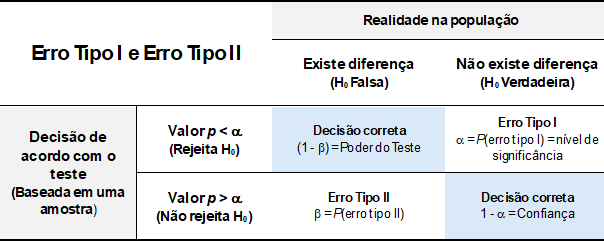
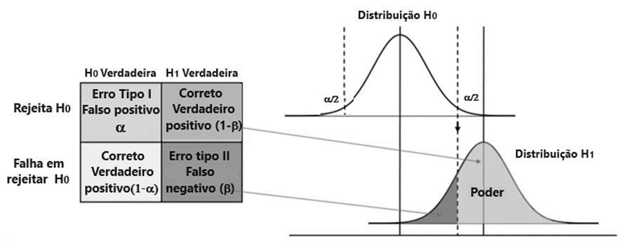

# Valor *p* {#sec-valorp}

```{r}
#| label: setup
#| include: false
library(tidyverse)
library(flextable)
```

O **valor *p*** é um dos conceitos mais utilizados — e mais mal interpretados — em estatística [@goodman2008dirty; @wasserstein2016asa]. Antes de defini-lo formalmente, vamos construir a intuição necessária a partir de um exemplo simples e concreto: o lançamento de uma moeda. Partindo das probabilidades básicas, chegaremos naturalmente à ideia central por trás de qualquer teste de hipóteses.

## Probabilidades no lançamento de moedas

### Lançamento de uma moeda

Ao se lançar uma moeda honesta, não adulterada, a chance de cair **cara**[^13-valor_p-1] é igual a:

[^13-valor_p-1]: Entenda-se, aqui, que o resultado **cara** é igual a **sucesso**.

- A moeda tem duas faces (**cara** e **coroa**) , logo, a chance é de 1:2 $\to$ $1/2 = 0,50 \to 50\%$

### Três lançamentos de uma moeda justa

Qual a probabilidade de cair três caras?

- 8 opções $\to$ $1/8 = 0,125 \to 12,5\%$

Colocando todas as opções em uma tabela, temos:

```{r}
#| label: tbl-moeda3
#| tbl-cap: "Probabilidades em 3 lançamentos de uma moeda honesta"

tibble(
  Opção = c("Ca-Ca-Ca", "Ca-Ca-Co", "Ca-Co-Ca", "Ca-Co-Co",
             "Co-Ca-Ca", "Co-Ca-Co", "Co-Co-Ca", "Co-Co-Co"),
  Caras = c(3, 2, 2, 1, 2, 1, 1, 0),
  p     = rep(0.125, 8)
) |>
  flextable() |>
  align(j = c("Caras", "p"), align = "center", part = "all") |>
  bg(i = ~ Caras == 3, bg = "gold") |>
  autofit()
```

::: callout-note
## Exercício 1

1)  Olhando a @tbl-moeda3, qual a probabilidade de cair duas caras em três lançamentos?

- Existem 3 opções onde temos 2 caras (Ca-Ca-Co, Ca-Co-Ca e Co-Ca-Ca)
- $0,125 \times 3 = 0,375 \to 37,5\%$

2)  Agora, qual a probabilidade de cairem duas ou mais caras?

- As opções são as mesmas anteriores acrescida da opção de três caras
- $0,125 \times 4 = 0,50 \to 50\%$
:::

Colocando as distribuições da tabela em um gráfico, temos:

```{r}
#| out-width: "70%"
#| out-height: "70%"
#| fig-align: 'center'
#| label: fig-moeda3
#| fig-cap: "Distribuição dos 3 lançamentos de uma moeda honesta"

tibble(
  caras = c(0:3),
  p     = c(1, 3, 3, 1) / 8
) |>
  ggplot(aes(x = factor(caras), y = p)) +
  geom_col() +
  geom_text(aes(label = scales::percent(p, accuracy = 0.1)), vjust = -0.5) +
  scale_y_continuous(expand = expansion(mult = c(0, 0.1))) +
  labs(
    x = "Número de caras",
    y = "Probabilidade"
  ) +
  theme_bw()
```

### Aumentando o número de lançamentos da moeda

#### Seis lançamentos

```{r}
#| output: false
dist6 <- dbinom(x = 0:6, size = 6, prob = 0.5)
df6 <- data.frame(caras = 0:6, p = round(dist6, 3))
```

Em um gráfico de barras, temos:

```{r}
#| label: fig-moeda6
#| fig-cap: "Distribuição de 6 lançamentos de uma moeda honesta"
#| #| out-width: "70%"
#| out-height: "70%"
#| fig-align: 'center'
  
df6 |> 
  ggplot(aes(x = factor(caras), y = p)) +
  geom_col() +
  geom_text(aes(label = scales::percent(p, accuracy = 0.1)), vjust = -0.5) +
  scale_y_continuous(expand = expansion(mult = c(0, 0.1))) +
  labs(
    x = "Número de caras",
    y = "Probabilidade"
  ) +
  theme_bw()
```

#### Doze lançamentos

```{r}
#| message: false
#| echo: true
#| out-width: "70%"
#| out-height: "70%"
#| fig-align: 'center'
#| label: fig-moeda12
#| fig-cap: "Distribuição de 12 lançamentos de uma moeda honesta"

dist12 <- dbinom(x = 0:12, size = 12, prob = 0.5)
df12 <- data.frame(caras = 0:12, p = round(dist12, 3))

df12 |> 
  ggplot(aes(x = factor(caras), y = p)) +
  geom_col() +
  geom_text(aes(label = scales::percent(p, accuracy = 0.1)), vjust = -0.5) +
  scale_y_continuous(expand = expansion(mult = c(0, 0.1))) +
  labs(
    x = "Número de caras",
    y = "Probabilidade"
  ) +
  theme_minimal()
```

#### Cinquenta lançamentos

```{r}
#| message: false
#| echo: false
#| out-width: "70%"
#| out-height: "70%"
#| fig-align: 'center'
#| label: fig-moeda50
#| fig-cap: "Distribuição de 50 lançamentos de uma moeda honesta"
dist50 <- dbinom(x = 0:50, size = 50, prob = 0.5)
df50 <- data.frame(caras = 0:50, p = round(dist50, 3))

df50 |> 
  ggplot(aes(x = factor(caras), y = p)) +
  geom_col() +
  scale_x_discrete(breaks = seq(0, 50, 10)) +
  scale_y_continuous(expand = expansion(mult = c(0, 0.1))) +
  labs(
    x = "Número de caras",
    y = "Probabilidade"
  ) +
  theme_bw()
```

::: callout-note
## Exercício 2

Nessa distribuição de probabilidades (@fig-moeda50), qual é a probabilidade de ocorrer exatamente vinte caras?
:::

```{r}
prob <- dbinom(20, size = 50, prob = 0.5)
format(prob, scientific = FALSE)
```

Ou seja, uma probabilidade[^13-valor_p-2] muito pequena, igual `r format(prob * 100, scientific = FALSE)`%.

[^13-valor_p-2]: Para evitar que a saída apareça em notação científica, usamos a função `format(probabilidade, scientific = FALSE)`

::: callout-note
## Exercício 3

Qual a probabilidade de se ter, na distribuição da @fig-moeda50, ATÉ 20 caras?
:::

Se o objetivo é encontrar a probabilidade de ter até 20 caras (ou seja, 0, 1, 2, 3, 4, ..., ou 20 sucessos), podemos usar a função de probabilidade acumulada:

```{r}
prob_20 <- pbinom(20, size = 50, prob = 0.5)
format(prob_20, scientific = FALSE)
```

Ou, como a probabilidade de obter até 20 caras (ou seja, de 0 a 20 sucessos) é a soma exata das probabilidades individuais de sair 0 caras, 1 cara, 2 caras, e assim por diante, até 20 caras, pode ser calculado assim:

```{r}
sum(dbinom(0:20, size = 50, prob = 0.5))
```

```{r}
#| message: false
#| echo: false
#| out-width: "70%"
#| out-height: "70%"
#| fig-align: 'center'
#| label: fig-moeda20
#| fig-cap: "Probabilidade acumulada de cair até 20 caras"
dist50 <- dbinom(x = 0:50, size = 50, prob = 0.5)
df50 <- data.frame(caras = 0:50, p = round(dist50, 3))

df50 |> 
  ggplot(aes(x = factor(caras), y = p, fill = caras <= 20)) +
  geom_col() +
  scale_fill_manual(values = c("TRUE" = "red", "FALSE" = "steelblue"), guide = "none") +
  scale_x_discrete(breaks = seq(0, 50, 10)) +
  scale_y_continuous(expand = expansion(mult = c(0, 0.1))) +
  labs(
    x = "Número de caras",
    y = "Probabilidade"
  ) +
  theme_bw()
```

::: callout-note
## Exercício 4

Imagine que, em um determinado jogo, cara é "sucesso" e ganha o jogo quem conseguir, em 50 lançamentos, 20 ou menos caras[^13-valor_p-3] , ou seja, na @fig-moeda20, o resultado cair na faixa vermelha. Olhando o gráfico, se deduz que banca terá uma chance de 9:1 de sair lucrando! Ou seja, a probabilidade de um jogador ganhar, ao fazer 50 lançamentos de uma moeda, é de aproximadamente 10%.

Suponha, agora, que neste mesmo jogo, um indivíduo usa a sua moeda na aposta e ganha 3 vezes seguida. O que posso deduzir sobre a honestidade da moeda?
:::

[^13-valor_p-3]: Consequentemente, $\ge 30$ coroas.

Para ganhar **três vezes seguidas** (assumindo que as rodadas são independentes), multiplicamos as probabilidades:

$$P(\text{Ganhar 3 vezes}) = 0,1013 \times 0,1013 \times 0,1013 \approx 0,00104$$

Ou seja, a probabilidade de isso acontecer puramente por sorte com uma moeda honesta é de apenas 0,1% (cerca de 1 chance em 1.000).

[O que podemos deduzir]{.underline}?

Em estatística, quando um evento com uma probabilidade tão absurdamente baixa acontece, nós começamos a rejeitar a ideia de que foi "apenas sorte".

Considerando a visão frequentista, em um teste de hipóteses normal, as nossas hipóteses estatísticas seriam:

> **Hipótese Nula** $H_{0}$: a moeda é honesta\
> **Hipóteses Alternativa** $H_{1}$: a moeda não é honesta

Usando uma confiança de 95%, o nível de significância é de $\alpha = 0.05$ [^13-valor_p-4]. Dessa forma, rejeita-se $H_{0}$ se a probabilidade encontrada for $\le \alpha = 0.05$. A probabilidade de ganhar 3 vezes seguidas é de 0,1% (0,001), muito menor que 0,05 e, assim, podemos rejeitar a hipótese ($H_{0}$) de honestidade da moeda. A moeda provavelmente está alterada para a sair mais coroas (facilitando o resultado de "20 ou menos caras").

[^13-valor_p-4]: Essa é a tradição arbitrária, usada em estatística. Ou seja, se a probabilidade for igual a 0,049, se rejeita a hipóteses nula $H_{0}$; se for 0,051, ela não é rejeitada. Estranho, né? Mas é assim...

O dado observado é tão extremo que a explicação de que "a moeda não é honesta" se torna infinitamente mais provável e, se fosse em um cassino, o jogador teria sido convidado a se retirar na terceira rodada!

### O que é valor de p?

::: callout-important
## Definição

É a probabilidade de observar dados tão ou mais extremos que os encontrados, **caso a hipótese nula seja verdadeira** [@guyatt1995basic; @menezes2004hipoteses].
:::

#### Conectando com o exemplo

No exemplo, o valor *p* = 0,001 significa: *"se a moeda fosse honesta (*$H_0$ verdadeira), a probabilidade de um jogador ganhar 3 vezes seguidas seria de apenas 0,1%". Como esse valor é menor que $\alpha = 0{,}05$, rejeita-se $H_0$ e concluí-se que a moeda provavelmente está adulterada.

A função da estatística termina aqui. A decisão final cabe ao pesquisador: rejeitar ou não $H_0$ deve sempre estar apoiado em uma fundamentação teórica — não apenas no valor *p* isolado.

#### O que o valor *p* **não** é

As interpretações equivocadas do valor *p* são extremamente comuns [@goodman2008dirty; @wasserstein2016asa]. É tão importante saber o que ele **não** representa quanto a sua definição formal:

::: callout-warning
## Interpretações incorretas do valor *p*

- **Não é** a probabilidade de $H_0$ ser verdadeira. Um valor *p* = 0,001 **não** significa que há 99,9% de chance de a moeda estar adulterada — o valor *p* nada diz sobre a probabilidade de uma hipótese ser ou não verdadeira.

- **Não é** a probabilidade de o resultado ter ocorrido por acaso. É a probabilidade de *resultados tão ou mais extremos* ocorrerem, *supondo* que $H_0$ é verdadeira — uma distinção sutil, mas fundamental.

- **Não mede** a importância ou o tamanho do efeito. Um valor *p* muito pequeno pode resultar simplesmente de uma amostra grande, mesmo que o efeito prático seja irrelevante. Sempre avalie a magnitude do efeito separadamente.

- **Não garante** replicação. Um resultado com *p* \< 0,05 não significa que o mesmo achado se repetirá em um novo estudo.
:::

#### Resumindo

O valor *p* é uma **ferramenta de decisão**, não uma medida de verdade. Ele informa se os dados observados são compatíveis com a hipótese nula — e, quando não são, ele autoriza a rejeitá-la com um grau de confiança pré-estabelecido. A interpretação final, porém, depende sempre do contexto, da teoria e do julgamento do pesquisador.

### Erros de Decisão {#sec-erros}

Nessa tomada de decisão, *erros* são cometidos, por exemplo, pode-se rejeitar uma hipótese nula verdadeira. Nesse caso, tem-se um resultado *falso positivo*, conclui-se que existe um efeito quando na verdade ele não existe. Este erro é denominado de **erro tipo I** e a probabilidade de se cometer esse tipo de erro é denominado de $\alpha$.

$$P(rejeitar \quad H_{0}|H_{0} \quad verdadeira) = \alpha$$

Outra possibilidade de erro é quando não se rejeita uma hipótese nula falsa. É o erro denominado de erro tipo II. Nesse caso, tem-se um *falso negativo*; não se conseguiu encontrar um efeito que realmente existe. A probabilidade de cometer esse tipo de erro é chamada de $\beta$.

$$P(não \quad rejeitar \quad H_{0}|H_{0} \quad falsa) = \beta$$

Na @fig-erros estão resumidas as possíveis consequências na tomada de decisão em um teste de hipótese [@fletcher2014acaso].

{#fig-erros fig-align="center" width="14cm"}

### Significância estatística versus relevância prática

Rejeitar $H_0$ não significa, necessariamente, que o efeito encontrado seja importante. Essa é uma das armadilhas mais comuns na interpretação de resultados estatísticos.

O valor *p* depende de **dois fatores**: o tamanho do efeito e o tamanho da amostra. Com amostras muito grandes, até diferenças minúsculas e sem nenhum significado prático produzem valores *p* extremamente pequenos.

#### Um exemplo com a moeda

Imagine que, ao invés de uma moeda completamente honesta, temos uma moeda com um viés muito sutil: a probabilidade de cara é 0,51 em vez de 0,50 — uma diferença de apenas 1 ponto percentual. Na prática, em qualquer jogo humano, essa diferença seria imperceptível.

O que acontece ao testar essa moeda com amostras de tamanhos diferentes?

```{r}
#| label: tbl-efeito
#| tbl-cap: "Valor p e tamanho do efeito para diferentes tamanhos de amostra (P(cara) = 0,51)"
tibble(
  n         = c(100, 500, 1000, 5000, 10000, 100000),
  caras     = round(n * 0.51),
  valor_p   = map_dbl(n, \(x) binom.test(round(x * 0.51), x, p = 0.5)$p.value),
  diferenca = 0.51 - 0.50
) |>
  mutate(
    n         = format(n, big.mark = "", scientific = FALSE),
    caras     = format(caras, big.mark = "", scientific = FALSE),
    valor_p   = format(round(valor_p, 4), scientific = FALSE),
    diferenca = scales::percent(diferenca, accuracy = 0.1)
  ) |>
  rename(
    `Lançamentos (n)` = n,
    `Caras observadas` = caras,
    `Valor p`          = valor_p,
    `Diferença real`   = diferenca
  ) |>
  flextable() |>
  align(align = "center", part = "all") |>
  autofit()
```

Observe que a **diferença real entre a moeda viciada e a honesta é sempre a mesma**: 1 ponto percentual. O que muda é apenas o número de lançamentos. Com 100 lançamentos, o teste não detecta nada. Com 100.000 lançamentos, o *p* é minúsculo — mesmo que a moeda seja praticamente honesta para qualquer fim prático.

#### Tamanho do efeito

Para complementar o valor *p*, devemos sempre reportar uma medida de **tamanho do efeito** (*effect size*) — uma quantidade que descreve a *magnitude* da diferença, independentemente do tamanho da amostra. Para proporções, as medidas mais comuns são:

| Medida | O que representa |
|----|----|
| Diferença de proporções | $\hat{p} - p_0$ — a mais intuitiva; no exemplo, vale 0,01 |
| *h* de Cohen | Diferença padronizada entre proporções; $< 0{,}2$ é considerado efeito pequeno [@cohen1992quantitative] |
| Razão de chances (*odds ratio*) | Quanto maior a chance de um evento em relação ao outro |

::: callout-tip
## Regra prática

Sempre apresente o valor *p* **junto** com uma medida de tamanho do efeito e os intervalos de confiança. Um resultado pode ser estatisticamente significante e praticamente irrelevante — ou vice-versa.
:::

::: callout-note
## O paradoxo inverso: efeito grande, amostra pequena

O problema oposto também existe. Com amostras muito pequenas, um efeito real e expressivo pode não atingir significância estatística — não porque o efeito inexista, mas porque o estudo não tem **poder estatístico** suficiente para detectá-lo.

Imagine uma moeda com viés intenso: P(cara) = 0,70. Em apenas 10 lançamentos, observamos 7 caras — exatamente o esperado para essa moeda. O teste, porém, não rejeita $H_0$:

```{r}
binom.test(7, 10, p = 0.5)$p.value
```

O valor *p* é de aproximadamente 0,34 — muito acima de 0,05. Ainda assim, a moeda tem um viés real de **20 pontos percentuais** em relação a uma moeda honesta. A amostra simplesmente é pequena demais para distinguir esse efeito do acaso.

Concluir que *"não há efeito"* com base em p \> 0,05 em uma amostra pequena é um erro tão grave quanto ignorar a magnitude do efeito em amostras grandes. **A ausência de significância estatística não é a mesma coisa que ausência de efeito.**
:::

#### Poder estatístico

O **poder estatístico** de um teste é a probabilidade de rejeitar corretamente $H_0$ quando ela é de fato falsa — ou seja, a capacidade do estudo de detectar um efeito real quando ele existe:

$$\text{Poder} = 1 - \beta$$

onde $\beta$ é a probabilidade de **erro do tipo II**: não rejeitar $H_0$ quando ela deveria ser rejeitada (\@fig-power).

Por convenção, busca-se um poder mínimo de 80% no planejamento de estudos [@cohen1988power].

No exemplo da moeda viciada (P(cara) = 0,70, $n$ = 10), o poder pode ser calculado com o pacote `pwr` [@champely2020pwr][^13-valor_p-5]:

[^13-valor_p-5]: A função `pwr.p.test()` é usada para testes de **uma proporção** (como o teste da moeda). Quando o objetivo é comparar **duas proporções independentes** — por exemplo, a taxa de sucesso de dois tratamentos —, a função equivalente é `pwr.2p.test()`, com a mesma estrutura de argumentos.

```{r}
library(pwr)

pwr.p.test(
  h         = ES.h(p1 = 0.70, p2 = 0.50),  # h de Cohen para proporções
  n         = 10,
  sig.level = 0.05
)
```

Com apenas 10 lançamentos, o poder é de **\~26%**: em cerca de 3 a cada 4 experimentos, o teste falharia em detectar a moeda viciada, mesmo com um viés de 20 pontos percentuais.

Para descobrir quantos lançamentos seriam necessários para atingir 80% de poder, deixamos `n` em aberto e fornecemos o poder desejado:

```{r}
pwr.p.test(
  h         = ES.h(p1 = 0.70, p2 = 0.50),
  sig.level = 0.05,
  power     = 0.80
)
```

Seriam necessários **47 lançamentos** para ter 80% de chance de detectar o viés. Com apenas 10, o estudo estava seriamente subdimensionado.

No exemplo da moeda, um pesquisador responsável diria: *"O teste foi significante (p \< 0,05), mas a diferença estimada é de apenas 1 ponto percentual, sem relevância prática para o contexto estudado."* Já em um estudo com amostra pequena, o correto seria: *"O teste não atingiu significância (p = 0,34), mas o efeito estimado é de 20 pontos percentuais — uma amostra maior seria necessária para confirmar ou descartar esse achado."*

{#fig-power width="15cm"}
