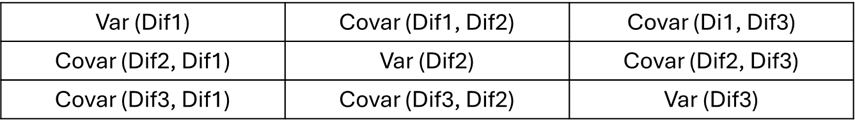
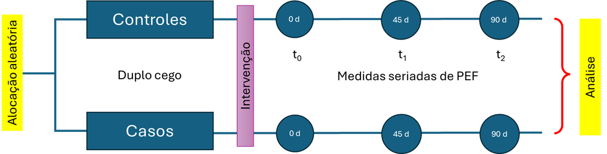

# Anova de Medidas Repetidas

## Pacotes usados neste capítulo

```{r}
pacman::p_load(afex, 
               effectsize,
               emmeans,
               flextable,  
               ggbeeswarm,
               ggpubr, 
               ggsci, 
               knitr, 
               readxl, 
               rstatix, 
               tidyverse)
```

## Anova de Medidas Repetidas com um Fator

### Introdução

A ANOVA de medidas repetidas (*Repeated Measures ANOVA*) é uma técnica estatística usada quando o mesmo grupo de participantes é medido várias vezes, seja ao longo do tempo ou sob diferentes condições. Ela é ideal para dados longitudinais ou experimentos intra-sujeitos, onde cada sujeito serve como seu próprio controle. São exemplos típicos:

• Medir a qualidade de vida de crianças asmáticas em vários momentos para avaliar o impacto de um programa de atenção ao asmático;

• Testar tempos de reação em um teste em três tempos em um mesmo grupo;

• Testar a autoestima de um mesmo grupo após a introdução de um tipo especial de dieta.

A @tbl-compare mostra algumas diferenças importantes entre a ANOVA e a ANOVA de Medidas Repetidas:

```{r}
#| label: tbl-compare
#| tbl-cap: "Comparação entre ANOVA e ANOVA de medidas repetidas"
#| echo: false
#| message: false
#| warning: false

df <- data.frame(
caracteristica = c("Tipo de Amostra", "Controle da variabilidade individual", "Sensibilidade estatística", "Suposição de esfericidade"),
ANOVA = c("Grupos independentes", "Não controla", "Menor", "Não se aplica"),
ANOVA_rep = c("Mesmos sujeitos em diferentes condições","Controla (cada sujeito é seu próprio controle)", "Maior (reduz o erro residual)", "Necessária (testada com o teste de Mauchly)"))

tab <- flextable(df)  |> 
  set_header_labels(
    caracteristica = "Característica",
    ANOVA = "ANOVA (entre sujeitos)",
    ANOVA_rep = "ANOVA de Medidas Repetidas (intra-sujeitos)")   |> 
  theme_booktabs() |> 
  width(j = 1:3, width = c(2.5,2.5,2.5)) |>
  align(align = "left", part = "header") |>
  align(align = "left", part = "body") |>
  bold(part = "header") 

tab
```

A ANOVA de medidas repetidas é mais poderosa estatisticamente porque reduz a variabilidade entre sujeitos, focando nas mudanças dentro de cada indivíduo. A ANOVA de medidas repetidas pode ser entendida como uma expansão da ANOVA [@anunciacao2021anovarep].

A **ANOVA de medidas repetidas de um fator** é uma técnica estatística que compara as médias de três ou mais grupos relacionados, onde os mesmos participantes são medidos repetidamente em diferentes momentos ou condições para avaliar a mudança em uma variável dependente. É uma extensão do teste *t* pareado para mais de dois grupos e, por avaliar o mesmo grupo ao longo do tempo, controla diferenças individuais.

### Dados usados no exemplo {#sec-dadoscap16}

::: callout-note
### Cenário do exemplo

Um estudo, realizado em um ambulatório de Doenças Respiratórias Pediátricas, avaliou a função pulmonar de um grupo de crianças por um período de 3 meses (0, 45 dias, 90 dias) usando um novo corticoide inalatório. Todas as crianças tinham idade entre 7 e 15 anos e a medida avaliadora foi PFE (Pico de Fluxo Expiratório) que corresponde a taxa máxima de ar expelida pelos pulmões durante uma expiração forçada, indicador importante da função pulmonar, especialmente no monitoramento de asma.
:::

Os dados podem ser obtidos [aqui](https://github.com/petronioliveira/Arquivos/blob/main/dadosAsma.xlsx). Baixe no seu diretório de trabalho e carregue com a função `read_excel()` do pacote `readxl`. Na ANOVA de medidas repetidas de um fator, será usado apenas o grupo, denominado de `caso`, que usou o medicamento testado.

```{r}
dados_uni <- readxl::read_excel("dados/dadosAsma.xlsx")  |>  
  dplyr::filter(grupo == "caso") |> 
  dplyr::select(id, t0, t1, t2)

str(dados_uni)
```

#### Exploração e transformação dos dados

Observando a saída da função `str()`, verifica-se os dados se encontram no formato amplo (a variável tempo está colocada em três colunas, t~0~, t~1~, t~2~) e a ANOVA de medidas repetidas necessita de que os dados estejam no formato longo. Isso significa que, ao invés de ter cada medida repetida em uma coluna separada, haverá uma coluna para o identificador (`id`) do indivíduo, uma coluna para o `tempo/condição` (fator de medidas repetidas), e uma coluna para o valor da variável dependente (`VD = escores`).

Para fazer esta transformação será realizada pela função `pivot_longer()`[^16-anovarep-1]do pacote `tidyr` [@wickham2022tidyr]. Nesta função, no argumento `data`, coloca-se o nome do conjunto de dados; em `cols`, há necessidade informar as colunas do formato amplo que serão reunidas. No argumento `names_to`, nomear a coluna que conterá as colunas unificadas e em `values_to`, especificar o nome da variável no formato longo que conterá os valores. A variável `id` e a nova variável `tempo` devem ser convertida para fatores e o novo conjunto de dados será atribuído a um objeto nomeado `dadosL_uni`:

[^16-anovarep-1]: Veja a @sec-pivot para mais detalhes da função

```{r}
dadosL_uni <- dados_uni  |> 
  tidyr::pivot_longer(cols = c(t0, t1, t2),
                      names_to = "tempo",
                      values_to = "escores")  |>  
  convert_as_factor(id, tempo)

str(dadosL_uni)
```

#### Sumarização dos dados

Estatísticas descritivas dos escores espirométricos por grupos (`tempo`) podem ser obtidas com as funções `group_by()` e `summarise()` do pacote `dplyr`:

```{r}
resumo <- dadosL_uni  |> 
  dplyr::group_by(tempo) |> 
  dplyr::summarise(n = n(),
                   média = mean(escores, na.rm =TRUE),
                   dp = sd(escores, na.rm = TRUE))
resumo
```

O resumo mostra que a média aumenta do momento inicial (t~0~) para o final (t~2~).

#### Visualização dos dados

Graficamente, pode-se observar os dados através de um conjunto de boxplots (@fig-bxppfe), usando o pacote `ggpubr` com a função `ggboxplot()`. Este gráfico permite visualizar a variação dos escores com o tempo e a variabilidade em cada um dos momentos.

```{r}
#| label: fig-bxppfe
#| message: false
#| warning: false
#| fig-align: "center"
#| out-height: "70%"
#| out-width: "70%"
#| fig-cap: "Boxplots mostrando o impacto de uma medicação através do tempo"

ggpubr::ggboxplot (dadosL_uni,
                   bxp.errorbar = TRUE,
                   bxp.errorbar.width = 0.1, 
                   x = "tempo", 
                   y = "escores", 
                   color = "black",
                   fill = "lightblue",
                   ylab = "Pico de Fluxo Expiratório (l/min)",
                   xlab = "Tempo",
                   outliers = TRUE,
                   ggtheme = theme_classic(),
                   legend = "none") + 
  geom_jitter(
    width = 0.15,
    size = 1.8,
    alpha = 0.6,
    color = "darkblue"
  ) +
  theme (text = element_text (size = 12))
```

Outra maneira de obter praticamente as mesmas informações visuais é através de um gráfico de linha (@fig-linepfe), usando a função `geom_beeswarm` do pacote `ggbeeswarm` que mostra bem o comportamento dos escores com o tempo e em cada momento:

```{r}
#| label: fig-linepfe
#| message: false
#| warning: false
#| fig-align: "center"
#| out-height: "70%"
#| out-width: "70%"
#| fig-cap: "Gráfico mostrando o impacto de uma medicação através do tempo"
ggplot(dadosL_uni, aes(x = tempo, y = escores, group = 1)) +
  ggbeeswarm::geom_beeswarm(method = "swarm", color = "cadetblue",cex = 2,
                            alpha = 0.5, size = 2) +
  geom_errorbar(stat = "summary", fun.data = "mean_sd", width = 0.1, linewidth = 0.8) +
  geom_point(stat = "summary", fun = "mean", color = "tomato", size = 3) +
  geom_line(stat = "summary", fun = "mean", linetype = "dashed") +
  labs(y = "Pico de Fluxo Expiratório (l/min)",
       x= "Tempo") +
  theme_classic()
```

Ambas as figuras exibem uma modificação dos escores espirométricos (melhora nitidamente!) à medida que o tempo passa, utilizando a medicação.

### Criação do modelo de ajuste {#sec-anova1model}

Para a maioria dos casos, recomenda-se a função `aov_ez()` do pacote `afex` [@singmann2025afex] que fornece uma abordagem de alta robustez estatística e libera o teste de Mauchly com as correções de esfericidade.

::: callout-note
## Sintaxe do modelo aov_ez

```{r}
#| echo: true
#| eval: false

aov_ez(
  id       = "sujeito",
  dv       = "resposta",
  data     = dataframe,
  between  = "grupo",
  within   = "tempo"
)
```
:::

Portanto, no exemplo em estudo, a sintaxe para o ajuste do modelo é:

```{r}
modelo_ez <- afex::aov_ez(
  id = "id",
  dv = "escores",
  data = dadosL_uni,
  within = "tempo"
)
```

Esse comando cria um objeto `modelo_ez` [^16-anovarep-2] que contém os resultados da ANOVA de medidas repetidas (tabela da ANOVA do tipo III) e outras informações, como o teste de Mauchly. Para ver a partição da variância e o teste F, usa-se a função `summary()`:

[^16-anovarep-2]: Objeto da classe "afex_aov".

```{r}
summary(modelo_ez)
```

A saída do modelo mostra a Tabela da ANOVA de Medidas repetidas de um fator (tempo) e resume os resultados do teste de esfericidade de Mauchly e as correções de Greenhouse-Geisser (GG) e Huynh-Feldt (HF) [^16-anovarep-3].

[^16-anovarep-3]: Observe que, no sumário, o HF eps = 1.025029, ou seja, $> 1$, o que não faz sentido matematicamente, porque o epsilon deve estar no intervalo $0 \le \epsilon \le 1$. Não existe consequências negativas, inclusive reforça que a suposição de esfericidade foi atendida.

O **teste de Mauchly** avalia a suposição de esfericidade, que é o pressuposto de que as variâncias das diferenças entre todos os pares de níveis de repetição (os três momentos de medição) são iguais. Como o valor *p* = 0,6107 não se rejeita a H~0~ e se conclui que a esfericidade é válida e podemos confiar nos resultados da ANOVA univariada tipo III sem necessidade de correção. As correções de Greenhouse-Geisser e Huynh-Feldt confirmam a forte significância do efeito de tempo , entretanto, embora apresentadas, não são estritamente necessárias neste caso (veja mais sobre esfericidade na @sec-esphericity).

A tabela principal da ANOVA univariada Tipo III, assumindo esfericidade, testa a hipótese nula de que não há diferença entre as médias das medições do PFE nos três momentos de tempo.

- O intercepto foi significativo ($p < 0,001$), indicando que média geral é significativamente diferente de zero. Este resultado não é importante para o efeito do tratamento.

- O efeito do **tempo** foi significativo (F = 39,72; $p < 0,001$), o que significa rejeitar a H~0~ de igualdade das médias através do tempo.

  - O Quadrado Médio(QM) é obtido dividindo a Soma dos Quadrados(SQ) pelos respectivos graus de liberdade (gl) :

  $$QM_{tempo} = \frac{SQ_{tempo}}{gl_{tempo}}= \frac{61417}{2}=30708,5$$

  $$QM_{erro} = \frac{SQ_{erro}}{gl_{erro}}=\frac{61853}{80}=773,162$$

  - Logo, *F* é igual a:

    $$F = \frac{QM_{tempo}}{QM_{erro}}=\frac{30708,5}{773,162}=39,718$$

**Existe uma diferença estatisticamente significativa** nas medições de *Peak Flow Meter* das crianças asmáticas ao longo dos três momentos distintos (0, 45 e 90 dias). Isto apenas indica que *pelo menos dois* momentos são diferentes, haverá necessidade de realizar testes *post hoc*.

Uma outra maneira de obter os resultados do modelo_ez é utilizando o objeto `modelo_ez` que au ser executado retorna a Tabela da ANOVA, incluindo o tamanho do efeito generalizado (`ges`):

```{r}
modelo_ez
```

### Avaliação dos pressupostos

#### Obtenção dos resíduos

No `afex`, o `$lm` é um modelo multivariado: os resíduos são uma matriz com uma coluna por tempo. Para verificar os pressupostos do modelo, é necessário analisar esses resíduos.

```{r}
residuos <- residuals(modelo_ez$lm)
head(residuos)
```

Os resíduos estão em formato largo (matriz 41×3). É preciso pivotá-los para longo e depois fazer um `left_join` pelo `id` e `tempo`:

```{r}
residuos_long <- as.data.frame(residuos) |>
  tibble::rownames_to_column("id") |>
  tidyr::pivot_longer(cols = c(t0, t1, t2),
                      names_to = "tempo",
                      values_to = "residuos") |>
  dplyr::mutate(id = factor(id, levels = levels(dadosL_uni$id)))

dadosL_uni <- dplyr::left_join(dadosL_uni, residuos_long, by = c("id", "tempo"))

head(dadosL_uni)
```

A coluna tempo perdeu a classe fator ao juntar os dadosL_uni com residuos_long e, portanto, precisa ser convertida de volta para fator.

```{r}
dadosL_uni <- dadosL_uni |> 
  dplyr::mutate(tempo = factor(tempo))

str(dadosL_uni)
```

Agora, `dadosL_uni` tem a coluna `residuos` com os resíduos do modelo, e `tempo` volta a ser fator. Essa coluna pode ser usada para avaliar os pressupostos.

#### Avaliação da normalidade

A suposição de normalidade dos resíduos é fundamental para a validade dos testes estatísticos em modelos lineares. Em modelos com medidas repetidas, essa suposição pode variar ao longo dos diferentes momentos de avaliação. Para verificar essa condição, será aplicado o teste de Shapiro-Wilk, usando a função `shapiro_test()` do pacote `rstatix` e gerados gráficos QQ dos resíduos por tempo (t~0~, t~1~, t~2~), com o `ggplot2`.

Como um exercício pedagógico, teste de Shapiro-Wilk será aplicado aos resíduos do modelo e nos dados brutos:

```{r}
sw_brutos <- dadosL_uni |>
  dplyr::group_by(tempo) |>
  rstatix::shapiro_test(escores) |>
  dplyr::mutate(fonte = "dados brutos")

sw_residuos <- dadosL_uni |>
  dplyr::group_by(tempo) |>
  rstatix::shapiro_test(residuos) |>
  dplyr::mutate(fonte = "resíduos")

dplyr::bind_rows(sw_brutos, sw_residuos) |>
  dplyr::select(fonte, tempo, statistic, p) |>
  dplyr::arrange(tempo, fonte)
```

Os resultados são idênticos! E isso faz sentido matematicamente. Neste modelo, os resíduos por tempo são simplesmente o resultado de cada escore menos a média do seu tempo.

$$res_{ij}= y_{ij} - \bar{y}_j$$

É uma centralização, e o teste de Shapiro-Wilk é não varia com translações e re-escalamentos — a forma da distribuição não muda. Portanto, testar normalidade nos dados brutos por grupo ou nos resíduos por grupo **produz resultados equivalentes neste delineamento**.\
A diferença entre as duas abordagens só apareceria em modelos mais complexos, como ANCOVA ou ANOVA mista, onde os resíduos removem também o efeito de covariáveis ou fatores entre-sujeitos.

Todos os três momentos não violam normalidade (todos p \> 0.05), com t~1~ sendo o mais próximo do limiar (p = 0.073).

Pode-se observar isso, gerando o `QQ plot` dos resíduos com o `ggplot2`, usando o `stat_qq()` e `stat_qq_line()`, separado por `tempo` com `facet_wrap()`:

```{r}
#| label: fig-qqpef
#| message: false
#| warning: false
#| fig-align: "center"
#| out-height: "70%"
#| out-width: "70%"
#| fig-cap: "Gráfico QQ para verificar a normalidade por momento"
ggplot(dadosL_uni, 
       aes(sample = residuos, 
           color = tempo)) +
  stat_qq() +
  stat_qq_line() +
  facet_wrap(~ tempo) +
  labs(
    title = "QQ Plot dos Resíduos por Tempo",
    x = "Quantis Teóricos",
    y = "Quantis Amostrais"
  ) +
  theme_bw() +
  theme(legend.position = "none") 
```

Os três painéis (@fig-qqpef) mostram aderência razoável à linha de referência na região central, com algum afastamento nas caudas — padrão consistente com o Shapiro-Wilk (t~1~ foi o mais próximo do limiar). Os agrupamentos horizontais visíveis nos painéis refletem a natureza discreta do PFE, que é medido em valores inteiros, e não indicam violação de normalidade.

No geral, o pressuposto de normalidade dos resíduos é satisfatório nos três momentos.

#### Identificação de valores atípicos

Não deve haver valores atípicos extremos nos resíduos. Pode-se verificar a presença de valores atípicos, usando a função `identify_outliers()` do pacote `rstatix`.

```{r}
dadosL_uni |>
  dplyr::group_by(tempo) |>
  rstatix::identify_outliers(residuos)
```

Nenhum valor atípico detectado nos resíduos em nenhum dos três momentos. O pressuposto é atendido.

Vale lembrar que `identify_outliers()` usa o critério do IQR: valores além de $Q_{1}-1,5\times IQR$ ou $Q_{3}+1,5\times IQR$ são classificados como atípicos, e além de $3\times IQR$ como extremos. Apenas os extremos (*extreme*) costumam ser problemáticos para a ANOVA.

Isso também pode ser verificado na @fig-bxppfe dos boxplots.

#### Teste de esfericidade {#sec-esphericity}

A esfericidade é a versão da homocedasticidade para medidas repetidas, é avaliada como foi visto (@sec-anova1model) pelo teste de Mauchly. O teste de Mauchly é uma avaliação da matriz de covariância das diferenças entre os níveis do fator. A matriz de covariância é a ferramenta que avalia se a variação nas mudanças ao longo do tempo é consistente. O teste de Mauchly podes ser obtido ajustando o modelo unifatorial de medidas repetidas (tempo), usando a função `aov_ez()` do pacote `afex`.

```{r}
#| message: false
summary(modelo_ez)$sphericity.tests
```

A saída do teste de Mauchly exibiu um valor *p* $> 0,05$, indicando que o pressuposto da esfericidade não foi violado, não havendo necessidade de recorrer às correções da esfericidade, que seriam obtidas da seguinte maneira:

::: callout-note
## Lógica do teste de Mauchly

O teste de Mauchly é uma avaliação da matriz de covariância das diferenças entre os níveis do fator. O que isto significa?

O exemplo usado na ANOVA de medidas repetidas corresponde a medida de Pico de Fluxo Expiratório (PFE) em três momentos (t~0~, t~1~ e t~2~, respectivamente, basal, 45 dias e 90 dias).

Para saber se o tratamento funciona, não se está interessado apenas na medida do PFE em cada tempo, mas sim na **mudança** que o tratamento causou. Se quer saber se a PFE no tempo 1 é diferente da PFE no tempo 0, e se o PFE no tempo 2 é diferente do PFE nos tempos anteriores.

As "mudanças" são as **diferenças** entre os níveis do fator, ou seja:

- Dif 1: (t1−t0)
- Dif 2: (t2−t0)
- Dif 3: (t2−t1)

A ANOVA de medidas repetidas assume que essas diferenças têm uma relação especial entre si. Ela assume que a **variância de cada uma dessas diferenças é aproximadamente a mesma** e que a **correlação (ou covariância) entre elas também é a mesma**.

[Matriz de Covariância das Diferenças]{.underline}

Imagine-se que se calculou a variância de cada uma dessas diferenças. A matriz de covariância das diferenças é uma tabela que organiza esses resultados em uma matriz quadrada (3 x 3) e simétrica:

{fig-align="center" width="15.5cm"}

A suposição de **esfericidade** (que o teste de Mauchly avalia) é que todos os valores nessa matriz devem ser aproximadamente **iguais**. • As variâncias diagonais devem ser iguais; • As covariâncias fora da diagonal também devem ser **iguais**.

[Importância do Teste de Mauchly]{.underline}

O teste de Mauchly verifica se essa suposição de esfericidade é verdadeira. • Se o **teste de Mauchly for não significativo** (*p* \> 0,05): Significa que a matriz das diferenças é "esférica" e a suposição de esfericidade foi mantida. Se pode confiar no resultado da ANOVA. • Se o **teste de Mauchly for significativo** (*p* \< 0,05): Significa que a suposição de esfericidade foi violada. As variâncias das diferenças não são iguais, e isso pode inflar a taxa de erro do Tipo I (a chance de encontrar um resultado significativo quando não existe um de verdade).

Quando a esfericidade é violada, é calculada as correções de **Greenhouse-Geisser (GGe)** ou **Huynh-Feldt (HFe)**, que ajustam os graus de liberdade e tornam o teste mais conservador, garantindo que o seu resultado final seja confiável. Huynh e Feldt [@huynh1976epsilon] relataram que quando a correção $\epsilon$ de Greenhouse-Geisser é \> 0,75 muitas hipóteses nulas falsas deixam de ser rejeitadas, isto é, o teste é muito conservador, propondo outra correção dos graus de liberdade. É recomendado o uso da correção de Greenhouse-Geisser para o ajuste dos graus de liberdade quando $\epsilon$ \< 0,75 ou nada se sabe a respeito da esfericidade [@girden1992epsilon]. Avaliando o poder destes testes, Muller [@muller1989sphericity] verificou que a correção de Greenhouse-Geisser fornece um controle adicional do erro Tipo I, enquanto o poder é maximizado.
:::

#### Resumo da avaliação dos pressupostos

Todos os pressupostos foram atendidos. Vale notar que o QQ plot mostra leve afastamento nas caudas — os dados têm uma distribuição um pouco mais achatada que a normal — mas o Shapiro-Wilk não detectou violação significativa em nenhum dos três momentos, e com n=41 a ANOVA de medidas repetidas é razoavelmente robusta a pequenos desvios de normalidade.

### Análise *post hoc*

A ANOVA de medidas repetidas indicou uma modificação significativa nos escores de PEF ao longo do tempo com o uso da medicação. No entanto, esse teste apenas revela que há diferenças entre os tempos, sem especificar entre quais pares de momentos essas diferenças ocorrem. Para identificar onde essas diferenças são estatisticamente significativas, é necessário realizar uma análise *post hoc*.

#### Médias marginais estimadas por `tempo`

```{r}

emm <- emmeans(modelo_ez, ~ tempo)
emm
```

#### Comparações pareadas com correção de Bonferroni

Optou-se pelo método de Bonferroni por ser mais conservador e reduzir o risco de falsos positivos, mesmo que sacrifique o poder estatístico. Em contextos com muitos grupos, métodos como Holm ou Benjamini-Hochberg (BH) podem ser preferidos por sua maior sensibilidade.

```{r}
pairs(emm, adjust = "bonferroni")
```

Todos os três pares diferem significativamente após correção de Bonferroni:

```{r}
#| label: tbl-posthoc
#| tbl-cap: "Comparações pareadas post-hoc (correção de Bonferroni)"
pairs(emm, adjust = "bonferroni") |>
  as.data.frame() |>
  dplyr::mutate(
    contrast = c("t0 vs t1", "t0 vs t2", "t1 vs t2"),
    estimate = round(estimate, 1),
    SE       = round(SE, 2),
    t.ratio  = round(t.ratio, 3),
    p.value  = dplyr::case_when(
      p.value < 0.001 ~ "< 0,001",
      TRUE ~ format(round(p.value, 3), nsmall = 3)
    )
  ) |>
  dplyr::select(contrast, estimate, SE, df, t.ratio, p.value) |>
  flextable() |>
  set_header_labels(
    contrast = "Contraste",
    estimate = "Diferença (l/min)",
    SE       = "EP",
    df       = "gl",
    t.ratio  = "t",
    p.value  = "p"
  ) |>
  theme_booktabs() |>
  align(align = "center", part = "all") |>
  align(j = 1, align = "left", part = "all") |>
  bold(part = "header") |>
  width(j = 1, width = 2) |>
  width(j = 2:6, width = 1.2) |>
  add_footer_lines("Correção de Bonferroni; EP = erro padrão; gl = graus de liberdade.")
```

O PFE aumentou progressivamente em todos os momentos — a melhora de t0 para t2 foi a maior (\~55 l/min), e mesmo entre t1 e t2 houve ganho adicional significativo, sugerindo que o efeito do corticoide continuou se acumulando ao longo dos 90 dias.

### Tamanho do Efeito Padronizado

O tamanho do efeito é uma medida da magnitude da diferença entre grupos, independente do tamanho da amostra. O tamanho do efeito na ANOVA pode ser obtido usando o parâmetro $\eta^2$ (eta ao quadrado), parcial ou generalizado, que está disponível no pacote `afex`, usado para ajustar o modelo (@sec-anova1model). Na ANOVA de medidas repetidas, é calculado o eta ao quadrado generalizado, pois o parcial pode superestimar o efeito. O eta ao quadrado generalizado mede a proporção da variância explicada por um fator em relação a variância total. Usando o `modelo_ez`, o tamanho do efeito pode ser obtido da seguinte forma usando a função `eta_squared()` do pacote `effectsize`:

```{r}
eta_g <- effectsize::eta_squared (modelo_ez, generalized = TRUE)
effectsize::interpret_eta_squared(eta_g)
```

$\eta^2_{G} = 0,16$, considerado efeito grande pelos critérios de Cohen (pequeno ≥ 0,01; médio ≥ 0,06; grande ≥ 0,14). Esse valor coincide com o `ges` já reportado na tabela do `afex`, mas agora com a incerteza quantificada.

```{r}
#| label: tbl-anova
#| tbl-cap: "ANOVA de medidas repetidas — efeito do tempo sobre o PFE"
eta_g |> as.data.frame()

anova(modelo_ez) |>
  as.data.frame() |>
  tibble::rownames_to_column("Efeito") |>
  dplyr::mutate(
    gl        = paste0(round(`num Df`, 2), ", ", round(`den Df`, 2)),
    MSE       = round(MSE, 2),
    F         = round(F, 3),
    eta2G     = round(eta_g$Eta2_generalized, 3),
    IC95      = paste0("[", round(eta_g$CI_low, 2), ", 1.00]"),
    p.value   = ifelse(`Pr(>F)` < 0.001, "< 0,001", round(`Pr(>F)`, 3))
  ) |>
  dplyr::select(Efeito, gl, MSE, F, eta2G, IC95, p.value) |>
  flextable() |>
  set_header_labels(
    Efeito  = "Efeito",
    gl      = "gl (GG)",
    MSE     = "QME",
    F       = "F",
    eta2G   = "\u03b7\u00b2G",
    IC95    = "IC 95%",
    p.value = "p"
  ) |>
  theme_booktabs() |>
  align(align = "center", part = "all") |>
  align(j = 1, align = "left", part = "all") |>
  bold(part = "header") |>
  width(j = 1, width = 1.5) |>
  width(j = 2, width = 1.8) |>
  width(j = 3:7, width = 1.1) |>
  add_footer_lines("QME = quadrado médio do erro; η²G = eta quadrado generalizado; IC = intervalo de confiança.")

```

### Resultado Final

A @tbl-resultados mostra os resultados finais da Anova de Medidas Repetidas:

```{r}
#| message: false
#| warning: false
#| label: tbl-resultados
#| tbl-cap: "ANOVA de medidas repetidas e comparações post-hoc para o PFE"

# --- ANOVA  ---
anova_row <- anova(modelo_ez) |>
  as.data.frame() |>
  tibble::rownames_to_column("label") |>
  dplyr::transmute(
    label  = label,
    gl     = paste0(round(`num Df`, 2), "; ", round(`den Df`, 2)),
    stat2  = format(round(MSE, 2), nsmall = 2, big.mark = "."),
    stat3  = format(round(F, 2), nsmall = 2),
    efeito = paste0("η²G = ", round(eta_g$Eta2_generalized, 2)),
    ic     = paste0("[", round(eta_g$CI_low, 2), "; 1,00]"),
    p      = "< 0,001"
  )

# --- Post-hoc ---
ph_df <- pairs(emm, adjust = "bonferroni") |> as.data.frame()

d_rm_t0_t1 <- effectsize::repeated_measures_d(dados_uni$t1, dados_uni$t0, method = "rm")
d_rm_t0_t2 <- effectsize::repeated_measures_d(dados_uni$t2, dados_uni$t0, method = "rm")
d_rm_t1_t2 <- effectsize::repeated_measures_d(dados_uni$t2, dados_uni$t1, method = "rm")

drm_list <- list(as.data.frame(d_rm_t0_t1),
                 as.data.frame(d_rm_t0_t2),
                 as.data.frame(d_rm_t1_t2))

ph_rows <- data.frame(
  label  = c("t0 vs t1", "t0 vs t2", "t1 vs t2"),
  gl     = as.character(ph_df$df),
  stat2  = format(round(ph_df$SE, 2), nsmall = 2),
  stat3  = format(round(ph_df$t.ratio, 2), nsmall = 2),
  efeito = paste0("d_rm = ", sapply(drm_list, \(x) format(round(x$d_rm, 2), nsmall = 2))),
  ic     = sapply(drm_list, \(x) paste0("[", round(x$CI_low, 2), "; ", round(x$CI_high, 2), "]")),
  p      = dplyr::case_when(
    ph_df$p.value < 0.001 ~ "< 0,001",
    TRUE ~ format(round(ph_df$p.value, 3), nsmall = 3)
  )
)

# --- Título das seções ---
blank <- data.frame(label="", gl="", stat2="", stat3="", efeito="", ic="", p="")
sec1  <- blank |> dplyr::mutate(label = "ANOVA")
sec2  <- blank |> dplyr::mutate(label = "Comparações post-hoc (Bonferroni)")

# --- Combinar no df final ---
df_final <- dplyr::bind_rows(sec1, anova_row, sec2, ph_rows)

sec_rows <- c(1, 3)

# --- Flextable ---
df_final |>
  flextable() |>
  set_header_labels(
    label  = "Fonte / Contraste",
    gl     = "gl",
    stat2  = "QME / EP",
    stat3  = "F / t",
    efeito = "Tamanho de efeito",
    ic     = "IC 95%",
    p      = "p"
  ) |>
  theme_booktabs() |>
  merge_h(i = sec_rows, part = "body") |>
  bold(i = sec_rows, part = "body") |>
  bg(i = sec_rows, bg = "#eeeeee", part = "body") |>
  align(align = "center", part = "all") |>
  align(j = 1, align = "left", part = "all") |>
  bold(part = "header") |>
  width(j = 1, width = 2.2) |>
  width(j = 2:7, width = 1.1) |>
  add_footer_lines("gl = graus de liberdade com correção de Greenhouse-Geisser (ANOVA) ou graus de liberdade do denominador (post-hoc); QME = quadrado médio do erro; EP = erro padrão; η²G = eta quadrado generalizado; d_rm = Cohen's d para medidas repetidas; IC = intervalo de confiança de 95%.")
```

### Gráfico final

```{r}
#| label: fig-end
#| message: false
#| warning: false
#| fig-align: "center"
#| out-height: "70%"
#| out-width: "70%"
#| fig-cap: "Gráfico mostrando o impacto de uma medicação através do tempo"
emm_df <- as.data.frame(emm)

pval_df <- data.frame(
  group1     = c("t0", "t1", "t0"),
  group2     = c("t1", "t2", "t2"),
  label      = c("***", "**", "***"),
  y.position = c(255, 263, 273)
)

ggplot(emm_df, aes(x = tempo, y = emmean, group = 1)) +
  geom_line(linetype = "dashed", linewidth = 0.7) +
  geom_errorbar(aes(ymin = lower.CL, ymax = upper.CL),
                width = 0.08, linewidth = 0.8) +
  geom_point(size = 3.5) +
  ggpubr::stat_pvalue_manual(pval_df,
                             label = "label",
                             tip.length = 0.01,
                             bracket.size = 0.5) +
  scale_x_discrete(labels = c(t0 = "Basal (0 dias)",
                               t1 = "45 dias",
                               t2 = "90 dias")) +
  scale_y_continuous(limits = c(155, 285)) +
  labs(x     = "Momento de avaliação",
       y     = "Pico de Fluxo Expiratório (l/min)",
       caption = "Médias marginais estimadas com IC 95%; correção de Bonferroni: ** p < 0,01; *** p < 0,001") +
  theme_classic(base_size = 13)
```

### Conclusão

A ANOVA de medidas repetidas revelou efeito significativo do tempo sobre o pico de fluxo expiratório \[F(1,95; 78,05) = 39,72; p \< 0,001; η²G = 0,16; IC 95%: 0,05–1,00\], indicando que os escores espirométricos variaram ao longo dos três momentos de avaliação. O teste de esfericidade de Mauchly não foi significativo (W = 0,975; p = 0,611), embora a correção de Greenhouse–Geisser tenha sido aplicada por padrão. As comparações post-hoc com correção de Bonferroni demonstraram diferenças significativas entre todos os pares de momentos. O PFE médio estimado aumentou de 174 l/min (IC 95%: 161–188) no momento basal para 205 l/min (IC 95%: 188–221) aos 45 dias (Δ = 30,2 l/min; t(40) = 5,17; p \< 0,001; d~rm~ = 0,60; IC 95%: 0,35–0,84) e para 229 l/min (IC 95%: 211–247) aos 90 dias (Δ = 54,6 l/min; t(40) = 9,19; p \< 0,001; d~rm~ = 1,02; IC 95%: 0,75–1,30). A comparação entre os momentos de 45 e 90 dias também revelou diferença significativa (Δ = 24,4 l/min; t(40) = 3,70; p = 0,002; d~rm~ = 0,44; IC 95%: 0,19–0,68), indicando que a melhora da função pulmonar continuou ao longo do segundo mês de tratamento. A evolução das médias marginais estimadas com os respectivos intervalos de confiança de 95% está ilustrada na @fig-end.

O η²G = 0,16 corresponde a um efeito grande pelos critérios de Cohen (≥ 0,14), e os d~rm~ variam de moderado (0,44 para t1 vs t2) a grande (1,02 para t0 vs t2), evidenciando relevância clínica consistente em todas as comparações.

## ANOVA Mista

A ANOVA Mista é um tipo de análise de variância usada quando o estudo envolve simultaneamente um fator entre‑sujeitos (grupos diferentes de participantes) e um fator intra‑sujeitos (medidas repetidas nos mesmos participantes). Ela permite avaliar diferenças nas médias da variável dependente tanto entre os grupos quanto ao longo do tempo ou condições, além de verificar se a evolução dos grupos ao longo do tempo é diferente.

O ponto central da ANOVA Mista é a interação entre os fatores. Uma interação significativa indica que o efeito do tempo (ou condição repetida) depende do grupo, ou que os grupos se comportam de maneira diferente ao longo das medições. Quando a interação é significativa, ela deve ser priorizada na interpretação, pois os efeitos principais isolados podem não refletir adequadamente o padrão real dos dados.

### Dados usados no exemplo

Os dados que servirão de exemplo são os mesmos da @sec-dadoscap16 sem usar o filtro para os 41 casos que correspondem às crianças de 5 a 15 anos que receberam um novo corticoide inalatório. Os controles são 41 crianças da mesma idade que receberam o tratamento habitual (@fig-trialAsma).

{#fig-trialAsma fig-align="center" width="17cm" height="4.3cm"}

```{r}
dados_mista <- readxl::read_excel("dados/dadosAsma.xlsx")
str(dados_mista)
```

Assim, como realizado com a ANOVA de medidas repetidas de um fator, os dados serão transformados para o formato longo e atribuídos a um objeto denominado `dadosL_mista`:

```{r}
dadosL_mista <- dados_mista |>
  tidyr::pivot_longer(cols = c(t0, t1, t2),
                      names_to = "tempo",
                      values_to = "escores") |> 
  convert_as_factor(id, grupo, tempo)

dadosL_mista |> sample_n_by(grupo, tempo, size = 1)


```

#### Sumarização dos dados

Os dados serão sumarizados por grupo e tempo e, em seguida, serão calculadas algumas estatísticas resumidas da variável de escore: média e sd (desvio padrão). Isso será realizado através das funções `group_by()` e `get_summary_stats()` do pacote `rstatix`.

```{r}
dadosL_mista |>
  rstatix::group_by(grupo, tempo) |> 
  rstatix::get_summary_stats(escores, type = "mean_sd")
```

#### Visualização dos dados

Pode-se observar os dados de diversas maneiras. Para ANOVA medidas repetidas de dois fatores, o gráfico de linha com barra de erro é bastante útil, pois além de permitir a visualização dos dados através do tempo, pode-se ver a existência ou não de interação entre os fatores. Para criar a (@fig-pfe2) serão usadas as funções `ggline()` do pacote `ggpubr`.

```{r}
#| label: fig-pfe2
#| message: false
#| warning: false
#| fig-align: "center"
#| out-height: "70%"
#| out-width: "70%"
#| fig-cap: "Efeito do novo corticoide inalatório nos escores de Pico de Fluxo Expiratório ao longo do tempo por grupo"
ggpubr::ggline(dadosL_mista, 
               x = "tempo",
               y = "escores",
               color = "grupo",
               palette = "d3",
               linewidth = 0.7,
               linetype = "dashed",
               add = "mean_ci",
               error.plot = "errorbar",
               position = position_dodge(width = 0.3),
               point.size = 1.5,
               ylab = "Pico de Fluxo Expiratório (l/min)",
               xlab = "Momento",
               legend = "top",
               ggtheme = theme_classic()) +
  scale_x_discrete(limits = c("t0", "t1", "t2"),
                   labels = c("Basal", "45 dias", "90 dias")) +
  labs(color = NULL)
```

A observação da @fig-pfe2 mostra que ambos os grupos melhoraram a função respiratória com o tempo. O grupo `caso` teve uma melhora mais acentuada, o que pode indicar que a intervenção foi eficaz. O grupo `controle` manteve uma evolução positiva estável. A análise estatística (como ANOVA de medidas repetidas) poderia confirmar se essas diferenças são significativas ou apenas tendências visuais.

### Criação do modelo misto {#sec-anovamista}

Este modelo permite testar se há diferença no tempo, independentemente do `grupo`; testar se há diferença entre os grupos, independentemente do `tempo` e verificar se há interação entre `tempo` e `grupo`, ou seja, se a mudança ao longo do tempo difere entre os grupos (por ex., se o tratamento teve efeito). Usando o formato longo, pode-se fazer o ajuste do modelo com a função `aov_ez()` do pacote `afex`. Essa função também é apropriada para delineamentos com mais de um fatores: um fator intra-sujeitos (`tempo`); um fator entre sujeitos (`grupo`) e, principalmente, se houver interação, desbalanceamento e se deseja realizar uma ANOVA tipo III. Além disso, a `aov_ez` já calcula automaticamente o teste de esfericidade de Mauchly e as correções (Greenhouse-Geisser e Huynh-Feldt).

Veja a sintaxe da função em @sec-anova1model.

```{r}
modelo_ez2 <- afex::aov_ez(id = "id",
                           data = dadosL_mista,
                           dv = "escores",
                           between = "grupo",
                           within = "tempo")

summary(modelo_ez2)
```

O teste de Mauchly não foi significativo para tempo e para a interação `grupo:tempo` (*p* = 0,195), indicando que o pressuposto de esfericidade não foi violado. As correções de Greenhouse-Geisser ($\epsilon = 0,961$) e Huynh-Feldt ($\epsilon = 0,984$) confirmam resultados praticamente idênticos.

Efeito principal de `grupo` não foi significativo (*p* = 0,463). Em média, os grupos `caso` e `controle` (n = 41 cada) não diferem nos escores quando se ignora o fator `tempo`.

Efeito principal de `tempo` foi significativo (p \< 0,001). Os escores variam ao longo dos três momentos (t~0~, t~1~, t~2~) independentemente do `grupo`.

Interação `grupo × tempo` foi significativa (p \< 0,001). **Este é o resultado mais importante** — a trajetória de mudança ao longo do tempo é diferente entre os grupos. Ou seja, o efeito do tempo depende do grupo (ou vice-versa).

Como a interação é significativa (@fig-pfe2), os efeitos principais devem ser interpretados com cautela. O próximo passo natural é examinar os efeitos simples (*simple effects*) — comparar os grupos em cada momento separadamente, ou comparar os momentos dentro de cada grupo — para entender o padrão da interação.

### Avaliação dos pressupostos do modelo

#### Esfericidade

O Teste de Mauchly, obtido junto com o modelo, mostrou que tanto o `tempo` como a interação `grupo:tempo` têm valores *p* \> 0,05. Não houve violação da esfericidade. Como visto, as correções de GG e HF são semelhantes, mas elas são desnecessárias quando não há violação da esfericidade.

Da mesma maneira que na ANOVA de Medidas Repetidas de uma via, pode também obter o teste de Mauchly com o seguinte código:

```{r}
#| message: false
summary(modelo_ez2)$sphericity.tests
```

#### Obtenção dos resíduos

Os resíduos podem ser obtidos da seguinte maneira, utilizando o modelo_ez :

```{r}
dadosL_mista$residuos <- residuals(modelo_ez2)
```

Isto cria uma coluna denominada `residuos` (diferença entre os valores observados e os ajustados) e que deve ser usada na análise dos pressupostos.

#### Avaliação da normalidade dos resíduos

A verificação recomendada é por `grupo` e `tempo`, pois o pressuposto de normalidade na ANOVA diz respeito à distribuição dos erros dentro de cada célula do delineamento — ou seja, dentro de cada combinação de `grupo` × `tempo`. Verificar os resíduos totais agrega células diferentes numa distribuição única, o que pode mascarar violações localizadas (ex.: não-normalidade só no grupo caso no momento t~1~). Agregar todos os resíduos numa única distribuição confunde a variação sistemática entre células com a variação aleatória intra-célula, podendo tanto mascarar violações reais quanto criar falsos alarmes [@field2012mixed]; @tabachnick2013normalidade\].

Uma consideração prática importante: com *n* = 41 por célula, o **Teorema Central do Limite** já oferece proteção considerável — mesmo que Shapiro indique algum desvio leve da normalidade, a ANOVA tende a ser robusta [@field2012mixed]; @howell2013repeated\]. O que realmente importa é identificar violações graves (ex.: distribuição fortemente assimétrica ou com *outliers* extremos) em alguma célula específica.

```{r}
dadosL_mista |>
  dplyr::group_by(grupo, tempo) |>
  rstatix::shapiro_test(residuos)
```

Os três momentos apresentam *p* \< 0,05, estatisticamente significativas, mas leves. Dois elementos sustentam essa afirmação:

- *W* (estatística do teste) próximo de 1(0,943 a 0,045) - indica desvio pequeno da normalidade, não uma distribuição radicalmente assimétrica;\
- valores *p* limítrofes (0,041 - 0,048) - pequeno afastamento do limiar $\alpha = 0,05$, sugerindo que a significância pode ser artefato da sensibilidade do teste com esse *n*.

Recomenda-se complementar com QQ plots para inspecionar visualmente:

```{r}
#| label: fig-qqplots
#| message: false
#| warning: false
#| fig-align: "center"
#| out-height: "70%"
#| out-width: "70%"
#| fig-cap: "Q-Q plots dos resíduos por momento"
dadosL_mista |>
  ggplot(aes(sample = residuos,
             color = tempo)) +
  stat_qq() +
  stat_qq_line() +
  facet_grid(grupo ~ tempo) +
  labs(x = "Quantis teóricos",
  y = "Quantis observados") +
  theme_bw() +
  theme(legend.position = "none") 
```

Como os W ficaram entre 0,943 e 0,961, espera-se ver pontos majoritariamente na reta, com pequenos desvios nas caudas — o que é consistente com violação leve, não grave (@tbl-resultados2).

```{r}
#| echo: false
#| label: tbl-resultados2
#| tbl-cap: "Interpretação dos padrões no Q-Q plot de normalidade"

library(flextable)

tibble::tibble(
  `Padrão no gráfico` = c(
    "Pontos na reta",
    "Curva em \"S\"",
    "Pontos acima da reta nas extremidades",
    "Pontos abaixo da reta nas extremidades",
    "Pontos isolados nas extremidades"
  ),
  `Interpretação` = c(
    "Normalidade atendida",
    "Distribuição com caudas mais pesadas (heavy tails)",
    "Assimetria positiva (cauda à direita)",
    "Assimetria negativa (cauda à esquerda)",
    "Outliers"
  )
) |>
  flextable() |>
  bold(part = "header") |>
  bg(part = "header", bg = "gray50") |>
  color(part = "header", color = "white") |>
  bg(i = c(1, 3, 5), bg = "gray90") |>
  autofit()
```

#### Pesquisa de outliers nos residuos

A presença de *outliers* serão analisados, usando função `identify_outliers()` do pacote `rstatix`.

```{r}
dadosL_mista |>
  dplyr::group_by(grupo, tempo) |>
  rstatix::identify_outliers(residuos)
```

O *outlier* está em uma célula sem violação de normalidade O participante id = 82 (controle ~t~1) aparece numa célula com W = 0,961 e *p* = 0,172 — que não havia sinalizado problema no Shapiro-Wilk.\
É um *outlier* leve, não extremo `is.extreme = FALSE` indica que o valor está entre $1,5 \times IIQ$ e $3 \times IIQ$ dos quartis — o critério do boxplot para outlier leve. Não ultrapassa o limiar de *outlier* extremo (\> 3×IIQ), que seria mais preocupante.

O resíduo de \~115 é expressivo em termos absolutos, mas com n = 41 na célula e sem classificação como extremo, a ANOVA mista permanece válida. Poderia-se investigar o id = 82 nos dados originais para verificar se é um erro de entrada ou um valor genuíno. Como é plausível, deve-se mantê-lo na análise e reportar a sua existência.

#### Homogeneidade de variâncias (fator entre-sujeitos)

Como o fator `grupo` é entre-sujeitos, o modelo assume que a variância dos escores é igual entre os grupos em cada momento. Verifica-se com o teste de Levene:

```{r}
dadosL_mista |>
  dplyr::group_by(tempo) |>
  rstatix::levene_test(escores ~ grupo)
```

Será realizada uma verificação da razão das variâncias entre grupos por tempo:

```{r}
dadosL_mista |>
  dplyr::group_by(grupo, tempo) |>
  dplyr::summarise(variancia = round(var(escores), 1), 
                   .groups = "drop") |>
  tidyr::pivot_wider(names_from = grupo, values_from = variancia) |>
  dplyr::mutate(razao = round(caso / controle, 2))
```

Há violação em t~1~ e t~2~, mas o contexto atenua a preocupação. A variância do grupo `caso` é aproximadamente o dobro da do grupo `controle` nesses momentos (razões de \~2:1), enquanto t~0~ está praticamente idêntico (0,97).

Por que os resultados da ANOVA permanecem confiáveis?

O fator determinante aqui é o equilíbrio do delineamento — grupos com *n* igual (41 × 41). Com tamanhos amostrais iguais, o teste *F* da ANOVA é reconhecidamente robusto a violações moderadas da homogeneidade de variâncias: a taxa de erro Tipo I se mantém próxima ao $\alpha$ nominal mesmo com razões de variância de 2:1 a 4:1 [@field2012mixed; @howell2013repeated; @maxwell2004assumptions].

Razões acima de 9:1 com grupos desbalanceados seriam motivo de maior preocupação.

Os pressupostos estão suficientemente atendidos para validar os resultados da ANOVA mista. A violação da homogeneidade deve ser reportada junto com a justificativa do *n* balanceado.

### Testes *post hoc*

[Efeitos simples de tempo dentro de cada grupo]{.underline}

```{r}
emm_tempo <- emmeans(modelo_ez2, ~ tempo | grupo)
pairs(emm_tempo, adjust = "bonferroni")
```

[Efeitos simples de grupo em cada momento]{.underline}

```{r}
emm_grupo <- emmeans(modelo_ez2, ~ grupo | tempo)
pairs(emm_grupo, adjust = "bonferroni")
```

**Interpretação da interação:**

Os dois grupos melhoram ao longo do tempo, mas com trajetórias distintas. O grupo *caso* apresenta melhora significativa em todos os intervalos — inclusive de t~0~ para t~1~ (*p* \< 0,0001). O grupo *controle*, por sua vez, não apresenta mudança significativa entre t~0~ e t~1~ (*p* = 0,251), com a melhora ocorrendo apenas a partir de t~1~. Essa diferença na velocidade de mudança inicial é o que sustenta a interação significativa.

Em nenhum momento isolado os grupos diferem significativamente entre si — o que é consistente com o efeito principal de `grupo` não significativo.

A @fig-pfe2 confirma visualmente o padrão encontrado no *post hoc*. Algumas observações:

- Em **t~0~**, o grupo *caso* parte de uma média ligeiramente inferior ao *controle* (\~175 vs \~184).

- Entre **t~0~ e t~1~**, o grupo *caso* apresenta um salto expressivo (+30 pontos), enquanto o *controle* praticamente não muda (+8 pontos, n.s.) — essa é a origem da interação.

- Entre **t~1~ e t~2~**, as duas linhas sobem com inclinações similares, convergindo para médias próximas em t~2~.

- As barras de erro (IC 95%) das médias marginais estimadas se sobrepõem em todos os momentos, consistente com o efeito principal de `grupo` não significativo.

### Tamanho do Efeito Padronizado

O TEP extraído será o eta quadrado generalizado (GES) que é o mais recomendado para a ANOVA Mista. Para executar essa ação, será utilizada a função `eta_squared()` do pacote `effectsize` [@ben2020effectsize]. Essa função pode retornar o $eta^{2}$ , $eta^{2}$ parcial e o $eta^{2}$ generalizado. O padrão é o $eta^{2}$ parcial , portanto deve-se especificar com o argumento o tipo de $eta^{2}$ desejado.

**Eta quadrado** **generalizado dos efeitos principais e da interação**

```{r}
eta_g <- effectsize::eta_squared(modelo_ez2, generalized = TRUE)
effectsize::interpret_eta_squared(eta_g)
```

```{r}
#| echo: false
#| label: tbl-output
#| tbl-cap: "Eta quadrado generalizado dos efeitos da ANOVA mista"
effectsize::eta_squared(modelo_ez2, generalized = TRUE) |>
  as.data.frame() |>
  dplyr::mutate(
    Parameter = dplyr::recode(Parameter,
      "grupo"       = "Grupo (entre-sujeitos)",
      "tempo"       = "Tempo (intra-sujeitos)",
      "grupo:tempo" = "Grupo × Tempo (interação)"
    ),
    Eta2_partial = round(Eta2_generalized, 3),
    CI_low       = round(CI_low, 3),
    CI_high      = ifelse(CI_high >= 1, "—", as.character(round(CI_high, 3)))
  ) |>
  dplyr::select(
    Efeito         = Parameter,
    `η²g`          = Eta2_generalized,
    `IC 95% inf.`  = CI_low,
    `IC 95% sup.`  = CI_high
  ) |>
  flextable::flextable() |>
  flextable::bold(part = "header") |>
  flextable::bg(part = "header", bg = "#2C3E50") |>
  flextable::color(part = "header", color = "white") |>
  flextable::bg(i = c(1, 3), bg = "#F2F2F2") |>
  flextable::autofit()
```

A saída do código do `effectsize` , usada para criar a @tbl-output, mostra que o efeito do `tempo` tem magnitude grande (η²g = 0,12), o que indica que aproximadamente 12% da variância dos escores (excluindo a variância do erro entre-sujeitos) é explicada pela mudança ao longo dos momentos. A interação `grupo × tempo` tem magnitude moderada (η²g = 0,02), e o efeito principal de `grupo` é negligenciável (η²g \< 0,0057).

### Conclusão

A análise da ANOVA mista revelou que o fator **tempo** exerceu um efeito significativo sobre os valores de Peak Flow (*F*(2,160) = 68.725, *p* \< 0.001, ges = 0.120), indicando uma evolução consistente da função pulmonar ao longo das avaliações. Além disso, observou‑se uma interação significativa entre **grupo × tempo** (*F*(2,160) = 8.348, *p* \< 0.001, ges = 0.016), demonstrando que a trajetória de melhora diferiu entre os grupos. O efeito principal de **grupo**, entretanto, não foi significativo (*F*(1,80) = 0.544, *p* = 0.463, ges = 0.006), sugerindo que as diferenças globais entre os grupos não são suficientemente robustas quando se considera a variabilidade total.

As análises post hoc com correção de Bonferroni mostraram que, embora o grupo caso tenha apresentado médias superiores em t1 e t2, **as comparações diretas entre grupos em cada tempo não atingiram significância estatística** (t0: *p* = 0.305; t1: *p* = 0.212; t2: *p* = 0.101). Esses resultados indicam que, apesar da tendência favorável ao novo corticoide, as diferenças pontuais entre grupos não são estatisticamente confirmadas após ajuste conservador.

Por outro lado, a análise dentro dos grupos mostrou um padrão claro: o **novo corticoide** promoveu uma melhora acentuada e progressiva, com diferenças significativas entre todos os momentos avaliados, enquanto o **corticoide padrão** apresentou melhora mais lenta, sem alteração significativa entre t0 e t1. O tamanho do efeito generalizado (GES) reforça essa interpretação: o efeito do tempo foi **moderado a forte** (ges = 0.120), enquanto a interação grupo × tempo apresentou **efeito pequeno, porém significativo** (ges = 0.016), compatível com diferenças na trajetória de evolução, mas não necessariamente nas comparações pontuais.

Em síntese, os resultados indicam que o novo corticoide proporciona **melhora clínica mais rápida e mais pronunciada** na função pulmonar, ainda que as diferenças entre grupos em cada tempo isolado não tenham alcançado significância estatística (@fig-pfe3). A combinação dos achados — significância da interação, padrão dos post hocs e magnitude dos tamanhos de efeito — sugere que o novo tratamento apresenta **vantagem terapêutica relevante**, especialmente no ritmo e intensidade da recuperação do Peak Flow.

```{r}
#| label: fig-pfe3
#| message: false
#| warning: false
#| fig-align: "center"
#| out-height: "70%"
#| out-width: "70%"
#| fig-cap: "Efeito do novo corticoide inalatório nos escores de Pico de Fluxo Expiratório ao longo do tempo por grupo"

modelo <- dadosL_mista  |>  
  rstatix::anova_test(dv = escores, 
             wid = id, 
             within = tempo,
             between = grupo,
             type = 3) 

pwc <- dadosL_mista  |> 
  dplyr::group_by(tempo)  |> 
  pairwise_t_test(escores ~ grupo, 
                  paired = TRUE,
                  p.adjust.method = "bonferroni")

pvalores <- dadosL_mista  |> 
  group_by(tempo)  |> 
  pairwise_t_test(escores ~ grupo, 
                  paired = TRUE,
                  p.adjust.method = "bonferroni")  |> 
  mutate(y.position = 250)

ggpubr::ggline(dadosL_mista, 
               x = "tempo",
               y = "escores",
               color = "grupo",
               palette = "d3",
               linewidth = 0.7,
               linetype = "dashed",
               add = "mean_ci",
               error.plot = "errorbar",
               position = position_dodge(width = 0.3),
               point.size = 1.5,
               ylab = "Pico de Fluxo Expiratório (l/min)",
               xlab = "Momento",
               legend = "top",
               ggtheme = theme_classic()) +
  theme(legend.position = "top")+
  geom_text(data = pvalores, 
            aes(x = tempo, 
                y = y.position, 
                label = paste0("p = ", signif(p, 3))),
            inherit.aes = FALSE, size = 4) + 
  scale_x_discrete(limits = c("t0", "t1", "t2"),
                   labels = c("Basal", "45 dias", "90 dias")) +
  labs(subtitle = get_test_label(modelo, detailed = TRUE),
       caption = get_pwc_label(pwc),
       color = NULL)
```
