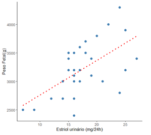
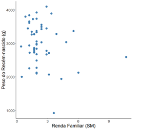
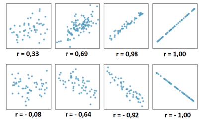

# Correlação {#sec-cor}

## Pacotes usados neste capítulo

```{r}
#| message: false
#| warning: false
pacman::p_load(flextable,
               knitr,
               readxl,
               rstatix,
               tidyverse)
```

## Introdução

A correlação é usada para avaliar a força e a direção da relação entre duas variáveis numéricas contínuas, normalmente distribuídas. A maneira mais comum de mostrar a relação entre duas variáveis quantitativas é através de um diagrama ou gráfico de dispersão (*scatterplot*). A @fig-estriol exibe um exemplo de um gráfico de dispersão, onde se observa um padrão geral que sugere uma relação entre o estriol urinário (mg/24h) e o peso fetal em uma gravidez normal [@greene1963urinary].

{#fig-estriol fig-align="center" width="11cm"}

O gráfico de dispersão mostra que os valores de uma variável aparecem no eixo horizontal `x` e os valores da outra variável aparecem no eixo vertical `y`. Cada indivíduo nos dados aparece como o ponto no gráfico fixado pelos valores de ambas as variáveis para aquele indivíduo. Normalmente, eixo *`x`* é a **variável explicativa** (ou variável explanatória ou independente) e *`y`* a **variável desfecho** (variável resposta ou dependente).

Em um diagrama de dispersão deve-se procurar o padrão geral e desvios marcantes desse padrão. Verifica-se o padrão geral, observando a direção, a forma e força do relacionamento. Um tipo importante de desvio é um valor atípico, um valor individual que está fora do padrão geral do relacionamento.

A @fig-estriol mostra uma clara direção do padrão geral que se move da esquerda inferior para a direita superior. Este comportamento é denominado de *correlação positiva* entre as variáveis. A forma do relacionamento é aproximadamente uma linha reta com uma ligeira curva para a direita à medida que se move para cima. A força de uma correlação em um gráfico de dispersão é determinada pela proximidade dos pontos em uma forma clara. No caso, quanto mais se aproxima de uma reta, mais forte é a associação, no caso de uma correlação linear. Duas variáveis estão *negativamente associadas* quando se comportam de forma oposta ao da @fig-estriol.

Obviamente, nem todos os diagramas de dispersão mostram uma direção clara que permita descrever como correlação positiva ou negativa e não tem uma forma linear, sugerindo que não há correlação, como a @fig-pesorenda.

{#fig-pesorenda fig-align="center" width="11cm"}

## Coeficiente de correlação de Pearson {#sec-coef}

A correlação é quantificada pelo *Coeficiente de Correlação Linear de Pearson*. Este coeficiente paramétrico, denotado por *r*, é um número adimensional, independente das unidades usadas para medir as variáveis *x* e *y*.

Suponha que se tenha dados sobre as variáveis *x* e *y* para *n* indivíduos. Os valores para o primeiro indivíduo são ${x}_{1}$ e ${y}_{1}$, os valores para o segundo indivíduo são ${x}_{2}$ e ${y}_{2}$ e assim por diante. As médias e desvios padrão das duas variáveis são $\bar{x}$ e ${s}_{x}$ para os valores de *x* e $\bar{y}$ e ${s}_{y}$ para os valores de *y*. A correlação *r* entre *x* e *y* é dada pela equação:

$$r = \frac{\sum{(x_{1} - \bar{x})(y_{1} - \bar{y})}}{{\sqrt{\sum (x_{1} - \bar{x})^2\times\sum (y_{1} - \bar{y})^2}}}$$

O Coeficiente de Correlação, *r*, apresenta as seguintes características:

- É um valor numérico que varia de -1 a +1 (@fig-coefcor):

  - Quando *r* = -1, há uma correlação linear negativa ou inversa perfeita;
  - Quando *r* = +1, há uma correlação linear positiva ou direta perfeita;
  - Quando *r* = 0, não há correlação entre as variáveis.

{#fig-coefcor fig-align="center" width="15cm"}

- Quanto mais os pontos se aproximam de uma linha reta, maior a magnitude de *r*.

- O coeficiente de correlação *r* é calculado para uma amostra e é uma estimativa do coeficiente de correlação da população $\rho$ (leia-se rô).

- A correlação não faz distinção entre variáveis explicativas e variáveis resposta. Apesar de haver uma recomendação para que *x* seja a variável explanatória e *y* a variável desfecho. Não faz diferença qual variável será chamada de *x* e qual de *y* no cálculo da correlação.

- Como *r* usa os valores padronizados das observações, *r* não muda se as unidades de medida de *x*, *y* ou ambos são modificados. A correlação *r* em si não tem unidade de medida; é apenas um número.

## Dados usados no exemplo {#sec-execor}

::: callout-tip
## Cenário

Está bem definido que existe uma relação entre a idade de crianças e a sua altura (comprimento). Os dados de 40 crianças com idade entre 18 e 36 meses (20 meninos e 20 meninas) foram coletados em um ambulatório pediátrico. A idade foi registrada em meses e o comprimento em centímetros.
:::

Os dados estão em `dadosReg.xlsx` que pode ser obtido [**aqui**](https://github.com/petronioliveira/Arquivos/blob/main/dadosReg.xlsx). Baixe e salve o arquivo no seu diretório de trabalho.

### Leitura e exploração dos dados

A função `read_excel` do pacote `readxl` será usada para carregar o arquivo. Observar os dados com a função `str()`.

```{r}
dados <- read_excel("dados/dadosReg.xlsx")
str(dados)
```

De acordo com uma das exigências da correlação, as variáveis `idade` e `comp` pertencem a classe das variáveis numéricas. Essas variáveis são as únicas que serão usadas para a correlação. A pergunta a ser respondida é: o comprimento depende da idade? Ou seja, Y em função de X.\
As demais, serão removidas, usando a função `select()` do pacote `dplyr`, tornando o conjunto de dados mais limpo:

```{r}
dados<- dados |> 
  dplyr::select(-id, -irmaos, -sexo)
```

Após esta pequena manipulação, será feita a sumarização dos dados.

### Sumarização e visualização dos dados

Esta ação será realizada com a função `get_summary_stats ()` do pacote `rstatix` que necessita dos seguintes argumentos:

```{r}
dados |>
  rstatix::get_summary_stats(idade,
                             comp,
                             type = "mean_sd")
```

Para visualizar os dados, será usado o gráfico de dispersão (@fig-idadecomp), usando a função `geom_point()` do pacote `ggplot2`:

```{r}
#| label: fig-idadecomp
#| echo: false
#| message: false
#| warning: false
#| out-width: "70%"
#| out-height: "70%"
#| fig-align: "center"
#| fig-cap: "Gráfico de dispersão do 'Comprimento vs. Idade' de crianças entre 18 e 36 meses"
ggplot2::ggplot(dados, 
                aes(x=idade, 
                    y=comp)) + 
  geom_point(size = 3, 
             shape = 21,
             fill = "tomato",
             color = "black") +
  xlab("Idade (meses)") +
  ylab ("Comprimento (cm)") +
  theme_bw() +
  theme(text = element_text(size = 12))
```

## Pressupostos da correlação {#sec-precor}

Antes de analisar os dados, é importante verificar se é apropriado usar o teste estatístico, através da veridficação dos seus pressupostos.

Serão discutidos sete pressupostos, três estão relacionados com o projeto do estudo e como as variáveis foram medidas (pressupostos 1, 2 e 3) e quatro que se relacionam com as características dos dados (pressupostos 4, 5, 6 e 7) [@kassambara2021correlation].

1.  [Variáveis numéricas contínuas]{.underline}

As duas variáveis devem ser medidas em uma escala contínua (são medidas no nível intervalar ou de razão). No exemplo, tanto a variável `idade` como o comprimento (`comp`) são variáveis contínuas.

2.  [Variáveis devem estar como pares]{.underline}

As duas variáveis contínuas devem ser emparelhadas, o que significa que cada caso (por exemplo, cada participante) tem dois valores: um para cada variável.

3.  [Independência das observações]{.underline}

Deve haver independência de casos, o que significa que as duas observações para um caso (por exemplo, a idade e o comprimento) devem ser independentes das duas observações para qualquer outro caso.

Se estes pressupostos forem atendidos, avalia-se os outros pressupostos:

4.  [Relação linear entre as variáveis]{.underline}

O coeficiente de correlação de Pearson é uma medida da força de uma associação linear entre duas variáveis. Dito de outra forma, ele determina se há um componente linear de associação entre duas variáveis contínuas. Por esse motivo, verifica-se a relação entre duas variáveis, em um gráfico de dispersão, para ver se a execução de uma correlação de Pearson é a melhor escolha como medida de associação.

A variável `idade` é colocada como variável preditora (eixo *x*) e `comp` como desfecho (eixo *y*). O gráfico de dispersão (@fig-idadecomp), mostra uma nítida correlação linear.

5.  [Normalidade das variáveis]{.underline}

Para verificar se as variáveis têm distribuição normal, é possível usar o teste de Shapiro-Wilk, usando a função `shapiro_test()`, incluída no pacote `rstatix`:

```{r}
dados  |>  shapiro_test(idade, comp)
```

O teste de Shapiro-Wilk de ambas as variáveis retorna um valor p\> 0,05, indicando que não é possível rejeitar a $H_{0}$; os dados seguem a distribuição normal, portanto o pressuposto foi atendido.

6.  [Pesquisa de valores atípicos]{.underline}

A identificação dos valores atípicos pode ser feita usando a função `identify_outliers()` do pacote `rstatix`.

```{r}
 dados |> identify_outliers(idade)
 dados |> identify_outliers(comp)
```

7.  [Homoscedasticidade]{.underline}

Rigorosamente, o conceito formal de homocedasticidade (variância constante dos erros) pertence ao universo da regressão e não ao da correlação.

No entanto, para que o coeficiente de correlação de Pearson seja perfeitamente válido e confiável, as variáveis precisam apresentar homocedasticidade bivariada. Na correlação, isso é avaliado diretamente nos dados brutos.

Isso se faz de forma visual, analisando o próprio gráfico de dispersão das variáveis originais (@fig-idadecomp).

O que procurar no gráfico:

- O padrão ideal (Homocedasticidade): A dispersão dos pontos (a "largura" ou "gordura" da nuvem de pontos) deve ser aproximadamente constante ao longo de todo o eixo X. Olhando gráfico de Comprimento vs. Idade (@fig-idadecomp), a variabilidade dos pontos em 20 meses é visualmente muito parecida com a variabilidade em 30 ou 35 meses. Os pontos seguem uma "banda" de largura constante.

- O problema (Heterocedasticidade): Se os pontos formassem um desenho de cone ou funil (por exemplo, super compactados em 20 meses e abrindo um leque enorme de variação em 35 meses), haveria heterocedasticidade.

A análise da constância da variância é feita observando diretamente o comportamento das variáveis originais juntas (dados brutos). Isto se deve ao fato de que, na correlação pura, não existe uma variável que "prevê" a outra, não há uma linha de tendência formal para gerar resíduos (erros).\
Se por acaso for notado um formato de funil muito evidente, o caminho costuma ser aplicar uma transformação nos dados brutos (como logaritmo) ou partir para uma correlação não-paramétrica (como Spearman ou Kendall).

## Execução do teste de correlação

### Coeficiente de correlação de Pearson (*r*)

O coeficiente de correlação, *r*, é calculado para uma amostra e é uma estimativa do coeficiente de correlação da população $\rho$ (rô).\
Como visto, no início deste capítulo, a correlação não faz distinção entre variáveis explicativas e variáveis resposta. Apesar de haver uma recomendação para que *x* seja a variável explanatória e *y* a variável desfecho. Não faz diferença qual variável será chamada de *x* e qual de *y* no cálculo da correlação.\
Como o *r* usa os valores padronizados das observações, não muda nada se as unidades de medida de *x*, *y* ou ambas são modificadas. A correlação *r* em si não tem unidade de medida; é apenas um número.

O cálculo pode ser realizado com a função `cor_test()` do pacote `rstatix` que usa os seguintes argumentos:

- **data** $\to$ dataframe contendo as variáveis;
- **...** $\to$ Uma ou mais expressões (ou nomes de variáveis) sem aspas separadas por vírgulas. Usado para selecionar uma variável de interesse. Alternativa ao argumento `vars`. Ignorado quando `vars` é especificado;
- **vars2** $\to$ • vetor de caracteres opcional. Se especificado, cada elemento em vars será testado em relação a todos os elementos em vars2. Aceita nomes de variáveis sem aspas: c(var1, var2);
- **alternative** $\to$ hipótese alternativa “two.sided” (bilateral) ou “greater” ou “less” (unilateral a direita ou a esquerda, respectivamente);
- **method** $\to$ ⟶ qual coeficiente de correlação deve ser usado para o teste. Um dos termos "pearson", "kendall" ou "spearman" pode ser abreviado;
- **conf.level** $\to$ nivel de confiança. Padrão 0.95.

```{r}
r <- dados |> cor_test(idade, 
                         comp, 
                         method = "pearson")
r
```

A saída do Coeficiente de Correlação de Pearson (*r*) é igual `r round(r$cor, 2)` (IC95%: `r round(c(r$conf.low, r$conf.high), 2)`) o que corresponde a uma correlação linear muito forte (@tbl-coefr) entre a idade e o comprimento de crianças [@schober2018correlation].

O coeficiente refere a existência de correlação linear, mas não especifica se a relação é de causa e efeito. O valor *p* especifica se a correlação é igual a zero ($H_{0}$) ou diferente de zero ($H_{1}$). No caso, ela é diferente de zero.

O importante é a magnitude do *r*, entretanto, o coeficiente *r* e o valor *p* devem ser interpretados em conjunto. Se o valor *p* \> 0,05, mesmo que *r* seja diferente de zero, a correlação não deveria ser interpretada.

```{r}
#| label: tbl-coefr
#| tbl-cap: "Interpretação do Coeficiente de Correlação"
#| echo: FALSE
#| message: FALSE
#| warning: FALSE

res = c("0,0 < 0,3", "0,3 < 0,5", "0,5 < 0,7", "0,7 < 0,9", "0,9 < 1,0", "1,0")
int = c("desprezável","fraca","moderada", "forte", "muito forte", "perfeita")

df <- data.frame(res, int)

minha_tab <- flextable(df) |>
  set_header_labels(
    res = "Coeficiente de Correlação (r)",
    int = "Interpretação") |>
  autofit() |>
  theme_booktabs() |>
  width(j = 1, width = 1.5) |>
  width(j = 2, width = 1.5) |>
  align(align = "left", part = "header") |>
  align(align = "left", part = "body") |>
  bold(part = "header") 

minha_tab
```

Talvez a melhor maneira de interpretar a correlação linear é elevar o valor do *r* ao quadrado para obter o *Coeficiente de Determinação* ($R^{2}$). No exemplo usado, tem-se que o $R^{2}$ é igual a $0,96^{2} = 0,922$, então, 92,2% da variação do comprimento da criança (*y*) podem ser explicados, nesses dados, pela variação da sua idade (*x*), fato mais ou menos óbvio!.

### Coeficiente de correlação de Spearman ($\rho$)

Se os pressupostos são violados é recomendado o uso de correlação não paramétrica (veja a @sec-distlivre), incluindo testes de correlação baseados em postos (veja a @sec-postos) de Spearman e Kendall [@de2016comparing].\
Para calcular o coeficiente, usar a mesma função da correlação de Pearson, mudando o argumento `method`:

```{r}
#| message: false
#| warning: false
rho <- dados |> cor_test(idade, 
                           comp, 
                           method = "spearman")
rho
```

### Coeficiente de correlação de Kendall ($\tau$)

O coeficiente de correlação de postos de Kendall ou estatística tau de Kendall é usado para estimar uma medida de associação baseada em postos. Pode ser usado com variáveis ordinais ou quando não existe relação linear entre as variáveis. Uma vantagem sobre o coeficiente de Spearman é a possibilidade de ser generalizado para um coeficiente de correlação parcial. Deve ser usada ao invés do coeficiente de Spearman quando se tem um conjunto pequeno de dados com um grande número de postos empatados (veja a @sec-postos). Para o cálculo desse coeficiente, continua-se com a mesma função anterior, mudando o `method = “kendall”`.

```{r}
#| message: false
#| warning: false
tau <- dados |> cor_test(idade, 
                           comp, 
                           method = "kendall")
tau
```

No caso normal, a correlação de Kendall é mais robusta e eficiente que a correlação de Spearman. Isso significa que a correlação de Kendall é preferida quando há amostras pequenas ou alguns valores atípicos. O rho de Spearman geralmente é maior que o tau de Kendall.
