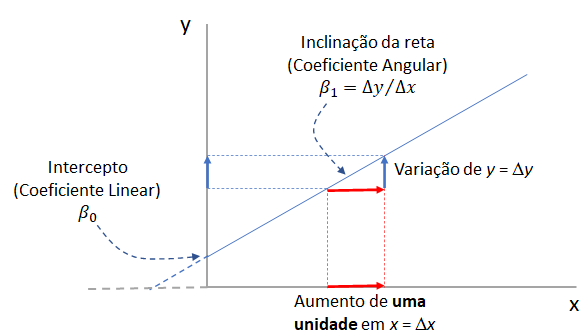

# Regressão Linear Simples {#sec-rls}

## Pacotes usados neste capítulo

```{r}
#| message: false
#| warning: false
pacman::p_load(car,
               flextable,
               ggpubr,
               knitr,
               lmtest,
               readxl,
               rstatix,
               tidyverse)
```

## Introdução

A *regressão linear simples*, assim como a correlação, é uma técnica usada para explorar a natureza da relação entre duas variáveis aleatórias contínuas. A principal diferença entre esses dois métodos analíticos é que a regressão permite investigar a alteração em uma variável, chamada *resposta*, correspondente a uma determinada alteração em outra, conhecida como variável *explicativa*. A regressão é um modelo matemático que permite a *predição* de uma variável resposta a partir de uma outra variável explicativa. A análise de correlação quantifica a força da relação entre as variáveis, tratando-as simetricamente [@sedgwick2013correlation].

A *regressão linear simples* é chamada assim, porque existe apenas uma variável independente. Se houver mais de uma variável independente, é chamada de *regressão múltipla*.

A representação matemática do modelo de regressão linear populacional é descrita pela equação da reta de melhor ajuste em um conjunto de pares de dados (x, y) em um gráfico de dispersão de pontos.

$$y = \beta_{0} + \beta_{1}x$$

{#fig-retareg fig-align="center" width="14cm"}

A inclinação da reta de regressão ($\beta_{1}$) determina a variação de *y* para cada unidade de variação de *x* e recebe o nome de *coeficiente angular* ou *de regressão*. O ponto de interceptação da reta com *y* quando *x* é igual a zero é $\beta_{0}$ e é denominado de *coeficiente linear* (@fig-retareg). A equação da reta de regressão amostral que estima a reta de regressão populacional é igual a:

$$\hat {y} = b_{0} + b_{1}x$$

A reta do diagrama de dispersão da @fig-retareg é a melhor reta de ajuste aos dados.

## Dados usados no exemplo

Serão usados os mesmos dados do exemplo da Correlação (@sec-execor). A função `read_excel` do pacote `readxl` carregará o arquivo.

```{r}
dados <- read_excel("dados/dadosReg.xlsx") |> 
  select(idade, comp)
str(dados)
```

Para revisar as estatísticas descritivas do conjunto de dados, será executado o seguinte código:

```{r}
dados |> 
  rstatix::get_summary_stats(idade,
                             comp,
                             type = "mean_sd")
```

## Resíduos {#sec-residuos}

No exemplo usado na correlação (@sec-execor), verificou-se que existe uma correlação linear entre a idade e o comprimento de crianças, usando uma amostra de 40 crianças entre 18 e 36 meses. A correlação de Pearson foi muito forte (*r* = 0,96, *p* \< 0,00001). Esta relação linear pode ser descrita pela reta, mostrada na @fig-retareg1.

```{r}
#| label: fig-retareg1
#| message: false
#| warning: false
#| out-height: "70%"
#| out-width: "70%"
#| fig-align: "center"
#| fig-cap: "Reta de regressão"

ggplot2::ggplot(dados, 
                aes(x = idade, 
                    y = comp,
                    color = "tomato")) +
  geom_smooth(method = "lm", 
              se = FALSE, 
              color = "steelblue") +
  geom_point(size = 3.5) +
  theme_classic() + 
  xlab("Idade (meses)") +
  ylab("Comprimento (cm)") +
  theme(text = element_text(size = 12)) +
  theme(legend.position = "none")
```

Não é possível traçar uma reta que passe por todos os pontos. Esta reta ideal descreveria uma correlação perfeita, que não é o caso. Pode haver várias retas, a reta calculada pela regressão linear é aquela que promove o melhor ajuste, ou seja, é aquela cuja distância dos pontos até a reta é a menor possível.

Os resíduos são a diferença entre o valor observado e o valor previsto pelo modelo de regressão linear, construído anteriormente (`mod_reg`). A técnica estatística para achar a melhor reta que ajusta um conjunto de dados é denominada de **método dos mínimos quadrados** (*Ordinary Least Square*). A melhor reta ajustada é aquela em que a soma dos quadrados da distância de cada ponto (**soma dos quadrados residual**) em relação à reta é minimizada.

Para se obter os resíduos, ajusta-se um modelo de regressão, usando a função `lm()`[^18-regressao-1], nativa do R:

[^18-regressao-1]: lm = linear model

```{r}
mod_reg <- lm(comp ~ idade, data = dados)
```

O modelo fornece uma série de variáveis que podem ser visualizadas com:

```{r}
ls(mod_reg)
```

Assim, as variáveis `residuos` e `preditos` podem ser criadas no dataframe `dados` da seguinte maneira:

```{r}
dados$residuos <- residuals(mod_reg)

dados$preditos <- predict(mod_reg) 
```

Usando essas variáveis, pode-se criar o gráfico da @fig-residuos que mostra os resíduos do modelo:

```{r}
#| label: fig-residuos
#| message: false
#| warning: false
#| out-height: "70%"
#| out-width: "70%"
#| fig-align: "center"
#| fig-cap: "Resíduos do Modelo de Regressão Linear"

ggplot2::ggplot(dados, 
                aes(x = idade, 
                    y = comp,
                    color = "tomato")) +
  geom_smooth(method = "lm", 
              se = FALSE, 
              color = "steelblue") +
  geom_segment(aes(xend = idade, 
                   yend = preditos), 
               linewidth = 0.8,
               linetype = "dotted") +
  geom_point(aes(y = preditos), 
             shape = 19,
             size = 3,
             colour = "steelblue") +
  geom_point(size = 3) +
  theme_classic() + 
  xlab("Idade (meses)") +
  ylab("Comprimento (cm)") +
  theme(text = element_text(size = 12)) +
  theme(legend.position = "none")
```

Uma boa maneira de testar a qualidade do ajuste do modelo é observar os resíduos [@kim2019statistical] ou as diferenças entre os valores reais (pontos vermelhos) e os valores previstos (pontos azuis). A reta de regressão, em azul no gráfico, representa os valores previstos. A linha vertical pontilhada da linha reta até o valor dos dados observados é o **resíduo**.

A ideia aqui é que a soma dos resíduos seja aproximadamente zero ou o mais baixo possível. Na vida real, a maioria dos casos não seguirá uma linha perfeitamente reta, portanto, resíduos são esperados. Na saída do resumo da função `lm()` em (`mod_reg$residuals`) aparecem estatísticas descritivas sobre os resíduos do modelo (*residuals*), elas mostram como os resíduos são aproximadamente zero. Pode-se observar isso, usando a função `summary ()` e `sum()`:

```{r}
summary(mod_reg$residuals)
sum(mod_reg$residuals)
```

Como se observa, a soma dos resíduos é praticamente igual a zero ($-3{,}54 \times 10^{-15}$).

## Análise dos pressupostos do modelo de regressão

### Avaliação da normalidade dos resíduos

Ao analisar os pressupostos da correlação, foi realizada a avaliação da normalidade nos dados brutos. Na regressão, o foco muda quase que totalmente para os **resíduos** (os erros do modelo: $y - \hat{y}$), porque o objetivo é prever *y* a partir de *x* .

O correto é avaliar os pressupostos sobre os resíduos do modelo como um todo. Estes resíduos encontram-se, como visto, na variável `resíduos` extraída do modelo de regressão (`mod_reg`).

Dessa forma, a função `shapiro_test()` do pacote `rstatix`:

```{r}
dados |> 
  rstatix::shapiro_test(residuos)
```

Pode-se observar isso, gerando o QQ plot dos resíduos com `ggpubr::ggqqplot()`:

```{r}
#| label: fig-rlnorm
#| message: false
#| warning: false
#| fig-align: "center"
#| out-height: "70%"
#| out-width: "70%"
#| fig-cap: "Gráfico QQ para verificar a normalidade dos resíduos na RL"
ggpubr::ggqqplot(data = dados,
                 x = "residuos",
                 color = "steelblue4",
                 xlab = "Quantis normais", 
                 ylab = "Residuos",
                 ggtheme = theme_bw())
```

A saída do teste de Shapiro-Wilk mostra um valor *p* \> 0,05 e pode-se decidir que não há evidência de violação da normalidade. Fato reforçado pela @fig-rlnorm que mostra que os pontos acompanham a reta de referência.

### Pesquisa de valores atípicos nos resíduos

Uma maneira de avaliar os valores atípicos, é transformar os resíduos em resíduos padronizados e verificar a distribuição desses, sabendo que em uma amostra normalmente distribuída, ao redor de 95% dos valores estão entre –1,96 e +1,96 desvios padrão; 99% deve estar entre –2,58 e +2,58 e quase todos (99,9%) devem se situar entre –3,09 e +3,09 desvios padrão [^18-regressao-2].

[^18-regressao-2]: **Regra prática:** Resíduos além de $\pm 2$ acendem um sinal amarelo (merecem atenção) e resíduos além de $\pm 3$ são formalmente classificados como ***outliers***estatísticos (sinal vermelho).

Existe uma função denominada `rstandard()`, também nativa do R, que padroniza os resíduos do `mod_reg`. Assim, pode-se criar uma variável no conjunto `dados` com esses resíduos padronizados e fazer um sumário, usando a função `summary()`. Esta função exibirá a estatística dos 5 números mais a média para os resíduos padronizados:

```{r}
dados$residuos_p <- rstandard(mod_reg)
summary(dados$residuos_p)
```

A saída mostra que não há resíduos padronizados com um valor absoluto maior que 3. Acima deste valor existe motivo de preocupação porque em uma amostra média é improvável que aconteça um valor tão alto por acaso [@field2012regression].

#### Distância de Cook

Olhar apenas para o resíduo padronizado mede o quão distante o ponto está da reta na vertical (*y*). Mas na regressão linear, um *outlier* perigoso é aquele que tem o poder de **distorcer a reta**. Por isso, é interessante avaliar métricas complementares como a **distância de Cook**. Ela avalia o quanto a sua reta de regressão mudaria se aquele ponto específico fosse deletado.\
Pontos com Distância de Cook maiores que 1 (ou maiores que $4/n$, onde $n$ é o tamanho da amostra) são considerados pontos de alta influência. Mesmo que o resíduo padronizado não seja gigante, se ele altera a reta, ele é um `outlier` problemático.

A distância de Cook pode ser obtida pela função `cooks.distance()` com o modelo de regressão:

```{r}
dados$d_cook <- cooks.distance(mod_reg)

summary(dados$d_cook)
```

```{r}
n = nrow(dados)
limite <- 4/n
limite
```

A saída do sumário mostra que não existem valores de distância de Cook superiores ao limite definido. Isso pode ser observado na @fig-cook.

```{r}
#| label: fig-cook
#| message: false
#| warning: false
#| fig-align: "center"
#| out-height: "70%"
#| out-width: "70%"
#| fig-cap: "Gráfico Diagnóstico: Resíduos padronizados vs. Alavancagem"

dados$alavancagem <- hatvalues(mod_reg)

# 1. Número de parâmetros(intercepto + inclinação)
k <- 2 # Número de parâmetros 

# 2. Criar a função matemática correta baseada no limite dos dados
cook_limite <- function(leverage, cook_d, k_param = k) {
  # Adiciona um tratamento para evitar divisão por zero
  ifelse(leverage <= 0, NA, sqrt((cook_d * k_param * (1 - leverage)) / leverage))
}

# 3. Gerar o grid focando na escala real da sua alavancagem (de 0 a 0.10)
grid_cook <- data.frame(alavancagem = seq(0.001, max(dados$alavancagem) * 1.1, length.out = 200)) |> 
  mutate(
    cook_05_pos = cook_limite(alavancagem, 0.5),
    cook_05_neg = -cook_limite(alavancagem, 0.5)
  )

# 4. Montar o gráfico definitivo
dados |>  
  ggplot(aes(x = alavancagem, y = residuos_p)) + 
  
  # Linhas da Distância de Cook
  geom_line(data = grid_cook, aes(y = cook_05_pos), linetype = "dotted", color = "red", na.rm = TRUE) +
  geom_line(data = grid_cook, aes(y = cook_05_neg), linetype = "dotted", color = "red", na.rm = TRUE) +
  
  # Texto indicador ajustado para os dados
  annotate("text", 
           x = max(dados$alavancagem), 
           y = cook_limite(max(dados$alavancagem), 0.5) + 0.4, # Linha + uma folguinha para cima
           label = "Cook's d = 0.5", 
           color = "red", 
           size = 3, 
           hjust = 1) +
  
  # Dados e a curva loess
  geom_point(size = 3) + 
  geom_smooth(method = "loess", se = FALSE, color = "steelblue") +
  geom_hline(yintercept = 0, linetype = 'dashed', col = 'red') +
  
  # Zoom sem quebrar o cálculo das linhas
  coord_cartesian(ylim = c(-4, 4)) + 
  
  # Ajuste fino das quebras do eixo Y para melhor a estética visual
  scale_y_continuous(breaks = seq(-5, 5, by = 1)) +
  
  labs(x = "alavancagem", y = "residuos_p") +
  theme_bw()
```

Resumindo:

- Ausência de pontos influentes: A linha vermelha de Cook está lá no topo, isolada, e nenhum ponto sequer ameaça chegar perto dela.

- Linearidade bem resolvida: A linha azul na @fig-cook oscila muito timidamente bem próxima da linha vermelha tracejada do zero, mostrando que não há desvios sistemáticos.

- Boa distribuição: A grande massa de dados tem resíduos padronizados confortavelmente situados entre -2 e 2.

### Homocedasticidade dos resíduos {#sec-BP}

Na regressão linear simples, a análise da homocedasticidade significa verificar se a variabilidade dos resíduos (erros) permanece constante ao longo de todos os valores previstos pelo modelo. Em termos simples: o modelo não pode ser mais preciso em uma idade e essencialmente um palpite em outra.

Para fazer essa análise de forma robusta na prática, você deve combinar a análise visual (a mais importante e recomendada) com um teste estatístico formal.

A melhor forma de diagnosticar a homocedasticidade é gerando os gráficos baseados nos resíduos do modelo. Plotar os **Resíduos Padronizados** versus **Valores Ajustados** (Fitted Values), variável `preditos` no conjunto `dados`.

```{r}
#| label: fig-homo
#| message: false
#| warning: false
#| fig-align: "center"
#| out-height: "70%"
#| out-width: "70%"
#| fig-cap: "Gráfico Diagnóstico: Resíduos padronizados vs. Valores Ajustados"
dados |> 
  ggplot(aes(x = preditos, y = residuos_p)) +
  geom_point(size = 3) +
  geom_smooth(method = "loess", se = FALSE, color = "steelblue") +
  geom_hline(yintercept = 0, linetype = "dashed", color = "red") +
  labs(x = "Valores Preditos (Comprimento Estimado)", 
       y = "Resíduos Padronizados") +
  theme_bw()
```

Como interpretar o gráfico?

- [Cenário Ideal (Homocedasticidade)]{.underline}: Os pontos pretos devem estar espalhados de forma aleatória e uniforme acima e abaixo da linha horizontal vermelha (@fig-homo), formando uma "banda" ou "retângulo" de largura constante. A linha azul deve ficar o mais reta e horizontal possível perto do zero (@fig-homo).

- [Problema (Heterocedasticidade)]{.underline}: Se a dispersão dos pontos começar bem estreita de um lado e abrir como um funil, cone ou megafone à medida que os valores preditos aumentam, a homocedasticidade foi violada.

Concluindo a avaliação visual:

- [Dispersão em Banda Uniforme]{.underline}: A "nuvem" de pontos pretos está distribuída de forma homogênea e retangular ao longo de todo o eixo *x* (desde os valores estimados de 80 cm até 100 cm). Não há nenhuma evidência daquele formato clássico de "funil", "megafone" ou "cone" que denunciaria a heterocedasticidade.

- [Amplitude Constante]{.underline}: A variabilidade vertical dos pontos (no eixo *y*) se mantém quase idêntica do início ao fim do gráfico, flutuando estavelmente dentro do intervalo seguro de $-2$ a $+2$ desvios-padrão.

- [Linha de Tendência Estável]{.underline}: A linha azul oscila de forma muito sutil e comportada em torno da linha tracejada vermelha do zero. Essa leve oscilação é perfeitamente normal e esperada devido à flutuação de pequenas amostras, não indicando nenhum desvio sistemático de variância ou falta de linearidade.

Completando a avaliação visual, o teste estatístico mais amplamente utilizado para regressão linear é o **Teste de Breusch-Pagan**. Esse teste não é nativo do R, mas está presente no pacote `lmtest` [@hothorn2015lmtest]:

```{r}
lmtest::bptest(mod_reg)
```

A homocedasticidade do modelo foi avaliada visualmente por meio do gráfico de dispersão dos resíduos padronizados versus os valores preditos, mostrando uma distribuição uniforme da variância. O pressuposto foi confirmado formalmente pelo teste de Breusch-Pagan ($\chi^2 = \text{0.049988}$, $p > 0,05$).

### Independência dos resíduos {#sec-dw}

Os resíduos no modelo devem ser independentes, ou seja, não devem ser correlacionados entre si. Para verificar isso, pode-se executar o *teste Durbin-Watson* - `teste dw` [@durbin1950testing], utilizando a função `car::durbinWatsonTest()` do pacote `car`. O teste retorna um valor entre 0 e 4. Um valor maior que 2 indica uma correlação negativa entre resíduos adjacentes, enquanto um valor menor que 2 indica uma correlação positiva. Se o valor for dois, é provável que exista independência. Existe uma sugestão de que valores abaixo de 1 ou mais de 3 são um motivo definitivo de preocupação [@field2012regression]. É importante mencionar que o teste tem como pressuposto a normalidade dos dados.

```{r}
car::durbinWatsonTest(mod_reg)
```

Na saída do teste o valor *p* \> 0,05 e a estatística DW é igual a 2,2, não se rejeita a hipótese nula de independência (rho = 0).

## Tamanho amostral na regressão

O tamanho da amostra deve ser suficiente para suportar o modelo de regressão. É importante coletar dados suficientes para obter um modelo de regressão confiável. O tamanho da amostra necessário para suportar um modelo depende do valor do coeficiente de correlação do modelo (no caso da correlação linear simples é o *r* de Pearson) e do número de variáveis incluídas.

A @tbl-samplesize mostra o número de participantes necessários em modelos com 1 a 4 preditores independentes. Como se observa, o requisito de tamanho da amostra aumenta com o número de variáveis preditoras [@peat2014regression].

```{r}
#| label: tbl-samplesize
#| tbl-cap: "Tamanho amostral para regressão de acordo com o r de Pearson e o número de preditores"
#| echo: FALSE
#| message: FALSE
#| warning: FALSE

r_pearson <-c(0.2, 0.3,0.4)
uma <- c(190, 80, 45)
duas <- c(230, 100, 55)
tres <- c(265, 115, 65)
quatro <- c(290, 125, 70)

df <- data.frame(r_pearson, uma, duas, tres, quatro)

minha_tab <- flextable(df) |>
  set_header_labels(
    r_pearson = "r de Pearson",
    uma = "Uma",
    duas = "Duas",
    tres = "Três",
    quatro = "Quatro") |>
  autofit() |>
  add_header_row(values = c("", "Número de Variáveis Preditoras"),
                 colwidths = c(1, 4)) |> 
  theme_booktabs() |>
  width(j = 1, width = 1.5) |>
  width(j = 2:4, width = 1.5) |>
  align(align = "center", part = "header") |>
  align(align = "center", part = "body") |>
  bold(part = "header") 

minha_tab
```

Existem muitas regras práticas, sugerindo o tamanho da amostra. Uma delas, diz que se deve ter 10 a 15 casos por variável preditora no modelo. Entretanto, essas regras podem ser duvidosas e o melhor é calcular o tamanho amostral baseado no tamanho do efeito, usando, por exemplo o site [*StatToDo*](https://www.statstodo.com/SSizMulReg.php) ou com o software *GPower* 3.1.9.7 [@faul2007g].

## Interpretação do modelo de regressão linear simples

O modelo linear já foi realizado (@sec-residuos) e será repetido aqui para facilitar a visualização. A função `summary()` imprime o resumo do modelo:

```{r}
mod_reg <- lm (comp ~ idade, dados)
summary (mod_reg)
```

A saída da função `summary()`, primeiro apresenta como o modelo foi obtido e, em seguida, resume os resíduos do modelo. Por último, tem-se os `Coeficientes`:

1.  As estimativas (*Estimate*) para os parâmetros do modelo - o valor do intercepto *y* (neste caso, 61,44) e o efeito estimado da idade sobre o comprimento (1,1)- significam que para cada unidade de aumento na idade se espera um aumento de 1,1 cm no comprimento.
2.  O erro padrão dos valores estimados (*Std. Error*).
3.  A estatística de teste (*t value*)
4.  O valor *P* (Pr (\>\| t \|)), também conhecido como a probabilidade de encontrar a estatística *t* fornecida se a hipótese nula de nenhuma correlação for verdadeira.\
5.  As três linhas finais são os diagnósticos do modelo - o mais importante a observar é o valor *p* ($2,2\times 10^{-16}$), que indica se o modelo se ajusta bem aos dados.

A partir desses resultados, pode-se dizer que existe uma correlação positiva significativa entre idade e comprimento (valor P \< 0,001), com um aumento de 1,1 cm no comprimento para cada aumento de 1 mês na idade , possibilitando a previsão do comprimento da criança conhecendo a idade.

Estes dados são empregados para formular a equação do modelo de regressão da seguinte maneira:

$$\hat {y} = 61,44 + 1,1 x$$

O erro padrão das estimativas são fornecidos. Esses dados permitem calcular o IC95%. Ou pode-se usar a função `confint()` do pacote `stats`, que será colocada dentro da função `round()` para arredondar os valores até um dígito.

```{r}
round (confint (mod_reg, level = 0.95), 1)
```

Dessa forma, é possível prever que uma criança de 30 meses, de acordo com o modelo, terá o seguinte comprimento:

```{r}
comp_30m <- 61.4 + 1.1 * 30
comp_30m

```

```{r}
lim.sup <- 64.2 + 1.2*30
lim.inf <- 58.7 + 1.0*30
print (c(lim.inf, lim.sup))
```

Ou seja, espera-se que uma criança tenha, aos 30 meses de idade, um comprimento médio de 94,4 cm (IC95%: 88,7-100,2)

## Visualização dos resultados

Será obtido um gráfico de dispersão com a reta de regressão e seu intervalo de confiança de 95% (@fig-resreg). Além disso, adicionou-se a equação do modelo[^18-regressao-3] de regressão (o R arredondou os valores), juntamente com o coeficiente de determinação $R^{2}$.

[^18-regressao-3]: Usou a função `stat_regline_equation()` do pacote `ggpubr`.

```{r}
#| label: fig-resreg
#| message: false
#| warning: false
#| out-height: "70%"
#| out-width: "70%"
#| fig-align: "center"
#| fig-cap: "Resultado da Regressão Linear"

ggplot (dados, aes (x = idade, y = comp)) +
  geom_point (size = 3) +
  geom_smooth (method = "lm", se = TRUE, color = "tomato") +
  stat_regline_equation(label.y = 100, aes(label = after_stat(eq.label))) +
  stat_regline_equation(label.y = 99,  aes(label = after_stat(rr.label))) +
  theme_classic () +
  xlab ("Idade (meses)") +
  ylab ("Comprimento(cm)") +
  theme (text = element_text (size = 12))
```

No gráfico, o intervalo de previsão médio de 95% em torno da reta de regressão é um intervalo de confiança de 95%, ou seja, a área na qual há 95% de certeza de que a reta de regressão verdadeira se encontra [@altman1988statistics]. Esta banda de intervalo é levemente curvada porque os erros na estimativa do intercepto e da inclinação são incluídos em adição ao erro na previsão da variável desfecho.

Se for observado, o IC95% da reta de regressão obtida pelo `ggplot2` difere um pouco do IC95% da função `confint()`. Isto ocorre porque:

- quando se usa `geom_smooth(method = "lm", se = TRUE)`, o intervalo de confiança gerado é baseado na incerteza da **previsão média** da regressão. Ou seja, ele mostra a faixa onde se espera que a média da variável dependente (`comp`) esteja para um determinado valor da variável independente (`idade`) e\
- quando se usa a função `confint()`, ela retorna o intervalo de confiança dos **coeficientes** do modelo de regressão. Ou seja, ela fornece a incerteza associada aos parâmetros estimados (incluindo o intercepto e os coeficientes das variáveis preditoras).

A principal diferença, portanto, é que o intervalo de confiança do `ggplot2` reflete a incerteza da linha de regressão ajustada, enquanto `confint()` fornece a incerteza dos parâmetros do modelo.
