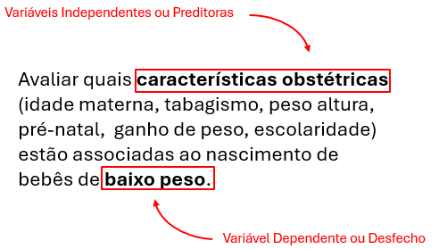
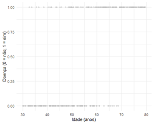
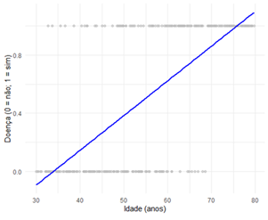
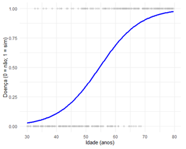
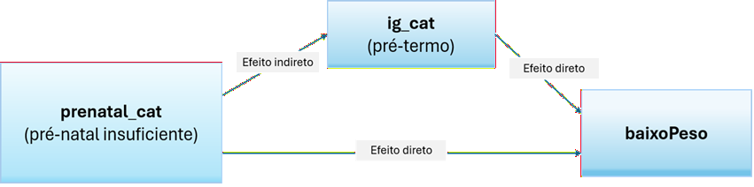

# Regressão Logística Binária

## Pacotes usados neste capítulo

Os seguintes pacotes devem estar instalados e carregados:

```{r}
if(!require("pacman")){install.packages("pacman")} 
pacman::p_load(car, 
               flextable, 
               ggrepel,
               gtsummary,
               labelled,
               performance, 
               pROC,
               rcompanion,  
               readxl, 
               sjPlot, 
               table1, 
               tidyverse)
```

## Introdução

Os dois modelos de regressão mais comuns são a regressão linear e a regressão logística. A regressão linear modela uma média e exige uma variável dependente (VD) numérica contínua; na regressão logística, a VD deve ser categórica. Em ambas, as variáveis independentes (VI) podem ser numéricas ou categóricas [^24-reglogbin-1].

[^24-reglogbin-1]: As variáveis categóricas podem entrar normalmente no modelo, desde que codificadas (ex.: variáveis *dummy*)

A **regressão logística** pode ser classificada em três tipos:

1.  **Regressão Logística Binária** – é usada quando a VD é categórica nominal dicotômica ( sim/não, morto/vivo, homem/mulher, etc.).

2.  **Regressão Logística Multinomial** – é usada quando a VD categórica tem 3 ou mais níveis (ex.: estágio do câncer, cor preferida, status de fumo, etc.).

3.  **Regressão Logística Ordinal** – é usada quando a VD tem uma ordem natural como na escala de dor (1 a 10), status de fumante (não fumante, fumante leve, fumante pesado)

## Regressão Logística Binária

A regressão logística binária (RLB) é utilizada quando o objetivo é estimar a chance de um indivíduo pertencer a uma das duas categorias possíveis (o desfecho binário, 0 ou 1), dada uma ou mais variáveis independentes ou preditoras (de qualquer tipo). Dito de outra forma, a RLB é uma abordagem classificatória que estima a relação entre uma variável dependente dicotômica e um conjunto de preditores (@fig-mod_rlb). Foi desenvolvida, em 1958, como uma extensão do modelo linear, pelo estatístico britânico David Cox [@cox1958regression]. Pertence a uma família de modelos, denominada *Modelo Linear Generalizado* (GLM) com distribuição binomial.

{#fig-mod_rlb fig-align="center" width="10cm"}

### Função Logística ou Função Logito

A regressão linear simples (RLS) estima a relação entre uma **variável dependente** **quantitativa contínua (Y)** e uma **variável explicativa contínua** **(X)**. Por exemplo, a relação entre o comprimento (Y) e a idade (X) de crianças é estimada pelo método dos *Mínimos Quadrados Ordinários* (MQO) e descrita pela equação da reta de regressão. Esta reta tenta predizer a variável resposta contínua a partir de uma variável preditora também contínua (@fig-reglinear).

$$y = \beta_0 + \beta_{1} . x_{1} + \beta_{2} . x_{2} + ... + \beta_{n} . x_{n} $$

```{r}
#| echo: false
#| out-width: "50%"
#| label: fig-reglinear
#| fig-align: 'center'
#| fig-cap: "Regressão Linear Simples" 

dados <- readxl::read_excel("dados/dadosReg.xlsx") |> 
  dplyr::select(idade, comp)

ggplot(dados, 
       aes(x = idade, y = comp)) +
  geom_point(position = position_jitter(width = 0.2, height = 0),
             shape = 19,
             alpha = 1,
             size = 2,
             stroke =1) +
  geom_smooth(method = "lm", 
              se =FALSE,
              color= "blue") +
  ylab("Comprimento (cm)") +
  xlab("Idade (meses)") +
  theme_minimal(base_size = 12) 
```

Entretanto, a probabilidade de ocorrência de uma variável resposta (variável desfecho - VD) quando ela é uma variável categórica dicotômica, variável *dummy*, 0 e 1, por exemplo, não ter doença ou ter doença (@fig-outcomebin), não consegue ser estimada, por exemplo, pela idade (variável independente - VI - contínua), usando o modelo da regressão linear.

{#fig-outcomebin fig-align="center" width="10cm"}

Se for ajustada uma reta de regressão aos pontos usando o Método dos Mínimos Quadrados (*Ordinary Least Squares*), o gráfico (@fig-fittingline) terá o aspecto onde  a reta de regressão se estende abaixo de 0 e acima de 1 em relação ao eixo Y.

{#fig-fittingline fig-align="center" width="10cm"}

No entanto, a variável Y (Probabilidade de Doença) não pode assumir valores fora do limite de 0 e 1. Além disso, a variável desfecho dicotômica viola os pressupostos de normalidade e homoscedasticidade dos erros, pois segue a Distribuição de Bernoulli. Em consequência, a regressão linear não é adequada nessa situação.

A **solução** é usar a **regressão logística binária**, que lida com essas limitações, usando uma função de ligação (*link function*) que transforma a probabilidade em um valor que pode ser modelado linearmente e variar de $-\infty$ a $+\infty$. A função de ligação utilizada no modelo de regressão logística é a **Logito** (ou função logística), que resulta em uma curva em forma de 'S' chamada **curva logística** ou **curva sigmoide** (@fig-logit). Ou seja, ela tem crescimento lento quando a probabilidade é muito baixa ou muito alta e crescimento rápido no meio (em torno 0,5). Isto reflete bem muitos fenômenos reais como risco de doença e probabilidade de sobrevivência.

$$\textrm{logito}= ln\left ( \frac{p}{1 - p} \right )$$

{#fig-logit fig-align="center" width="10cm"}

O termo $\frac{p}{1-p}$ é a chance (*odds*), que representa a razão entre a probabilidade de ocorrência do evento (*p*) e a probabilidade de sua não ocorrência ($1-p$). O **logito**[^24-reglogbin-2] é o logaritmo natural (neperiano) dessa razão de probabilidades. Na regressão logística, o logito é modelado como uma função linear dos preditores, permitindo a estimação dos coeficientes ($\beta$), conhecida como **função de ligação** (*link function*) que especifica a ligação entre o componente aleatório (distribuição binomial) e o componente sistemático (combinação linear das variáveis independentes) do modelo GLM [@agresti2015foundations]:

[^24-reglogbin-2]: Também conhecido como `log(odds)` ou `logito(p)`.

$$ln\left ( \frac{p}{1 - p} \right )=\beta_0 + \beta_{1} . x_{1} + \beta_{2} . x_{2} + ... + \beta_{n} . x_{n}$$

Através de manipulação algébrica, podemos isolar *p* para obter a probabilidade do evento Y=1 (sucesso) diretamente, garantindo que o valor final sempre esteja entre 0 e 1. 

Iniciando com o logito, denotando-o por $\eta$ [^24-reglogbin-3]:

[^24-reglogbin-3]: Na regressão linear: $\eta = \mu$, pois $\eta$ é o previsor linear. Em termos de odds $\eta=log(odds)$, ou seja, $odds=e^{\eta}$.

$$ln\left ( \frac{p}{1 - p} \right )=\eta$$

onde $\eta$ é uma combinação linear dos preditores:

$$\eta=\beta_0 + \beta_{1} . x_{1} + \beta_{2} . x_{2} + ... + \beta_{n} . x_{n}$$

Eliminando o logaritmo natural (ln) aplicando exponencial nos dois termos:

$$\frac{p}{1 - p}=e^{\eta}$$

Multiplicando ambos os lados por $(1 - p)$:

$$p=e^{\eta}(1-p)$$

Distribuindo o termo da direita:

$$p=e^{\eta}-e^{\eta}p$$

Logo:

$$p+e^{\eta}p=e^{\eta}$$

Fatorando *p*:

$$p( 1+ e^{\eta})=e^{\eta}$$

Isolando *p*:

$$p=\frac{e^{\eta}}{1+e^{\eta}}$$

Substituindo $\eta$ pelo fator sistemático da GLM:

$$p=\frac{e^{\beta_0 + \beta_{1} . x_{1} + \beta_{2} . x_{2} + ... + \beta_{n} . x_{n}}}{1+e^{\beta_0 + \beta_{1} . x_{1} + \beta_{2} . x_{2} + ... + \beta_{n} . x_{n}}}$$

Essa equação garante que o resultado esteja sempre entre 0 e 1. A combinação linear (fator sistemático) pode assumir qualquer valor real, mas probabilidades não podem ser menores que 0 e nem maiores que 1. A função logito resolve isso:

Quando $\eta \to +\infty$, $p \to 1$; e $\eta = -\infty, p \to 0$ . Ou seja, **não importa o valor dos betas ou das variáveis**, o resultado sempre será uma probabilidade válida.

### Dados do exemplo

::: callout-note
## Contexto

O baixo peso ao nascer (BPN), definido pela Organização Mundial da Saúde (OMS) como o peso ao nascimento inferior a 2.500 gramas, permanece como um dos principais desafios globais de saúde pública. O desfecho é um determinante crítico da mortalidade neonatal e infantil, além de estar associado a repercussões negativas a longo prazo, incluindo atrasos no desenvolvimento cognitivo e maior suscetibilidade a doenças crônicas não transmissíveis na vida adulta, como hipertensão e diabetes.

Diante desse cenário, o presente exemplo tem como objetivo identificar e contrastar os fatores de risco para o baixo peso ao nascer em dois cenários analíticos distintos: na totalidade dos recém-nascidos e, especificamente, no subgrupo de nascidos a termo, utilizando dados de uma série consecutiva de partos realizados no Hospital Geral de Caxias do Sul.
:::

O banco de dados a ser utilizado é `dadosMater.xlsx` (@sec-dadosMater) que será lido com a função `read_excel()` do pacote `readxl`:

```{r}
dados <- readxl::read_excel("dados/dadosMater.xlsx")
```

#### Tratamento dos dados

Inicialmente, serão selecionadas as variáveis que serão manipuladas na análise: `id`, `idade_mae`,  `altura`, `peso`, `anos_est`, `renda`, `estado_civil`, `prenatal`, `ganho_peso`, `para`, `ig`, `tipo-parto`, `sexo` e `peso_RN_rn` que serão atribuídas a um objeto de nome `dados_mater` .  Na sequência, usando o operador `pipe` será criada a variável `baixoPeso` como um fator, onde `0 = Normal` e `1 = Evento` (peso ao nascer \< 2500g).  Juntamente, serão categorizadas outras variáveis da forma adequada para rodar a regressão logística:

```{r}
dados_mater <- dados |>
  dplyr::select (id, idade_mae, altura,  peso,  fumo,  anos_est,  
                 renda, estado_civil,  prenatal,  ganho_peso,  para, 
                 ig, tipo_parto,  sexo,  peso_rn) |>
  dplyr:: mutate(
    baixoPeso     = factor(ifelse(peso_rn < 2500, 1, 0), levels = c(0, 1)),
    fumo_cat      = factor(ifelse(fumo == 1, "Sim", "Não"), levels = c("Não", "Sim")),
    prenatal_cat  = factor(ifelse(prenatal == 2, "Insuficiente", "Adequado"), 
                          levels = c("Adequado", "Insuficiente")),
    renda_cat     = factor(ifelse(renda < 3, "<3 SM", ">=3 SM"), levels = c(">=3 SM", "<3 SM")),
    eCivil_cat    = factor(ifelse(estado_civil == 1, "Mãe solo", "Companheiro"), 
                          levels = c("Mãe solo", "Companheiro")),
    escolaridade  = factor(ifelse(anos_est < 4, "<4 anos", ">=4 anos"), levels = c(">=4 anos", "<4 anos")),
    idade_cat     = factor(ifelse(idade_mae < 20, "<20 anos", ">=20 anos"), levels = c(">=20 anos", "<20 anos")),
    estatura_cat  = factor(ifelse(altura < 1.50, "<150 cm", ">=150 cm"), levels = c(">=150 cm", "<150 cm")),
    ganhoPeso_cat = factor(ifelse(ganho_peso < 10, "<10 kg", ">=10 kg"), levels = c(">=10 kg", "<10 kg")),
    paridade      = factor(ifelse(para == 0, "Primípara", "Multípara"), levels = c("Multípara", "Primípara")),
    ig_cat        = factor(ifelse(ig < 37, "Pré-termo", "Termo"), levels = c("Termo", "Pré-termo")))

str(dados_mater)
```

### Probabilidade versus Chance (*Odds*)

A distinção entre **probabilidade** e **chance (odds)** é fundamental em estatística aplicada, especialmente em modelos como a regressão logística. Embora ambos os conceitos descrevam a possibilidade de ocorrência de um evento, eles o fazem de maneiras matemáticas diferentes e servem a propósitos distintos na modelagem (veja também @sec-probabilidades e @sec-or).

#### Probabilidade

A **probabilidade**, na definição frequentista, expressa a proporção de vezes que um evento deve ocorrer em relação ao total de possibilidades. Seu valor está sempre no intervalo \[0, 1\].

$$ \textrm{probabilidade}=p=\frac{n}{N} $$

onde *n* = número de eventos favoráveis e *N* = número total de eventos.

Usando o dataframe `dados_mater`, pode-se calcular a probabilidade de gestantes fumantes na amostra:

```{r}
tabFumo <- with(data = dados_mater, table(fumo_cat))
addmargins(tabFumo, FUN = sum)

p_fumantes <- tabFumo[2]/(tabFumo[1]+tabFumo[2])
p_fumantes
```

Ou seja, 22% das gestantes são fumantes.

#### Chance (*Odds*)

A **chance**, ou *odds*, compara a probabilidade de um evento ocorrer com a probabilidade de ele **não** ocorrer [@hosmer2013applied]. Diferentemente da probabilidade, as *odds* variam de 0 a$\infty$.

$$ 
\textit{odds}=\frac{p}{1 - p} $$

Usando o mesmo exemplo das probabilidades:

$$ 
\textit{odds(fumar)}=\frac{0,22}{1 - 0,22}=\frac{0,22}{0,78}=0,28$$

Isso significa que, para cada gestante fumante, há aproximadamente **3,6 gestantes não fumantes** (pois 1/0,28≈3,6).

Tanto a probabilidade como a *odds* descrevem o mesmo fenômeno, mas de forma diferente:

[Probabilidade]{.underline}: "22% das gestantes são fumantes".

[*Odds*]{.underline}: "A razão entre fumantes e não fumantes é 0,28".

#### Por que isto é importante?

Como visto, os modelos, como a regressão logística, não modelam diretamente a probabilidade, mas sim o **logaritmo das *odds*** [@agresti2015foundations]:

$$ln\left ( \frac{p}{1 - p} \right )=\eta$$

Isto é útil porque o logaritimo neperiano das *odds* varia de $-\infty$ a $+\infty$, como um preditor linear. Além disso, facilita a interpretação dos coeficientes, pois ao exponenciar o coeficiente [@hosmer2013applied] se obtém a **razão de chances** (*odds ratio*):

$$e^{\beta_j}= \textit{razão de chances(odds ratio)}$$

[Exemplo Aplicado]{.underline}

Suponha que, em um estudo, o coeficiente associado ao consumo de álcool seja β=0,7.

O efeito sobre as ***odds*** é:

$$e^{0,7}\approx 2,01$$

::: callout-note
## Interpretação

Pessoas que consomem álcool têm **aproximadamente o dobro da chance** de serem fumantes, comparadas às que não consomem.

Observe que isso não significa “o dobro da probabilidade”, mas sim “o dobro das *odds*”, o que é matematicamente distinto.
:::

```{r}
#| echo: false
#| label: tbl-prob-odds
#| tbl-cap: "Relação entre Probabilidade, Odds e Odds Ratio (referência: p = 0,50)."

data.frame(
  Probabilidade = c("0,10", "0,20", "0,30", "0,40", "0,50",
                    "0,60", "0,70", "0,80", "0,90"),
  Odds          = c("0,111", "0,250", "0,429", "0,667", "1,000",
                    "1,500", "2,333", "4,000", "9,000"),
  OR            = c("0,111", "0,250", "0,429", "0,667", "1,000 (referência)",
                    "1,500", "2,333", "4,000", "9,000")
) |>
  flextable::flextable() |>
  flextable::set_header_labels(
    Probabilidade = "Probabilidade",
    Odds          = "Odds",
    OR            = "Odds Ratio\n(em relação a p = 0,50)"
  ) |>
  flextable::bold(i = 5) |>
  flextable::align(align = "center", part = "all") |>
  flextable::autofit()
```

```{r}
#| echo: false
#| out-width: "70%"
#| label: fig-podds
#| fig-align: 'center'
#| fig-cap: "Gráfico da relação entre Probabilidade e Odds."

p     <- seq(0.01, 0.99, by = 0.01)
odds  <- p / (1 - p)
logit <- log(odds)

opar <- par(mfrow = c(1, 3))

# Probabilidade
plot(p, p, type = "l", lwd = 2, col = "black",
     main = "Probabilidade",
     ylab = "p", xlab = "p")
grid()

# Odds
plot(p, odds, type = "l", lwd = 2, col = "blue",
     main = "Odds = p/(1-p)",
     ylab = "Odds", xlab = "p")
grid()

# Log-Odds
plot(p, logit, type = "l", lwd = 2, col = "darkred",
     main = "Log-Odds (logit)",
     ylab = "log(p/(1-p))", xlab = "p")
grid()

par(opar)

```

### Análise exploratória e bivariada

Antes de avançar para o modelo multivariado, é importante conhecer a distribuição e as taxas brutas de baixo peso. Este trabalho será realizado pelas funções `tbl_summary()` e `add_p()` que fazem parte do pacote `gtsummary` [@daniel2021gtsummary]. A função `tbl_summary()` constrói tabelas muito elegantes e a função `add_p()` é a responsável por calcular e adicionar automaticamente uma coluna de valores *p* à tabela. São ferramentas fundamentais para a criação de resumos tipo (`"Tabela 1"`). A sintaxe básica foi projetada para ser usada com o operador `%>%` ou `|>` (pipe).

```{r}
#| echo: true
#| message: false
#| warning: false
#| label: tbl-bivariada
#| tbl-cap: "Análise bivariada de fatores de risco para baixo peso ao nascer (< 2500g)."

theme_gtsummary_language("pt")

dados_mater |>
  mutate(baixoPeso = factor(baixoPeso, levels = c(0, 1), labels = c("Não", "Sim"))) |>
  select(baixoPeso, renda_cat, eCivil_cat, escolaridade, idade_cat, estatura_cat,
         fumo_cat, paridade, prenatal_cat, ganhoPeso_cat, ig_cat) |>
  tbl_summary(
    by = baixoPeso,
    percent = "row",
    label = list(
      renda_cat    ~ "Renda Familiar",
      eCivil_cat   ~ "Estado Civil",
      escolaridade ~ "Escolaridade Materna",
      idade_cat    ~ "Idade da Mãe",
      estatura_cat ~ "Estatura Materna",
      fumo_cat     ~ "Tabagismo",
      paridade     ~ "Paridade",
      prenatal_cat ~ "Consultas Pré-natal",
      ganhoPeso_cat ~ "Ganho de Peso",
      ig_cat       ~ "Idade Gestacional"
    )
  ) |>
  add_p() |>
  modify_spanning_header(c(stat_1, stat_2) ~ "**Baixo Peso ao Nascer**") |>
  modify_header(label = "**Variável**")
```

Com base nos valores *p* da análise bivariada, recomenda-se incluir `ig_cat`, `fumo_cat`, `prenatal_cat`, `ganhoPeso_cat`, `estado_civil_cat` e `paridade`. O critério de inclusão está baseado no valor *p* \< 0,20 na análise bivariada , decisão habitual na regressão logística [@hosmer2013applied].

**Atenção importante sobre** `ig_cat`: Idade gestacional é o maior determinante individual do baixo peso — prematuro quase sempre tem baixo peso. Incluí-la no modelo geral faz sentido descritivo, mas ela pode ser um **mediador** na cadeia causal (ex.: tabagismo → prematuridade → baixo peso), não um confundidor. Por isso o contexto do documento já prevê dois modelos distintos: um com toda a amostra (incluindo `ig_cat`) e outro restrito aos nascidos a termo (onde `ig_cat` deixa de ser pertinente).

### Ajuste do modelo GLM global

O `modelo_global` será construído com a função nativa `glm()` – *generalized linear model* - usada para aplicar uma regressão logística no R. Sua funcionalidade é idêntica à função `lm()` da regressão linear. Necessita alguns argumentos:

- **formula** $\to$ objeto da classe formula. Um preditor típico tem o formato `resposta ~ preditor` em que `resposta`, na regressão logística binária, é uma variável dicotômica e o preditor pode ser uma série de variáveis numéricas ou categóricas;

- **family** $\to$ uma descrição da distribuição de erro e função de link a ser usada no modelo `glm`, pode ser uma *string* que nomeia uma função de *family*. O padrão é `family = gaussian()`. No caso da regressão logística binária, `family = binomial()` ou `family = binomial (link =”logit”)`. Para outras informações, use `help(glm)` ou `help(family)`;

- **data** $\to$ banco de dados.

Dentro dos parênteses da função `glm()`, são fornecidas informações essenciais sobre o modelo. À esquerda do `til (~)`, encontra-se a variável dependente, que deve estar codificada como 0 e 1 para que a função a interprete corretamente como binária. Após o `til (~)`, são listadas as variáveis preditoras. Quando se utiliza um ponto (`~.`), isso indica a inclusão de todas as variáveis preditoras disponíveis. Já o uso do asterisco (\*) entre duas variáveis preditoras especifica que, além dos efeitos principais, também deve ser considerado um termo de interação entre elas. No exemplo apresentado, nesta análise inicial, não será solicitada os efeitos da interação. Por fim, após a vírgula, define-se que a distribuição utilizada é a binomial. Como a função `glm` usa `logit` como link padrão para uma variável de desfecho binomial, não há necessidade de especificá-lo explicitamente no modelo [@field2012logit].

```{r}
modelo_global <- glm(
  baixoPeso ~ fumo_cat + prenatal_cat + ganhoPeso_cat + ig_cat + eCivil_cat + paridade,
  data   = dados_mater,
  family = binomial(link = "logit")
)
```

A saída da função `glm()` fornece os coeficientes, da mesma forma como na regressão linear, que estima o efeito das variáveis preditoras sobre a chance de ocorrência do desfecho (no exemplo, sucesso = 1; no modelo, ter peso \< 2500g).

Para exibir os resultados usa-se:

```{r}
summary(modelo_global)
```

Numericamente, os coeficientes de regressão logística não são facilmente interpretáveis em escala bruta, pois estão representados como `log (odds)` ou `logito` . Para tornar mais simples, inverte-se a transformação logística, exponenciando os coeficientes (`exp(coeficiente)`). Isso faz com que os coeficientes se transformem em **razões de chance** (*odds ratio*), ficando mais intuitivos facilitando a interpretação. Isso pode ser realizado via a função `tbl_regression()`:

```{r}
#| label: tbl-modelo-global
#| tbl-cap: "Razões de chance (OR) e intervalos de confiança 95% do modelo GLM ajustado para baixo peso ao nascer."

modelo_global |>
  tbl_regression(
    exponentiate = TRUE,
    label = list(
      fumo_cat      ~ "Tabagismo",
      prenatal_cat  ~ "Consultas Pré-natal",
      ganhoPeso_cat ~ "Ganho de Peso",
      ig_cat        ~ "Idade Gestacional",
      eCivil_cat    ~ "Estado Civil",
      paridade      ~ "Paridade"
    )
  ) |>
  bold_p() |>
  bold_labels()
```

Após o ajuste, três variáveis permaneceram estatisticamente significativas: **idade gestacional pré-termo** (o preditor de maior magnitude, OR = 36,6), **tabagismo** (OR = 2,09) e **consultas pré-natal insuficientes** (OR = 1,80). As variáveis `ganhoPeso_cat`, `eCivil_cat` e `paridade`, embora selecionadas pela análise bivariada (*p* \< 0,20), perderam significância no modelo ajustado, sugerindo que seus efeitos observados na bivariada eram mediados ou confundidos pelas demais variáveis. Um modelo reduzido, contendo apenas as três variáveis significativas, é recomendado para a etapa seguinte.

### Modelo reduzido

```{r}
modelo_reduzido <- glm(
  baixoPeso ~ ig_cat + fumo_cat + prenatal_cat,
  data   = dados_mater,
  family = binomial(link = "logit"))
```

#### Comparação via AIC/BIC e Teste de Razão de Verossimilhança

Os dois modelos são comparados pelo **AIC** e **BIC** (quanto menor, melhor) e pelo **Teste de Razão de Verossimilhança** (TRV), que avalia se a remoção das três variáveis provoca perda significativa de ajuste.

```{r}
#| label: tbl-aic
#| tbl-cap: "Comparação de AIC e BIC entre o modelo global e o reduzido."

data.frame(
  Modelo = c("Global (6 preditores)", "Reduzido (3 preditores)"),
  AIC    = round(c(AIC(modelo_global), AIC(modelo_reduzido)), 2),
  BIC    = round(c(BIC(modelo_global), BIC(modelo_reduzido)), 2)
) |>
  flextable::flextable() |>
  flextable::bold(j = 1) |>
  flextable::autofit()
```

```{r}
anova(modelo_reduzido, modelo_global, test = "LRT")
```

O TRV não foi significativo (*p* = 0,30), indicando que a remoção de `ganhoPeso_cat`, `eCivil_cat` e `paridade` **não deteriorou o ajuste do modelo**. O modelo reduzido é preferível por ser mais parcimonioso --- além de apresentar AIC (778,6) e BIC (799,5) menores do que o modelo global (AIC = 781,0; BIC = 817,5).

#### Resultados do modelo reduzido

```{r}
#| label: tbl-modelo-reduzido
#| tbl-cap: "Razões de chance (OR) e IC95% --- comparação entre modelo global e reduzido."

tbl_global_reg <- modelo_global |>
  tbl_regression(
    exponentiate = TRUE,
    label = list(
      fumo_cat      ~ "Tabagismo",
      prenatal_cat  ~ "Consultas Pré-natal",
      ganhoPeso_cat ~ "Ganho de Peso",
      ig_cat        ~ "Idade Gestacional",
      eCivil_cat    ~ "Estado Civil",
      paridade      ~ "Paridade"
    )
  ) |>
  bold_p() |>
  bold_labels()

tbl_reduzido_reg <- modelo_reduzido |>
  tbl_regression(
    exponentiate = TRUE,
    label = list(
      ig_cat       ~ "Idade Gestacional",
      fumo_cat     ~ "Tabagismo",
      prenatal_cat ~ "Consultas Pré-natal"
    )
  ) |>
  bold_p() |>
  bold_labels()

tbl_merge(
  list(tbl_global_reg, tbl_reduzido_reg),
  tab_spanner = c("**Modelo Global**", "**Modelo Reduzido**"))
```

### Modelo restrito aos nascidos a termo

A análise anterior inclui toda a amostra, com `ig_cat` dominando o modelo, funcionando como um efeito sugador.\
Para identificar fatores de risco independentes da prematuridade, o modelo é ajustado apenas nos **nascidos a termo** (`ig_cat == "Termo"`).

#### Subconjunto a termo

```{r}
dados_termo <- dados_mater |>
  dplyr::filter(ig_cat == "Termo")

cat("N a termo:", nrow(dados_termo), "\n")
cat("BPN a termo:", sum(dados_termo$baixoPeso == 1), "\n")
cat("% BPN a termo:", round(mean(dados_termo$baixoPeso == 1) * 100, 1), "%\n")
```

#### Análise bivariada — nascidos a termo

```{r}
#| label: tbl-biv-termo
#| tbl-cap: "Análise bivariada de fatores de risco para baixo peso ao nascer nos nascidos a termo."

dados_termo |>
  dplyr::mutate(baixoPeso = factor(baixoPeso, levels = c(0, 1), labels = c("Não", "Sim"))) |>
  dplyr::select(baixoPeso, renda_cat, eCivil_cat, escolaridade, idade_cat,
                estatura_cat, fumo_cat, paridade, prenatal_cat, ganhoPeso_cat) |>
  tbl_summary(
    by = baixoPeso,
    percent = "row",
    label = list(
      renda_cat     ~ "Renda Familiar",
      eCivil_cat    ~ "Estado Civil",
      escolaridade  ~ "Escolaridade Materna",
      idade_cat     ~ "Idade da Mãe",
      estatura_cat  ~ "Estatura Materna",
      fumo_cat      ~ "Tabagismo",
      paridade      ~ "Paridade",
      prenatal_cat  ~ "Consultas Pré-natal",
      ganhoPeso_cat ~ "Ganho de Peso"
    )
  ) |>
  add_p() |>
  modify_spanning_header(c(stat_1, stat_2) ~ "**Baixo Peso ao Nascer**") |>
  modify_header(label = "**Variável**")
```

Na amostra restrita aos nascidos a termo, as variáveis com p \< 0,20 na análise bivariada foram: **tabagismo** (p = 0,005), **renda familiar** (p = 0,038) e **escolaridade materna** (p = 0,12). As consultas pré-natal, significativas na amostra total, perderam associação neste subgrupo — sugerindo que seu efeito estava mediado pela prematuridade.

#### Ajuste do modelo GLM — nascidos a termo

```{r}
#| label: tbl-modelo-termo
#| tbl-cap: "Razões de chance (OR) e IC95% para baixo peso ao nascer nos nascidos a termo."

modelo_termo <- glm(
  baixoPeso ~ fumo_cat + renda_cat + escolaridade + ganhoPeso_cat,
  data   = dados_termo,
  family = binomial(link = "logit")
)

modelo_termo |>
  tbl_regression(
    exponentiate = TRUE,
    label = list(
      fumo_cat      ~ "Tabagismo",
      renda_cat     ~ "Renda Familiar",
      escolaridade  ~ "Escolaridade Materna",
      ganhoPeso_cat ~ "Ganho de Peso"
    )
  ) |>
  bold_p() |>
  bold_labels() |>
  modify_header(label = "**Variável**") |>
  modify_spanning_header(everything() ~ "**Nascidos a Termo — Baixo Peso ao Nascer**")
```

No modelo ajustado restrito aos nascidos a termo, apenas o **tabagismo** permaneceu estatisticamente significativo (p = 0,011). A **renda familiar** apresentou tendência limítrofe (p = 0,07), sugerindo relevância clínica ainda que sem significância estatística formal — possivelmente reflexo do número reduzido de eventos neste subgrupo (n = 59 casos de BPN a termo). As demais variáveis não atingiram significância após o ajuste mútuo.

### Avaliação do ajuste do modelo restrito

O teste de Hosmer-Lemeshow clássico **não é aplicável** neste modelo: como todos os preditores são categóricos binários, o modelo gera apenas 14 probabilidades previstas distintas (máximo possível: 2⁴ = 16 padrões de covariáveis), insuficientes para formar os 10 grupos (decis) exigidos pelo teste. Alternativas mais adequadas são a **AUC** [^24-reglogbin-4] (discriminação) e o **teste de razão de verossimilhança** em relação ao modelo nulo.

[^24-reglogbin-4]: AUC = Area Under Curve, área sob a curva ROC (ver também @sec-rocurve)

```{r}
#| message: false
#| warning: false 
#| label: tbl-ajuste-termo
#| tbl-cap: "Avaliação do ajuste do modelo GLM restrito aos nascidos a termo."

library(pROC)

# AUC
roc_termo <- pROC::roc(dados_termo$baixoPeso, fitted(modelo_termo), quiet = TRUE)

# TRV vs. modelo nulo
modelo_nulo <- glm(baixoPeso ~ 1, data = dados_termo, family = binomial)
trv <- anova(modelo_nulo, modelo_termo, test = "LRT")

data.frame(
  Medida  = c("AUC (discriminação)",
              "IC 95% da AUC",
              "TRV vs. modelo nulo — χ²(4)",
              "Valor-p (TRV)"),
  Valor   = c(
    round(pROC::auc(roc_termo), 3),
    paste0(round(pROC::ci.auc(roc_termo)[1], 3), " – ",
           round(pROC::ci.auc(roc_termo)[3], 3)),
    round(trv$Deviance[2], 2),
    format.pval(trv$`Pr(>Chi)`[2], digits = 3)
  )
) |>
  flextable::flextable() |>
  flextable::autofit()
```

O modelo apresenta **AUC = 0,618** (IC 95%: 0,544–0,692), indicando discriminação modesta — esperada dada a pequena prevalência de BPN a termo (5,4%) e o número limitado de preditores. O TRV confirma que o conjunto de variáveis melhora significativamente o ajuste em relação ao modelo sem preditores (χ²(4) = 14,29, p = 0,006).

## Análise de Mediação: papel da prematuridade

A análise bivariada e o modelo global sugeriram que o efeito das **consultas pré-natal insuficientes** sobre o BPN pode ser parcialmente mediado pela **prematuridade** (`ig_cat`). Para quantificar essa mediação, foi aplicado o modelo causal de @imai2010identification, implementado no pacote `mediation` [@tingley2014mediation], com 1.000 replicações bootstrap.

O diagrama causal testado é mostrado na @fig-causalidade:

{#fig-causalidade fig-align="center" width="15cm"}

```{r}
#| label: fig-mediacao
#| message: false
#| warning: false
#| fig-cap: "Decomposição do efeito de pré-natal insuficiente sobre baixo peso ao nascer em efeito direto (ADE) e efeito indireto via prematuridade (ACME)."
#| out-width: "70%"
#| fig-align: 'center'

library(mediation)

dados_med <- dados_mater |>
  dplyr::mutate(
    ig_num       = as.integer(ig_cat == "Pré-termo"),
    prenatal_num = as.integer(prenatal_cat == "Insuficiente"),
    fumo_num     = as.integer(fumo_cat == "Sim"),
    bp_num       = as.integer(baixoPeso == 1)
  )

mod_mediador <- glm(ig_num ~ prenatal_num + fumo_num, data = dados_med,
                    family = binomial(link = "logit"))

mod_desfecho <- glm(bp_num ~ prenatal_num + ig_num + fumo_num, data = dados_med,
                    family = binomial(link = "logit"))

set.seed(4821)
med_result <- mediate(
  mod_mediador, mod_desfecho,
  treat    = "prenatal_num",
  mediator = "ig_num",
  boot     = TRUE, sims = 1000
)

plot(med_result,
     main   = "Mediação por prematuridade",
     xlab   = "Efeito sobre P(baixo peso)",
     labels = c("ACME\n(indireto)", "ADE\n(direto)", "Total"))
```

```{r}
#| label: tbl-mediacao
#| message: false
#| warning: false
#| tbl-cap: "Resultados da análise de mediação — efeito de pré-natal insuficiente sobre baixo peso ao nascer."
#| echo: false

data.frame(
  Componente = c(
    "Efeito total",
    "Efeito indireto — ACME (via prematuridade)",
    "Efeito direto — ADE",
    "Proporção mediada"
  ),
  Estimativa = c(
    round(med_result$tau.coef, 3),
    round(med_result$d.avg, 3),
    round(med_result$z.avg, 3),
    paste0(round(med_result$n.avg * 100, 1), "%")
  ),
  `IC 95%` = c(
    paste0(round(med_result$tau.ci[1], 3), " – ", round(med_result$tau.ci[2], 3)),
    paste0(round(med_result$d.avg.ci[1], 3), " – ", round(med_result$d.avg.ci[2], 3)),
    paste0(round(med_result$z.avg.ci[1], 3), " – ", round(med_result$z.avg.ci[2], 3)),
    paste0(round(med_result$n.avg.ci[1] * 100, 1), "% – ",
           round(med_result$n.avg.ci[2] * 100, 1), "%")
  ),
  `Valor-p` = c(
    format.pval(med_result$tau.p, digits = 3),
    format.pval(med_result$d.avg.p, digits = 3),
    format.pval(med_result$z.avg.p, digits = 3),
    format.pval(med_result$n.avg.p, digits = 3)
  ),
  check.names = FALSE
) |>
  flextable::flextable() |>
  flextable::bold(i = 4) |>
  flextable::autofit()
```

A análise revelou que aproximadamente **65% do efeito total** das consultas pré-natal insuficientes sobre o baixo peso ao nascer é mediado pela prematuridade (ACME[^24-reglogbin-5] médio = 0,101; IC 95%: 0,056–0,139; p \< 0,001). O efeito direto — independente da prematuridade — permanece significativo mas de menor magnitude (ADE[^24-reglogbin-6] médio = 0,054; IC 95%: 0,019–0,088; p \< 0,001), sugerindo que o pré-natal inadequado também atua por outras vias, como crescimento intrauterino restrito em gestações a termo.

[^24-reglogbin-5]: ACME = Average Causal Mediation Effect

[^24-reglogbin-6]: ADE = Average Direct Effect

## Modelo com interação: ig_cat × prenatal_cat

A exploração par-a-par das três interações possíveis entre os preditores do modelo reduzido mostrou que apenas `ig_cat:prenatal_cat` apresentou evidência de modificação de efeito (LRT: χ²(1) = 3,75; p = 0,053). As demais — `ig_cat:fumo_cat` (p = 0,74) e `fumo_cat:prenatal_cat` (p = 0,92) — foram descartadas. O modelo com a interação foi ajustado formalmente:

```{r}
#| label: tbl-interacao
#| tbl-cap: "Razões de chance (OR) e IC95% do modelo reduzido com interação ig_cat × prenatal_cat."

mod_interacao <- glm(
  baixoPeso ~ ig_cat + fumo_cat + prenatal_cat + ig_cat:prenatal_cat,
  data   = dados_mater,
  family = binomial(link = "logit")
)

mod_interacao |>
  tbl_regression(
    exponentiate = TRUE,
    label = list(
      ig_cat       ~ "Idade Gestacional",
      fumo_cat     ~ "Tabagismo",
      prenatal_cat ~ "Consultas Pré-natal"
    )
  ) |>
  bold_p() |>
  bold_labels() |>
  modify_header(label = "**Variável**")
```

```{r}
#| label: fig-interacao
#| fig-cap: "Probabilidade prevista de baixo peso ao nascer segundo consultas pré-natal e idade gestacional (tabagismo fixado em 'Não')."
#| out-width: "70%"
#| fig-align: 'center'

expand.grid(
  ig_cat       = factor(c("Termo", "Pré-termo"), levels = c("Termo", "Pré-termo")),
  prenatal_cat = factor(c("Adequado", "Insuficiente"), levels = c("Adequado", "Insuficiente")),
  fumo_cat     = factor("Não", levels = c("Não", "Sim"))
) |>
  dplyr::mutate(
    prob = predict(mod_interacao, newdata = dplyr::pick(everything()),
                   type = "response")
  ) |>
  ggplot(aes(x = prenatal_cat, y = prob, color = ig_cat, group = ig_cat)) +
  geom_point(size = 3) +
  geom_line(linewidth = 1) +
  scale_y_continuous(labels = scales::percent_format(accuracy = 1),
                     limits = c(0, 1)) +
  labs(
    x      = "Consultas pré-natal",
    y      = "P(baixo peso ao nascer)",
    color  = "Idade gestacional",
    caption = "Tabagismo fixado em 'Não'") +
  theme_classic()
```

O termo de interação apresentou OR = `r round(exp(coef(mod_interacao)["ig_catPré-termo:prenatal_catInsuficiente"]), 2)` (IC 95%: `r paste(round(exp(confint.default(mod_interacao)["ig_catPré-termo:prenatal_catInsuficiente", ]), 2), collapse = " – ")`; p = 0,057), indicando que **o efeito do pré-natal insuficiente sobre o risco de BPN é aproximadamente duas vezes maior nos prematuros** do que nos nascidos a termo. Em outras palavras, a adequação do pré-natal importa sobretudo quando a gestação é prematura — nos nascidos a termo, o efeito isolado do pré-natal sobre o BPN é quase nulo (@fig-interacao).

### Diagnóstico: multicolinearidade (VIF)

A inclusão simultânea de `ig_cat`, `prenatal_cat` e seu produto `ig_cat:prenatal_cat` levanta a questão de colinearidade estrutural. O *Variance Inflation Factor* (VIF) foi calculado para ambos os modelos:

```{r}
#| label: tbl-vif
#| message: false
#| warning: false
#| tbl-cap: "VIF dos modelos reduzido e com interação."

vif_reduzido   <- car::vif(modelo_reduzido) |>
  as.data.frame() |>
  tibble::rownames_to_column("Variável") |>
  dplyr::rename(VIF = 2) |>
  dplyr::mutate(Modelo = "Reduzido")

vif_interacao  <- car::vif(mod_interacao) |>
  as.data.frame() |>
  tibble::rownames_to_column("Variável") |>
  dplyr::rename(VIF = 2) |>
  dplyr::mutate(Modelo = "Com interação")

dplyr::bind_rows(vif_reduzido, vif_interacao) |>
  dplyr::mutate(
    VIF      = round(VIF, 2),
    Variável = dplyr::recode(Variável,
      ig_cat                              = "Idade Gestacional",
      fumo_cat                            = "Tabagismo",
      prenatal_cat                        = "Consultas Pré-natal",
      `ig_catPré-termo:prenatal_catInsuficiente` = "ig_cat × prenatal_cat"
    )
  ) |>
  dplyr::select(Modelo, Variável, VIF) |>
  flextable::flextable() |>
  flextable::merge_v(j = "Modelo") |>
  flextable::bold(j = "VIF", i = ~ VIF >= 5) |>
  flextable::color(j = "VIF", i = ~ VIF < 5, color = "darkgreen") |>
  flextable::autofit()
```

No **modelo reduzido**, todos os VIFs são próximos de 1 — ausência total de colinearidade. No **modelo com interação**, os valores sobem ligeiramente para `prenatal_cat` (VIF = 2,1) e para o termo `ig_cat × prenatal_cat` (VIF = 2,7), reflexo da **colinearidade estrutural** esperada quando se inclui o produto de dois preditores já presentes no modelo. Trata-se de um artefato matemático, não um problema nos dados: todos os VIFs permanecem bem abaixo do limiar de preocupação (VIF ≥ 5), e os erros-padrão dos coeficientes não estão inflados de forma relevante.

### Diagnóstico: observações influentes (Distância de Cook)

A distância de Cook mede o quanto os coeficientes do modelo mudariam se cada observação fosse removida. O limiar conservador habitualmente adotado é $4/n$ e o limiar crítico é 1.

```{r}
#| label: fig-cook
#| fig-cap: "Distância de Cook por observação no modelo reduzido. Linha tracejada: limiar 4/n = 0,003. Nenhuma observação ultrapassa o limiar crítico de 1."
#| out-width: "80%"
#| fig-align: 'center'

cook   <- cooks.distance(modelo_reduzido)
limiar <- 4 / nrow(dados_mater)

cook_df <- data.frame(
  obs  = seq_along(cook),
  cook = cook,
  flag = cook > limiar
)

ggplot(cook_df, aes(x = obs, y = cook)) +
  geom_point(aes(color = flag), size = 1, alpha = 0.6) +
  geom_hline(yintercept = limiar, linetype = "dashed",
             color = "tomato", linewidth = 0.7) +
  ggrepel::geom_text_repel(
    data  = cook_df |> dplyr::slice_max(cook, n = 5),
    aes(label = obs), size = 3
  ) +
  scale_color_manual(
    values = c("FALSE" = "darkseagreen", "TRUE" = "steelblue"),
    labels = c("Abaixo do limiar", "Acima de 4/n"),
    name   = NULL
  ) +
  scale_y_continuous(
    labels = scales::number_format(accuracy = 0.001),
    limits = c(0, max(cook) * 1.2)
  ) +
  labs(
    x       = "Índice da observação",
    y       = "Distância de Cook",
    caption = paste0("Limiar 4/n = ", round(limiar, 4),
                     "   |   Nenhuma observação ultrapassa o limiar crítico de 1")) +
  theme_classic()
```

Nenhuma observação ultrapassa o limiar crítico de 1; o valor máximo observado foi de apenas `r round(max(cook), 4)`. As `r sum(cook > limiar)` observações acima do limiar conservador (4/n = `r round(limiar, 4)`) apresentam distâncias de Cook inferiores a 0,011 — valores negligenciáveis em termos práticos. O padrão em "faixas horizontais" no gráfico é esperado: preditores categóricos binários geram um número finito de padrões de covariáveis, e observações com o mesmo padrão têm exatamente a mesma distância de Cook. **O modelo reduzido não apresenta observações influentes.**

::: callout-note
## Síntese: mediação e interação como perspectivas complementares

As análises de mediação e de interação descrevem **a mesma relação causal sob dois ângulos distintos** e seus resultados são mutuamente consistentes.

A **análise de mediação** responde à pergunta *"por qual via o pré-natal insuficiente aumenta o risco de BPN?"*: aproximadamente 65% do efeito total passa pela prematuridade (efeito indireto, ACME = 0,101), enquanto os 35% restantes ocorrem por outras vias — como restrição de crescimento intrauterino em gestações a termo (efeito direto, ADE = 0,054).

A **análise de interação** responde à pergunta *"em qual subgrupo esse efeito é maior?"*: o OR de interação (\~2,2) indica que o impacto do pré-natal inadequado sobre o BPN é aproximadamente o dobro nos prematuros em comparação aos nascidos a termo. O gráfico de interação (@fig-interacao) torna isso visível — a probabilidade de BPN nos nascidos a termo varia muito pouco com a qualidade do pré-natal, ao passo que nos prematuros a diferença é marcada.

Em conjunto, os dois achados apontam para a mesma conclusão prática: **intervenções de pré-natal têm seu maior impacto na prevenção do BPN por meio da redução da prematuridade**. Nos nascidos a termo, o pré-natal inadequado ainda representa risco — mas seu efeito direto é consideravelmente menor.
:::

## Limitações

Os resultados desta análise devem ser interpretados à luz de algumas limitações metodológicas:

1.  **Número reduzido de eventos no subgrupo a termo.** Dos 1.102 nascidos a termo, apenas 59 (5,4%) apresentaram baixo peso ao nascer. A regra prática amplamente adotada em regressão logística recomenda no mínimo 10 eventos por variável preditora [@hosmer2013applied]. Com 4 preditores no modelo restrito, seriam necessários ao menos 40 eventos — limiar próximo do observado, o que pode ter comprometido a estabilidade das estimativas e o poder para detectar efeitos de variáveis como renda familiar e escolaridade materna.

2.  **Capacidade discriminativa limitada.** A AUC de 0,618 no modelo restrito reflete discriminação modesta, em parte consequência direta do item anterior: amostras com poucos eventos tendem a produzir modelos com menor capacidade de separar casos de não-casos.

3.  **Inaplicabilidade do teste de Hosmer-Lemeshow.** Como todos os preditores são categóricos binários, o modelo gera apenas 14 probabilidades previstas distintas, inviabilizando a formação dos decis necessários ao teste. A avaliação do ajuste foi realizada por métricas alternativas (AUC e TRV).

4.  **Delineamento transversal/observacional.** A natureza do estudo não permite estabelecer causalidade entre os fatores de risco identificados e o desfecho. As associações encontradas devem ser interpretadas como indicativas de risco relativo, não como relações causais.

5.  **Possível mediação por prematuridade.** Variáveis como consultas pré-natal e ganho de peso gestacional mostraram associação com BPN na amostra total, mas perderam significância nos nascidos a termo. Isso sugere que parte de seu efeito é mediado pela prematuridade — relação que foi formalmente quantificada na análise de mediação, cujos resultados devem ser interpretados com cautela dado o caráter observacional do estudo e as suposições do modelo causal adotado.
