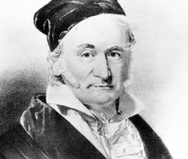
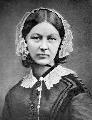
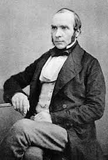
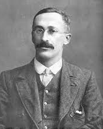
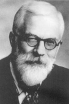
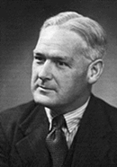

# Introdução

## Importância da Bioestatística

A Bioestatística, estatística aplicada às ciências biológicas e da saúde, é a ferramenta utilizada pelos pesquisadores para lidar com as incertezas geradas pela variabilidade biológica e humana. Várias definições foram escritas para a estatística, uma delas é a seguinte [@armitage2008statistical]:

>  **Estatística** é a disciplina interessada com o tratamento dos dados numéricos obtidos a partir de grupos de indivíduos. 

Para isso, ela utiliza técnicas estatísticas quantitativas [@massad2004metodos] que ajudam a diminuir a ignorância em relação a essa variabilidade. Compreender a variabilidade humana aproxima a medicina do método científico, reduzindo incertezas na tentativa de verificar se os resultados encontrados de fato existem ou são apenas obra do acaso.

Na década de 1990, houve maior acesso aos computadores. Os profissionais da saúde não estatísticos passaram a ter mais interesse no campo da bioestatística. Isto gerou uma onda que facilitou o aparecimento de novas ferramentas estatísticas de ponta. Apesar disso, o conhecimento da Bioestatística permanece restrito aos especialistas na área.

Nos últimos anos, os pacotes de softwares foram aprimorados, tornando-se mais amigáveis e diminuindo significativamente o pânico ao se defrontar com uma série de números uma vez que a maioria deles exige apenas conhecimento básico de matemática.

Para a tomada de decisão em saúde é fundamental o acúmulo de conhecimento adquirido através da prática clínica, geradora da experiência do profissional, do intercâmbio com os pares e da análise adequada das evidências científicas publicadas em periódicos de qualidade. Para atingir este objetivo, é fundamental o conhecimento de bioestatística — o pensamento que deve nortear os profissionais da saúde ao lidar com o ser humano é o *pensamento probabilístico*.

## Pílulas históricas da Estatística {#sec-historia}

>  A história deve começar em algum lugar, mas a história não tem começo [@kendall1960studies].

Entretanto, é natural que se tracem as raízes voltando ao passado, tanto quanto possível. Alguns referem-se à curiosidade em relação ao registro de dados à dinastia Shank, na China, possivelmente no século XIII a.C., com a realização de censos populacionais. Há relatos bíblicos de possíveis censos realizados por Moisés (1491 a.C.) e por Davi (1017 a.C.).

Os romanos e os gregos já realizavam censos por volta do século VIII a IV a.C. Em 578-534 a.C., o imperador *Servo Túlio* mandou realizar um censo de população masculina adulta e suas propriedades que serviu para estabelecer o recrutamento para o exército, para o exercício dos direitos políticos e para o pagamento de impostos. Os romanos fizeram 72 censos entre 555 a.C. e 72 d.C. A punição para quem não respondia, geralmente era a morte! Na Idade Média, na Europa, existem registros de diversos censos: durante o domínio muçulmano, na Península Ibérica, nos séculos VII a XV; no reinado de Carlos Magno (712-814) e ainda o maior registro estatístico feito na época, o *Domesday Book* (@fig-domesday), realizado na Inglaterra, em 1086, por Guilherme I [@kendall1960studies], o Conquistador, onde registravam nascimentos, mortes, batismos e casamentos. Houve, também, recenseamentos nas repúblicas italianas no século XII ao XIII [@ine2014censos].

{#fig-domesday fig-align="center" width="10cm"}

*John Graunt* (24/04/1620 - 18/04/1674), cientista britânico, é responsável por vários estudos demográficos ingleses e foi o precursor da construção de Tábuas de Mortalidade. Realizou estudos com William Petty (1623 - 1687), economista britânico que propôs a *aritmética política*.

Em 1791, *Sir John Sinclair* (1754 - 1835) concebeu um plano de uma pesquisa empírica na Escócia para fornecer informações estatísticas. Foi a primeira vez que o termo estatística foi usado em inglês.

Médico, matemático, físico e filósofo italiano, *Girolamo Cardano* (24/09/1501 - 21/09/1576) é tido como o primeiro a introduzir ideias gerais da teoria das equações algébricas e as primeiras regras da probabilidade, descritas no livro *Liber de Ludo Aleae*, publicado em 1663. Descreveu pela primeira vez a clínica da febre tifoide e foi amigo de Leonardo da Vinci.

Matemático, astrônomo e físico francês, *Pierre-Simon Laplace*, Marquês de Laplace (23/03/1749 - 05/03/1827), dedicou-se substancialmente à física, mas outro tema central de sua obra foi a teoria das probabilidades. Em seu *Essai philosophique sur les probabilités*, projetou um sistema matemático de raciocínio indutivo baseado em probabilidades, que hoje coincide com as ideias bayesianas.

*Antoine Gombaud*, conhecido como Chevalier de Méré (1607 - 1684) foi um nobre e jogador. Como não tinha mais sucesso nos jogos de azar, buscou ajuda de Blaise Pascal (19/06/1623 - 19/08/1662), matemático e físico francês, que se correspondeu com Pierre Fermat (matemático e cientista francês), nascendo desta colaboração a teoria matemática das probabilidades (1654). Blaise Pascal foi mais tarde chamado de o Pai da Teoria das Probabilidades.

A moderna teoria das probabilidades foi atribuída a *Abraham De Moivre* (26/05/1667 - 27/11/1754), matemático francês, que adquiriu fama por seus estudos na trigonometria, teoria das probabilidades e pela equação da curva normal. Em 1742, Thomas Bayes (1701 - 07/04/1761), matemático e pastor presbiteriano inglês, desenvolveu o Teorema de Bayes, que descreve a probabilidade de um evento ocorrer com base em um conhecimento *a priori*.

Matemático francês, *Adrien-Marie Legendre* (18/09/1752 - 10/01/1833) tornou-se, em 1783, membro adjunto da *Academie des Sciences*, instituição que esteve na vanguarda dos desenvolvimentos científicos dos séculos XVII e XVIII. Deu importantes contribuições à estatística, à teoria dos números e à álgebra abstrata.

Considerado por muitos o Príncipe da Matemática, o mais notável dos matemáticos, *Johann Carl Friedrich Gauss* (30/04/1777 - 23/02/1855) (@fig-gauss) foi um matemático, astrônomo e físico alemão que contribuiu em diversas áreas das ciências, como teoria dos números, estatística, geometria diferencial, eletrostática, astronomia e ótica. Descobriu o método dos mínimos quadrados e a lei de Gauss da distribuição normal de erros, cuja curva em formato de sino é hoje familiar a todos que trabalham com estatística.

{#fig-gauss fig-align="center" width="6.5cm"}

Astrônomo, matemático, demógrafo e estatístico francês, *Lambert Adolphe Jacques Quételet* (22/02/1796 - 17/02/1874) concentrou seu trabalho em estatística social, criando regras de determinação de propensão ao crime.

Antropólogo, matemático e estatístico inglês, *Francis Galton* (16/02/1822 - 17/01/1911) criou, entre muitos artigos e livros, o conceito estatístico de correlação e da regressão à média, além de ser o primeiro a aplicar métodos estatísticos ao estudo das diferenças e da herança humana de inteligência. Criou também o conceito de eugenia e defendia que a espécie humana poderia ser melhorada por seleção artificial, evitando-se relacionamentos indesejáveis — ideia que acompanhava o pensamento burguês europeu da época. Desenvolveu a psicometria, criando testes de inteligência para selecionar homens e mulheres brilhantes; essa teoria teve papel importante na formação do fascismo e do nazismo [@salgado2011sir].

Nascido na vila de Kenley, Shropshire, *William Farr* (30/11/1807 - 14/04/1883) foi médico sanitarista e estatístico inglês, o primeiro investigador a examinar séries temporais de morbimortalidade para longos períodos — por isso considerado o criador da Estatística da Saúde Pública Moderna. Seus relatórios foram fundamentais para o desencadeamento das reformas sanitárias britânicas, em meados e no final do século XIX [@stolley1995beginnings].

*Florence Nightingale* (12/05/1820 - 13/08/1910) (@fig-florence) ficou famosa por ser enfermeira pioneira no tratamento de feridos durante a Guerra da Criméia [@cohen1984florence], tendo se tornado conhecida na história pelo apelido de "A dama da lâmpada", por servir-se de uma lamparina para auxiliar no cuidado aos feridos durante a noite. Também contribuiu no campo da Estatística, sendo pioneira na utilização de métodos de representação visual de informações, como o gráfico de setores (habitualmente conhecido como gráfico do tipo "pizza").

{#fig-florence fig-align="center" width="4.9cm" height="6.3cm"}

Considerado pai da Epidemiologia Moderna, *John Snow* (York, 15/03/1813 - Londres, 16/06/1858) (@fig-snow) anestesiou, em 1853, a rainha Vitória no parto sem dor de seu oitavo filho, Leopoldo de Albany — fato que ajudou a divulgar a técnica entre os médicos da época. Demonstrou que a cólera era causada pelo consumo de águas contaminadas com matérias fecais, ao comprovar que os casos dessa doença se agrupavam em determinados locais da cidade de Londres, em 1854, onde havia fontes dessas águas [@stolley1995beginnings].

{#fig-snow fig-align="center" width="4.9cm"}

Importante estatístico inglês, *Karl Pearson* (27/03/1857 - 27/04/1936) fundou, em 1911, o Departamento de Estatística Aplicada da *University College London* e, junto com Weldon e Galton, criou em 1901 a revista *Biometrika*, dedicada a desenvolver as teorias estatísticas e editada até os dias de hoje. Seu trabalho fundamentou muitos métodos estatísticos de uso comum atualmente: regressão linear e coeficiente de correlação, teste do qui-quadrado de Pearson e classificação das distribuições [@moore_2000].

Psicólogo inglês, *Charles Edward Spearman* (10/09/1863 - 17/09/1945) é conhecido por seu trabalho em estatística como pioneiro da análise fatorial e pelo coeficiente de correlação de postos que leva seu nome. Também produziu trabalhos relevantes sobre modelos da inteligência humana.

Químico e estatístico inglês, *William Sealy Gosset* (13/07/1876 - 16/10/1937) (@fig-student) criou, em 1907, enquanto trabalhava na cervejaria experimental de Arthur Guinness & Son, a distribuição t, que usou para identificar a melhor variedade de cevada trabalhando com pequenas amostras. Como a cervejaria tinha uma política que proibia seus empregados de publicar descobertas em nome próprio, ele adotou o pseudônimo "Student", e o teste é chamado "t de Student" em sua homenagem [@salsburg2009gosset].

{#fig-student fig-align="center" width="4.6cm"}

Estatístico, biólogo e geneticista inglês, *Ronald Aylmer Fisher* (17/02/1890 - 29/07/1962) (@fig-fisher) envolveu-se, em 1919, com pesquisa agrícola no centro de experimentos de *Rothamsted Research*, em Harpenden, Inglaterra, onde desenvolveu novas metodologias e teoria no ramo de experimentos [@hald2007]. Ao longo da vida, escreveu 7 livros e publicou cerca de 400 artigos acadêmicos em estatística e genética. Em um dos seus livros, *The design of Experiments* (1935), Fisher relata um experimento que surgiu de uma pergunta curiosa: o gosto do chá muda de acordo com a ordem em que as ervas e o leite são colocados? Essa simples questão resultou em um estudo pioneiro na área e serviu de sustentação para análise da aleatorização de dados experimentais [@salsburg2009cha]. Ronald A. Fisher foi descrito [@kruskal1980] como "um gênio que criou praticamente sozinho os fundamentos para o moderno pensamento estatístico". Era muito temperamental. Seus atritos com outros estatísticos ficaram famosos, entre eles encontra-se ninguém menos do que Karl Pearson, outro notável estatístico.

{#fig-fisher fig-align="center" width="4.5cm" height="6.7cm"}

Epidemiologista e estatístico inglês, *Austin Bradford Hill* (08/07/1897 - 18/04/1991) (@fig-hill) foi pioneiro no estudo do acaso nos ensaios clínicos e, junto com Richard Doll, o primeiro a demonstrar a ligação entre o uso do cigarro e o câncer de pulmão. É amplamente conhecido pelos Critérios de Hill, conjunto de critérios para a determinação de uma associação causal [@stolley1995lung].

{#fig-hill fig-align="center" width="4.5cm"}

Estatístico norte-americano, *John Wilder Tukey* (16/06/1915 - 26/07/2000) desenvolveu uma filosofia para a análise de dados que mudou a maneira de pensar dos estatísticos, sugerindo que se visualizassem os dados — interpretando formato, centro, dispersão e presença de valores atípicos — antes de sumarizá-los numericamente e só então escolher um modelo matemático. Foi o criador do boxplot e introduziu a palavra "bit" como contração do termo *binary digit*.

Estatístico inglês, *Douglas G. Altman* (12/07/1948 - 03/06/2018) (@fig-altman) é conhecido por seu trabalho em melhorar a confiabilidade dos artigos de pesquisa médica [@matthews2018douglas] e por artigos altamente citados sobre metodologia estatística. Foi professor de estatística em medicina na Universidade de Oxford. Há praticamente 30 anos, escreveu um artigo sobre o problema da qualidade da pesquisa em medicina que causou grande impacto e permanece válido até hoje [@altman1994scandal]. Nesta publicação, afirma:

>  A má qualidade de muitas pesquisas médicas é amplamente reconhecida, mas, de forma perturbadora, os líderes da profissão médica parecem apenas minimamente preocupados com o problema e não fazem nenhum esforço aparente para encontrar uma solução.

{#fig-altman fig-align="center" width="4.5cm"}

## História resumida do R

O R é uma linguagem e um ambiente de desenvolvimento voltado fundamentalmente para a computação estatística. Foi inspirado em duas linguagens: S (criada por John Chambers, do Bell Labs), que forneceu a sintaxe, e Scheme (criada por Hal Abelson e Gerald Sussman), que forneceu a semântica.

O nome R provém em parte das iniciais dos criadores, *Ross Ihaka* e *Robert Gentleman* (@fig-ross), e também de um trocadilho com o nome da linguagem que o antecedeu, S. Em 29 de fevereiro de 2000, o software foi considerado suficientemente completo e estável para o lançamento da versão 1.0.

O R é um projeto GNU [^intro-1]. Software Livre significa que os usuários têm liberdade para executar, copiar, distribuir, estudar, alterar e melhorar o software. Foi desenvolvido em um esforço colaborativo de pessoas em vários locais do mundo [@rproject2022].

[^intro-1]: Esta sigla está associada ao animal gnu africano, símbolo de software de distribuição livre; GNU significa, em inglês, *GNU's Not Unix*, uma sigla recursiva muito comum entre nerds!

O projeto R fornece uma grande variedade de técnicas estatísticas e gráficas, sendo uma linguagem e um ambiente similares ao S. Um dos pontos fortes de R é a facilidade com que produções gráficas de qualidade podem ser produzidas. O R é também altamente expansível com o uso dos pacotes, que são bibliotecas para sub-rotinas específicas ou áreas de estudo específicas. Um conjunto de pacotes é incluído com a instalação de R e muitos outros estão disponíveis na rede de distribuição do R - *Comprehensive R Archive Network* (CRAN) [@cranmirrors2022].

{#fig-ross fig-align="center" width="8cm"}

A linguagem R é largamente usada entre estatísticos e analistas de dados para desenvolver softwares de estatística e análise de dados. Pesquisas e levantamentos com profissionais da área da saúde mostram que a popularidade do R aumentou substancialmente nos últimos anos [@Whitney2020].
